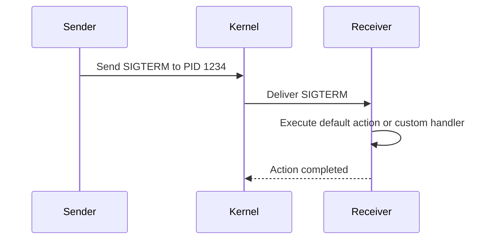
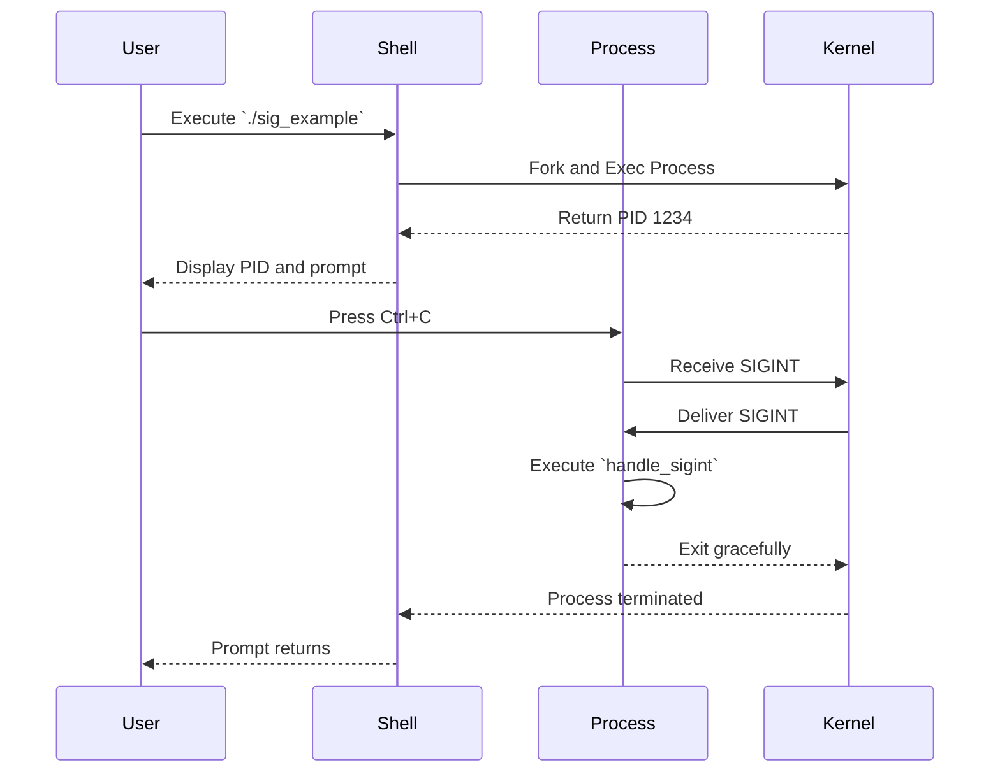
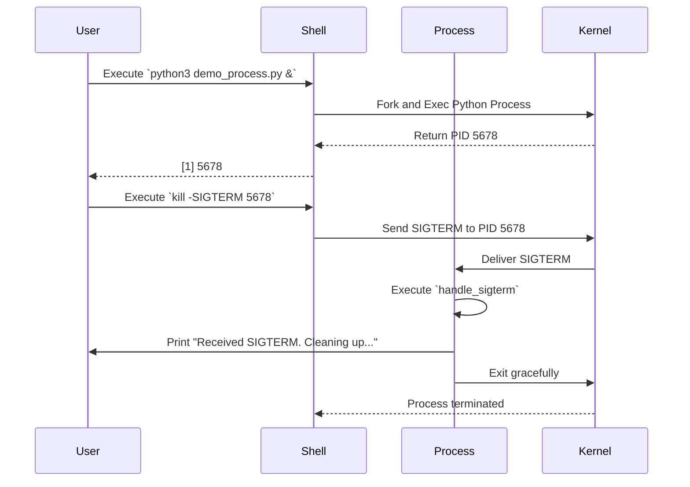

# Comprehensive Guide to Signals in Linux

## Table of Contents

- [Introduction](#introduction)
- [Understanding Signals](#understanding-signals)
  - [What are Signals?](#what-are-signals)
  - [Signal Types](#signal-types)
  - [Signal Delivery and Handling](#signal-delivery-and-handling)
- [List of Signals](#list-of-signals)
  - [Standard Signals](#standard-signals)
  - [Real-Time Signals](#real-time-signals)
- [Sending Signals](#sending-signals)
  - [Using the `kill` Command](#using-the-kill-command)
  - [Using the `killall` Command](#using-the-killall-command)
  - [Using the `pkill` Command](#using-the-pkill-command)
- [Handling Signals in Programs](#handling-signals-in-programs)
  - [Signal Handling in C](#signal-handling-in-c)
  - [Signal Handling in Bash Scripts](#signal-handling-in-bash-scripts)
- [Mermaid Diagrams](#mermaid-diagrams)
  - [Signal Flow Diagram](#signal-flow-diagram)
  - [Signal Handling Sequence Diagram](#signal-handling-sequence-diagram)
- [Examples](#examples)
  - [Listing Available Signals](#listing-available-signals)
  - [Sending Signals to Processes](#sending-signals-to-processes)
  - [Custom Signal Handling in C](#custom-signal-handling-in-c)
  - [Custom Signal Handling in Bash](#custom-signal-handling-in-bash)
- [Comprehensive Demo](#comprehensive-demo)
  - [Scenario: Gracefully Terminating a Process](#scenario-gracefully-terminating-a-process)
  - [Scenario: Ignoring a Signal](#scenario-ignoring-a-signal)
  - [Scenario: Custom Signal Handling](#scenario-custom-signal-handling)
- [Conclusion](#conclusion)

## Introduction

Signals are a fundamental mechanism in Unix-like operating systems, including Linux, used for inter-process communication (IPC). They allow processes to send notifications to each other or to themselves to indicate that certain events have occurred. Understanding signals is essential for system administration, programming, and effective process management.

This guide provides an in-depth exploration of signals in Linux, detailing each signal, their purposes, default behaviors, and practical examples of how to use and handle them.

## Understanding Signals

### What are Signals?

A **signal** is an asynchronous notification sent to a process or a specific thread within a process to notify it of events such as:

- **Interruptions**: e.g., user pressing Ctrl+C.
- **Termination Requests**: e.g., system shutting down.
- **Exception Events**: e.g., segmentation faults.

Each signal has a unique integer identifier and a name, usually prefixed with `SIG` (e.g., `SIGINT`). Signals can be sent by the kernel, by other processes, or by the process itself.

### Signal Types

Signals in Linux can be broadly categorized into:

1. **Standard Signals**: Predefined signals with specific purposes.
2. **Real-Time Signals**: User-defined signals with guaranteed delivery order and queuing.

### Signal Delivery and Handling

When a signal is sent to a process, the process can handle it in one of the following ways:

1. **Default Action**: The system performs a default action (e.g., terminate the process).
2. **Ignore the Signal**: The process chooses to ignore the signal.
3. **Custom Handler**: The process defines a custom function (signal handler) to execute when the signal is received.

**Example:**

```c
#include <signal.h>
#include <stdio.h>
#include <unistd.h>

// Custom signal handler for SIGINT
void sigint_handler(int sig) {
    printf("Caught SIGINT (signal %d). Exiting gracefully.\n", sig);
    _exit(0);
}

int main() {
    // Register the signal handler
    signal(SIGINT, sigint_handler);

    printf("Process PID: %d. Press Ctrl+C to trigger SIGINT.\n", getpid());

    // Infinite loop to keep the process running
    while(1) {
        sleep(1);
    }

    return 0;
}
```

## List of Signals

Below is a comprehensive list of signals available in Linux, including their signal numbers, names, default actions, and descriptions.

### Standard Signals

| Signal Number | Signal Name | Default Action        | Description                                                                                                        |
| ------------- | ----------- | --------------------- | ------------------------------------------------------------------------------------------------------------------ |
| 1             | `SIGHUP`    | Terminate             | Hangup detected on controlling terminal or death of controlling process. Often used to reload configuration files. |
| 2             | `SIGINT`    | Terminate             | Interrupt from keyboard (Ctrl+C).                                                                                  |
| 3             | `SIGQUIT`   | Core Dump & Terminate | Quit from keyboard (Ctrl+\). Creates a core dump.                                                                  |
| 4             | `SIGILL`    | Core Dump & Terminate | Illegal Instruction.                                                                                               |
| 5             | `SIGTRAP`   | Core Dump & Terminate | Trace/breakpoint trap.                                                                                             |
| 6             | `SIGABRT`   | Core Dump & Terminate | Abort signal from `abort()`.                                                                                       |
| 7             | `SIGBUS`    | Core Dump & Terminate | Bus error (accessing memory incorrectly).                                                                          |
| 8             | `SIGFPE`    | Core Dump & Terminate | Floating-point exception.                                                                                          |
| 9             | `SIGKILL`   | Terminate             | Kill signal. Cannot be caught or ignored.                                                                          |
| 10            | `SIGUSR1`   | Terminate             | User-defined signal 1.                                                                                             |
| 11            | `SIGSEGV`   | Core Dump & Terminate | Invalid memory reference (segmentation fault).                                                                     |
| 12            | `SIGUSR2`   | Terminate             | User-defined signal 2.                                                                                             |
| 13            | `SIGPIPE`   | Terminate             | Broken pipe: write to pipe with no readers.                                                                        |
| 14            | `SIGALRM`   | Terminate             | Timer signal from `alarm()`.                                                                                       |
| 15            | `SIGTERM`   | Terminate             | Termination signal. Used to politely ask a process to terminate.                                                   |
| 17            | `SIGCHLD`   | Ignore                | Child process terminated or stopped.                                                                               |
| 18            | `SIGCONT`   | Continue              | Continue if stopped.                                                                                               |
| 19            | `SIGSTOP`   | Stop                  | Stop process. Cannot be caught or ignored.                                                                         |
| 20            | `SIGTSTP`   | Stop                  | Stop typed at terminal (Ctrl+Z).                                                                                   |
| 21            | `SIGTTIN`   | Stop                  | Background process attempting read.                                                                                |
| 22            | `SIGTTOU`   | Stop                  | Background process attempting write.                                                                               |
| 23            | `SIGURG`    | Ignore                | Urgent condition on socket.                                                                                        |
| 24            | `SIGXCPU`   | Terminate             | CPU time limit exceeded.                                                                                           |
| 25            | `SIGXFSZ`   | Terminate             | File size limit exceeded.                                                                                          |
| 26            | `SIGVTALRM` | Terminate             | Virtual alarm clock.                                                                                               |
| 27            | `SIGPROF`   | Terminate             | Profiling timer expired.                                                                                           |
| 28            | `SIGWINCH`  | Ignore                | Window size change.                                                                                                |
| 29            | `SIGIO`     | Terminate             | I/O now possible.                                                                                                  |
| 30            | `SIGPWR`    | Terminate             | Power failure imminent.                                                                                            |
| 31            | `SIGSYS`    | Core Dump & Terminate | Bad system call.                                                                                                   |

### Real-Time Signals

Real-time signals are numbered from 32 to 64 and are intended for application-defined purposes. They have the following properties:

- **Guaranteed Delivery**: Signals are not lost; they are queued.
- **Ordered Delivery**: Signals are delivered in the order they were sent.

| Signal Number | Signal Name              | Default Action | Description                     |
| ------------- | ------------------------ | -------------- | ------------------------------- |
| 34-64         | `SIGRTMIN` to `SIGRTMAX` | Terminate      | Real-time user-defined signals. |

_Note: The exact numbering of real-time signals can vary between different Unix-like systems._

## Sending Signals

### Using the `kill` Command

Despite its name, the `kill` command is used to send signals to processes, not just to terminate them.

**Syntax:**

```bash
kill -SIGNAL PID
```

**Examples:**

- **Gracefully terminate a process:**
  ```bash
  kill -SIGTERM 1234
  ```
- **Forcefully kill a process:**
  ```bash
  kill -SIGKILL 1234
  ```
- **Send a user-defined signal:**
  ```bash
  kill -SIGUSR1 1234
  ```

### Using the `killall` Command

The `killall` command sends signals to all processes running a specified command.

**Syntax:**

```bash
killall -SIGNAL process_name
```

**Examples:**

- **Gracefully terminate all instances of `firefox`:**
  ```bash
  killall -SIGTERM firefox
  ```
- **Forcefully kill all instances of `firefox`:**
  ```bash
  killall -SIGKILL firefox
  ```

### Using the `pkill` Command

The `pkill` command sends signals to processes based on various criteria such as name, user, group, etc.

**Syntax:**

```bash
pkill -SIGNAL pattern
```

**Examples:**

- **Terminate all processes matching the pattern `vim`:**
  ```bash
  pkill -SIGTERM vim
  ```
- **Send `SIGUSR1` to all processes owned by user `john`:**
  ```bash
  pkill -SIGUSR1 -u john
  ```

## Handling Signals in Programs

### Signal Handling in C

In C, signals can be handled using the `signal` function or the more robust `sigaction` function.

**Example Using `signal`:**

```c
#include <stdio.h>
#include <signal.h>
#include <unistd.h>
#include <stdlib.h>

// Signal handler for SIGINT
void handle_sigint(int sig) {
    printf("Caught SIGINT (signal %d). Exiting gracefully.\n", sig);
    exit(0);
}

int main() {
    // Register the signal handler
    if (signal(SIGINT, handle_sigint) == SIG_ERR) {
        printf("Error registering signal handler.\n");
        return 1;
    }

    printf("Process PID: %d. Press Ctrl+C to trigger SIGINT.\n", getpid());

    // Infinite loop to keep the process running
    while(1) {
        sleep(1);
    }

    return 0;
}
```

**Compilation and Execution:**

```bash
gcc -o sig_example sig_example.c
./sig_example
```

Press `Ctrl+C` to trigger `SIGINT` and observe the custom handler in action.

### Signal Handling in Bash Scripts

Bash scripts can handle signals using the `trap` command.

**Example Bash Script (`signal_handler.sh`):**

```bash
#!/bin/bash

# Function to handle SIGINT
handle_sigint() {
    echo "Caught SIGINT (Ctrl+C). Exiting."
    exit 0
}

# Trap SIGINT and call handle_sigint
trap handle_sigint SIGINT

echo "Script PID: $$"
echo "Press Ctrl+C to trigger SIGINT."

# Infinite loop to keep the script running
while true; do
    sleep 1
done
```

**Usage:**

```bash
chmod +x signal_handler.sh
./signal_handler.sh
```

Press `Ctrl+C` to see the custom handler in action.

## Mermaid Diagrams

### Signal Flow Diagram



### Signal Handling Sequence Diagram



## Examples

### Listing Available Signals

To list all available signals along with their numbers and descriptions:

```bash
kill -l
```

**Example Output:**

```
 1) SIGHUP    2) SIGINT    3) SIGQUIT    4) SIGILL    5) SIGTRAP
 6) SIGABRT   7) SIGBUS    8) SIGFPE     9) SIGKILL   10) SIGUSR1
11) SIGSEGV   12) SIGUSR2   13) SIGPIPE   14) SIGALRM   15) SIGTERM
16) SIGSTKFLT 17) SIGCHLD   18) SIGCONT   19) SIGSTOP   20) SIGTSTP
21) SIGTTIN   22) SIGTTOU   23) SIGURG    24) SIGXCPU   25) SIGXFSZ
26) SIGVTALRM 27) SIGPROF   28) SIGWINCH  29) SIGIO     30) SIGPWR
31) SIGSYS    34) SIGRTMIN  ... up to SIGRTMAX
```

### Sending Signals to Processes

**Gracefully terminate a process with PID 1234 using `SIGTERM`:**

```bash
kill -SIGTERM 1234
```

**Forcefully kill a process with PID 1234 using `SIGKILL`:**

```bash
kill -SIGKILL 1234
```

**Send a user-defined signal (`SIGUSR1`) to a process:**

```bash
kill -SIGUSR1 1234
```

### Custom Signal Handling in C

**Example C Program Handling Multiple Signals:**

```c
#include <stdio.h>
#include <signal.h>
#include <unistd.h>
#include <stdlib.h>

// Handler for SIGINT
void handle_sigint(int sig) {
    printf("Caught SIGINT (signal %d). Exiting gracefully.\n", sig);
    exit(0);
}

// Handler for SIGUSR1
void handle_sigusr1(int sig) {
    printf("Caught SIGUSR1 (signal %d). Performing custom action.\n", sig);
}

int main() {
    // Register signal handlers
    signal(SIGINT, handle_sigint);
    signal(SIGUSR1, handle_sigusr1);

    printf("Process PID: %d. Waiting for signals.\n", getpid());

    // Infinite loop to keep the process running
    while(1) {
        sleep(1);
    }

    return 0;
}
```

**Usage:**

1. **Compile and run the program:**

   ```bash
   gcc -o signal_example signal_example.c
   ./signal_example
   ```

2. **In another terminal, send signals to the process:**

   - **Send `SIGUSR1`:**

     ```bash
     kill -SIGUSR1 <PID>
     ```

   - **Send `SIGINT` by pressing `Ctrl+C` in the running process's terminal.**

**Expected Output:**

```
Process PID: 1234. Waiting for signals.
Caught SIGUSR1 (signal 10). Performing custom action.
Caught SIGINT (signal 2). Exiting gracefully.
```

### Custom Signal Handling in Bash

**Example Bash Script Handling `SIGINT` and `SIGTERM`:**

```bash
#!/bin/bash

# Function to handle SIGINT
handle_sigint() {
    echo "Caught SIGINT (Ctrl+C). Exiting."
    exit 0
}

# Function to handle SIGTERM
handle_sigterm() {
    echo "Caught SIGTERM. Cleaning up before exit."
    # Perform cleanup tasks here
    exit 0
}

# Trap SIGINT and SIGTERM
trap handle_sigint SIGINT
trap handle_sigterm SIGTERM

echo "Script PID: $$"
echo "Waiting for signals. Press Ctrl+C or send SIGTERM."

# Infinite loop to keep the script running
while true; do
    sleep 1
done
```

**Usage:**

1. **Make the script executable and run it:**

   ```bash
   chmod +x signal_trap.sh
   ./signal_trap.sh
   ```

2. **In another terminal, send `SIGTERM` to the script:**

   ```bash
   kill -SIGTERM <PID>
   ```

3. **Alternatively, press `Ctrl+C` in the script's terminal to send `SIGINT`.**

**Expected Output:**

```
Script PID: 5678
Waiting for signals. Press Ctrl+C or send SIGTERM.
Caught SIGTERM. Cleaning up before exit.
```

_or_

```
Caught SIGINT (Ctrl+C). Exiting.
```

## Comprehensive Demo

### Scenario: Gracefully Terminating a Process

In this demo, we'll start a background process, send it a `SIGTERM` signal to terminate gracefully, and observe the behavior.

#### Step 1: Create a Simple Python Script (`demo_process.py`)

```python
import signal
import time
import sys
import os

def handle_sigterm(signum, frame):
    print("Received SIGTERM. Cleaning up...")
    sys.exit(0)

# Register the SIGTERM handler
signal.signal(signal.SIGTERM, handle_sigterm)

print(f"Process started with PID: {os.getpid()}. Waiting for SIGTERM...")

# Keep the process running
while True:
    time.sleep(1)
```

#### Step 2: Start the Process

```bash
python3 demo_process.py &
```

**Output:**

```yaml
Process started with PID: 5678. Waiting for SIGTERM...
[1] 5678
```

#### Step 3: List Running Processes

```bash
ps aux | grep demo_process.py
```

**Example Output:**

```yaml
user      5678  0.0  0.1  12345  6789 pts/0    S    12:00   0:00 python3 demo_process.py
user      5680  0.0  0.0   6789   456 pts/0    S+   12:01   0:00 grep --color=auto demo_process.py
```

#### Step 4: Send `SIGTERM` to the Process

```bash
kill -SIGTERM 5678
```

#### Step 5: Observe the Process Handling the Signal

In the terminal where `demo_process.py` is running, you should see:

```code
Received SIGTERM. Cleaning up...
```

The process will then terminate gracefully.

#### Step 6: Verify Termination

```bash
ps aux | grep demo_process.py
```

**Example Output:**

```sql
user      5680  0.0  0.0   6789   456 pts/0    S+   12:01   0:00 grep --color=auto demo_process.py
```

The `demo_process.py` no longer appears in the process list, indicating it has terminated successfully.

### Visual Representation



### Scenario: Ignoring a Signal

In this scenario, we'll create a Bash script that ignores the `SIGINT` signal.

#### Step 1: Create a Bash Script (`ignore_sigint.sh`)

```bash
#!/bin/bash

# Function to handle SIGINT
handle_sigint() {
    echo "SIGINT received but ignored."
}

# Trap SIGINT and ignore it by assigning the handler
trap handle_sigint SIGINT

echo "Script PID: $$"
echo "SIGINT (Ctrl+C) is ignored. Press Ctrl+C to test."

# Infinite loop to keep the script running
while true; do
    sleep 1
done
```

#### Step 2: Make the Script Executable and Run It

```bash
chmod +x ignore_sigint.sh
./ignore_sigint.sh
```

**Output:**

```code
Script PID: 6789
SIGINT (Ctrl+C) is ignored. Press Ctrl+C to test.
```

#### Step 3: Attempt to Send `SIGINT`

Press `Ctrl+C` in the script's terminal.

**Expected Output:**

```code
SIGINT received but ignored.
```

The script continues to run despite receiving `SIGINT`.

#### Step 4: Terminate the Script

To terminate the script, you can send a different signal, such as `SIGTERM`:

```bash
kill -SIGTERM 6789
```

**Note:** If the script does not handle `SIGTERM`, it will terminate using the default action.

### Scenario: Custom Signal Handling

In this scenario, we'll create a C program that handles multiple signals with custom handlers.

#### Step 1: Create a C Program (`multi_signal_handler.c`)

```c
#include <stdio.h>
#include <signal.h>
#include <unistd.h>
#include <stdlib.h>

// Handler for SIGINT
void handle_sigint(int sig) {
    printf("Caught SIGINT (signal %d). Exiting gracefully.\n", sig);
    exit(0);
}

// Handler for SIGUSR1
void handle_sigusr1(int sig) {
    printf("Caught SIGUSR1 (signal %d). Performing custom action.\n", sig);
}

// Handler for SIGTERM
void handle_sigterm(int sig) {
    printf("Caught SIGTERM (signal %d). Terminating process.\n", sig);
    exit(0);
}

int main() {
    // Register signal handlers
    signal(SIGINT, handle_sigint);
    signal(SIGUSR1, handle_sigusr1);
    signal(SIGTERM, handle_sigterm);

    printf("Process PID: %d. Waiting for signals.\n", getpid());

    // Infinite loop to keep the process running
    while(1) {
        sleep(1);
    }

    return 0;
}
```

#### Step 2: Compile and Run the Program

```bash
gcc -o multi_signal_handler multi_signal_handler.c
./multi_signal_handler
```

**Output:**

```code
Process PID: 7890. Waiting for signals.
```

#### Step 3: Send Different Signals to the Process

- **Send `SIGUSR1`:**

  ```bash
  kill -SIGUSR1 7890
  ```

  **Expected Output:**

  ```code
  Caught SIGUSR1 (signal 10). Performing custom action.
  ```

- **Send `SIGINT` by pressing `Ctrl+C`:**

  **Expected Output:**

  ```code
  Caught SIGINT (signal 2). Exiting gracefully.
  ```

- **Send `SIGTERM`:**

  ```bash
  kill -SIGTERM 7890
  ```

  **Expected Output:**

  ```code
  Caught SIGTERM (signal 15). Terminating process.
  ```

## Conclusion

Signals are a powerful and essential feature in Linux for managing process behavior and facilitating inter-process communication. They enable processes to respond to various events, such as user interruptions, system requests, and error conditions. By understanding the different types of signals, their default behaviors, and how to handle them, users and developers can create more robust and responsive applications.
