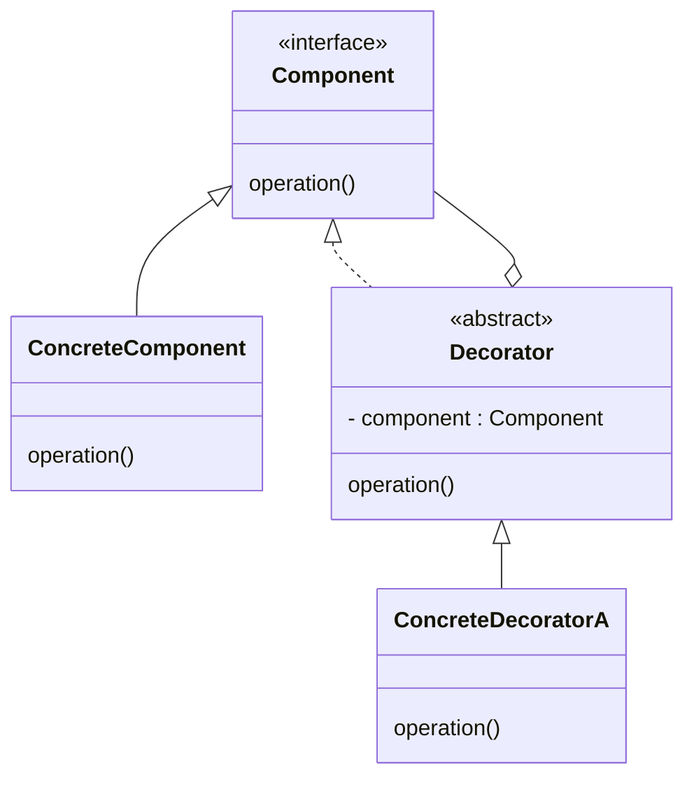

# The Decorator Design Pattern in Python

This README provides a **comprehensive overview** of the **Decorator Design Pattern** in Python. It covers the concept, benefits, and includes **examples** showing both the **object-oriented (“GoF”) approach** and **Python’s syntactic (function) decorators**.

---

## Table of Contents

- [The Decorator Design Pattern in Python](#the-decorator-design-pattern-in-python)
  - [Table of Contents](#table-of-contents)
  - [1. Introduction](#1-introduction)
  - [2. What Is the Decorator Design Pattern?](#2-what-is-the-decorator-design-pattern)
  - [3. Example: OOP-Style Decorator (GoF)](#3-example-oop-style-decorator-gof)
    - [3.1 Structure](#31-structure)
    - [3.2 Code Example](#32-code-example)
  - [4. Benefits](#4-benefits)
  - [5. Python Function Decorators](#5-python-function-decorators)
    - [5.1 Function Decorator Example](#51-function-decorator-example)
  - [6. Comparison: OOP Decorator vs. Python Function Decorators](#6-comparison-oop-decorator-vs-python-function-decorators)
  - [7. Common Use Cases](#7-common-use-cases)
  - [8. Summary](#8-summary)
  - [9. References](#9-references)

---

## 1. Introduction

The **Decorator Pattern** is one of the **Structural Design Patterns** described in the “Gang of Four” (GoF) Design Patterns book. It allows you to **dynamically** add behavior or responsibilities to objects **without** modifying the original object itself.

In Python, the term “decorator” also refers to a **language feature** for **functions** and **classes**, which can seem similar yet is slightly different in concept. This README will clarify both approaches.

---

## 2. What Is the Decorator Design Pattern?

> **Definition**: The Decorator Pattern attaches additional responsibilities to an object dynamically. Decorators provide a flexible alternative to subclassing for extending functionality.

Key points:

- You have an original **Component** (object) whose behavior you want to augment.
- Instead of **inheriting** and overriding, you **wrap** the component in a **Decorator** object.
- The **Decorator** implements the same interface as the component and holds a reference to the original component.
- **At runtime**, you can wrap an object with multiple decorators, stacking or chaining additional behaviors.

---

## 3. Example: OOP-Style Decorator (GoF)

### 3.1 Structure

In UML-like terms:



**Explanation**:

1. **`Component`** is an interface (shown as `<<interface>>`) declaring `operation()`.
2. **`ConcreteComponent`** implements `Component`.
3. **`Decorator`** is an abstract class also implementing `Component` (dotted line: `<|..`), holding a reference to a `Component` instance (shown as `o--`).
4. **`ConcreteDecoratorA`** extends `Decorator`.

### 3.2 Code Example

Below is a Python example that simulates a **coffee ordering** scenario, where you can decorate your coffee with add-ons (milk, sugar, whipped cream, etc.).

```python
from abc import ABC, abstractmethod

# 1. Component Interface (or abstract base class)
class Coffee(ABC):
    @abstractmethod
    def get_cost(self) -> float:
        pass

    @abstractmethod
    def get_description(self) -> str:
        pass


# 2. ConcreteComponent
class Espresso(Coffee):
    def get_cost(self) -> float:
        return 2.00

    def get_description(self) -> str:
        return "Espresso"


# 3. Decorator Abstract Class
class CoffeeDecorator(Coffee):
    def __init__(self, coffee: Coffee):
        self._coffee = coffee

    def get_cost(self) -> float:
        # Default behavior: delegate to wrapped object
        return self._coffee.get_cost()

    def get_description(self) -> str:
        # Default behavior: delegate to wrapped object
        return self._coffee.get_description()


# 4. Concrete Decorators
class MilkDecorator(CoffeeDecorator):
    def get_cost(self) -> float:
        return self._coffee.get_cost() + 0.50  # add milk cost

    def get_description(self) -> str:
        return self._coffee.get_description() + ", Milk"


class SugarDecorator(CoffeeDecorator):
    def get_cost(self) -> float:
        return self._coffee.get_cost() + 0.20  # add sugar cost

    def get_description(self) -> str:
        return self._coffee.get_description() + ", Sugar"


# Usage Example
if __name__ == "__main__":
    # Start with a plain espresso
    coffee = Espresso()
    print(coffee.get_description(), coffee.get_cost())

    # Decorate it with milk
    coffee = MilkDecorator(coffee)
    print(coffee.get_description(), coffee.get_cost())

    # Decorate it with sugar
    coffee = SugarDecorator(coffee)
    print(coffee.get_description(), coffee.get_cost())
```

**Output** (example):

```
Espresso 2.0
Espresso, Milk 2.5
Espresso, Milk, Sugar 2.7
```

Notice how each **decorator** adds new behavior (cost + description) **without modifying** the existing `Espresso` class directly. You can “stack” decorators in any combination.

---

## 4. Benefits

1. **Open/Closed Principle**: Allows adding new features without modifying existing code.
2. **Flexible at Runtime**: Behaviors can be combined, turned on/off in any order.
3. **Avoids Complex Inheritance**: Instead of creating multiple subclasses, you wrap objects dynamically.
4. **Single Responsibility Principle**: Each decorator can handle one small feature, making code easier to maintain.

---

## 5. Python Function Decorators

**Python’s function decorators** are often used for wrapping or augmenting **functions** (or methods) with additional behavior, e.g., logging, caching, authentication checks.

**They are syntactic sugar** for higher-order functions that take a function as an argument and return a new function.

### 5.1 Function Decorator Example

```python
def my_decorator(func):
    def wrapper(*args, **kwargs):
        print("Before the function call...")
        result = func(*args, **kwargs)
        print("After the function call...")
        return result
    return wrapper

@my_decorator
def say_hello(name):
    print(f"Hello, {name}!")

if __name__ == "__main__":
    say_hello("Mahmoud")
```

**How It Works**:

1. `@my_decorator` is equivalent to `say_hello = my_decorator(say_hello)`.
2. The `wrapper` function prints logs **before** and **after** calling the original `func`.
3. At runtime, calling `say_hello("Mahmoud")` triggers the extra behavior automatically.

---

## 6. Comparison: OOP Decorator vs. Python Function Decorators

- **OOP Decorator (GoF)**:

  - Typically used to wrap **objects** that share a common interface.
  - Follows the “Gang of Four” structural design pattern approach.
  - Ideal for **runtime composition** of multiple features in an OOP context.

- **Python Function Decorators**:
  - Primarily used to wrap **functions (or classes)** with additional behavior.
  - Syntax uses the `@` symbol directly above the function.
  - Very common in Python for tasks like **logging, authentication, input validation**.

They **share a similar concept** of “wrapping” an entity to augment behavior, but:

- GoF Decorator focuses on **object interfaces** in an OOP sense.
- Python’s function decorators focus on wrapping **functions** at runtime using a **higher-order function** approach.

---

## 7. Common Use Cases

1. **Adding cross-cutting concerns** like **logging**, **caching**, or **timing** to existing methods or functions.
2. **Conditionally** enabling/disabling features at runtime (e.g., paid add-ons, feature flags).
3. **Sandboxing** or **restricting** access in a layered application.
4. **Analytics**: measuring execution time, memory usage, or call frequency.

---

## 8. Summary

The **Decorator Design Pattern** is a powerful way to extend or modify behavior without resorting to rigid inheritance. In Python, this can be done in two main ways:

1. **GoF OOP Decorators**: Where you wrap objects sharing a common interface.
2. **Python’s Function Decorators**: Where you wrap functions (or classes) with a higher-order function.

Both approaches **enhance flexibility** and support the **Open/Closed Principle**, enabling dynamic or conditional additions of functionality.

---

## 9. References

- **Design Patterns: Elements of Reusable Object-Oriented Software** by Erich Gamma, Richard Helm, Ralph Johnson, and John Vlissides (Gang of Four)
- [Python Official Docs — Decorators](https://docs.python.org/3/glossary.html#term-decorator)
- [Real Python — Primer on Python Decorators](https://realpython.com/primer-on-python-decorators/)
