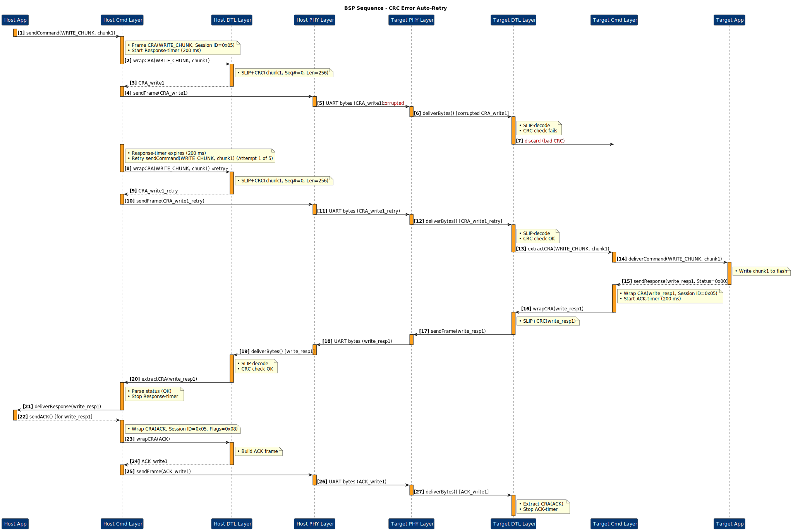

# Bootloader Serial Protocol (BSP)

## Document Info

- **Purpose**: Reliable, scriptable firmware delivery from PC to embedded target over UART
- **Last Updated**: 2025-06-30
- **Version**: v0.1

---

## Contents

<strong>Table of Contents</strong>

- [Bootloader Serial Protocol (BSP)](#bootloader-serial-protocol-bsp)
  - [Document Info](#document-info)
  - [Contents](#contents)
  - [1 · Scope](#1--scope)
  - [2 · Architecture](#2--architecture)
    - [2.1 Layered View](#21-layered-view)
    - [2.2 Command Frame (CRA Header)](#22-command-frame-cra-header)
      - [2.2.4 ACK Frame](#224-ack-frame)
    - [2.3 Response Frame](#23-response-frame)
  - [3 · Data Transfer Layer (DTL)](#3--data-transfer-layer-dtl)
  - [4 · Physical Layer](#4--physical-layer)
  - [5 · Time-outs \& Retries](#5--time-outs--retries)
    - [5.1 Host Time-outs](#51-host-time-outs)
    - [5.2 Target Time-outs](#52-target-time-outs)
    - [5.3 Recommended Retry Limits](#53-recommended-retry-limits)
  - [6 · Interaction Sequences](#6--interaction-sequences)
    - [6.1 Layered Sequence](#61-layered-sequence)
    - [6.2 Full Flash Flow](#62-full-flash-flow)
      - [6.2.1 Erase Flash Sequence](#621-erase-flash-sequence)
      - [6.2.2 Write Chunk Sequence](#622-write-chunk-sequence)
      - [6.2.3 Verify Chunk Sequence](#623-verify-chunk-sequence)
      - [6.2.4 Reset and Run Sequence](#624-reset-and-run-sequence)
    - [6.3 Error \& Retry](#63-error--retry)
    - [6.4 Multiple Requests All Success Case](#64-multiple-requests-all-success-case)
    - [6.5 Multiple Requests Timeout Case](#65-multiple-requests-timeout-case)
    - [6.6 Single Command Duplicate ACK](#66-single-command-duplicate-ack)
    - [6.7 Single Command ACK MISS](#67-single-command-ack-miss)
    - [6.8 Single Corrupted Command](#68-single-corrupted-command)
    - [6.9 Single Command Corrupted Response](#69-single-command-corrupted-response)
  - [7 · Reference Tables](#7--reference-tables)
    - [7.1 Command IDs](#71-command-ids)
    - [7.2 Status Codes](#72-status-codes)
    - [7.3 CRC-16 Parameters](#73-crc-16-parameters)
    - [7.4 SLIP Special Bytes](#74-slip-special-bytes)
  - [8 · Next Steps](#8--next-steps)
  - [9 · Revision History](#9--revision-history)

---

## 1 · Scope

Enable a host CLI (Python) to:

- **Erase**, **program**, **verify**, and **run** flash on a remote MCU
- **Query** transfer progress or **abort** safely
- Operate over a simple **3-wire UART** (TX, RX, GND) with optional RTS/CTS

A single CRA transaction follows:

---

## 2 · Architecture

### 2.1 Layered View

- **Application Layer**: Bootloader state machine & CLI
- **Command Layer**: CRA framing, priorities & ACK
- **Data Transfer Layer**: Fragmentation, CRC-16, SLIP
- **Physical Layer**: UART byte stream

---

### 2.2 Command Frame (CRA Header)

| Byte(s) | Field            | Description                      |
| :-----: | :--------------- | :------------------------------- |
|    0    | **Session ID**   | 8-bit handle, echoed in response |
|    1    | **Flags**        | b3 = ACK flag, b2–b0 = priority  |
|    2    | **Command Code** | See [§7.1](#71-command-ids)      |
|   3–4   | **Payload Len**  | Little-endian, 0–60 bytes        |
|    …    | **Payload**      | Command-specific parameters      |

> **TODO:** Insert PlantUML bit-level map.

#### 2.2.4 ACK Frame

When the client sends only an ACK (no payload), Flags = `0x08` (b3=1, all other bits=0) and all other fields = 0:

| Byte(s) | Value | Description                   |
| :-----: | :---- | :---------------------------- |
|    0    | 0xXX  | Session ID (copied from resp) |
|    1    | 0x08  | b3 = ACK, b2–b0 = 0           |
|   2–4   | 0x00  | Cmd code + len = 0            |

---

### 2.3 Response Frame

| Byte(s) | Field          | Description                  |
| :-----: | :------------- | :--------------------------- |
|    0    | **Session ID** | Mirrors request              |
|    1    | **Status**     | See [§7.2](#72-status-codes) |
|   2–3   | **Resp Len**   | Little-endian                |
|    …    | **Payload**    | Optional data                |

> **TODO:** Insert PlantUML byte-layout.

---

## 3 · Data Transfer Layer (DTL)

| Field  | Size    | Description                       |
| :----: | :------ | :-------------------------------- |
|  Seq#  | 2 B     | 0–65 535, wraps                   |
|  Len   | 2 B     | Data length                       |
|  Data  | 0–256 B | Aligned to flash line width       |
| CRC-16 | 2 B     | CCITT-False over (Seq, Len, Data) |
|  SLIP  | —       | 0xC0/0xDB framing & escaping      |

> **Note:** Next chunk is sent only after ACK (0×00) is confirmed.

---

## 4 · Physical Layer

| Parameter    | Value                           |
| :----------- | :------------------------------ |
| Baud Rate    | **115 200 bps**                 |
| Word Format  | 8 data bits, no parity, 1 stop  |
| Flow Control | RTS/CTS (preferred) or XON/XOFF |
| Idle Timeout | 2 × max frame transmission time |

---

## 5 · Time-outs & Retries

### 5.1 Host Time-outs

| Phase         | Timeout |
| :------------ | :------ |
| Wait for Resp | 200 ms  |
| Chunk Verify  | 300 ms  |

### 5.2 Target Time-outs

| Phase        | Timeout |
| :----------- | :------ |
| Wait for ACK | 200 ms  |

### 5.3 Recommended Retry Limits

- **Command → Response:** 5 retries
- **DTL chunk → ACK:** 5 retries
- **Verify → ACK:** 3 retries

---

## 6 · Interaction Sequences

### 6.1 Layered Sequence

### 6.2 Full Flash Flow

The full flash flow is divided into individual sequences for each command phase, illustrating the complete process of erasing, programming, verifying, and running firmware on a remote MCU.

#### 6.2.1 Erase Flash Sequence

#### 6.2.2 Write Chunk Sequence

#### 6.2.3 Verify Chunk Sequence

#### 6.2.4 Reset and Run Sequence

### 6.3 Error & Retry

### 6.4 Multiple Requests All Success Case

### 6.5 Multiple Requests Timeout Case

### 6.6 Single Command Duplicate ACK

### 6.7 Single Command ACK MISS

### 6.8 Single Corrupted Command

### 6.9 Single Command Corrupted Response

---

## 7 · Reference Tables

### 7.1 Command IDs

| Code | Mnemonic       | Direction | Comments            |
| :--: | :------------- | :-------: | :------------------ |
| 0x10 | ERASE_FLASH    | Host→MCU  | Full or partial     |
| 0x11 | WRITE_CHUNK    | Host→MCU  | Up to 256 bytes     |
| 0x12 | VERIFY_CHUNK   | Host→MCU  | CRC check           |
| 0x13 | RESET_AND_RUN  | Host→MCU  | Jump to application |
| 0x14 | ABORT          | Host→MCU  | Cancel session      |
| 0x20 | PROGRESS_QUERY | Host→MCU  | % complete          |

### 7.2 Status Codes

| Value | Description   |
| :---: | :------------ |
| 0×00  | OK            |
| 0×01  | Generic error |
| 0×02  | Flash failure |
| 0×03  | Bad CRC       |
| 0×04  | Timeout       |

### 7.3 CRC-16 Parameters

- **Polynomial:** 0x1021
- **Initial Value:** 0xFFFF
- **Reflect In/Out:** No
- **XOR Out:** 0x0000

### 7.4 SLIP Special Bytes

| Name      | Value | Purpose                      |
| :-------- | :---- | :--------------------------- |
| `END`     | 0xC0  | Frame delimiter              |
| `ESC`     | 0xDB  | Escape indicator             |
| `ESC_END` | 0xDC  | Encodes literal 0xC0 in data |
| `ESC_ESC` | 0xDD  | Encodes literal 0xDB in data |

---

## 8 · Next Steps

1. Replace every **TODO** with final PlantUML diagrams.
2. Implement host CLI (`serial_bsp_cli.py`) with argparse & pyserial.
3. Develop STM32 bootloader modules (`bsp_command.c`, `bsp_dtl.c`, …).

---

## 9 · Revision History

| Date       | Version | Notes                |
| :--------- | :------ | :------------------- |
| 2025-06-30 | v0.1    | Initial public draft |
