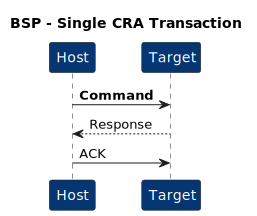
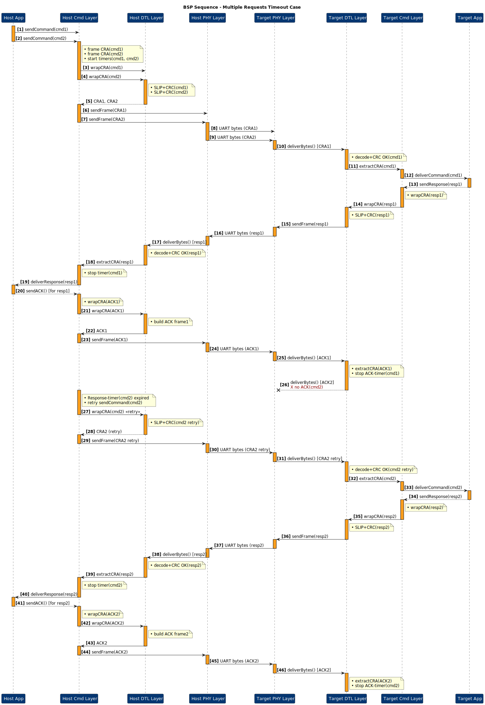

# Bootloader Serial Protocol (BSP)

## Document Info

- **Purpose**: Reliable, scriptable firmware delivery from PC to embedded target over UART
- **Last Updated**: 2025-06-30
- **Version**: v0.1

---

## Contents

<strong>Table of Contents</strong>

- [Bootloader Serial Protocol (BSP)](#bootloader-serial-protocol-bsp)
  - [Document Info](#document-info)
  - [Contents](#contents)
  - [1 · Scope](#1--scope)
  - [2 · Architecture](#2--architecture)
    - [2.1 Layered View](#21-layered-view)
    - [2.2 Command Frame (CRA Header)](#22-command-frame-cra-header)
      - [Field Explanations](#field-explanations)
    - [2.2.4 ACK Frame](#224-ack-frame)
      - [Bit-level layout (fixed 5 bytes)](#bit-level-layout-fixed-5-bytes)
      - [Field Explanations — ACK-only Frame](#field-explanations--ack-only-frame)
    - [2.3 Response Frame](#23-response-frame)
      - [Bit-level view](#bit-level-view)
  - [3 · Data Transfer Layer (DTL)](#3--data-transfer-layer-dtl)
      - [Frame layout](#frame-layout)
  - [4 · Physical Layer](#4--physical-layer)
  - [5 · Time-outs \& Retries](#5--time-outs--retries)
    - [5.1 Host Time-outs](#51-host-time-outs)
    - [5.2 Target Time-outs](#52-target-time-outs)
    - [5.3 Recommended Retry Limits](#53-recommended-retry-limits)
  - [6 · Interaction Sequences](#6--interaction-sequences)
    - [6.1 Layered Sequence](#61-layered-sequence)
    - [6.2 Full Flash Flow](#62-full-flash-flow)
      - [6.2.1 Erase Flash Sequence](#621-erase-flash-sequence)
      - [6.2.2 Write Chunk Sequence](#622-write-chunk-sequence)
      - [6.2.3 Verify Chunk Sequence](#623-verify-chunk-sequence)
      - [6.2.4 Reset and Run Sequence](#624-reset-and-run-sequence)
    - [6.3 Error \& Retry](#63-error--retry)
    - [6.4 Multiple Requests All Success Case](#64-multiple-requests-all-success-case)
    - [6.5 Multiple Requests Timeout Case](#65-multiple-requests-timeout-case)
    - [6.6 Single Command Duplicate ACK](#66-single-command-duplicate-ack)
    - [6.7 Single Command ACK MISS](#67-single-command-ack-miss)
    - [6.8 Single Corrupted Command](#68-single-corrupted-command)
    - [6.9 Single Command Corrupted Response](#69-single-command-corrupted-response)
  - [7 · Services](#7--services)
    - [7.1 Bootloader Services](#71-bootloader-services)
      - [7.1.1 Erase Flash](#711-erase-flash)
      - [7.1.2 Write Chunk](#712-write-chunk)
      - [7.1.3 Verify Chunk](#713-verify-chunk)
      - [7.1.4 Reset and Run](#714-reset-and-run)
      - [7.1.5 Abort](#715-abort)
  - [8 · Reference Tables](#8--reference-tables)
    - [8.1 Command IDs](#81-command-ids)
    - [8.2 Status Codes](#82-status-codes)
    - [8.3 CRC-16 Parameters](#83-crc-16-parameters)
    - [8.4 SLIP Special Bytes](#84-slip-special-bytes)
  - [9 · Next Steps](#9--next-steps)
  - [10 · Revision History](#10--revision-history)

---

## 1 · Scope

Enable a host CLI (Python) to:

- **Erase**, **program**, **verify**, and **run** flash on a remote MCU
- **Query** transfer progress or **abort** safely
- Operate over a simple **3-wire UART** (TX, RX, GND) with optional RTS/CTS

A single CRA transaction follows:

---

## 2 · Architecture

### 2.1 Layered View

- **Application Layer**: Bootloader state machine & CLI
- **Command Layer**: CRA framing, priorities & ACK
- **Data Transfer Layer**: Fragmentation, CRC-16, SLIP
- **Physical Layer**: UART byte stream

---

### 2.2 Command Frame (CRA Header)

#### Field Explanations

- **Unique ID (8 bits)** – Per-transaction handle generated by the host and echoed back by the target.  
  Lets you pipeline up to 256 CRA sessions without ambiguity.

- **Reserved (5 bits – bits 7…3 of the Flags byte)** – Must always be **0**.  
  Held for future protocol extensions; ignored by the target.

- **AF – Acknowledge Flag (1 bit – bit 2)**

  | AF  | Meaning                                                      | Valid Priority bits |
  | :-: | ------------------------------------------------------------ | ------------------- |
  |  0  | **Command / Response** frame                                 | 0 – 3               |
  |  1  | **ACK-only** frame (no payload; `Command = 0x00`, `Len = 0`) | 0                   |

  _If **AF = 1**, the two priority bits **must** be `0` and the frame length is fixed at 5 bytes._

- **Priority (2 bits – bits 1-0)** – Host-hinted urgency when **AF = 0**

  | Value | Meaning  |
  | :---: | -------- |
  |   0   | Low      |
  |   1   | Normal   |
  |   2   | High     |
  |   3   | Critical |

- **Command (8 bits)** – Opcode chosen from **[§ 8.1 Command IDs](#81-command-ids)** (e.g. `ERASE_FLASH 0x10`, `WRITE_CHUNK 0x11`, …).  
  Must be **0x00** in an ACK-only frame.

- **Payload (8 × n bits)** – Command-specific parameters.  
  Length _n_ is conveyed in **Payload Len** (bytes 3-4). Total header + payload ≤ 64 bytes.

### 2.2.4 ACK Frame

#### Bit-level layout (fixed 5 bytes)

|          **Byte**          | **Bit&nbsp;7** | **Bit&nbsp;6** | **Bit&nbsp;5** | **Bit&nbsp;4** | **Bit&nbsp;3** | **Bit&nbsp;2** | **Bit&nbsp;1** | **Bit&nbsp;0** | **Notes**                                                       |
| :------------------------: | :------------: | :------------: | :------------: | :------------: | :------------: | :------------: | :------------: | :------------: | --------------------------------------------------------------- |
| **0** (Session&nbsp;ID) |       —        |       —        |       —        |       —        |       —        |       —        |       —        |       —        | Echoes the request you are acknowledging                        |
|      **1** (Flags)      |     **0**      |     **0**      |     **0**      |     **0**      |     **0**      |     **1**      |     **0**      |     **0**      | Reserved (5 bits)=0; AF (bit 2)=1 → ACK; Priority (bits 1-0)=00 |
|     **2** (Command)     |     **0**      |     **0**      |     **0**      |     **0**      |     **0**      |     **0**      |     **0**      |     **0**      | Command Code = 0×00                                             |
|     **3** (Len LSB)     |     **0**      |     **0**      |     **0**      |     **0**      |     **0**      |     **0**      |     **0**      |     **0**      | Payload Len LSB = 0                                             |
|     **4** (Len MSB)     |     **0**      |     **0**      |     **0**      |     **0**      |     **0**      |     **0**      |     **0**      |     **0**      | Payload Len MSB = 0                                             |

#### Field Explanations — ACK-only Frame

- **Session ID (8 bits)** – Copies the Unique ID from the response you are acknowledging.
  Frees any per-transaction resources on the target once the ACK is received.

- **Reserved (5 bits — bits 7…3 of Flags)** – Always **0**.
  Frames with non-zero reserved bits are rejected with _STATUS_BAD_FLAGS_.

- **AF – Acknowledge Flag (1 bit — bit 2)**

  - `0` = normal Command/Response frame
  - `1` = ACK-only frame (no payload)
    When AF = 1, Priority **must** be `00`.

- **Priority (2 bits — bits 1-0)** – Must be **00** in an ACK.

- **Command (8 bits)** – Fixed to **0x00**.

- **Payload Len (16 bits, little-endian)** – Fixed to **0x0000**.

---

### 2.3 Response Frame

| Byte(s) | Field          | Description                  |
| :-----: | :------------- | :--------------------------- |
|    0    | **Session ID** | Mirrors request              |
|    1    | **Status**     | See [§7.2](#72-status-codes) |
|   2–3   | **Resp Len**   | Little-endian                |
|    …    | **Payload**    | Optional data                |

#### Bit-level view

| **Session ID** | **Status** | **Resp Len** | **Payload**  |
| :------------: | :--------: | :----------: | :----------: |
|     8 bits     |   8 bits   | 16 bits (LE) | 8 × _n_ bits |

| Field          | Bits     | Purpose                       |
| -------------- | -------- | ----------------------------- |
| **Session ID** | 7 … 0    | Echoes the request.           |
| **Status**     | 7 … 0    | Result code – see §8.2.       |
| **Resp Len**   | 15 … 0   | Byte-count of Payload.        |
| **Payload**    | variable | Optional data (0 – 60 bytes). |

---

## 3 · Data Transfer Layer (DTL)

| Field  | Size    | Description                       |
| :----: | :------ | :-------------------------------- |
|  Seq#  | 2 B     | 0–65 535, wraps                   |
|  Len   | 2 B     | Data length                       |
|  Data  | 0–256 B | Aligned to flash line width       |
| CRC-16 | 2 B     | CCITT-False over (Seq, Len, Data) |
|  SLIP  | —       | 0xC0/0xDB framing & escaping      |

#### Frame layout

|  Seq#   |   Len   |   Data    | CRC-16  |           SLIP framing            |
| :-----: | :-----: | :-------: | :-----: | :-------------------------------: |
| 16 bits | 16 bits | 0 – 256 B | 16 bits | 0xC0 delimiters with 0xDB escapes |

> **Note:** Next chunk is sent **only** after an ACK (0x00) is confirmed.

---

## 4 · Physical Layer

| Parameter    | Value                           |
| :----------- | :------------------------------ |
| Baud Rate    | **115200 bps**                  |
| Word Format  | 8 data bits, no parity, 1 stop  |
| Flow Control | RTS/CTS (preferred) or XON/XOFF |
| Idle Timeout | 2 × max frame transmission time |

---

## 5 · Time-outs & Retries

### 5.1 Host Time-outs

| Phase         | Timeout |
| :------------ | :------ |
| Wait for Resp | 200 ms  |
| Chunk Verify  | 300 ms  |

### 5.2 Target Time-outs

| Phase        | Timeout |
| :----------- | :------ |
| Wait for ACK | 200 ms  |

### 5.3 Recommended Retry Limits

- **Command → Response:** 5 retries
- **DTL chunk → ACK:** 5 retries
- **Verify → ACK:** 3 retries

---

## 6 · Interaction Sequences

### 6.1 Layered Sequence

### 6.2 Full Flash Flow

The full flash flow is divided into individual sequences for each command phase, illustrating the complete process of erasing, programming, verifying, and running firmware on a remote MCU.

#### 6.2.1 Erase Flash Sequence

#### 6.2.2 Write Chunk Sequence

#### 6.2.3 Verify Chunk Sequence

#### 6.2.4 Reset and Run Sequence

### 6.3 Error & Retry

### 6.4 Multiple Requests All Success Case

### 6.5 Multiple Requests Timeout Case

### 6.6 Single Command Duplicate ACK

### 6.7 Single Command ACK MISS

### 6.8 Single Corrupted Command

### 6.9 Single Command Corrupted Response

---

## 7 · Services

### 7.1 Bootloader Services

#### 7.1.1 Erase Flash

Erase flash memory (full or partial) on the target MCU.

**Command Message**

| Field          | Content              | Description                                                     |
| :------------- | :------------------- | :-------------------------------------------------------------- |
| AF             | `COMMAND_FRAME`      | Set frame as command frame (Flags.b3=0)                         |
| Command        | `ERASE_FLASH` (0x10) | Full or partial erase request                                   |
| Payload\[0..3] | Start Address (LE)   | 32-bit little-endian flash address (omit for full-chip erase)   |
| Payload\[4..7] | Length (LE)          | 32-bit little-endian length in bytes (omit for full-chip erase) |

**Response Message**

| Field   | Content     | Description                  |
| :------ | :---------- | :--------------------------- |
| Status  | Status byte | See [§8.2](#82-status-codes) |
| Payload | —           | None                         |

---

#### 7.1.2 Write Chunk

Send one fragment (0–256 bytes) of the firmware image.

**Command Message**

| Field   | Content                  | Description                |
| :------ | :----------------------- | :------------------------- |
| AF      | `COMMAND_FRAME`          | Set frame as command frame |
| Command | `WRITE_CHUNK` (0x11)     | Write data chunk request   |
| Payload | Chunk data (0–256 bytes) | Raw flash data fragment    |

**Response Message**

| Field   | Content     | Description                  |
| :------ | :---------- | :--------------------------- |
| Status  | Status byte | See [§8.2](#82-status-codes) |
| Payload | —           | None                         |

---

#### 7.1.3 Verify Chunk

Ask target to CRC-check the last written chunk.

**Command Message**

| Field   | Content               | Description                     |
| :------ | :-------------------- | :------------------------------ |
| AF      | `COMMAND_FRAME`       | Set frame as command frame      |
| Command | `VERIFY_CHUNK` (0x12) | Verify previously written chunk |
| Payload | —                     | None                            |

**Response Message**

| Field   | Content     | Description                  |
| :------ | :---------- | :--------------------------- |
| Status  | Status byte | See [§8.2](#82-status-codes) |
| Payload | —           | None                         |

---

#### 7.1.4 Reset and Run

Tell bootloader to exit and start the application.

**Command Message**

| Field   | Content                | Description                      |
| :------ | :--------------------- | :------------------------------- |
| AF      | `COMMAND_FRAME`        | Set frame as command frame       |
| Command | `RESET_AND_RUN` (0x13) | Exit bootloader and run firmware |
| Payload | —                      | None                             |

**Response Message**

| Field   | Content     | Description                  |
| :------ | :---------- | :--------------------------- |
| Status  | Status byte | See [§8.2](#82-status-codes) |
| Payload | —           | None                         |

---

#### 7.1.5 Abort

Cancel the current flash session.

**Command Message**

| Field   | Content         | Description                  |
| :------ | :-------------- | :--------------------------- |
| AF      | `COMMAND_FRAME` | Set frame as command frame   |
| Command | `ABORT` (0x14)  | Cancel in-flight CRA session |
| Payload | —               | None                         |

**Response Message**

| Field   | Content     | Description                  |
| :------ | :---------- | :--------------------------- |
| Status  | Status byte | See [§8.2](#82-status-codes) |
| Payload | —           | None                         |

---

## 8 · Reference Tables

### 8.1 Command IDs

| Code | Mnemonic      | Direction | Comments            |
| :--: | :------------ | :-------: | :------------------ |
| 0x10 | ERASE_FLASH   | Host→MCU  | Full or partial     |
| 0x11 | WRITE_CHUNK   | Host→MCU  | Up to 256 bytes     |
| 0x12 | VERIFY_CHUNK  | Host→MCU  | CRC check           |
| 0x13 | RESET_AND_RUN | Host→MCU  | Jump to application |
| 0x14 | ABORT         | Host→MCU  | Cancel session      |

### 8.2 Status Codes

| Value | Description   |
| :---: | :------------ |
| 0×00  | OK            |
| 0×01  | Generic error |
| 0×02  | Flash failure |
| 0×03  | Bad CRC       |
| 0×04  | Timeout       |

### 8.3 CRC-16 Parameters

- **Polynomial:** 0x1021
- **Initial Value:** 0xFFFF
- **Reflect In/Out:** No
- **XOR Out:** 0x0000

### 8.4 SLIP Special Bytes

| Name      | Value | Purpose                      |
| :-------- | :---- | :--------------------------- |
| `END`     | 0xC0  | Frame delimiter              |
| `ESC`     | 0xDB  | Escape indicator             |
| `ESC_END` | 0xDC  | Encodes literal 0xC0 in data |
| `ESC_ESC` | 0xDD  | Encodes literal 0xDB in data |

---

## 9 · Next Steps

1. Replace every **TODO** with final PlantUML diagrams.
2. Implement host CLI (`serial_bsp_cli.py`) with argparse & pyserial.
3. Develop STM32 bootloader modules (`bsp_command.c`, `bsp_dtl.c`, …).

---

## 10 · Revision History

| Date       | Version | Notes                |
| :--------- | :------ | :------------------- |
| 2025-06-30 | v0.1    | Initial public draft |
