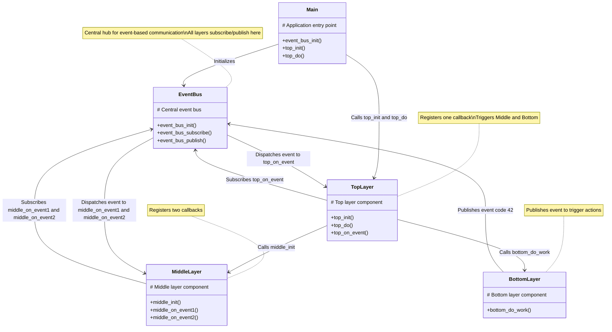

# Macro-Based Static EventBus Pipeline (C)

A three-layer callback pipeline (Top ⇒ Middle ⇒ Bottom) built on a central EventBus with **static** subscriber storage—no dynamic allocation. EventBus core is split across `.h` and `.c`.

---

## Table of Contents

- [Macro-Based Static EventBus Pipeline (C)](#macro-based-static-eventbus-pipeline-c)
  - [Table of Contents](#table-of-contents)
  - [Project Structure](#project-structure)
  - [Design Overview](#design-overview)
  - [event\_bus (bus core)](#event_bus-bus-core)
    - [include/event\_bus.h](#includeevent_bush)
    - [src/event\_bus.c](#srcevent_busc)
  - [Bottom Layer](#bottom-layer)
    - [include/bottom\_layer.h](#includebottom_layerh)
    - [src/bottom\_layer.c](#srcbottom_layerc)
  - [Middle Layer](#middle-layer)
    - [include/middle\_layer.h](#includemiddle_layerh)
    - [src/middle\_layer.c](#srcmiddle_layerc)
  - [Top Layer](#top-layer)
    - [include/top\_layer.h](#includetop_layerh)
    - [src/top\_layer.c](#srctop_layerc)
  - [Application Entry](#application-entry)
    - [src/main.c](#srcmainc)
  - [Makefile](#makefile)
  - [Build \& Run](#build--run)

---

## Project Structure

```
eventbus_app/
├── include/
│   ├── event_bus.h
│   ├── bottom_layer.h
│   ├── middle_layer.h
│   └── top_layer.h
├── src/
│   ├── event_bus.c
│   ├── bottom_layer.c
│   ├── middle_layer.c
│   ├── top_layer.c
│   └── main.c
└── Makefile
```

---

## Design Overview

- **Static allocation**: `MAX_SUBSCRIBERS` fixed-size array in `event_bus_t`.
- **Separation of interface and implementation**: Header declares API; source implements it.
- **Zero heap usage**: No calls to `malloc` or `free`.
- **Layer decoupling**: Each layer (Top, Middle, Bottom) defines and registers callbacks without holding references to other layers. They communicate solely through the EventBus, which dispatches events. This means:
  - Layers don’t directly call each other’s functions.
  - New layers or handlers can be added without modifying existing code.
  - The system remains modular and maintainable.

The following diagram illustrates the layered architecture and how the layers interact through the EventBus. The `Main` component initializes the system, the `TopLayer` triggers `MiddleLayer` and `BottomLayer`, and the `BottomLayer` publishes events to the `EventBus`, which dispatches them to subscribed callbacks in `MiddleLayer` and `TopLayer`.



---

## event_bus (bus core)

### include/event_bus.h

```c
#ifndef EVENT_BUS_H
#define EVENT_BUS_H

#include <stddef.h>

// Maximum subscribers supported
#define MAX_SUBSCRIBERS 16

// Event callback signature
typedef void (*event_cb_t)(int code);

// Event bus structure
typedef struct {
    event_cb_t subs[MAX_SUBSCRIBERS];
    size_t     count;
} event_bus_t;

// Initialize the bus
void event_bus_init(event_bus_t *bus);

// Subscribe a callback; returns 0 on success, -1 if full
int  event_bus_subscribe(event_bus_t *bus, event_cb_t cb);

// Publish an event to all subscribers
void event_bus_publish(const event_bus_t *bus, int code);

#endif // EVENT_BUS_H
```

### src/event_bus.c

```c
#include "event_bus.h"
#include <stdio.h>

void event_bus_init(event_bus_t *bus) {
    bus->count = 0;
}

int event_bus_subscribe(event_bus_t *bus, event_cb_t cb) {
    if (bus->count >= MAX_SUBSCRIBERS) {
        // Too many subscribers
        return -1;
    }
    bus->subs[bus->count++] = cb;
    return 0;
}

void event_bus_publish(const event_bus_t *bus, int code) {
    for (size_t i = 0; i < bus->count; ++i) {
        bus->subs[i](code);
    }
}
```

---

## Bottom Layer

### include/bottom_layer.h

```c
#ifndef BOTTOM_LAYER_H
#define BOTTOM_LAYER_H

#include "event_bus.h"

// Execute work, then emit an event
void bottom_do_work(event_bus_t *bus);

#endif // BOTTOM_LAYER_H
```

### src/bottom_layer.c

```c
#include "bottom_layer.h"
#include <stdio.h>

void bottom_do_work(event_bus_t *bus) {
    printf("[Bottom] performing work…\n");
    int code = 42;  // example payload
    event_bus_publish(bus, code);
}
```

---

## Middle Layer

### include/middle_layer.h

```c
#ifndef MIDDLE_LAYER_H
#define MIDDLE_LAYER_H

#include "event_bus.h"

// Register Middle layer handlers
void middle_init(event_bus_t *bus);

#endif // MIDDLE_LAYER_H
```

### src/middle_layer.c

```c
#include "middle_layer.h"
#include <stdio.h>

static void middle_on_event1(int code) {
    printf("[Middle] handler1 got %d\n", code);
}
static void middle_on_event2(int code) {
    printf("[Middle] handler2 got %d\n", code);
}

void middle_init(event_bus_t *bus) {
    printf("[Middle] registering handlers\n");
    event_bus_subscribe(bus, middle_on_event1);
    event_bus_subscribe(bus, middle_on_event2);
}
```

---

## Top Layer

### include/top_layer.h

```c
#ifndef TOP_LAYER_H
#define TOP_LAYER_H

#include "event_bus.h"

// Register Top layer handler
void top_init(event_bus_t *bus);

// Trigger Middle & Bottom
void top_do(event_bus_t *bus);

#endif // TOP_LAYER_H
```

### src/top_layer.c

```c
#include "top_layer.h"
#include "middle_layer.h"
#include "bottom_layer.h"
#include <stdio.h>

static void top_on_event(int code) {
    printf("[Top   ] received event %d\n", code);
}

void top_init(event_bus_t *bus) {
    printf("[Top   ] registering handler\n");
    event_bus_subscribe(bus, top_on_event);
}

void top_do(event_bus_t *bus) {
    printf("[Top   ] invoking Middle & Bottom\n");
    middle_init(bus);
    bottom_do_work(bus);
}
```

---

## Application Entry

### src/main.c

```c
#include <stdio.h>
#include "event_bus.h"
#include "top_layer.h"

int main(void) {
    event_bus_t bus;
    event_bus_init(&bus);

    top_init(&bus);

    printf("=== Begin Flow ===\n");
    top_do(&bus);
    printf("==== End Flow ====\n");

    return 0;
}
```

---

## Makefile

```makefile
CC      = gcc
CFLAGS  = -std=c11 -Wall -Iinclude

SRCS = src/event_bus.c \
       src/bottom_layer.c \
       src/middle_layer.c \
       src/top_layer.c    \
       src/main.c

all: eventbus_app

eventbus_app: $(SRCS)
	$(CC) $(CFLAGS) -o $@ $^

clean:
	rm -f eventbus_app
```

---

## Build & Run

```bash
make
./eventbus_app
```

Expected output:

```
[Top   ] registering handler
=== Begin Flow ===
[Top   ] invoking Middle & Bottom
[Middle] registering handlers
[Bottom] performing work…
[Middle] handler1 got 42
[Middle] handler2 got 42
[Top   ] received event 42
==== End Flow ====
```
