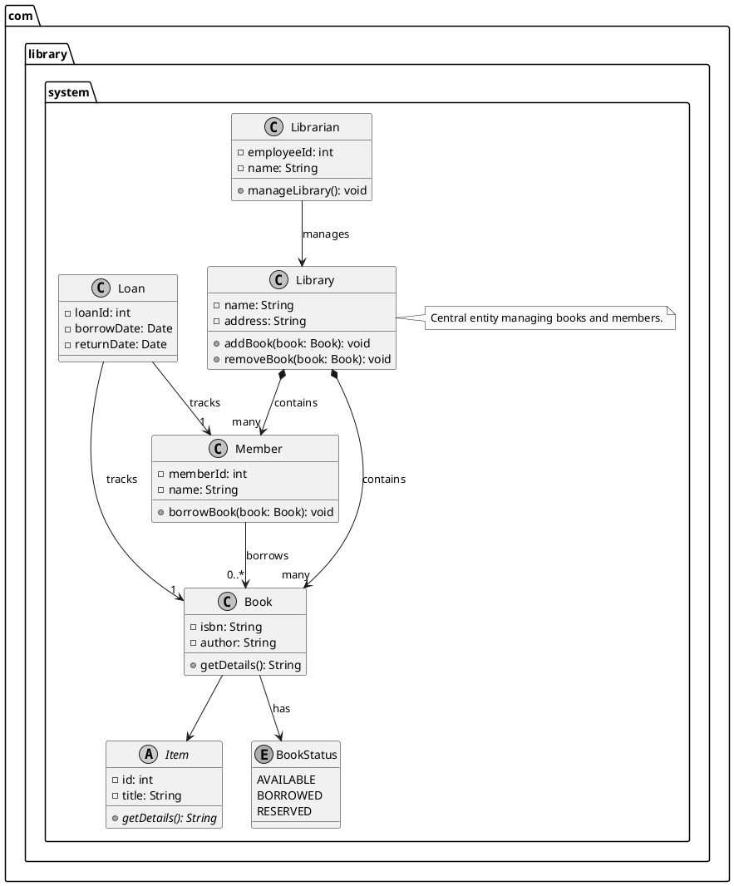

# PlantUML Class Diagram Guide

This README provides a comprehensive guide to creating class diagrams using PlantUML, a text-based tool for generating UML diagrams. It covers the syntax, components, relationships, and best practices for class diagrams, with a specific example of a Library Management System at the end to demonstrate class relationships.

## Table of Contents

- [PlantUML Class Diagram Guide](#plantuml-class-diagram-guide)
  - [Table of Contents](#table-of-contents)
  - [What is a Class Diagram?](#what-is-a-class-diagram)
  - [Key Components of a PlantUML Class Diagram](#key-components-of-a-plantuml-class-diagram)
    - [Classes](#classes)
    - [Attributes](#attributes)
    - [Methods](#methods)
    - [Abstract Classes and Interfaces](#abstract-classes-and-interfaces)
    - [Annotations and Stereotypes](#annotations-and-stereotypes)
  - [Relationships in Class Diagrams](#relationships-in-class-diagrams)
    - [Association](#association)
    - [Aggregation](#aggregation)
    - [Composition](#composition)
    - [Inheritance (Generalization)](#inheritance-generalization)
    - [Implementation (Realization)](#implementation-realization)
    - [Dependency](#dependency)
    - [Multiplicity](#multiplicity)
  - [Advanced Features](#advanced-features)
    - [Packages](#packages)
    - [Notes](#notes)
    - [Visibility and Formatting](#visibility-and-formatting)
    - [Generics](#generics)
    - [Enums](#enums)
  - [How to Use PlantUML](#how-to-use-plantuml)
  - [Best Practices](#best-practices)
  - [Common Pitfalls](#common-pitfalls)
  - [Library Management System Example](#library-management-system-example)
  - [Additional Resources](#additional-resources)

## What is a Class Diagram?

A class diagram is a type of UML diagram that models the structure of a system by showing its classes, attributes, methods, and relationships among objects. In PlantUML, class diagrams are created using a simple text-based syntax, which is rendered into visual diagrams.

## Key Components of a PlantUML Class Diagram

### Classes

A class represents a blueprint for objects. In PlantUML, classes are defined using the `class` keyword.

**Syntax:**

```text
class ClassName {
  // Attributes and methods
}
```

**Example:**

```plantuml
class Car {
  -make: String
  -model: String
  +startEngine(): void
}
```

- `-` denotes private, `+` public, `#` protected, `~` package-private.

### Attributes

Attributes are the data or properties of a class.

**Syntax:**

```text
-visibility attributeName: Type
```

**Example:**

```plantuml
class Employee {
  -id: int
  -name: String
  +salary: double {static}
}
```

- Use `{static}` for static attributes and `{abstract}` for abstract attributes.

### Methods

Methods represent the behavior of a class.

**Syntax:**

```text
-visibility methodName(param: Type): ReturnType
```

**Example:**

```plantuml
class BankAccount {
  -balance: double
  +deposit(amount: double): void
  +withdraw(amount: double): boolean
}
```

### Abstract Classes and Interfaces

- **Abstract Classes**: Use `abstract` or `abstract class`.
- **Interfaces**: Use `interface`.

**Example:**

```plantuml
abstract class Animal {
  +makeSound(): void {abstract}
}
interface Drivable {
  +drive(): void
}
```

### Annotations and Stereotypes

Stereotypes (e.g., `<<entity>>`) provide metadata.

**Syntax:**

```text
class ClassName <<Stereotype>> {
}
```

**Example:**

```plantuml
class User <<entity>> {
  -id: int
  -username: String
}
```

## Relationships in Class Diagrams

### Association

A general relationship between classes (e.g., "uses").

**Syntax:**

```text
ClassA --> ClassB : label
```

**Example:**

```plantuml
Driver --> Car : drives
```

### Aggregation

A "whole-part" relationship where parts can exist independently.

**Syntax:**

```text
ClassA o--> ClassB : label
```

**Example:**

```plantuml
Car o--> "4" Wheel : contains
```

### Composition

A stronger "whole-part" relationship where parts cannot exist without the whole.

**Syntax:**

```text
ClassA *--> ClassB : label
```

**Example:**

```plantuml
House *--> "many" Room : contains
```

### Inheritance (Generalization)

An "is-a" relationship.

**Syntax:**

```text
ClassA --> ClassB
```

**Example:**

```plantuml
Car --> Vehicle
```

### Implementation (Realization)

A class implementing an interface.

**Syntax:**

```text
ClassA ..|> InterfaceB
```

**Example:**

```plantuml
Car ..|> Drivable
```

### Dependency

A weak relationship where one class uses another temporarily.

**Syntax:**

```text
ClassA ..> ClassB : label
```

**Example:**

```plantuml
Application ..> Logger : uses
```

### Multiplicity

Specifies how many instances are involved in a relationship (e.g., `1`, `0..1`, `*`, `1..*`).

**Example:**

```plantuml
Order --> "1..*" Item : contains
```

## Advanced Features

### Packages

Group classes for organization.

**Syntax:**

```text
package "PackageName" {
  [ClassA]
  [ClassB]
}
```

**Example:**

```plantuml
package "com.example.model" {
  [User]
  [Order]
}
```

### Notes

Add explanatory notes.

**Syntax:**

```text
note right of ClassName
  Text here.
end note
```

**Example:**

```plantuml
note right of Car
  Represents a vehicle.
end note
```

### Visibility and Formatting

Customize appearance with `skinparam`.

**Example:**

```plantuml
skinparam monochrome true
```

### Generics

Define classes with generic types.

**Example:**

```plantuml
class List<T> {
  +add(item: T): void
}
```

### Enums

Define enumerations.

**Example:**

```plantuml
enum Color {
  RED
  GREEN
  BLUE
}
```

## How to Use PlantUML

1. **Write Code**: Use `.puml` files or PlantUML-compatible editors.
2. **Render Diagram**:
   - Online: http://www.plantuml.com/plantuml
   - IDE Plugins: IntelliJ, VS Code, Eclipse
   - Local: `java -jar plantuml.jar diagram.puml`
3. **Output Formats**: PNG, SVG, etc.

## Best Practices

- Keep diagrams simple and focused.
- Use consistent naming conventions.
- Add notes for clarity.
- Use packages to organize classes.
- Customize appearance with `skinparam`.

## Common Pitfalls

- Incorrect arrow usage (e.g., using `-->` instead of `*-->` for composition).
- Overloading diagrams with too many details.
- Omitting multiplicity where needed.

## Library Management System Example

Below is a PlantUML class diagram for a Library Management System, showcasing classes and their relationships.

**Classes and Relationships**:

- `Library`: Manages books and members (composition with `Book` and `Member`).
- `Book`: Represents a book with attributes like ISBN and title (inherits from `Item`).
- `Member`: Represents a library member who can borrow books (association with `Book`).
- `Librarian`: Manages the library (association with `Library`).
- `Loan`: Tracks borrowing details ( association with `Book` and `Member`).
- `Item`: Abstract parent class for `Book`.

**PlantUML Code:**



**Explanation of Relationships**:

- **Inheritance**: `Book` inherits from `Item` (`Book --> Item`).
- **Composition**: `Library` contains multiple `Book` and `Member` objects (`*-->`), meaning books and members cannot exist without the library.
- **Association**: `Member` borrows multiple `Book` objects (`--> "0..*"`).
- **Association**: `Librarian` manages the `Library` (`-->`).
- **Association**: `Loan` tracks one `Book` and one `Member` (`--> "1"`).
- **Association**: `Book` has a `BookStatus` (`-->`) to indicate availability.

## Additional Resources

- Official PlantUML Documentation: http://plantuml.com/class-diagram
- Online Editor: http://www.plantuml.com/plantuml
- Search X for community examples and tips.

---

| Snippet Purpose                              | Filename                   | Markdown to Embed                                          |                                                      |
| -------------------------------------------- | -------------------------- | ---------------------------------------------------------- | ---------------------------------------------------- |
| **Basic Class** (Car example)                | `class_car.puml`           | ``                     |                                                      |
| **Attributes** (Employee example)            | `class_employee.puml`      | ``           |                                                      |
| **Methods** (BankAccount example)            | `class_bankaccount.puml`   | ``     |                                                      |
| **Abstract & Interface** (Animal / Drivable) | `abstract_interface.puml`  | `` |                                                      |
| **Stereotype** (`<<entity>>` User)           | `stereotype_user.puml`     | ``       |                                                      |
| **Association** (Driver → Car)               | `assoc_driver_car.puml`    | ``             |                                                      |
| **Aggregation** (Car o-- Wheel)              | `agg_car_wheel.puml`       | ``                 |                                                      |
| **Composition** (House \*-- Room)            | `comp_house_room.puml`     | ``              |                                                      |
| **Inheritance** (Car → Vehicle)              | `inherit_car_vehicle.puml` | ``         |                                                      |
| **Realization** (Car ..                      | > Drivable)                | `realize_car_drivable.puml`                                | `` |
| **Dependency** (App ..> Logger)              | `dep_app_logger.puml`      | ``               |                                                      |
| **Multiplicity** (Order → “1..\*” Item)      | `mult_order_item.puml`     | ``              |                                                      |
| **Package** (com.example.model)              | `package_example.puml`     | ``         |                                                      |
| **Note** (note right of Car)                 | `note_car.puml`            | ``                    |                                                      |
| **Generics** (List<T>)                       | `generic_list.puml`        | ``               |                                                      |
| **Enum** (Color)                             | `enum_color.puml`          | ``                   |                                                      |
| **Library Management System** (full example) | `library_management.puml`  | ``       |                                                      |
