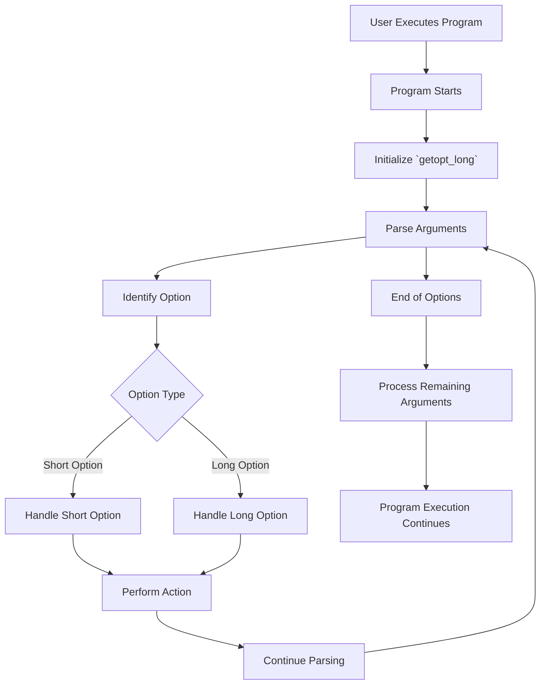

# **Command-Line Option Parsing with `getopt` and `getopt_long`**

This guide explains how to use the `getopt` and `getopt_long` functions in C to handle command-line arguments. It includes details on parsing short and long options, using `struct option`, and provides comprehensive examples with mixed short and long options. Additionally, it features a Mermaid diagram to visualize the command-line option parsing flow.

---

## **Table of Contents**

1. [Introduction to `getopt` and `getopt_long`](#introduction-to-getopt-and-getopt_long)
2. [Understanding `struct option`](#understanding-struct-option)
3. [Features of `getopt_long`](#features-of-getopt_long)
4. [Example Code with Short and Long Options](#example-code-with-short-and-long-options)
5. [Example Code with `flag` Variable](#example-code-with-flag-variable)
6. [Compilation and Execution](#compilation-and-execution)
7. [Sample Outputs](#sample-outputs)
8. [Command-Line Option Parsing Flow Diagram](#command-line-option-parsing-flow-diagram)
9. [Conclusion](#conclusion)
10. [Additional Resources](#additional-resources)

---

## **1. Introduction to `getopt` and `getopt_long`**

Command-line tools often need to parse arguments provided by users. The C standard library offers two functions for this purpose:

### **`getopt`**

-   **Purpose**: Parses short options (e.g., `-a`, `-b`).
-   **Syntax**:
    ```c
    int getopt(int argc, char * const argv[], const char *optstring);
    ```
-   **Parameters**:
    -   `argc`: Argument count.
    -   `argv`: Argument vector.
    -   `optstring`: String containing the legitimate option characters. A colon (`:`) after a character indicates that the option requires an argument (e.g., `"a:b"` means `-a` requires an argument, `-b` does not).
-   **Behavior**:
    -   Returns the option character if a valid option is found.
    -   Returns `?` if an invalid option is found.
    -   Sets the global variable `optarg` to point to the option's argument if it has one.
    -   Updates the global variable `optind` to the index of the next element to be processed in `argv`.

### **`getopt_long`**

-   **Purpose**: Extends `getopt` to support long options (e.g., `--help`).
-   **Syntax**:
    ```c
    int getopt_long(int argc, char * const argv[], const char *optstring,
                    const struct option *longopts, int *longindex);
    ```
-   **Parameters**:
    -   `argc`: Argument count.
    -   `argv`: Argument vector.
    -   `optstring`: String containing the legitimate short option characters.
    -   `longopts`: Array of `struct option` defining the long options.
    -   `longindex`: Pointer to an integer to store the index of the long option relative to `longopts`.
-   **Behavior**:
    -   Returns the option character for short options.
    -   Returns `0` for long options if `flag` is non-NULL.
    -   Similar to `getopt`, it sets `optarg` and updates `optind`.

---

## **2. Understanding `struct option`**

The `getopt_long` function utilizes the `struct option` array to define long options. This structure provides a way to specify detailed information about each long option.

### **Structure Definition**

```c
struct option {
    const char *name;  // Name of the long option
    int has_arg;       // Argument requirement: no_argument, required_argument, or optional_argument
    int *flag;         // Pointer to an int for flag storage or NULL if not used
    int val;           // Value to return or store in *flag when option is matched
};
```

### **Field Explanation**

1. **`name`**:

    - **Description**: The long option name without the leading dashes (e.g., `"help"` for `--help`).

2. **`has_arg`**:

    - **Description**: Specifies whether the option requires an argument.
    - **Values**:
        - `no_argument` (0): Option does not take an argument.
        - `required_argument` (1): Option requires an argument.
        - `optional_argument` (2): Option can take an optional argument.

3. **`flag`**:

    - **Description**: Determines how the option is handled.
    - **Values**:
        - If `NULL`, `getopt_long` returns the value in `val` when the option is encountered.
        - If not `NULL`, `getopt_long` sets the integer pointed to by `flag` to `val` when the option is found and returns `0`.

4. **`val`**:
    - **Description**: The value associated with the option.
    - **Usage**:
        - When `flag` is `NULL`, this is the value returned by `getopt_long`.
        - When `flag` is not `NULL`, this is the value assigned to the variable pointed to by `flag`.

### **Example of `struct option` Array**

```c
static struct option long_options[] = {
    {"help",    no_argument,       0, 'h'}, // Both short (-h) and long (--help)
    {"version", no_argument,       0, 'v'}, // Both short (-v) and long (--version)
    {"config",  required_argument, 0,  0 }, // Long only (--config=FILE)
    {"debug",   no_argument,       0, 'd'}, // Single dash long option (-debug)
    {0,         0,                 0,  0 }
};
```

-   **Explanation**:
    -   `{"help", no_argument, 0, 'h'}`:
        -   Long option `--help`.
        -   No argument required.
        -   Returns `'h'` when matched.
    -   `{"config", required_argument, 0, 0}`:
        -   Long option `--config`.
        -   Requires an argument.
        -   Returns `0` when matched (handled in the code).
    -   The last entry `{0, 0, 0, 0}` signifies the end of the array.

---

## **3. Features of `getopt_long`**

The `getopt_long` function provides enhanced functionality over `getopt`, enabling more flexible command-line option parsing. Key features include:

-   **Support for Long Options**:

    -   Ability to parse options with two dashes (e.g., `--help`).
    -   Facilitates more descriptive and user-friendly commands.

-   **Handling Optional Arguments**:

    -   Options can have optional arguments, providing greater flexibility in command usage.

-   **Mixing Short and Long Options**:

    -   Programs can accept both short (`-h`) and long (`--help`) options simultaneously.

-   **Automatic Parsing of Arguments**:

    -   Manages the ordering and presence of arguments, reducing the complexity of manual parsing.

-   **Error Handling**:
    -   Automatically detects and reports unrecognized or missing option arguments.

---

## **4. Example Code with Short and Long Options**

This example demonstrates how to parse both short and long options using `getopt_long`. It includes:

1. Options with short (`-h`) and long (`--help`) versions.
2. Long-only options (`--config`).
3. Single-dash long options (`-d` for `--debug`).

### **Source Files**

-   `utils.c`
-   `utils.h`
-   `main.c`

### **`utils.c`**

```c
#include "utils.h"

int add(int a, int b) {
    return a + b;
}

int subtract(int a, int b) {
    return a - b;
}
```

### **`utils.h`**

```c
#ifndef UTILS_H
#define UTILS_H

int add(int a, int b);
int subtract(int a, int b);

#endif // UTILS_H
```

### **`main.c`**

```c
#include <stdio.h>
#include <stdlib.h>
#include <getopt.h>
#include <string.h>

// Function to print usage information
void print_usage() {
    printf("Usage: ./program [options]\n");
    printf("Options:\n");
    printf("  -h, --help             Display this help message\n");
    printf("  -v, --version          Show version information\n");
    printf("  --config=FILE          Specify configuration file (long only)\n");
    printf("  -d, -debug             Enable debugging (single dash long option)\n");
    printf("\n");
}

int main(int argc, char *argv[]) {
    int opt;
    int option_index = 0;

    // Define long options
    static struct option long_options[] = {
        {"help",    no_argument,       0, 'h'}, // Both short (-h) and long (--help)
        {"version", no_argument,       0, 'v'}, // Both short (-v) and long (--version)
        {"config",  required_argument, 0,  0 }, // Long only (--config=FILE)
        {"debug",   no_argument,       0, 'd'}, // Single dash long option (-debug)
        {0,         0,                 0,  0 }
    };

    // Parse command-line arguments
    while ((opt = getopt_long(argc, argv, "hv", long_options, &option_index)) != -1) {
        switch (opt) {
            case 'h': // --help or -h
                print_usage();
                exit(0);
            case 'v': // --version or -v
                printf("Version 1.0\n");
                exit(0);
            case 'd': // -d or -debug
                printf("Debugging enabled\n");
                break;
            case 0:
                // Handle long-only options without short equivalent
                if (strcmp(long_options[option_index].name, "config") == 0) {
                    printf("Config file: %s\n", optarg);
                }
                break;
            default:
                print_usage();
                exit(1);
        }
    }

    // Process non-option arguments
    if (optind < argc) {
        printf("Non-option arguments:\n");
        while (optind < argc) {
            printf("  %s\n", argv[optind++]);
        }
    }

    return 0;
}
```

### **Explanation**

-   **Options Handled**:

    -   `-h` or `--help`: Displays usage information.
    -   `-v` or `--version`: Shows version information.
    -   `--config=FILE`: Specifies a configuration file (long-only).
    -   `-d` or `-debug`: Enables debugging.

-   **Parsing Logic**:
    -   The `while` loop uses `getopt_long` to parse the command-line arguments.
    -   Short options (`-h`, `-v`) are handled in the `switch` statement.
    -   Long-only options (`--config`) are handled when `opt` is `0`.
    -   The `-d` option is both a short option and a single-dash long option (`-debug`).

---

## **5. Example Code with `flag` Variable**

This example demonstrates using the `flag` field in `struct option` to directly modify program behavior based on the presence of specific options. It showcases how to set flags without returning specific values.

### **Source Files**

-   `main_flag.c`
-   `utils.c`
-   `utils.h`

### **`main_flag.c`**

```c
#include <stdio.h>
#include <stdlib.h>
#include <getopt.h>
#include <string.h>

// Flags for behavior
int verbose_flag = 0;
int debug_flag = 0;

// Function to print usage information
void print_usage() {
    printf("Usage: ./program [options]\n");
    printf("Options:\n");
    printf("  --verbose   Enable verbose output\n");
    printf("  --debug     Enable debugging\n");
    printf("  -h, --help  Show this help message\n");
    printf("\n");
}

int main(int argc, char *argv[]) {
    int opt;
    int option_index = 0;

    // Define long options with flags
    static struct option long_options[] = {
        {"verbose", no_argument, &verbose_flag, 1}, // Set verbose_flag = 1
        {"debug",   no_argument, &debug_flag,   1}, // Set debug_flag = 1
        {"help",    no_argument, 0, 'h'},          // Short and long for help
        {0,         0,                 0,  0 }
    };

    // Parse command-line arguments
    while ((opt = getopt_long(argc, argv, "h", long_options, &option_index)) != -1) {
        switch (opt) {
            case 'h': // --help or -h
                print_usage();
                exit(0);
            case 0: // Long option with flag set
                // Flags are already set by getopt_long
                break;
            default:
                print_usage();
                exit(1);
        }
    }

    // Output flags
    if (verbose_flag) {
        printf("Verbose mode enabled\n");
    }
    if (debug_flag) {
        printf("Debugging mode enabled\n");
    }

    // Process non-option arguments
    if (optind < argc) {
        printf("Non-option arguments:\n");
        while (optind < argc) {
            printf("  %s\n", argv[optind++]);
        }
    }

    return 0;
}
```

### **Explanation**

-   **Options Handled**:

    -   `--verbose`: Enables verbose output by setting `verbose_flag` to `1`.
    -   `--debug`: Enables debugging by setting `debug_flag` to `1`.
    -   `-h` or `--help`: Displays usage information.

-   **Parsing Logic**:
    -   The `long_options` array includes `verbose` and `debug` options that set their respective flags when matched.
    -   When these options are encountered, `getopt_long` automatically sets the flags without needing to handle them explicitly in the `switch` statement.
    -   The `-h` option is handled to display usage information.

---

## **6. Compilation and Execution**

### **Compile:**

To compile the examples, use the `gcc` compiler with appropriate flags.

1. **Compile the Short and Long Options Example**

    ```bash
    gcc -o program main.c utils.c
    ```

2. **Compile the Flag Variable Example**

    ```bash
    gcc -o program_flag main_flag.c utils.c
    ```

### **Run Examples:**

1. **Short and Long Options Example**

    - **Display Help:**

        ```bash
        ./program -h
        ```

        **Output:**

        ```
        Usage: ./program [options]
        Options:
          -h, --help             Display this help message
          -v, --version          Show version information
          --config=FILE          Specify configuration file (long only)
          -d, -debug             Enable debugging (single dash long option)
        ```

    - **Show Version:**

        ```bash
        ./program --version
        ```

        **Output:**

        ```
        Version 1.0
        ```

    - **Specify Configuration File:**

        ```bash
        ./program --config=config.cfg
        ```

        **Output:**

        ```
        Config file: config.cfg
        ```

    - **Enable Debugging:**

        ```bash
        ./program -d
        ```

        **Output:**

        ```
        Debugging enabled
        ```

    - **Using Non-Option Arguments:**

        ```bash
        ./program --verbose file1.txt file2.txt
        ```

        **Output:**

        ```
        Non-option arguments:
          file1.txt
          file2.txt
        ```

2. **Flag Variable Example**

    - **Enable Verbose and Debug Modes:**

        ```bash
        ./program_flag --verbose --debug
        ```

        **Output:**

        ```
        Verbose mode enabled
        Debugging mode enabled
        ```

    - **Display Help:**

        ```bash
        ./program_flag --help
        ```

        **Output:**

        ```
        Usage: ./program [options]
        Options:
          --verbose   Enable verbose output
          --debug     Enable debugging
          -h, --help  Show this help message
        ```

---

## **7. Sample Outputs**

### **Short and Long Options Example**

```bash
$ ./program -h
Usage: ./program [options]
Options:
  -h, --help             Display this help message
  -v, --version          Show version information
  --config=FILE          Specify configuration file (long only)
  -d, -debug             Enable debugging (single dash long option)
```

```bash
$ ./program --version
Version 1.0
```

```bash
$ ./program --config=config.cfg
Config file: config.cfg
```

```bash
$ ./program -d
Debugging enabled
```

```bash
$ ./program --help
Usage: ./program [options]
Options:
  -h, --help             Display this help message
  -v, --version          Show version information
  --config=FILE          Specify configuration file (long only)
  -d, -debug             Enable debugging (single dash long option)
```

### **Flag Variable Example**

```bash
$ ./program_flag --verbose --debug
Verbose mode enabled
Debugging mode enabled
```

```bash
$ ./program_flag --help
Usage: ./program [options]
Options:
  --verbose   Enable verbose output
  --debug     Enable debugging
  -h, --help  Show this help message
```

---

## **8. Command-Line Option Parsing Flow Diagram**

Visual representations can greatly enhance the understanding of how command-line options are parsed using `getopt` and `getopt_long`. Below is a **Mermaid** diagram illustrating the flow of command-line option parsing.

### **Diagram: Command-Line Option Parsing Flow**



_Figure: Command-Line Option Parsing Flow_

### **Explanation of the Diagram**

1. **User Executes Program**:

    - The user runs the program with various command-line arguments.

2. **Program Starts**:

    - The program begins execution and prepares to parse arguments.

3. **Initialize `getopt_long`**:

    - Sets up the `getopt_long` function with defined options.

4. **Parse Arguments**:

    - `getopt_long` starts parsing the provided arguments.

5. **Identify Option**:

    - Determines whether the current argument is an option or a non-option.

6. **Option Type**:

    - Checks if the option is a short (`-h`) or long (`--help`) option.

7. **Handle Short Option**:

    - Processes short options using the `getopt` mechanism.

8. **Handle Long Option**:

    - Processes long options using the `getopt_long` mechanism.

9. **Perform Action**:

    - Executes the corresponding action based on the identified option.

10. **Continue Parsing**:

    - Continues to parse the next set of arguments.

11. **End of Options**:

    - Detection of the end of option arguments (`--` or end of `argv`).

12. **Process Remaining Arguments**:

    - Handles any non-option arguments that follow.

13. **Program Execution Continues**:
    - The program proceeds with its main functionality using the parsed arguments.

---

## **9. Conclusion**

In this guide, we explored the concepts and practical steps involved in using **`getopt`** and **`getopt_long`** in C for command-line option parsing. Here's a recap of the key points covered:

1. **Introduction**:

    - Introduced `getopt` for parsing short options and `getopt_long` for handling long options.
    - Highlighted the importance of command-line parsing for creating flexible and user-friendly programs.

2. **Understanding `struct option`**:

    - Explained the `struct option` structure used by `getopt_long` to define long options.
    - Detailed each field within the structure for precise option configuration.

3. **Features of `getopt_long`**:

    - Discussed the extended capabilities of `getopt_long` over `getopt`, including support for long options, optional arguments, and mixed option types.

4. **Example Code with Short and Long Options**:

    - Provided a comprehensive example demonstrating how to parse and handle both short and long options.
    - Illustrated how to handle long-only options and single-dash long options.

5. **Example Code with `flag` Variable**:

    - Showcased how to use the `flag` field in `struct option` to set program behavior directly when options are matched.
    - Emphasized the benefits of using flags for cleaner and more efficient code handling.

6. **Compilation and Execution**:

    - Guided through the compilation steps for both short/long options and flag variable examples.
    - Provided commands for running the programs with expected outputs to verify functionality.

7. **Sample Outputs**:

    - Displayed the expected outputs when running the compiled programs with various options.
    - Ensured that users can validate their implementations against the provided outputs.

8. **Command-Line Option Parsing Flow Diagram**:
    - Included a Mermaid diagram to visually represent the command-line option parsing flow.
    - Provided explanations to ensure clarity and understanding of the diagram.

**Final Thoughts**:

Mastering command-line option parsing with `getopt` and `getopt_long` is essential for developing robust and flexible C programs. By effectively leveraging these functions, developers can create applications that offer flexible and intuitive interfaces, enhancing both usability and maintainability.

---

## **10. Additional Resources**

To further enhance your understanding of command-line option parsing in C, consider exploring the following resources:

### **Books**

-   **"The C Programming Language" by Brian W. Kernighan and Dennis M. Ritchie**

    -   A foundational text covering C programming, including library usage and command-line argument handling.

-   **"Advanced Programming in the UNIX Environment" by W. Richard Stevens**

    -   Explores system programming on UNIX-like systems, including detailed discussions on option parsing and `getopt` functions.

-   **"Linux System Programming" by Robert Love**
    -   Delves into system-level programming on Linux, covering libraries, linking, and more advanced topics.

### **Online Documentation**

-   **GNU C Library (glibc) Documentation**

    -   [GNU C Library Documentation](https://www.gnu.org/software/libc/manual/)
    -   Comprehensive reference for the GNU C Library, essential for understanding system libraries and `getopt` functions.

-   **GCC Documentation**

    -   [GCC Online Documentation](https://gcc.gnu.org/onlinedocs/)
    -   Detailed information on GCC compiler options, including linking and library management.

-   **getopt_long Manual Page**
    -   [getopt_long(3) - Linux man page](https://man7.org/linux/man-pages/man3/getopt_long.3.html)
    -   Official manual page for `getopt_long`, providing detailed usage information.

### **Tutorials and Articles**

-   **"Understanding Command-Line Arguments in C" by GeeksforGeeks**

    -   [GeeksforGeeks Article](https://www.geeksforgeeks.org/command-line-arguments-c-examples/)
    -   An introductory tutorial on handling command-line arguments with examples.

-   **"Using getopt and getopt_long to Parse Command-Line Options" by IBM Developer**

    -   [IBM Developer Article](https://developer.ibm.com/articles/au-c-linux-getopt/)
    -   A comprehensive guide on using `getopt` and `getopt_long` with practical examples.

-   **"Parsing Command-Line Arguments in C Using getopt" by Tutorialspoint**
    -   [Tutorialspoint Guide](https://www.tutorialspoint.com/cprogramming/c_command_line_arguments.htm)
    -   Step-by-step instructions with code examples.

### **Video Tutorials**

-   **"Understanding Command-Line Arguments in C" by thenewboston**

    -   [YouTube Video](https://www.youtube.com/watch?v=U7OT7LrVmFY)
    -   A video tutorial explaining how to handle command-line arguments using `getopt` and `getopt_long`.

-   **"C Programming Tutorial - Command Line Arguments" by ProgrammingKnowledge**
    -   [YouTube Video](https://www.youtube.com/watch?v=4Zt1kKUUVGc)
    -   A comprehensive guide on parsing command-line arguments in C.

### **Community and Forums**

-   **Stack Overflow**

    -   [getopt Questions](https://stackoverflow.com/questions/tagged/getopt)
    -   A wealth of Q&A on specific issues and advanced topics related to `getopt` and `getopt_long`.

-   **Reddit - r/C_Programming**

    -   [Reddit C Programming Community](https://www.reddit.com/r/C_Programming/)
    -   Engage with fellow C programmers, ask questions, and share knowledge about option parsing.

-   **GitHub Repositories**
    -   Explore open-source projects that utilize `getopt` and `getopt_long` to understand practical implementations.

### **Tools Documentation**

-   **`getopt` and `getopt_long` Manual Pages**

    -   [getopt(3) - Linux man page](https://man7.org/linux/man-pages/man3/getopt.3.html)
    -   Official manual pages providing detailed usage information for `getopt` and `getopt_long`.

-   **`gcc` (GNU Compiler Collection) Documentation**
    -   [GCC Linking Documentation](https://gcc.gnu.org/onlinedocs/gcc/Link-Options.html)
    -   Detailed explanations of linker options relevant to command-line option parsing.

### **Practical Exercises**

1. **Implement Additional Options**:

    - Extend the example programs to include more options, such as options that accept multiple arguments or options that can be repeated.

2. **Handle Optional Arguments**:

    - Modify the existing examples to include options with optional arguments and observe how `getopt_long` handles them.

3. **Combine Short Options**:

    - Experiment with combining multiple short options (e.g., `-hv`) and see how `getopt` parses them.

4. **Error Handling Enhancements**:

    - Improve the example programs to handle invalid options gracefully and provide more informative error messages.

5. **Dynamic Option Definitions**:

    - Create programs where the set of recognized options is determined at runtime, enhancing flexibility.

6. **Logging Options**:

    - Implement options that control the logging level of your program, such as `--log-level=DEBUG`.

7. **Interactive Help**:
    - Enhance the help option to provide interactive prompts or more detailed usage information based on user input.

By engaging with these resources and exercises, you can deepen your understanding of command-line option parsing in C, enabling you to write more efficient, modular, and maintainable code.
