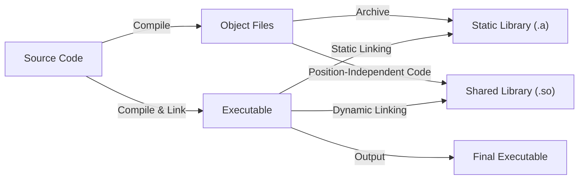
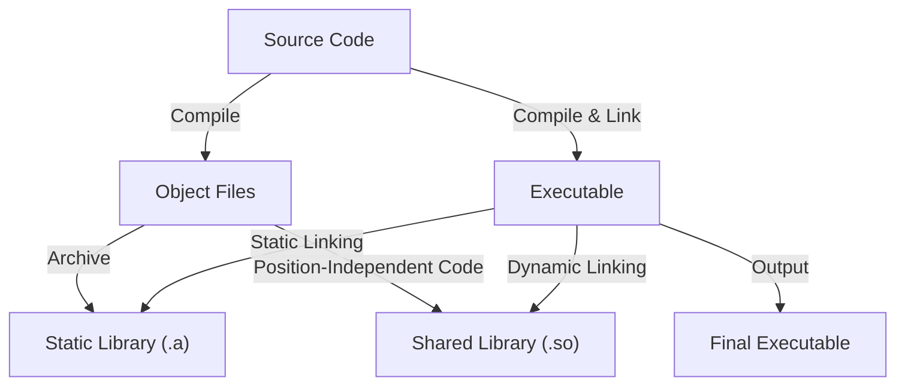

# **Understanding Static and Shared Libraries in C**

## **Table of Contents**

- [**Understanding Static and Shared Libraries in C**](#understanding-static-and-shared-libraries-in-c)
  - [**Table of Contents**](#table-of-contents)
  - [**1. Introduction**](#1-introduction)
  - [**2. Static Libraries**](#2-static-libraries)
    - [**Creating Static Libraries**](#creating-static-libraries)
      - [**Steps to Create a Static Library**](#steps-to-create-a-static-library)
    - [**Linking Static Libraries**](#linking-static-libraries)
      - [**Steps to Link a Static Library**](#steps-to-link-a-static-library)
    - [**Demo: Static Library Example**](#demo-static-library-example)
  - [**3. Shared Libraries**](#3-shared-libraries)
    - [**Creating Shared Libraries**](#creating-shared-libraries)
      - [**Steps to Create a Shared Library**](#steps-to-create-a-shared-library)
    - [**Linking Shared Libraries**](#linking-shared-libraries)
      - [**Steps to Link a Shared Library**](#steps-to-link-a-shared-library)
    - [**Demo: Shared Library Example**](#demo-shared-library-example)
  - [**4. Differences Between Static and Shared Libraries**](#4-differences-between-static-and-shared-libraries)
    - [**Static Libraries**](#static-libraries)
    - [**Shared Libraries**](#shared-libraries)
    - [**Diagram: Static vs Shared Linking**](#diagram-static-vs-shared-linking)
    - [**Explanation of the Diagram**](#explanation-of-the-diagram)
  - [**5. Advanced Concepts**](#5-advanced-concepts)
    - [**Library Search Paths**](#library-search-paths)
      - [**Specifying Library Paths During Compilation**](#specifying-library-paths-during-compilation)
      - [**Using Environment Variables**](#using-environment-variables)
    - [**RPATH and RUNPATH**](#rpath-and-runpath)
      - [**Setting RPATH During Compilation**](#setting-rpath-during-compilation)
    - [**Versioning of Shared Libraries**](#versioning-of-shared-libraries)
      - [**Shared Library Naming Conventions**](#shared-library-naming-conventions)
      - [**Creating Versioned Shared Libraries**](#creating-versioned-shared-libraries)
      - [**Updating Shared Libraries**](#updating-shared-libraries)
  - [**6. Best Practices**](#6-best-practices)
    - [**Choosing Between Static and Shared Libraries**](#choosing-between-static-and-shared-libraries)
    - [**Managing Library Dependencies**](#managing-library-dependencies)
  - [**7. Diagram: Static vs Shared Linking**](#7-diagram-static-vs-shared-linking)
    - [**Explanation of the Diagram**](#explanation-of-the-diagram-1)
  - [**8. Summary**](#8-summary)
  - [**9. Additional Resources**](#9-additional-resources)
    - [**Books**](#books)
    - [**Online Documentation**](#online-documentation)
    - [**Tutorials and Articles**](#tutorials-and-articles)
    - [**Video Tutorials**](#video-tutorials)
    - [**Community and Forums**](#community-and-forums)
    - [**Tools Documentation**](#tools-documentation)
    - [**Practical Exercises**](#practical-exercises)

---

## **1. Introduction**

In C programming, **libraries** are collections of pre-compiled functions that can be reused by other programs. They promote code reuse, modularity, and efficiency by allowing developers to leverage existing functionalities without rewriting code from scratch. There are two primary types of libraries in C:

-   **Static Libraries**: These libraries are bundled directly into the executable at compile time.
-   **Shared Libraries**: These libraries are linked dynamically at runtime.

Both types serve the purpose of code reuse but differ significantly in how and when they are linked to the program, as well as in their impact on the executable's size and performance.

Understanding the differences between static and shared libraries, along with their respective creation and linking processes, is essential for effective C programming and system optimization.

---

## **2. Static Libraries**

Static libraries are archives of object files that are linked into the executable at compile time. Once linked, the program contains its own copy of the library's code, making the executable self-contained.

### **Creating Static Libraries**

A static library is created by compiling source files into object files and then archiving them into a single library file using the `ar` command.

#### **Steps to Create a Static Library**

1. **Write C Source Files with Functions to Include in the Library**

    _Example: `utils.c`_

    ```c
    #include "utils.h"

    int add(int a, int b) {
        return a + b;
    }

    int subtract(int a, int b) {
        return a - b;
    }
    ```

2. **Write a Header File (`.h`) for Your Functions**

    _Example: `utils.h`_

    ```c
    #ifndef UTILS_H
    #define UTILS_H

    int add(int a, int b);
    int subtract(int a, int b);

    #endif // UTILS_H
    ```

3. **Compile the C Source Files into Object Files**

    ```bash
    gcc -c utils.c -o utils.o
    ```

    - `-c`: Compiles without linking.
    - `utils.c`: Source file.
    - `-o utils.o`: Outputs the object file.

4. **Create the Static Library Using `ar`**

    ```bash
    ar rcs libutils.a utils.o
    ```

    - `ar`: The archiver command used to create libraries.
    - `rcs`: Flags where:

        - `r`: Insert the object file into the archive.
        - `c`: Create the archive if it doesn't exist.
        - `s`: Create an index (symbol table) for the archive.

    - `libutils.a`: The name of the static library (conventionally prefixed with `lib` and suffixed with `.a`).
    - `utils.o`: The object file to include in the library.

5. **Verify the Contents of the Static Library**

    ```bash
    ar -t libutils.a
    ```

    **Expected Output**:

    ```
    utils.o
    ```

    This confirms that `utils.o` has been successfully added to `libutils.a`.

### **Linking Static Libraries**

After creating a static library, you can link it to your program during compilation. The linker incorporates the necessary code from the static library into your executable.

#### **Steps to Link a Static Library**

1. **Write Your Main Program**

    _Example: `main.c`_

    ```c
    #include <stdio.h>
    #include "utils.h"

    int main() {
        int result1 = add(10, 5);
        int result2 = subtract(10, 5);
        printf("Addition result: %d\n", result1);
        printf("Subtraction result: %d\n", result2);
        return 0;
    }
    ```

2. **Compile the Program and Link the Static Library**

    ```bash
    gcc main.c -L. -lutils -o myprogram_static
    ```

    - `-L.`: Specifies to look for libraries in the current directory.
    - `-lutils`: Tells the linker to link with `libutils.a` (the `lib` prefix and `.a` extension are omitted).
    - `-o myprogram_static`: Specifies the output executable name.

3. **Run the Program**

    ```bash
    ./myprogram_static
    ```

    **Expected Output**:

    ```
    Addition result: 15
    Subtraction result: 5
    ```

    The program successfully uses the functions from the static library.

### **Demo: Static Library Example**

Let's walk through the process with the provided example.

1. **Files**:

    - `utils.c`
    - `utils.h`
    - `main.c`

2. **Create the Static Library**

    ```bash
    gcc -c utils.c -o utils.o
    ar rcs libutils.a utils.o
    ```

3. **Compile and Link the Main Program**

    ```bash
    gcc main.c -L. -lutils -o myprogram_static
    ```

4. **Execute the Program**

    ```bash
    ./myprogram_static
    ```

    **Output**:

    ```
    Addition result: 15
    Subtraction result: 5
    ```

    The static library functions `add` and `subtract` are successfully integrated into the executable.

---

## **3. Shared Libraries**

Shared libraries, also known as dynamic libraries, are not embedded directly into the executable. Instead, they are loaded into memory at runtime, allowing multiple programs to share a single copy of the library code.

### **Creating Shared Libraries**

Shared libraries require position-independent code (PIC) to allow the code to be loaded at any memory address without modification.

#### **Steps to Create a Shared Library**

1. **Write the C Source Files with Functions to Include**

    _Example: `utils.c`_

    ```c
    #include "utils.h"

    int add(int a, int b) {
        return a + b;
    }

    int subtract(int a, int b) {
        return a - b;
    }
    ```

2. **Write a Header File (`.h`) for Your Functions**

    _Example: `utils.h`_

    ```c
    #ifndef UTILS_H
    #define UTILS_H

    int add(int a, int b);
    int subtract(int a, int b);

    #endif // UTILS_H
    ```

3. **Compile the C Source Files into Position-Independent Object Files**

    ```bash
    gcc -fPIC -c utils.c -o utils.o
    ```

    - `-fPIC`: Generates position-independent code, necessary for shared libraries.

4. **Create the Shared Library Using `gcc`**

    ```bash
    gcc -shared -o libutils.so utils.o
    ```

    - `-shared`: Creates a shared object.
    - `-o libutils.so`: Specifies the output shared library name.

5. **Verify the Contents of the Shared Library**

    ```bash
    nm -D libutils.so
    ```

    **Expected Output**:

    ```
    00000000000007a0 T add
    00000000000007c0 T subtract
    ```

    This confirms that the functions `add` and `subtract` are available in `libutils.so`.

### **Linking Shared Libraries**

Linking shared libraries involves instructing the linker to reference the shared library rather than embedding its code into the executable.

#### **Steps to Link a Shared Library**

1. **Write Your Main Program**

    _Example: `main.c`_

    ```c
    #include <stdio.h>
    #include "utils.h"

    int main() {
        int result1 = add(10, 5);
        int result2 = subtract(10, 5);
        printf("Addition result: %d\n", result1);
        printf("Subtraction result: %d\n", result2);
        return 0;
    }
    ```

2. **Compile the Program and Link the Shared Library**

    ```bash
    gcc main.c -L. -lutils -o myprogram_shared
    ```

    - `-L.`: Specifies to look for libraries in the current directory.
    - `-lutils`: Tells the linker to link with `libutils.so`.
    - `-o myprogram_shared`: Specifies the output executable name.

3. **Run the Program**

    Before running the program, ensure that the shared library can be found by the dynamic linker. You can set the `LD_LIBRARY_PATH` environment variable to include the current directory:

    ```bash
    export LD_LIBRARY_PATH=.:$LD_LIBRARY_PATH
    ```

    **Run the Program**:

    ```bash
    ./myprogram_shared
    ```

    **Expected Output**:

    ```
    Addition result: 15
    Subtraction result: 5
    ```

    The program successfully utilizes the functions from the shared library.

### **Demo: Shared Library Example**

Let's walk through the process with the provided example.

1. **Files**:

    - `utils.c`
    - `utils.h`
    - `main.c`

2. **Create the Shared Library**

    ```bash
    gcc -fPIC -c utils.c -o utils.o
    gcc -shared -o libutils.so utils.o
    ```

3. **Compile and Link the Main Program**

    ```bash
    gcc main.c -L. -lutils -o myprogram_shared
    ```

4. **Set the Library Path and Execute the Program**

    ```bash
    export LD_LIBRARY_PATH=.:$LD_LIBRARY_PATH
    ./myprogram_shared
    ```

    **Output**:

    ```
    Addition result: 15
    Subtraction result: 5
    ```

    The shared library functions `add` and `subtract` are successfully linked and executed at runtime.

---

## **4. Differences Between Static and Shared Libraries**

Understanding the differences between static and shared libraries is crucial for making informed decisions about which type to use in your projects.

### **Static Libraries**

-   **Linking Time**: Linked at **compile time**.
-   **Inclusion**: The library code is **embedded** directly into the executable.
-   **Executable Size**: Generally **larger** since it contains copies of all library functions used.
-   **Runtime Dependencies**: **None**; the executable does not rely on external libraries at runtime.
-   **Performance**: Potentially **faster** at runtime since all code is loaded at compile time.
-   **Updates**: Requires **recompilation** of the executable to incorporate library updates.

### **Shared Libraries**

-   **Linking Time**: Linked at **runtime**.
-   **Inclusion**: The library code is **not embedded**; instead, the executable contains references to the shared library.
-   **Executable Size**: **Smaller** since it doesn't contain the library code.
-   **Runtime Dependencies**: **Required**; the shared library must be present on the system when the executable runs.
-   **Performance**: May have a **slight overhead** at runtime due to dynamic linking.
-   **Updates**: **Easier to update**; updating the shared library can benefit all executables that use it without recompilation.

### **Diagram: Static vs Shared Linking**

Below is a **Mermaid** diagram that visually contrasts the static and shared linking processes in C.



_Figure: Static vs Shared Linking Process_

### **Explanation of the Diagram**

1. **Source Code**: Your `.c` files containing function implementations and the `main` program.
2. **Compile**: Each source file is compiled into an object file (`.o`).
3. **Archive for Static Libraries**:
    - Object files are archived into a **Static Library** (`.a`) using the `ar` command.
    - During linking, the linker extracts the necessary code from the static library and embeds it into the final executable.
4. **Compile for Shared Libraries**:
    - Object files are compiled as **Position-Independent Code (PIC)**, which is essential for shared libraries.
    - These are then linked into a **Shared Library** (`.so`) using the `gcc -shared` command.
    - The final executable contains references to the shared library rather than embedding its code.
5. **Linking**:
    - **Static Linking**: Combines the main program with the static library into the final executable.
    - **Dynamic Linking**: References the shared library in the final executable; the actual linking occurs at runtime.
6. **Final Executable**: The resulting program that either contains the static library code or references the shared library.

---

## **5. Advanced Concepts**

### **Library Search Paths**

When linking a program to a library, the compiler and linker need to know where to find the library files. You can specify the library search paths using the `-L` flag during compilation or by setting environment variables.

#### **Specifying Library Paths During Compilation**

```bash
gcc main.c -L/path/to/library -lutils -o myprogram
```

-   `-L/path/to/library`: Adds `/path/to/library` to the list of directories to search for libraries.
-   `-lutils`: Links with `libutils.a` or `libutils.so`.

#### **Using Environment Variables**

-   **`LD_LIBRARY_PATH`**: Specifies additional directories to search for shared libraries at runtime.

    ```bash
    export LD_LIBRARY_PATH=/path/to/library:$LD_LIBRARY_PATH
    ```

    **Note**: It's generally recommended to use more secure methods like `RPATH` for specifying library paths in production environments.

### **RPATH and RUNPATH**

**RPATH** and **RUNPATH** are mechanisms to specify library search paths that are embedded within the executable.

-   **RPATH**:

    -   Embedded directly into the executable.
    -   Searched **before** the directories listed in `LD_LIBRARY_PATH`.
    -   Set using the `-Wl,-rpath,/path/to/library` linker flag.

-   **RUNPATH**:
    -   Embedded into the executable.
    -   Searched **after** the directories listed in `LD_LIBRARY_PATH`.
    -   Set using the `-Wl,-rpath,/path/to/library` linker flag in newer linker versions.

#### **Setting RPATH During Compilation**

```bash
gcc main.c -L. -lutils -Wl,-rpath=/path/to/library -o myprogram
```

-   `-Wl,-rpath=/path/to/library`: Passes the `-rpath` option to the linker, setting the runtime library search path.

### **Versioning of Shared Libraries**

Maintaining multiple versions of shared libraries ensures compatibility and allows for smooth updates without breaking dependent applications.

#### **Shared Library Naming Conventions**

-   **Versioned Names**: Include version numbers in the library name.

    ```
    libutils.so.1.0.0
    libutils.so.1
    libutils.so
    ```

    -   **Major Version (`libutils.so.1`)**: Indicates compatibility; major changes may break compatibility.
    -   **Minor Version (`libutils.so.1.0.0`)**: Represents minor changes and bug fixes.
    -   **Unversioned Symlink (`libutils.so`)**: Typically points to the latest version and is used during development.

#### **Creating Versioned Shared Libraries**

```bash
gcc -fPIC -c utils.c -o utils.o
gcc -shared -Wl,-soname,libutils.so.1 -o libutils.so.1.0.0 utils.o
ln -s libutils.so.1.0.0 libutils.so.1
ln -s libutils.so.1 libutils.so
```

-   `-Wl,-soname,libutils.so.1`: Sets the **SONAME**, a field in the ELF header that indicates the library's ABI.

#### **Updating Shared Libraries**

When updating a shared library:

1. **Increment the Version Numbers Appropriately**.
2. **Maintain Older Versions** if backward compatibility is required.
3. **Update Symlinks** to point to the new version.

---

## **6. Best Practices**

### **Choosing Between Static and Shared Libraries**

-   **Use Static Libraries When**:

    -   You want a self-contained executable with no external dependencies.
    -   The library is small or unlikely to change frequently.
    -   Deployment simplicity is a priority, especially in environments where installing shared libraries is challenging.

-   **Use Shared Libraries When**:
    -   Multiple programs can share the same library, reducing overall memory usage.
    -   The library is large or used by many applications.
    -   You want the flexibility to update the library independently of the executables.

### **Managing Library Dependencies**

-   **Use Package Managers**: Tools like `apt`, `yum`, or `pacman` can manage shared library installations and dependencies.
-   **Avoid Unnecessary Dependencies**: Keep your executables lean by only linking against essential libraries.
-   **Regularly Update Libraries**: Especially shared libraries, to benefit from performance improvements and security patches.
-   **Use Versioned Libraries**: Ensure compatibility and prevent "dependency hell" by adhering to versioning best practices.

---

## **7. Diagram: Static vs Shared Linking**

Visual representations can greatly enhance the understanding of how static and shared libraries interact during the build and execution processes. Below is a **Mermaid** diagram illustrating the differences between static and shared linking.



_Figure: Static vs Shared Linking Process_

### **Explanation of the Diagram**

1. **Source Code**: Your `.c` files containing function implementations and the `main` program.
2. **Compile**: Each source file is compiled into an object file (`.o`).
3. **Archive for Static Libraries**:
    - Object files are archived into a **Static Library** (`.a`) using the `ar` command.
    - During linking, the linker extracts the necessary code from the static library and embeds it into the final executable.
4. **Compile for Shared Libraries**:
    - Object files are compiled as **Position-Independent Code (PIC)**, which is essential for shared libraries.
    - These are then linked into a **Shared Library** (`.so`) using the `gcc -shared` command.
    - The final executable contains references to the shared library rather than embedding its code.
5. **Linking**:
    - **Static Linking**: Combines the main program with the static library into the final executable.
    - **Dynamic Linking**: References the shared library in the final executable; the actual linking occurs at runtime.
6. **Final Executable**: The resulting program that either contains the static library code or references the shared library.

---

## **8. Summary**

In this guide, we explored the concepts and practical steps involved in creating and using **static** and **shared libraries** in C programming. Here's a recap of the key points covered:

1. **Introduction**:

    - Defined static and shared libraries and their roles in C programming.
    - Highlighted the importance of libraries in promoting code reuse and modularity.

2. **Static Libraries**:

    - Detailed the process of creating static libraries using `ar`.
    - Explained how to link static libraries during compilation.
    - Provided a practical demo with example code and expected outputs.

3. **Shared Libraries**:

    - Covered the creation of shared libraries with position-independent code using `-fPIC` and `-shared`.
    - Explained how to link shared libraries and manage runtime dependencies with `LD_LIBRARY_PATH`.
    - Provided a practical demo with example code and expected outputs.

4. **Differences Between Static and Shared Libraries**:

    - Compared static and shared libraries in terms of linking time, inclusion, executable size, dependencies, performance, and update mechanisms.
    - Included a **Mermaid** diagram to visually contrast the linking processes.

5. **Advanced Concepts**:

    - Discussed library search paths, `RPATH` and `RUNPATH`, and versioning of shared libraries.
    - Explained how to embed library paths into executables and manage multiple library versions.

6. **Best Practices**:

    - Offered guidance on choosing between static and shared libraries based on project needs.
    - Emphasized managing library dependencies effectively to maintain system stability and performance.

7. **Mermaid Diagram: Static vs Shared Linking**:
    - Provided a visual diagram to illustrate the build and linking processes for both static and shared libraries.
    - Ensured correct Mermaid syntax by enclosing labels with special characters in quotes.

**Final Thoughts**:

Understanding the distinctions between static and shared libraries is essential for effective C programming and system optimization. By leveraging static libraries, developers can create self-contained executables, while shared libraries offer flexibility and resource efficiency through dynamic linking. Mastery of these concepts enables the development of modular, maintainable, and scalable software applications.

---

## **9. Additional Resources**

To further enhance your understanding of static and shared libraries in C, consider exploring the following resources:

### **Books**

-   **"The C Programming Language" by Brian W. Kernighan and Dennis M. Ritchie**

    -   A foundational text covering C programming, including library usage.

-   **"Advanced Programming in the UNIX Environment" by W. Richard Stevens**

    -   Explores system programming on UNIX-like systems, including library linking and dynamic loading.

-   **"Linux System Programming" by Robert Love**
    -   Delves into system-level programming on Linux, covering libraries, linking, and more.

### **Online Documentation**

-   **GNU C Library (glibc) Documentation**

    -   [GNU C Library Documentation](https://www.gnu.org/software/libc/manual/)
    -   Comprehensive reference for the GNU C Library, essential for understanding system libraries.

-   **GCC Documentation**

    -   [GCC Online Documentation](https://gcc.gnu.org/onlinedocs/)
    -   Detailed information on GCC compiler options, including linking and library management.

-   **Linkers and Libraries**
    -   [GNU Linker (ld) Documentation](https://sourceware.org/binutils/docs-2.34/ld/)
    -   Official documentation for the GNU linker, covering static and shared linking.

### **Tutorials and Articles**

-   **"Understanding Static and Shared Libraries in C" by GeeksforGeeks**

    -   [GeeksforGeeks Article](https://www.geeksforgeeks.org/static-and-shared-libraries-in-c/)
    -   An introductory tutorial on static and shared libraries with examples.

-   **"Static vs. Shared Libraries: What's the Difference?" by Stack Overflow**

    -   [Stack Overflow Discussion](https://stackoverflow.com/questions/6783283/static-vs-shared-libraries)
    -   Community-driven explanations and use-case discussions.

-   **"Creating and Using Static and Shared Libraries in C" by Tutorialspoint**
    -   [Tutorialspoint Guide](https://www.tutorialspoint.com/cprogramming/c_static_and_shared_libraries.htm)
    -   Step-by-step instructions with code examples.

### **Video Tutorials**

-   **"C Programming: Static vs Shared Libraries" by ProgrammingKnowledge**

    -   [YouTube Video](https://www.youtube.com/watch?v=QhgPff1gBvA)
    -   A video tutorial explaining the differences between static and shared libraries with demonstrations.

-   **"Understanding Static and Dynamic Linking" by TheCherno**
    -   [YouTube Video](https://www.youtube.com/watch?v=6FjQprQCFcc)
    -   An in-depth explanation of static and dynamic linking processes.

### **Community and Forums**

-   **Stack Overflow**

    -   [Static vs Shared Libraries Questions](https://stackoverflow.com/questions/tagged/static-libraries+shared-libraries)
    -   A wealth of Q&A on specific issues and advanced topics related to static and shared libraries.

-   **Reddit - r/C_Programming**

    -   [Reddit C Programming Community](https://www.reddit.com/r/C_Programming/)
    -   Engage with fellow C programmers, ask questions, and share knowledge about library management.

-   **GitHub Repositories**
    -   Explore open-source projects that utilize static and shared libraries to understand practical implementations.

### **Tools Documentation**

-   **`ar` (GNU Archiver) Manual**

    -   [GNU `ar` Documentation](https://www.gnu.org/software/binutils/manual/html_node/ar-invocation.html)
    -   Official manual for using `ar` to create and manage static libraries.

-   **`gcc` (GNU Compiler Collection) Documentation**

    -   [GCC Linking Documentation](https://gcc.gnu.org/onlinedocs/gcc/Link-Options.html)
    -   Detailed explanations of linker options for both static and shared libraries.

-   **`ldd` (List Dynamic Dependencies) Manual**
    -   [GNU `ldd` Documentation](https://man7.org/linux/man-pages/man1/ldd.1.html)
    -   Learn how to use `ldd` to inspect shared library dependencies of executables.

### **Practical Exercises**

1. **Build Custom Static and Shared Libraries**:

    - Create your own static and shared libraries with multiple functions.
    - Experiment with linking these libraries to various programs.

2. **Analyze Executables with `nm` and `ldd`**:

    - Use `nm` to list symbols in static and shared libraries.
    - Use `ldd` to inspect shared library dependencies of executables.

3. **Manage Library Versions**:

    - Implement versioning in shared libraries and observe how executables interact with different versions.

4. **Explore Dynamic Loading with `dlopen`**:

    - Write programs that load shared libraries at runtime using `dlopen`, `dlsym`, and `dlclose`.

5. **Optimize Executable Size**:
    - Compare the sizes of executables linked with static libraries versus those linked with shared libraries.
    - Understand the trade-offs involved in choosing one linking method over the other.
