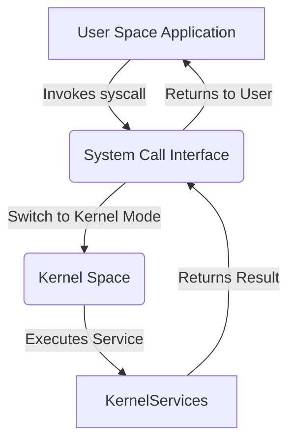

# **Understanding System Calls in Linux**

## **Table of Contents**

1. [Introduction to System Calls](#introduction-to-system-calls)
2. [Registers for Passing Arguments](#registers-for-passing-arguments)
   - [System Call Registers for Different Architectures](#system-call-registers-for-different-architectures)
   - [Argument Registers for Different Architectures](#argument-registers-for-different-architectures)
3. [Common Syscalls](#common-syscalls)
   - [read()](#read)
   - [write()](#write)
   - [open()](#open)
   - [close()](#close)
   - [Additional Common Syscalls](#additional-common-syscalls)
4. [Syscall Number Definitions](#syscall-number-definitions)
   - [Finding Syscall Numbers Programmatically](#finding-syscall-numbers-programmatically)
5. [Demo: Using Syscalls in C](#demo-using-syscalls-in-c)
   - [Advanced C Examples](#advanced-c-examples)
6. [Demo: Using Syscalls in Assembly](#demo-using-syscalls-in-assembly)
   - [Advanced Assembly Examples](#advanced-assembly-examples)
7. [Error Handling in Syscalls](#error-handling-in-syscalls)
8. [Tools for Inspecting Syscalls](#tools-for-inspecting-syscalls)
   - [1. strace](#1-strace)
   - [2. ltrace](#2-ltrace)
   - [3. gdb](#3-gdb)
   - [4. SystemTap](#4-systemtap)
   - [5. perf](#5-perf)
9. [Security Implications of Syscalls](#security-implications-of-syscalls)
10. [Summary](#summary)

---

## **1. Introduction to System Calls**

In Linux, **system calls** are the primary interface between user-space applications and the kernel. They allow programs to request services such as:

- **File Operations**: Reading from or writing to files.
- **Process Control**: Creating or terminating processes.
- **Memory Management**: Allocating or freeing memory.
- **Networking**: Sending or receiving data over networks.
- **Device Management**: Interacting with hardware devices.

When an application invokes a system call, it triggers a controlled transition from **user space** to **kernel space**, ensuring that operations are performed securely and efficiently.

### **System Call Numbering**

Each system call in Linux is assigned a unique number, known as the **syscall number**. When an application makes a system call, it provides this number along with any necessary arguments. The kernel uses the syscall number to identify and execute the appropriate function.

**Example**:

- `read` syscall number on x86_64: `0`
- `write` syscall number on x86_64: `1`
- `open` syscall number on x86_64: `2`

Syscall numbering varies across different architectures, which allows the same kernel source to support multiple hardware platforms.

**Diagram: System Call Flow**



_Figure: High-level flow of a system call from user space to kernel space and back._

---

## **2. Registers for Passing Arguments**

System calls use CPU **registers** to pass arguments from user space to the kernel. The exact registers and calling conventions depend on the underlying architecture.

### **System Call Registers for Different Architectures**

| **Arch/ABI** | **Instruction** | **System Call Number Register** | **Return Register** | **Return Value Register** | **Error Register** | **Notes** |
| ------------ | --------------- | ------------------------------- | ------------------- | ------------------------- | ------------------ | --------- |
| **i386**     | `int $0x80`     | `eax`                           | `eax`               | `edx`                     | -                  | -         |
| **x86_64**   | `syscall`       | `rax`                           | `rax`               | `rdx`                     | -                  | -         |
| **arm**      | `swi`           | `r7`                            | `r0`                | `r1`                      | -                  | -         |
| **mips**     | `syscall`       | `v0`                            | `v0`                | `v1`                      | `a3`               | 1,6       |
| **powerpc**  | `sc`            | `r0`                            | `r3`                | `r0`                      | 1                  | -         |
| **sparc**    | `t 0x10`        | `g1`                            | `o0`                | `o1`                      | -                  | -         |
| **arm64**    | `svc #0`        | `w8`                            | `x0`                | `x1`                      | -                  | -         |

**Key Points**:

- **System Call Number**: Placed in a designated register (e.g., `rax` for x86_64).
- **Return Value**: Typically returned in the same register used for the syscall number.
- **Error Handling**: Errors are often indicated by negative return values or specific error registers.

### **Argument Registers for Different Architectures**

| **Arch/ABI** | **arg1** | **arg2** | **arg3** | **arg4** | **arg5** | **arg6** | **arg7** | **Notes** |
| ------------ | -------- | -------- | -------- | -------- | -------- | -------- | -------- | --------- |
| **x86_64**   | `rdi`    | `rsi`    | `rdx`    | `r10`    | `r8`     | `r9`     | -        | -         |
| **i386**     | `ebx`    | `ecx`    | `edx`    | `esi`    | `edi`    | `ebp`    | -        | -         |
| **arm64**    | `x0`     | `x1`     | `x2`     | `x3`     | `x4`     | `x5`     | -        | -         |
| **mips**     | `a0`     | `a1`     | `a2`     | `a3`     | -        | -        | -        | -         |
| **sparc**    | `o0`     | `o1`     | `o2`     | `o3`     | `o4`     | `o5`     | -        | -         |

**Example**:

- **x86_64** `read` syscall (`sys_read`):
  - `rdi`: File descriptor (`fd`)
  - `rsi`: Buffer pointer (`buf`)
  - `rdx`: Number of bytes to read (`count`)

---

## **3. Common Syscalls**

Understanding common syscalls is fundamental for interacting with the Linux kernel. Below are detailed explanations and examples for several frequently used syscalls.

### **read()**

The `read` syscall reads data from a file descriptor into a buffer.

**Prototype**:

```c
ssize_t read(int fd, void *buf, size_t count);
```

- **Parameters**:
  - `fd`: The file descriptor to read from.
  - `buf`: Pointer to the buffer where data will be stored.
  - `count`: Maximum number of bytes to read.

**System Call Number**:

- **x86_64**: `SYS_read` = `0`

**Registers for `read()`**:

- `rdi`: `fd` (file descriptor)
- `rsi`: `buf` (buffer to store data)
- `rdx`: `count` (number of bytes to read)

**Example Usage in C**:

```c
#include <unistd.h>
#include <fcntl.h>
#include <stdio.h>

int main() {
    int fd = open("example.txt", O_RDONLY);
    if (fd == -1) {
        perror("open");
        return 1;
    }

    char buffer[100];
    ssize_t bytes_read = read(fd, buffer, sizeof(buffer)-1);
    if (bytes_read == -1) {
        perror("read");
        return 1;
    }

    buffer[bytes_read] = '\0'; // Null-terminate the buffer
    printf("Read %zd bytes: %s\n", bytes_read, buffer);

    close(fd);
    return 0;
}
```

**Advanced Example**: Reading from Standard Input Without Buffered I/O

```c
#include <unistd.h>
#include <stdio.h>

int main() {
    char buffer[128];
    ssize_t bytes;

    printf("Enter some text: ");
    bytes = read(STDIN_FILENO, buffer, sizeof(buffer)-1);
    if (bytes < 0) {
        perror("read");
        return 1;
    }

    buffer[bytes] = '\0';
    printf("You entered: %s\n", buffer);
    return 0;
}
```

### **write()**

The `write` syscall writes data from a buffer to a file descriptor.

**Prototype**:

```c
ssize_t write(int fd, const void *buf, size_t count);
```

- **Parameters**:
  - `fd`: The file descriptor to write to.
  - `buf`: Pointer to the buffer containing data to write.
  - `count`: Number of bytes to write.

**System Call Number**:

- **x86_64**: `SYS_write` = `1`

**Registers for `write()`**:

- `rdi`: `fd` (file descriptor)
- `rsi`: `buf` (buffer with data to write)
- `rdx`: `count` (number of bytes to write)

**Example Usage in C**:

```c
#include <unistd.h>
#include <fcntl.h>
#include <stdio.h>

int main() {
    int fd = open("output.txt", O_CREAT | O_WRONLY, 0644);
    if (fd == -1) {
        perror("open");
        return 1;
    }

    const char *text = "Hello, syscall!\n";
    ssize_t bytes_written = write(fd, text, 15);
    if (bytes_written == -1) {
        perror("write");
        return 1;
    }

    printf("Wrote %zd bytes to output.txt\n", bytes_written);
    close(fd);
    return 0;
}
```

**Advanced Example**: Writing to Multiple File Descriptors

```c
#include <unistd.h>
#include <fcntl.h>
#include <stdio.h>

int main() {
    int fd1 = open("file1.txt", O_CREAT | O_WRONLY, 0644);
    int fd2 = open("file2.txt", O_CREAT | O_WRONLY, 0644);

    if (fd1 == -1 || fd2 == -1) {
        perror("open");
        return 1;
    }

    const char *msg1 = "Data for file1\n";
    const char *msg2 = "Data for file2\n";

    write(fd1, msg1, 14);
    write(fd2, msg2, 14);

    close(fd1);
    close(fd2);
    return 0;
}
```

### **open()**

The `open` syscall opens a file and returns a file descriptor.

**Prototype**:

```c
int open(const char *pathname, int flags, mode_t mode);
```

- **Parameters**:
  - `pathname`: Path to the file to open.
  - `flags`: File access options (e.g., `O_RDONLY`, `O_WRONLY`, `O_CREAT`).
  - `mode`: Permissions to use if a new file is created (e.g., `0644`).

**System Call Number**:

- **x86_64**: `SYS_open` = `2`

**Registers for `open()`**:

- `rdi`: `pathname` (path to the file)
- `rsi`: `flags` (file access mode)
- `rdx`: `mode` (file permissions, if `O_CREAT` is specified)

**Example Usage in C**:

```c
#include <fcntl.h>
#include <unistd.h>
#include <stdio.h>

int main() {
    // Open a file for writing, create it if it doesn't exist
    int fd = open("newfile.txt", O_CREAT | O_WRONLY | O_TRUNC, 0644);
    if (fd == -1) {
        perror("open");
        return 1;
    }

    const char *msg = "Creating a new file using open syscall.\n";
    write(fd, msg, 39);
    close(fd);

    printf("File created and written successfully.\n");
    return 0;
}
```

**Advanced Example**: Opening a File with Read and Write Permissions

```c
#include <fcntl.h>
#include <unistd.h>
#include <stdio.h>

int main() {
    int fd = open("readwrite.txt", O_CREAT | O_RDWR, 0666);
    if (fd == -1) {
        perror("open");
        return 1;
    }

    const char *msg = "Read and write permissions enabled.\n";
    write(fd, msg, 34);

    // Move the file pointer to the beginning
    lseek(fd, 0, SEEK_SET);

    char buffer[50];
    read(fd, buffer, sizeof(buffer)-1);
    buffer[34] = '\0';
    printf("Read from file: %s\n", buffer);

    close(fd);
    return 0;
}
```

### **close()**

The `close` syscall closes an open file descriptor.

**Prototype**:

```c
int close(int fd);
```

- **Parameters**:
  - `fd`: The file descriptor to close.

**System Call Number**:

- **x86_64**: `SYS_close` = `3`

**Registers for `close()`**:

- `rdi`: `fd` (file descriptor)

**Example Usage in C**:

```c
#include <unistd.h>
#include <fcntl.h>
#include <stdio.h>

int main() {
    int fd = open("tempfile.txt", O_CREAT | O_WRONLY, 0644);
    if (fd == -1) {
        perror("open");
        return 1;
    }

    write(fd, "Temporary data\n", 15);

    if (close(fd) == -1) {
        perror("close");
        return 1;
    }

    printf("File closed successfully.\n");
    return 0;
}
```

**Advanced Example**: Closing Multiple File Descriptors

```c
#include <unistd.h>
#include <fcntl.h>
#include <stdio.h>

int main() {
    int fd1 = open("file1.txt", O_CREAT | O_WRONLY, 0644);
    int fd2 = open("file2.txt", O_CREAT | O_WRONLY, 0644);

    if (fd1 == -1 || fd2 == -1) {
        perror("open");
        return 1;
    }

    write(fd1, "Data for file1\n", 15);
    write(fd2, "Data for file2\n", 15);

    if (close(fd1) == -1 || close(fd2) == -1) {
        perror("close");
        return 1;
    }

    printf("Both files closed successfully.\n");
    return 0;
}
```

### **Additional Common Syscalls**

Beyond `read`, `write`, `open`, and `close`, several other syscalls are frequently used:

#### **lseek()**

Repositions the file offset of an open file descriptor.

**Prototype**:

```c
off_t lseek(int fd, off_t offset, int whence);
```

- **Parameters**:
  - `fd`: The file descriptor.
  - `offset`: The offset to set.
  - `whence`: Position from where to set the offset (`SEEK_SET`, `SEEK_CUR`, `SEEK_END`).

**System Call Number**:

- **x86_64**: `SYS_lseek` = `8`

**Registers for `lseek()`**:

- `rdi`: `fd`
- `rsi`: `offset`
- `rdx`: `whence`

**Example Usage in C**:

```c
#include <unistd.h>
#include <fcntl.h>
#include <stdio.h>

int main() {
    int fd = open("seekfile.txt", O_CREAT | O_WRONLY, 0644);
    if (fd == -1) {
        perror("open");
        return 1;
    }

    write(fd, "Hello, world!", 13);

    // Reposition to the beginning of the file
    if (lseek(fd, 0, SEEK_SET) == -1) {
        perror("lseek");
        return 1;
    }

    // Overwrite with "Hi"
    write(fd, "Hi", 2);

    close(fd);
    return 0;
}
```

#### **fork()**

Creates a new process by duplicating the calling process.

**Prototype**:

```c
pid_t fork(void);
```

- **Returns**:
  - `0` in the child process.
  - Child's PID in the parent process.
  - `-1` on failure.

**System Call Number**:

- **x86_64**: `SYS_fork` = `57`

**Registers for `fork()`**:

- No arguments are passed.

**Example Usage in C**:

```c
#include <unistd.h>
#include <stdio.h>

int main() {
    pid_t pid = fork();

    if (pid == -1) {
        perror("fork");
        return 1;
    } else if (pid == 0) {
        // Child process
        printf("Hello from Child!\n");
    } else {
        // Parent process
        printf("Hello from Parent! Child PID: %d\n", pid);
    }

    return 0;
}
```

#### **execve()**

Executes a program, replacing the current process image.

**Prototype**:

```c
int execve(const char *pathname, char *const argv[], char *const envp[]);
```

- **Parameters**:
  - `pathname`: Path to the executable.
  - `argv`: Argument vector.
  - `envp`: Environment variables.

**System Call Number**:

- **x86_64**: `SYS_execve` = `59`

**Registers for `execve()`**:

- `rdi`: `pathname`
- `rsi`: `argv`
- `rdx`: `envp`

**Example Usage in C**:

```c
#include <unistd.h>
#include <stdio.h>

int main() {
    char *args[] = {"/bin/ls", "-l", NULL};
    char *env[] = {NULL};

    if (execve("/bin/ls", args, env) == -1) {
        perror("execve");
        return 1;
    }

    // This line will not be executed if execve is successful
    printf("This won't be printed.\n");
    return 0;
}
```

#### **exit()**

Terminates the calling process.

**Prototype**:

```c
void exit(int status);
```

- **Parameters**:
  - `status`: Exit status code.

**System Call Number**:

- **x86_64**: `SYS_exit` = `60`

**Registers for `exit()`**:

- `rdi`: `status`

**Example Usage in C**:

```c
#include <unistd.h>

int main() {
    // Perform some operations

    // Exit with status code 0
    _exit(0);
}
```

**Note**: `_exit()` is used instead of `exit()` to perform a direct system call without invoking cleanup handlers.

---

## **4. Syscall Number Definitions**

Syscall numbers are defined in Linux kernel header files. These definitions are architecture-specific and can be found in different locations based on the system.

### **Locating Syscall Numbers**

- **Header Files**: Syscall numbers are defined in `unistd.h` or architecture-specific unistd files.
  - **x86_64**: `/usr/include/asm/unistd_64.h` or `/usr/include/x86_64-linux-gnu/asm/unistd_64.h`
  - **i386**: `/usr/include/asm/unistd.h` or `/usr/include/i386-linux-gnu/asm/unistd.h`

**Example**:

```c
// From unistd_64.h
#define __NR_read    0
#define __NR_write   1
#define __NR_open    2
#define __NR_close   3
#define __NR_fork    57
#define __NR_execve  59
#define __NR_exit    60
```

### **Finding Syscall Numbers Programmatically**

You can use the `syscall` utility or inspect the `unistd.h` headers to find syscall numbers.

**Using `syscall` Utility**:

```bash
# Install syscall utility if not already installed
sudo apt-get install syscall

# List syscall numbers for x86_64
syscall --arch=x86_64 --list
```

**Using `grep` to Find Syscall Numbers in Headers**:

```bash
grep __NR_ /usr/include/asm/unistd_64.h
```

**Example Output**:

```c
#define __NR_read    0
#define __NR_write   1
#define __NR_open    2
...
```

**Automated Script to List Syscalls**:

```bash
#!/bin/bash
# List all syscall numbers for x86_64 architecture

header="/usr/include/asm/unistd_64.h"

if [ ! -f "$header" ]; then
    echo "Header file not found: $header"
    exit 1
fi

grep '#define __NR_' "$header" | awk '{print $2, $3}'
```

**Sample Output**:

```
__NR_read 0
__NR_write 1
__NR_open 2
__NR_close 3
...
```

### **Understanding the Definitions**

Each syscall number corresponds to a unique operation in the kernel. These numbers are used by the system call interface to invoke the appropriate kernel function.

**Example**:

- `__NR_read`: System call number for the `read` syscall.
- `__NR_write`: System call number for the `write` syscall.

**C Code Example**:

```c
#include <sys/syscall.h>
#include <unistd.h>

int main() {
    // Directly using syscall numbers
    syscall(__NR_write, STDOUT_FILENO, "Hello via syscall!\n", 19);
    syscall(__NR_exit, 0);
}
```

---

## **5. Demo: Using Syscalls in C**

Directly invoking syscalls in C provides low-level control over system operations. This section includes basic and advanced examples demonstrating the use of syscalls.

### **Basic Example: Using `read`, `write`, and `open` Syscalls**

**Code Example**:

```c
#include <stdio.h>
#include <unistd.h>
#include <fcntl.h>
#include <sys/syscall.h>

#define SYS_READ 0
#define SYS_WRITE 1
#define SYS_OPEN 2

int main() {
    // Using open syscall to create and open a file
    int fd = syscall(SYS_OPEN, "test.txt", O_CREAT | O_WRONLY, 0644);
    if (fd == -1) {
        perror("open");
        return 1;
    }

    // Using write syscall to write data to the file
    const char *text = "Hello, syscall!";
    ssize_t bytes_written = syscall(SYS_WRITE, fd, text, 16);
    if (bytes_written == -1) {
        perror("write");
        return 1;
    }

    // Using read syscall to read data from the file
    char buffer[100];
    lseek(fd, 0, SEEK_SET);  // Rewind the file pointer
    ssize_t bytes_read = syscall(SYS_READ, fd, buffer, sizeof(buffer) - 1);
    if (bytes_read == -1) {
        perror("read");
        return 1;
    }

    buffer[bytes_read] = '\0';  // Null-terminate the buffer
    printf("Read from file: %s\n", buffer);

    // Close the file descriptor using close syscall
    syscall(SYS_close, fd);

    return 0;
}
```

**Compilation and Running**

1. **Compile** the program:

   ```bash
   gcc syscall_demo.c -o syscall_demo
   ```

2. **Run** the program:

   ```bash
   ./syscall_demo
   ```

**Expected Output**:

```
Read from file: Hello, syscall!
```

**Explanation**:

- The program uses the `syscall` function to invoke `open`, `write`, `read`, and `close` syscalls directly.
- It creates a file named `test.txt`, writes "Hello, syscall!" to it, reads the content back, and prints it to the standard output.

### **Advanced C Examples**

#### **Example 1: Using `fork` and `execve` Syscalls**

This example demonstrates creating a child process and executing a new program within it.

```c
#include <stdio.h>
#include <unistd.h>
#include <sys/syscall.h>
#include <sys/types.h>

#define SYS_fork 57
#define SYS_execve 59

int main() {
    pid_t pid = syscall(SYS_fork);
    if (pid == -1) {
        perror("fork");
        return 1;
    } else if (pid == 0) {
        // Child process: execute /bin/ls
        char *args[] = {"/bin/ls", "-l", NULL};
        char *env[] = {NULL};
        syscall(SYS_execve, "/bin/ls", args, env);
        // If execve fails
        perror("execve");
        syscall(SYS_exit, 1);
    } else {
        // Parent process: wait for child to finish
        int status;
        syscall(SYS_wait4, pid, &status, 0, NULL);
        printf("Child process completed.\n");
    }
    return 0;
}
```

**Explanation**:

- **`fork`**: Creates a new child process.
- **Child Process**: Uses `execve` to replace its image with `/bin/ls`.
- **Parent Process**: Waits for the child to complete using `wait4` syscall.

**Note**: The `wait4` syscall is not defined in the earlier syscall number definitions. Ensure to include its correct number or use a higher-level function.

#### **Example 2: Using `mmap` and `munmap` Syscalls**

This example demonstrates memory mapping using `mmap` and unmapping with `munmap`.

```c
#include <stdio.h>
#include <sys/mman.h>
#include <sys/syscall.h>
#include <unistd.h>

#define SYS_mmap 9
#define SYS_munmap 11

int main() {
    size_t length = 4096; // 4KB
    void *addr = syscall(SYS_mmap, NULL, length, PROT_READ | PROT_WRITE,
                        MAP_PRIVATE | MAP_ANONYMOUS, -1, 0);
    if (addr == (void *)-1) {
        perror("mmap");
        return 1;
    }

    // Write to the mapped memory
    sprintf((char *)addr, "Memory mapped via syscall!\n");
    printf("%s", (char *)addr);

    // Unmap the memory
    if (syscall(SYS_munmap, addr, length) == -1) {
        perror("munmap");
        return 1;
    }

    return 0;
}
```

**Explanation**:

- **`mmap`**: Maps a memory region that can be read and written.
- **Writing to Memory**: Writes a string to the mapped memory.
- **`munmap`**: Unmaps the previously mapped memory region.

#### **Example 3: Using `getpid` Syscall**

Retrieves the process ID of the calling process.

```c
#include <stdio.h>
#include <sys/syscall.h>
#include <unistd.h>

#define SYS_getpid 39

int main() {
    pid_t pid = syscall(SYS_getpid);
    printf("Current Process ID: %d\n", pid);
    return 0;
}
```

**Explanation**:

- The program uses the `getpid` syscall to retrieve and print the current process ID.

---

## **6. Demo: Using Syscalls in Assembly**

Making system calls directly in assembly language provides granular control over interactions with the kernel. This section includes basic and advanced assembly examples.

### **Basic Example: Writing to stdout and Exiting**

This example writes "Hello, syscall!" to the standard output and then exits the program.

**Assembly Code (x86_64 NASM Syntax)**:

```assembly
; syscall_demo.asm
section .data
    msg     db      "Hello, syscall!", 10  ; Message with newline
    len     equ     $ - msg                 ; Length of the message

section .text
    global _start

_start:
    ; write(int fd, const void *buf, size_t count)
    mov     rax, 1          ; syscall number for write (SYS_write)
    mov     rdi, 1          ; file descriptor (stdout)
    lea     rsi, [rel msg]  ; buffer to write
    mov     rdx, len        ; number of bytes
    syscall                 ; make the syscall

    ; exit(int status)
    mov     rax, 60         ; syscall number for exit (SYS_exit)
    xor     rdi, rdi        ; exit status 0
    syscall                 ; make the syscall
```

**Compilation and Running**

1. **Save** the assembly code to a file, e.g., `syscall_demo.asm`.

2. **Assemble and Link** the program using NASM and `ld`:

   ```bash
   nasm -f elf64 syscall_demo.asm -o syscall_demo.o
   ld syscall_demo.o -o syscall_demo
   ```

3. **Run** the program:

   ```bash
   ./syscall_demo
   ```

**Expected Output**:

```
Hello, syscall!
```

**Explanation**:

- **Data Section**:

  - `msg`: Contains the string "Hello, syscall!\n".
  - `len`: Calculates the length of `msg`.

- **Text Section**:
  - `_start`: Entry point of the program.
  - **Write Syscall**:
    - `rax = 1`: `SYS_write`
    - `rdi = 1`: File descriptor for stdout.
    - `rsi = msg`: Pointer to the message.
    - `rdx = len`: Length of the message.
    - `syscall`: Invokes the syscall.
  - **Exit Syscall**:
    - `rax = 60`: `SYS_exit`
    - `rdi = 0`: Exit status.
    - `syscall`: Invokes the syscall to terminate the program.

### **Advanced Assembly Examples**

#### **Example 1: Reading from stdin and Writing to stdout**

This assembly program reads input from the user and echoes it back to the standard output.

**Assembly Code (x86_64 NASM Syntax)**:

```assembly
; echo.asm
section .bss
    buffer resb 128      ; Reserve 128 bytes for input

section .data
    prompt db "Enter text: ", 0
    prompt_len equ $ - prompt

section .text
    global _start

_start:
    ; Write prompt to stdout
    mov     rax, 1          ; SYS_write
    mov     rdi, 1          ; stdout
    lea     rsi, [rel prompt]
    mov     rdx, prompt_len
    syscall

    ; Read input from stdin
    mov     rax, 0          ; SYS_read
    mov     rdi, 0          ; stdin
    lea     rsi, [rel buffer]
    mov     rdx, 128
    syscall
    mov     rbx, rax        ; Save number of bytes read

    ; Write the input back to stdout
    mov     rax, 1          ; SYS_write
    mov     rdi, 1          ; stdout
    lea     rsi, [rel buffer]
    mov     rdx, rbx        ; Number of bytes to write
    syscall

    ; Exit the program
    mov     rax, 60         ; SYS_exit
    xor     rdi, rdi        ; status 0
    syscall
```

**Compilation and Running**

1. **Assemble and Link**:

   ```bash
   nasm -f elf64 echo.asm -o echo.o
   ld echo.o -o echo
   ```

2. **Run** the program:

   ```bash
   ./echo
   ```

**Sample Interaction**:

```
Enter text: Hello from assembly!
Hello from assembly!
```

**Explanation**:

- **Prompt**: Writes "Enter text: " to stdout.
- **Read**: Reads up to 128 bytes from stdin into `buffer`.
- **Echo**: Writes the read bytes back to stdout.
- **Exit**: Terminates the program with status `0`.

#### **Example 2: Creating a New File and Writing Data**

This assembly program creates a new file named `assembly_output.txt` and writes "Data written via assembly." to it.

**Assembly Code (x86_64 NASM Syntax)**:

```assembly
; create_write.asm
section .data
    filename    db      "assembly_output.txt", 0
    msg         db      "Data written via assembly.", 10
    msg_len     equ     $ - msg

section .text
    global _start

_start:
    ; open syscall
    mov     rax, 2          ; SYS_open
    lea     rdi, [rel filename]
    mov     rsi, 577        ; O_CREAT | O_WRONLY | O_TRUNC (0644)
    mov     rdx, 0644
    syscall
    mov     rbx, rax        ; Save file descriptor

    ; write syscall
    mov     rax, 1          ; SYS_write
    mov     rdi, rbx        ; File descriptor
    lea     rsi, [rel msg]
    mov     rdx, msg_len
    syscall

    ; close syscall
    mov     rax, 3          ; SYS_close
    mov     rdi, rbx        ; File descriptor
    syscall

    ; exit syscall
    mov     rax, 60         ; SYS_exit
    xor     rdi, rdi        ; status 0
    syscall
```

**Compilation and Running**

1. **Assemble and Link**:

   ```bash
   nasm -f elf64 create_write.asm -o create_write.o
   ld create_write.o -o create_write
   ```

2. **Run** the program:

   ```bash
   ./create_write
   ```

3. **Verify** the File Content:

   ```bash
   cat assembly_output.txt
   ```

**Expected Output in `assembly_output.txt`**:

```
Data written via assembly.
```

**Explanation**:

- **Open**: Creates `assembly_output.txt` with write permissions.
- **Write**: Writes the message to the file.
- **Close**: Closes the file descriptor.
- **Exit**: Terminates the program.

---

## **7. Error Handling in Syscalls**

Proper error handling is crucial when working with syscalls to ensure robust and reliable applications. Syscalls typically return `-1` on error and set the `errno` variable to indicate the error type.

### **Understanding Return Values**

- **Success**: Returns a non-negative value.
  - For `read` and `write`: Number of bytes read or written.
  - For `open`: File descriptor.
- **Error**: Returns `-1` and sets `errno` to an error code.

### **Handling Errors in C**

**Example**: Enhanced `read` Syscall with Error Handling

```c
#include <stdio.h>
#include <unistd.h>
#include <fcntl.h>
#include <sys/syscall.h>
#include <errno.h>
#include <string.h>

#define SYS_READ 0
#define SYS_WRITE 1
#define SYS_OPEN 2
#define SYS_CLOSE 3

int main() {
    int fd = syscall(SYS_OPEN, "nonexistent.txt", O_RDONLY, 0);
    if (fd == -1) {
        fprintf(stderr, "Error opening file: %s\n", strerror(errno));
        return 1;
    }

    char buffer[100];
    ssize_t bytes_read = syscall(SYS_READ, fd, buffer, sizeof(buffer)-1);
    if (bytes_read == -1) {
        fprintf(stderr, "Error reading file: %s\n", strerror(errno));
        syscall(SYS_CLOSE, fd);
        return 1;
    }

    buffer[bytes_read] = '\0';
    printf("Read from file: %s\n", buffer);

    if (syscall(SYS_CLOSE, fd) == -1) {
        fprintf(stderr, "Error closing file: %s\n", strerror(errno));
        return 1;
    }

    return 0;
}
```

**Explanation**:

- Attempts to open a non-existent file, triggering an error.
- Uses `strerror(errno)` to print a human-readable error message.
- Ensures that resources are properly released even in error conditions.

### **Common `errno` Values**

| **Error Code** | **Symbolic Name**         | **Description**                    |
| -------------- | ------------------------- | ---------------------------------- |
| `EACCES`       | Permission denied         | Permission denied                  |
| `EBADF`        | Bad file descriptor       | Invalid file descriptor            |
| `EINVAL`       | Invalid argument          | Invalid argument passed to syscall |
| `ENOENT`       | No such file or directory | File or directory does not exist   |
| `ENOMEM`       | Out of memory             | Insufficient memory available      |
| `EEXIST`       | File exists               | File already exists                |

**Example**: Handling `ENOENT` Error

```c
#include <stdio.h>
#include <unistd.h>
#include <fcntl.h>
#include <sys/syscall.h>
#include <errno.h>
#include <string.h>

#define SYS_OPEN 2

int main() {
    int fd = syscall(SYS_OPEN, "missing.txt", O_RDONLY, 0);
    if (fd == -1) {
        if (errno == ENOENT) {
            fprintf(stderr, "File does not exist.\n");
        } else {
            fprintf(stderr, "Error opening file: %s\n", strerror(errno));
        }
        return 1;
    }

    // Proceed if file opens successfully
    syscall(SYS_CLOSE, fd);
    return 0;
}
```

**Explanation**:

- Specifically checks for `ENOENT` to provide a tailored error message.
- Provides better context to the user based on the error type.

### **Error Handling in Assembly**

Handling errors in assembly requires checking the return value and appropriately responding to errors.

**Example**: Assembly Program with Error Handling for `write` and `exit`

```assembly
; write_exit.asm
section .data
    msg     db      "Hello, syscall!", 10  ; Message with newline
    len     equ     $ - msg                 ; Length of the message

section .text
    global _start

_start:
    ; write(int fd, const void *buf, size_t count)
    mov     rax, 1          ; SYS_write
    mov     rdi, 1          ; stdout
    lea     rsi, [rel msg]  ; buffer
    mov     rdx, len        ; length
    syscall

    ; Check if write returned -1 (error)
    cmp     rax, -1
    jne     write_success

    ; Handle write error by exiting with status 1
    mov     rax, 60         ; SYS_exit
    mov     rdi, 1          ; exit status 1
    syscall

write_success:
    ; Exit with status 0
    mov     rax, 60         ; SYS_exit
    xor     rdi, rdi        ; exit status 0
    syscall
```

**Explanation**:

- Performs the `write` syscall.
- Compares the return value in `rax` to `-1` to detect errors.
- Exits with status `1` if an error occurs, otherwise exits with status `0`.

**Compilation and Running**

1. **Assemble and Link**:

   ```bash
   nasm -f elf64 write_exit.asm -o write_exit.o
   ld write_exit.o -o write_exit
   ```

2. **Run** the program:

   ```bash
   ./write_exit
   ```

**Behavior**:

- If `write` succeeds, the program exits with status `0`.
- If `write` fails, the program exits with status `1`.

---

## **8. Tools for Inspecting Syscalls**

Several tools are available to inspect, trace, and debug system calls made by programs. These tools are invaluable for developers and system administrators to understand program behavior, diagnose issues, and optimize performance.

### **1. strace**

`strace` is a diagnostic, debugging, and instructional userspace utility for monitoring the system calls used by a program.

**Basic Usage**:

```bash
strace ./your_program
```

**Example**:

```bash
strace ./syscall_demo
```

**Expected Output**:

```
open("test.txt", O_CREAT|O_WRONLY, 0644) = 3
write(3, "Hello, syscall!", 16) = 16
lseek(3, 0, SEEK_SET) = 0
read(3, "Hello, syscall!", 99) = 16
close(3) = 0
```

**Common Options**:

- `-e trace=<syscalls>`: Trace specific syscalls.
  - Example: `-e trace=read,write`
- `-o <file>`: Output trace to a file.
  - Example: `-o trace.log`
- `-c`: Count time, calls, and errors for each syscall.

**Example with Options**:

```bash
strace -e trace=open,read,write,close -o syscall_trace.log ./syscall_demo
```

### **2. ltrace**

`ltrace` traces library calls made by a program, providing insight into interactions with shared libraries.

**Basic Usage**:

```bash
ltrace ./your_program
```

**Example**:

```bash
ltrace ./syscall_demo
```

**Common Options**:

- `-e <library_functions>`: Trace specific library functions.
  - Example: `-e open,read,write,close`
- `-o <file>`: Output trace to a file.
  - Example: `-o library_trace.log`

**Comparison with strace**:

- `strace` focuses on system calls.
- `ltrace` focuses on library calls.
- Both can be used together for comprehensive tracing.

### **3. gdb**

`gdb` is the GNU Project Debugger, which allows you to see what is happening inside a program while it executes.

**Basic Usage**:

```bash
gdb ./your_program
```

**Example**:

```bash
gdb ./syscall_demo
```

**Common Commands**:

- `break <location>`: Set a breakpoint.
  - Example: `break main`
- `run`: Start the program.
- `step`: Step into functions.
- `next`: Step over functions.
- `continue`: Continue execution.
- `print <variable>`: Print the value of a variable.
- `info registers`: Display register values.

**Tracing Syscalls with gdb**:

1. **Set Breakpoints on Syscall Instructions**:

   - For `x86_64`, set a breakpoint on the `syscall` instruction.

   ```gdb
   (gdb) break syscall
   ```

2. **Run the Program**:

   ```gdb
   (gdb) run
   ```

3. **Inspect Registers**:

   - When a syscall is hit, inspect the registers to see syscall number and arguments.

   ```gdb
   (gdb) info registers
   ```

4. **Continue Execution**:

   ```gdb
   (gdb) continue
   ```

**Example Session**:

```
(gdb) break syscall
Breakpoint 1 at 0x400526: file syscall_demo.c, line 10.
(gdb) run
Starting program: ./syscall_demo

Breakpoint 1, syscall () at syscall_demo.c:10
10          bytes_written = syscall(SYS_WRITE, fd, text, 16);
(gdb) info registers
rax            0x1                 1
rdi            0x3                 3
rsi            0x400600            4194304
rdx            0x10                16
...
(gdb) continue
Continuing.
Read from file: Hello, syscall!
[Inferior 1 (process 12345) exited normally]
```

### **4. SystemTap**

`SystemTap` provides infrastructure to monitor and analyze the activities of the kernel and user-space programs.

**Basic Usage**:

```bash
sudo stap -e 'probe syscall.read { printf("read called with fd=%d\n", $fd) }' ./your_program
```

**Example**:

```bash
sudo stap -e 'probe syscall.write { printf("write called with fd=%d, count=%d\n", $fd, $count) }' ./syscall_demo
```

**Features**:

- **Probes**: Define points of interest (e.g., specific syscalls).
- **Scripts**: Write custom scripts to collect and display data.
- **Flexibility**: Can monitor a wide range of kernel and user-space activities.

**Advanced Example**: Monitoring All Syscalls and Logging Their Arguments

```bash
sudo stap -e '
probe syscall.* {
    printf("Syscall %s called with args: %s\n", probefunc(), argstr())
}
' ./your_program
```

**Explanation**:

- **`probe syscall.*`**: Attaches to all syscall probes.
- **`probefunc()`**: Retrieves the name of the current syscall.
- **`argstr()`**: Retrieves the arguments passed to the syscall.

### **5. perf**

`perf` is a powerful performance analyzing tool in Linux, capable of profiling applications and tracing syscalls.

**Basic Usage**:

```bash
perf trace ./your_program
```

**Example**:

```bash
perf trace ./syscall_demo
```

**Common Features**:

- **Profiling**: Measure CPU usage, cache misses, etc.
- **Tracing**: Trace syscalls and other kernel events.
- **Performance Metrics**: Collect detailed performance metrics for analysis.

**Advanced Usage**: Recording and Analyzing Syscalls

1. **Record Syscalls**:

   ```bash
   perf record -e syscalls:sys_enter_write -aR ./syscall_demo
   ```

2. **Analyze the Record**:

   ```bash
   perf report
   ```

**Explanation**:

- **`-e syscalls:sys_enter_write`**: Event to record when the `write` syscall is entered.
- **`-a`**: System-wide collection.
- **`-R`**: Raw sampling.

**Visualization**:

- `perf report` provides a graphical interface to analyze the recorded data.

---

## **9. Security Implications of Syscalls**

System calls are integral to the operation of user-space applications and the kernel. However, improper handling or exploitation of syscalls can lead to security vulnerabilities. Understanding these implications is crucial for developing secure software and maintaining system integrity.

### **Potential Security Risks**

1. **Privilege Escalation**:

   - Exploiting syscalls that require elevated privileges to perform unauthorized actions.
   - Example: Abusing `setuid` or `execve` to gain higher privileges.

2. **Denial of Service (DoS)**:

   - Using syscalls to exhaust system resources.
   - Example: Flooding the system with `fork` calls to create excessive processes.

3. **Buffer Overflows**:

   - Malicious inputs to syscalls like `read` or `write` can lead to buffer overflows if not properly handled.

4. **Race Conditions**:

   - Exploiting the timing of syscalls to manipulate system state.
   - Example: TOCTOU (Time of Check to Time of Use) vulnerabilities in file operations.

5. **Information Leakage**:
   - Accessing sensitive information via syscalls.
   - Example: Using `ptrace` to inspect another process's memory.

### **Mitigation Strategies**

1. **Least Privilege Principle**:

   - Run applications with the minimum necessary privileges to reduce the impact of potential exploits.

2. **Input Validation**:

   - Validate all inputs passed to syscalls to prevent buffer overflows and other injection attacks.

3. **Use of Safe APIs**:

   - Prefer higher-level, safer APIs over direct syscall invocations where possible, as they often include built-in safety checks.

4. **Monitoring and Auditing**:

   - Use tools like `strace`, `auditd`, and `SELinux` to monitor syscall usage and enforce security policies.

5. **Kernel Hardening**:

   - Apply kernel patches and use security modules (e.g., SELinux, AppArmor) to restrict syscall access.

6. **Avoid Unnecessary Syscalls**:
   - Reduce the attack surface by minimizing the number of syscalls an application makes, especially those that modify system state.

### **Example: Preventing Unauthorized File Access**

Consider a scenario where an application allows users to specify files to open. Without proper validation, users might access sensitive files.

**Vulnerable C Code**:

```c
#include <fcntl.h>
#include <unistd.h>
#include <sys/syscall.h>
#include <stdio.h>

#define SYS_open 2

int main(int argc, char *argv[]) {
    if (argc < 2) {
        printf("Usage: %s <filename>\n", argv[0]);
        return 1;
    }

    int fd = syscall(SYS_open, argv[1], O_RDONLY, 0);
    if (fd == -1) {
        perror("open");
        return 1;
    }

    // Proceed to read from the file
    syscall(SYS_close, fd);
    return 0;
}
```

**Potential Exploit**:

- An attacker can specify `/etc/passwd` or other sensitive files to read unauthorized data.

**Mitigation**:

- Implement input validation to restrict accessible files.

**Secure C Code Example**:

```c
#include <fcntl.h>
#include <unistd.h>
#include <sys/syscall.h>
#include <stdio.h>
#include <string.h>

#define SYS_open 2

int main(int argc, char *argv[]) {
    if (argc < 2) {
        printf("Usage: %s <filename>\n", argv[0]);
        return 1;
    }

    // Define a whitelist of allowed directories
    const char *allowed_dir = "/home/user/documents/";

    // Check if the filename starts with the allowed directory
    if (strncmp(argv[1], allowed_dir, strlen(allowed_dir)) != 0) {
        fprintf(stderr, "Access denied: Unauthorized directory.\n");
        return 1;
    }

    int fd = syscall(SYS_open, argv[1], O_RDONLY, 0);
    if (fd == -1) {
        perror("open");
        return 1;
    }

    // Proceed to read from the file
    syscall(SYS_close, fd);
    return 0;
}
```

**Explanation**:

- Restricts file access to a specific directory by validating the input path.
- Prevents access to sensitive system files outside the allowed directory.

### **Best Practices for Secure Syscall Usage**

1. **Minimize Privileged Operations**:

   - Limit the use of syscalls that require elevated privileges.
   - Drop privileges as soon as they are no longer needed.

2. **Use Secure Coding Standards**:

   - Follow secure coding guidelines to prevent common vulnerabilities.

3. **Regularly Update Software**:

   - Keep the kernel and system libraries updated to benefit from security patches.

4. **Employ Security Tools**:

   - Use static and dynamic analysis tools to detect potential vulnerabilities in code.

5. **Educate Developers**:
   - Train developers on secure programming practices and the implications of syscalls.

---

## **9. Summary**

This comprehensive guide explored the intricacies of system calls in Linux, delving into their mechanisms, usage, and implications. Here's a recap of the key points covered:

1. **System Calls**:

   - Fundamental interface between user-space applications and the kernel.
   - Enable operations like file management, process control, memory allocation, and more.

2. **Registers**:

   - Syscalls use specific CPU registers to pass arguments, varying across architectures.
   - Understanding register conventions is crucial for low-level programming.

3. **Common Syscalls**:

   - Detailed explanations and examples for essential syscalls: `read`, `write`, `open`, `close`.
   - Additional common syscalls like `lseek`, `fork`, `execve`, and `exit` were also covered.

4. **Syscall Number Definitions**:

   - Syscall numbers are architecture-specific and defined in kernel headers.
   - Methods to locate and utilize syscall numbers programmatically.

5. **Demos**:

   - **C Programming**: Directly invoking syscalls using the `syscall()` function with basic and advanced examples.
   - **Assembly Programming**: Crafting syscalls in x86_64 NASM syntax with examples for writing to stdout, reading input, and file operations.

6. **Error Handling**:

   - Importance of handling syscall errors to ensure application robustness.
   - Techniques for detecting and responding to errors in both C and assembly.

7. **Tools**:

   - Introduction to powerful tools like `strace`, `ltrace`, `gdb`, `SystemTap`, and `perf` for inspecting and debugging syscalls.
   - Practical examples demonstrating the usage of these tools.

8. **Security Implications**:
   - Exploration of potential security risks associated with syscalls.
   - Strategies and best practices to mitigate vulnerabilities and enhance system security.

**Final Thoughts**:

Understanding system calls is pivotal for developers aiming to perform low-level programming, optimize performance, or ensure the security of their applications. By mastering syscalls, one gains deeper insights into the Linux operating system's core functionalities and the intricate dance between user-space applications and kernel operations. Whether you're developing system utilities, debugging complex issues, or enhancing security measures, a solid grasp of syscalls is an invaluable asset in your programming toolkit.

---

# Additional Resources

To further enhance your understanding of system calls in Linux, consider exploring the following resources:

- **Books**:

  - _"Linux System Programming"_ by Robert Love
  - _"Understanding Linux Network Internals"_ by Christian Benvenuti

- **Online Documentation**:

  - [The Linux Programmer's Manual](https://man7.org/linux/man-pages/man2/syscall.2.html)
  - [Syscall Table](https://syscalls.kernelgrok.com/)

- **Tutorials and Articles**:

  - [Linux System Calls: An Introduction](https://www.geeksforgeeks.org/linux-system-calls/)
  - [Advanced Linux System Call Programming](https://www.ibm.com/docs/en/linux-on-systems?topic=system-calls)

- **Tools Documentation**:
  - [strace Documentation](https://strace.io/)
  - [gdb Documentation](https://www.gnu.org/software/gdb/documentation/)
