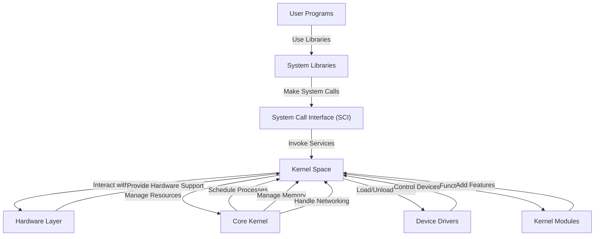

# **Linux Operating System Architecture: Layered Architecture Explained**

## **Table of Contents**

1. [Introduction](#introduction)
2. [Overview of Linux Architecture](#overview-of-linux-architecture)
3. [Layers of Linux Architecture](#layers-of-linux-architecture)
   - [User Space](#user-space)
     - [User Programs](#user-programs)
     - [Libraries](#libraries)
     - [Graphical User Interface (GUI)](#graphical-user-interface-gui)
   - [System Call Interface (SCI)](#system-call-interface-sci)
   - [Kernel Space](#kernel-space)
     - [Core Kernel](#core-kernel)
     - [Device Drivers](#device-drivers)
     - [Kernel Modules](#kernel-modules)
     - [System Libraries](#system-libraries)
   - [Hardware Layer](#hardware-layer)
4. [Interaction Between Layers](#interaction-between-layers)
5. [How Layers Work Together](#how-layers-work-together)
6. [Security Considerations](#security-considerations)
7. [Conclusion](#conclusion)
8. [Diagram of Layer Interaction](#diagram-of-layer-interaction)
9. [Additional Resources](#additional-resources)

---

## **1. Introduction**

Linux is a powerful, open-source, Unix-like operating system that powers everything from servers and desktops to embedded systems and mobile devices. Its design is based on a **layered architecture**, where each layer has specific responsibilities, promoting modularity, scalability, and maintainability. Understanding this architecture is fundamental for system programmers, developers, and IT professionals aiming to optimize, debug, or extend Linux-based systems.

This guide delves into the **layered architecture of Linux**, exploring each layer's components, their interactions, and the overall workflow that enables Linux to function efficiently and securely.

---

## **2. Overview of Linux Architecture**

The Linux operating system architecture is broadly divided into four primary layers:

1. **User Space**: The environment where user applications and processes run.
2. **System Call Interface (SCI)**: The gateway facilitating communication between user space and kernel space.
3. **Kernel Space**: The core of the operating system, managing system resources and hardware interactions.
4. **Hardware Layer**: The physical components of the computer system, including CPU, memory, and peripheral devices.

Each layer operates independently yet cohesively, ensuring that Linux remains flexible, efficient, and robust across diverse computing environments.

---

## **3. Layers of Linux Architecture**

### **User Space**

**User Space** is the realm where all user-level applications and processes execute. It operates independently of the kernel, providing a safe and isolated environment for running programs without direct access to hardware or critical system resources.

#### **User Programs**

User programs are the applications that users interact with directly. These include:

- **Shells**: Command-line interfaces like `bash`, `zsh`, and `fish`.
- **Text Editors**: Tools such as `vim`, `nano`, and `gedit`.
- **Web Browsers**: Applications like `Firefox`, `Chrome`, and `Chromium`.
- **Development Tools**: Compilers (`gcc`, `clang`), debuggers (`gdb`), and IDEs (`Visual Studio Code`, `Eclipse`).

These programs utilize system libraries to perform tasks and make system calls to request services from the kernel.

#### **Libraries**

Libraries are collections of precompiled functions and routines that user programs can leverage to perform common tasks without reinventing the wheel. Key libraries include:

- **GNU C Library (glibc)**: The standard C library providing fundamental functions like `printf`, `malloc`, and `memcpy`.
- **GTK and Qt**: Libraries for creating graphical user interfaces.
- **OpenSSL**: Provides cryptographic functions for secure communications.
- **libcurl**: Facilitates data transfer using various protocols.

Libraries enhance code reusability, reduce program size, and simplify development by abstracting complex functionalities.

#### **Graphical User Interface (GUI)**

The GUI layer offers a visual interface for interacting with the system, comprising:

- **Window Managers**: Control the placement and appearance of windows (`Metacity`, `Mutter`, `Openbox`).
- **Desktop Environments**: Provide a complete graphical interface (`GNOME`, `KDE Plasma`, `XFCE`).
- **Display Servers**: Manage the display hardware and render graphical elements (`X.Org Server`, `Wayland`).

The GUI layer interacts with user programs and system libraries to present information and accept user input.

### **System Call Interface (SCI)**

The **System Call Interface** is a crucial bridge between user space and kernel space. It allows user programs to request services from the kernel, such as:

- **File Operations**: `open()`, `read()`, `write()`, `close()`.
- **Process Control**: `fork()`, `exec()`, `exit()`.
- **Memory Management**: `mmap()`, `munmap()`.
- **Networking**: `socket()`, `connect()`, `send()`, `recv()`.

The SCI ensures that user programs can perform necessary operations while maintaining system stability and security by enforcing access controls and isolating processes.

### **Kernel Space**

**Kernel Space** houses the core components of the Linux operating system. It operates in a privileged mode, granting it unrestricted access to hardware and system resources. The kernel manages critical tasks, ensuring efficient and secure system operations.

#### **Core Kernel**

The **Core Kernel** is responsible for fundamental system management, including:

- **Process Scheduling**: Determines the order and duration of process execution on the CPU.
- **Memory Management**: Allocates and deallocates memory resources, manages virtual memory, and handles paging.
- **File Systems**: Manages file operations, supporting various file system types (`ext4`, `btrfs`, `xfs`).
- **Networking Stack**: Handles network protocols, data transmission, and reception.
- **Inter-Process Communication (IPC)**: Facilitates communication between processes through mechanisms like pipes, message queues, and shared memory.

The core kernel ensures that system resources are utilized efficiently and that processes operate without interfering with one another.

#### **Device Drivers**

**Device Drivers** are specialized kernel modules that manage interactions with hardware devices. They abstract the complexities of hardware communication, providing standardized interfaces for the kernel and user programs. Examples include:

- **Block Device Drivers**: Manage storage devices like hard drives and SSDs.
- **Character Device Drivers**: Handle devices like keyboards, mice, and serial ports.
- **Network Device Drivers**: Manage network interface cards (NICs) and wireless adapters.
- **Graphics Drivers**: Control GPUs and display hardware.

Device drivers are essential for the kernel to communicate effectively with diverse hardware components, ensuring compatibility and performance.

#### **Kernel Modules**

**Kernel Modules** extend the functionality of the core kernel without requiring a system reboot. They can be loaded and unloaded dynamically, allowing for modular system customization. Examples include:

- **Filesystem Modules**: Add support for new file systems (`ntfs`, `exfat`).
- **Network Protocol Modules**: Introduce new networking protocols or enhancements.
- **Hardware Support Modules**: Enable support for additional hardware devices.

Kernel modules enhance system flexibility, allowing administrators to tailor the kernel to specific needs and hardware configurations.

#### **System Libraries**

Within **Kernel Space**, system libraries provide essential services and abstractions for kernel operations. These libraries include:

- **libkmod**: Manages kernel modules, handling loading and unloading.
- **libelf**: Facilitates reading and writing ELF (Executable and Linkable Format) files, essential for module management.
- **libc (Kernel Version)**: Provides low-level functions for kernel programming.

These libraries streamline kernel development, offering standardized interfaces and reducing code redundancy.

### **Hardware Layer**

The **Hardware Layer** encompasses all physical components of the computer system, including:

- **Central Processing Unit (CPU)**: Executes instructions and manages system operations.
- **Memory (RAM)**: Stores data and instructions for active processes.
- **Storage Devices**: Includes hard drives, SSDs, and optical drives for persistent data storage.
- **Input/Output (I/O) Devices**: Comprises keyboards, mice, monitors, printers, and network adapters.
- **Peripheral Devices**: Encompasses external devices like USB drives, webcams, and Bluetooth devices.

The kernel interacts directly with the hardware through device drivers, managing resources and ensuring seamless operation of all physical components.

---

## **4. Interaction Between Layers**

The layers of Linux architecture interact through well-defined interfaces and protocols, ensuring smooth communication and operation. Here's how these interactions occur:

1. **User Programs ↔ Libraries**:

   - User applications call functions provided by system libraries (e.g., `printf()` from `glibc`).
   - Libraries abstract complex operations, offering simple APIs for user programs.

2. **Libraries ↔ System Call Interface (SCI)**:

   - System libraries internally make system calls to request services from the kernel.
   - This abstraction allows user programs to perform operations like file I/O without directly interacting with the kernel.

3. **System Call Interface (SCI) ↔ Kernel Space**:

   - SCI acts as a bridge, translating system calls into actions performed by the kernel.
   - Ensures that user programs cannot perform unauthorized operations, maintaining system security and stability.

4. **Kernel Space ↔ Hardware Layer**:

   - The kernel communicates with hardware devices via device drivers.
   - Manages resource allocation, data transmission, and hardware control.

5. **Kernel Space ↔ Kernel Modules**:

   - Kernel modules can be loaded or unloaded to extend kernel functionality.
   - Modules interact with the core kernel to provide support for new hardware, filesystems, or protocols.

6. **User Space ↔ Kernel Space**:
   - Through system calls, user space interacts with kernel space to perform essential operations.
   - This separation maintains system integrity, preventing user programs from compromising critical system components.

---

## **5. How Layers Work Together**

The collaborative operation of all layers ensures that Linux functions efficiently and securely. Here's a typical workflow illustrating their interplay:

1. **Launching an Application**:

   - A user initiates an application (e.g., launching `firefox`).
   - The shell (a user program) invokes the application by calling `exec()` via system libraries.

2. **System Call Execution**:

   - The system library translates the high-level `exec()` call into a system call through the SCI.
   - The kernel receives the system call, performing necessary checks and operations to execute the application.

3. **Process Scheduling and Memory Management**:

   - The kernel schedules the application's process, allocating CPU time.
   - Memory management assigns necessary memory resources, handling virtual memory and paging as required.

4. **Interacting with Hardware**:

   - If the application requires network access, the kernel interacts with the network device driver to send or receive data.
   - For graphical output, the kernel communicates with the graphics driver to render the application's interface on the monitor.

5. **Handling I/O Operations**:

   - When the application performs file I/O (e.g., reading a file), it makes system calls like `read()` or `write()`.
   - The kernel processes these calls, interacting with the filesystem and storage devices to fulfill the requests.

6. **Termination of the Application**:
   - Upon completion, the application exits, and the kernel deallocates the resources used by the process.
   - System libraries handle any cleanup operations, ensuring the system remains stable.

This seamless interaction allows users to execute complex applications without needing to manage low-level system details.

---

## **6. Security Considerations**

Security is paramount in the Linux architecture, ensuring that user programs cannot compromise system integrity. Key security mechanisms include:

1. **User and Kernel Space Separation**:

   - Isolates critical system components in kernel space, preventing user programs from directly accessing hardware or sensitive data.

2. **Access Control**:

   - Enforces permissions and ownership for files, processes, and resources, restricting unauthorized access.

3. **System Call Filtering**:

   - Limits the set of system calls available to user programs, reducing the attack surface.

4. **SELinux/AppArmor**:

   - Mandatory Access Control (MAC) systems that define security policies, restricting program capabilities beyond traditional user permissions.

5. **Address Space Layout Randomization (ASLR)**:

   - Randomizes memory addresses used by processes, making it harder for attackers to predict targets for exploits.

6. **No eXecute (NX) Bit**:

   - Marks certain memory regions as non-executable, preventing execution of malicious code injected into data sections.

7. **Stack Canaries**:

   - Inserts special values in the stack to detect and prevent buffer overflow attacks.

8. **Secure Boot and Code Signing**:
   - Ensures that only trusted kernel modules and binaries are loaded, preventing unauthorized code execution.

These security measures work collectively to safeguard the system against a wide range of threats, maintaining stability and trustworthiness.

---

## **7. Security Considerations**

Security is integral to the Linux architecture, ensuring that user programs cannot compromise system integrity. Key security mechanisms include:

1. **User and Kernel Space Separation**:

   - Isolates critical system components in kernel space, preventing user programs from directly accessing hardware or sensitive data.

2. **Access Control**:

   - Enforces permissions and ownership for files, processes, and resources, restricting unauthorized access.

3. **System Call Filtering**:

   - Limits the set of system calls available to user programs, reducing the attack surface.

4. **SELinux/AppArmor**:

   - Mandatory Access Control (MAC) systems that define security policies, restricting program capabilities beyond traditional user permissions.

5. **Address Space Layout Randomization (ASLR)**:

   - Randomizes memory addresses used by processes, making it harder for attackers to predict targets for exploits.

6. **No eXecute (NX) Bit**:

   - Marks certain memory regions as non-executable, preventing execution of malicious code injected into data sections.

7. **Stack Canaries**:

   - Inserts special values in the stack to detect and prevent buffer overflow attacks.

8. **Secure Boot and Code Signing**:

   - Ensures that only trusted kernel modules and binaries are loaded, preventing unauthorized code execution.

9. **Namespaces and Cgroups**:

   - Isolate processes and manage resource allocation, enhancing containerization and virtualization security.

10. **Kernel Integrity Checks**:
    - Verifies the integrity of the kernel and modules, preventing tampering and unauthorized modifications.

These security features collectively reinforce the Linux operating system's resilience against various threats, ensuring a secure and stable computing environment.

---

## **8. Diagram of Layer Interaction**

Visual representations can greatly enhance the understanding of complex architectures. Below is a **Mermaid** diagram illustrating the interaction between the different layers of Linux architecture:



_Figure: Interaction between Linux architecture layers, demonstrating the flow from user programs to hardware._

### **Explanation**

- **User Programs**: Applications and processes initiated by the user.
- **System Libraries**: Provide reusable functions and abstractions for user programs.
- **System Call Interface (SCI)**: Facilitates communication between user space and kernel space.
- **Kernel Space**: Manages system resources, processes, memory, and hardware interactions.
- **Hardware Layer**: The physical components of the computer system.

This diagram showcases the flow of operations from user applications through libraries and system calls into the kernel, which then interacts with the underlying hardware.

---

## **9. Summary**

The **Linux Operating System Architecture** is a meticulously designed, layered structure that ensures efficient, secure, and scalable system operations. Here's a recap of the key points covered:

1. **Introduction**:

   - Emphasized the importance of understanding Linux's layered architecture for effective system management and development.

2. **Overview of Linux Architecture**:

   - Highlighted the four primary layers: User Space, System Call Interface, Kernel Space, and Hardware Layer.

3. **Layers of Linux Architecture**:

   - **User Space**: Hosts user programs, libraries, and GUI components.
   - **System Call Interface (SCI)**: Bridges user space and kernel space, handling system calls.
   - **Kernel Space**: Contains the core kernel, device drivers, kernel modules, and system libraries, managing system resources and hardware interactions.
   - **Hardware Layer**: Comprises all physical hardware components managed by the kernel.

4. **Interaction Between Layers**:

   - Detailed how user programs interact with libraries and the SCI, which in turn communicates with the kernel to perform operations, all while managing hardware interactions.

5. **How Layers Work Together**:

   - Provided a workflow example illustrating the launch, execution, and termination of an application, showcasing inter-layer cooperation.

6. **Security Considerations**:

   - Discussed various security mechanisms that protect the system from unauthorized access and potential vulnerabilities, ensuring system integrity and reliability.

7. **Diagram of Layer Interaction**:
   - Presented a **Mermaid** diagram visualizing the interactions between different architectural layers, enhancing conceptual understanding.

**Final Thoughts**:

Understanding the layered architecture of Linux equips developers, system administrators, and IT professionals with the knowledge to optimize system performance, troubleshoot issues, and develop robust applications. The modular design promotes flexibility, allowing Linux to adapt to a wide range of hardware and use cases, from embedded systems to supercomputers.

---

## **10. Additional Resources**

To further enhance your understanding of Linux architecture and related topics, explore the following resources:

### **Books**

- **"Linux Kernel Development" by Robert Love**

  - Offers an in-depth look into the design and implementation of the Linux kernel, covering topics like process management, memory management, and device drivers.

- **"Understanding Linux Network Internals" by Christian Benvenuti**

  - Focuses on the networking components of the Linux kernel, providing insights into protocol implementation and network stack operations.

- **"The Linux Programming Interface" by Michael Kerrisk**
  - Comprehensive guide to system programming on Linux, covering system calls, IPC, file systems, and more.

### **Online Documentation**

- **Linux Kernel Documentation**

  - [Kernel.org Documentation](https://www.kernel.org/doc/html/latest/)
  - Official documentation for the Linux kernel, covering development guidelines, subsystem documentation, and more.

- **GNU C Library Documentation**

  - [glibc Documentation](https://www.gnu.org/software/libc/manual/)
  - Detailed reference for the GNU C Library, essential for understanding system libraries.

- **Man Pages**
  - Use the `man` command to access manual pages for commands and system calls.
    ```bash
    man 2 syscall_name
    ```
    - Example:
      ```bash
      man 2 read
      ```

### **Tutorials and Articles**

- **"Linux From Scratch"**

  - [Linux From Scratch](http://www.linuxfromscratch.org/)
  - A project that provides step-by-step instructions to build your own custom Linux system from source code.

- **"An Introduction to the Linux Kernel" by Daniel P. Bovet and Marco Cesati**

  - Offers foundational knowledge on kernel architecture and subsystem interactions.

- **"Understanding Linux: The Basics of Linux Operating System Architecture" by TekAdmin**
  - [TekAdmin Article](https://www.tektutorialshub.com/linux/linux-operating-system-architecture/)
  - A beginner-friendly overview of Linux architecture, suitable for those new to system administration.

### **Video Tutorials**

- **"Linux Kernel Internals" by The Linux Foundation**

  - [Linux Foundation YouTube Channel](https://www.youtube.com/user/TheLinuxFoundation)
  - Educational videos covering various aspects of the Linux kernel and system architecture.

- **"Understanding Linux OS Architecture" by freeCodeCamp.org**
  - [freeCodeCamp Video](https://www.youtube.com/watch?v=kjVd1l9G9V0)
  - A comprehensive video explaining the different layers and components of Linux architecture.

### **Community and Forums**

- **Stack Overflow**

  - [Linux Kernel Questions](https://stackoverflow.com/questions/tagged/linux-kernel)
  - Community-driven Q&A for specific Linux kernel and architecture-related inquiries.

- **Reddit - r/linux and r/kernel**

  - [r/linux](https://www.reddit.com/r/linux/)
  - [r/kernel](https://www.reddit.com/r/kernel/)
  - Subreddits dedicated to discussions, news, and questions about Linux and the Linux kernel.

- **Linux Kernel Mailing Lists**
  - [LKML (Linux Kernel Mailing List)](https://lkml.org/)
  - Engage with kernel developers and contributors for advanced topics and development discussions.

### **Tools Documentation**

- **GDB (GNU Debugger)**

  - [GDB Documentation](https://www.gnu.org/software/gdb/documentation/)
  - Comprehensive guide to using GDB for debugging applications and kernel modules.

- **Valgrind**

  - [Valgrind Documentation](http://valgrind.org/docs/manual/manual.html)
  - Detailed instructions on using Valgrind for memory debugging and profiling.

- **SystemTap**
  - [SystemTap Official Site](https://sourceware.org/systemtap/)
  - Documentation and tutorials for using SystemTap to monitor and analyze kernel activities.

### **Practical Exercises**

1. **Build and Analyze a Custom Kernel Module**:

   - Create a simple kernel module, compile it, and load it into the kernel.
   - Use tools like `lsmod`, `modinfo`, and `dmesg` to inspect and manage the module.

2. **Explore Process Management**:

   - Use commands like `ps`, `top`, `htop`, and `pstree` to monitor and manage processes.
   - Understand how the kernel schedules and prioritizes processes.

3. **Network Configuration and Analysis**:

   - Configure network interfaces using `ifconfig` or `ip`.
   - Use `tcpdump` or `wireshark` to capture and analyze network traffic.

4. **Memory Management Investigation**:

   - Monitor memory usage with `free`, `vmstat`, and `top`.
   - Explore virtual memory concepts using `/proc/meminfo` and `/proc/[pid]/maps`.

5. **Implement Security Policies**:
   - Set up and configure SELinux or AppArmor.
   - Define and test security policies to control application behaviors.
