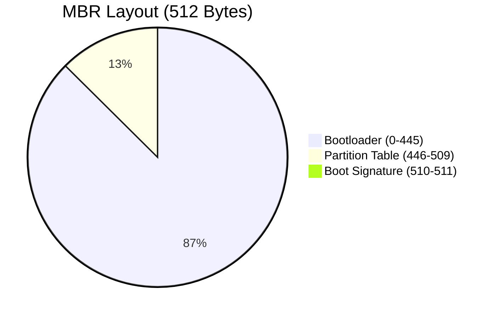
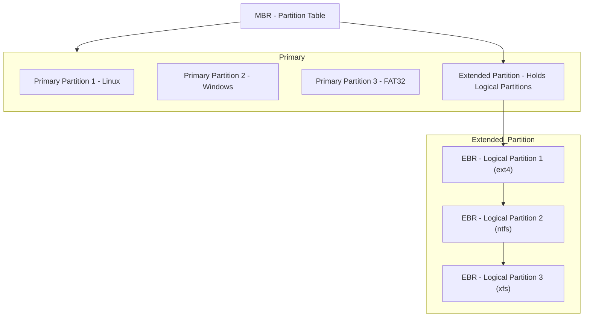

# MBR, Extended Partitions, and EBR (Extended Boot Record) Explained with Diagrams

This guide explains the **Master Boot Record (MBR)**, its limitations, and the role of **Extended Boot Records (EBR)** in creating logical partitions. Through detailed examples, diagrams, and step-by-step commands, you will learn how to inspect and manage partitions in Linux.

---

## Table of Contents

1. [Introduction to MBR](#introduction-to-mbr)
2. [Detailed Structure of the MBR (Byte-Level Breakdown)](#detailed-structure-of-the-mbr-byte-level-breakdown)
3. [Understanding Primary, Extended, and Logical Partitions](#understanding-primary-extended-and-logical-partitions)
4. [How EBR Works (With Diagram)](#how-ebr-works-with-diagram)
5. [Inspecting MBR and EBR Using Linux Commands](#inspecting-mbr-and-ebr-using-linux-commands)
6. [Creating Partitions (Primary, Extended, and Logical)](#creating-partitions-primary-extended-and-logical)
7. [Creating Multiple Partitions with Different File Systems (Including FAT32)](#creating-multiple-partitions-with-different-file-systems-including-fat32)
8. [Mermaid Diagram: Partition Table Layout](#mermaid-diagram-partition-table-layout)
9. [Limitations of MBR](#limitations-of-mbr)
10. [Conclusion](#conclusion)
11. [Additional Resources](#additional-resources)

---

## Introduction to MBR

The **Master Boot Record (MBR)** is a special 512-byte sector at the start of a disk (`/dev/sda`).  
It plays a critical role in booting and partitioning:

- **Bootloader (first 446 bytes)** – Contains code to load the operating system.
- **Partition Table (64 bytes)** – Describes up to **4 primary partitions**.
- **Boot Signature (last 2 bytes)** – The value `55 AA` indicates a bootable disk.

### Why MBR Matters

- MBR is the traditional partitioning scheme used on BIOS-based systems.
- It supports disks up to **2 TB** in size.
- For larger disks or more partitions, **GPT (GUID Partition Table)** is recommended.

---

## Detailed Structure of the MBR (Byte-Level Breakdown)

Below is a breakdown of the MBR sector by byte offsets:



### Byte-Level Diagram of MBR:

| Offset | Size (bytes) | Description              |
| ------ | ------------ | ------------------------ |
| 0x0000 | 446          | Bootloader Code          |
| 0x01BE | 16           | Partition 1 Entry        |
| 0x01CE | 16           | Partition 2 Entry        |
| 0x01DE | 16           | Partition 3 Entry        |
| 0x01EE | 16           | Partition 4 Entry        |
| 0x01FE | 2            | Boot Signature (`55 AA`) |

---

## Understanding Primary, Extended, and Logical Partitions

- **Primary Partitions**:

  - MBR can hold up to **4 primary partitions**.
  - These are described directly in the partition table.

- **Extended Partition**:

  - Used when more than 4 partitions are required.
  - One primary slot is allocated to an **extended partition**, which can hold multiple **logical partitions**.

- **Logical Partitions**:
  - Logical partitions exist inside the extended partition.
  - Each logical partition is managed by an **Extended Boot Record (EBR)**.
  - EBRs form a chain, allowing multiple logical partitions.

---

## How EBR Works (With Diagram)

When you exceed the 4-partition limit, **Extended Boot Records (EBR)** manage logical partitions within the extended partition.

- The MBR points to the **extended partition**.
- Each logical partition has its own EBR.
- EBRs reference the next logical partition, forming a **linked list**.

---

### Diagram: MBR, Extended, and Logical Partitions (Merged Layout)



---

## Creating Multiple Partitions with Different File Systems (Including FAT32)

To create multiple partitions with different file systems, follow these steps:

1. **Create the First Partition (FAT32 - 6GB):**

   ```bash
   sudo fdisk /dev/sdb
   ```

   - `n` – Create a new partition.
   - `p` – Select primary partition.
   - Choose the partition number (e.g., 1).
   - Enter `+6G` to allocate 6GB.
   - Write the changes by typing `w`.

   Format the partition to FAT32:

   ```bash
   sudo mkfs.vfat /dev/sdb1
   ```

2. **Create Additional Partitions:**
   For each additional partition, follow these steps to create and format partitions with different file systems:

- **Create an ext4 Partition (8GB):**

  ```bash
  sudo fdisk /dev/sdb
  ```

  - `n` – Create a new partition.
  - `p` – Select primary partition.
  - Choose the next available number (e.g., 2).
  - Enter `+8G` to allocate 8GB.
  - Write the changes by typing `w`.

  Format to ext4:

  ```bash
  sudo mkfs.ext4 /dev/sdb2
  ```

- **Create an NTFS Partition (10GB):**

  ```bash
  sudo fdisk /dev/sdb
  ```

  - `n` – Create a new partition.
  - `p` – Select primary partition.
  - Choose the next available number (e.g., 3).
  - Enter `+10G` to allocate 10GB.
  - Write the changes by typing `w`.

  Format to NTFS:

  ```bash
  sudo mkfs.ntfs /dev/sdb3
  ```

- **Create an xfs Partition (12GB):**

  ```bash
  sudo fdisk /dev/sdb
  ```

  - `n` – Create a new partition.
  - `p` – Select primary partition.
  - Choose the next available number (e.g., 4).
  - Enter `+12G` to allocate 12GB.
  - Write the changes by typing `w`.

  Format to xfs:

  ```bash
  sudo mkfs.xfs /dev/sdb4
  ```
