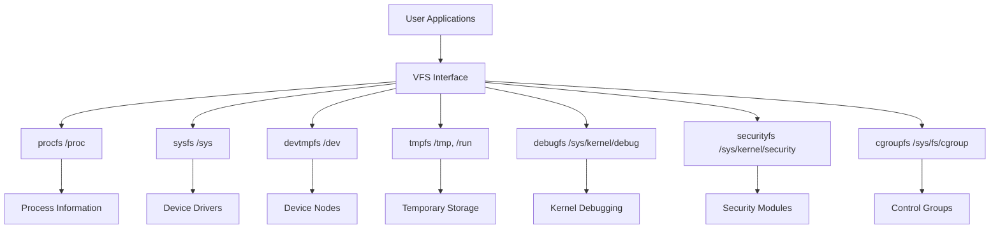
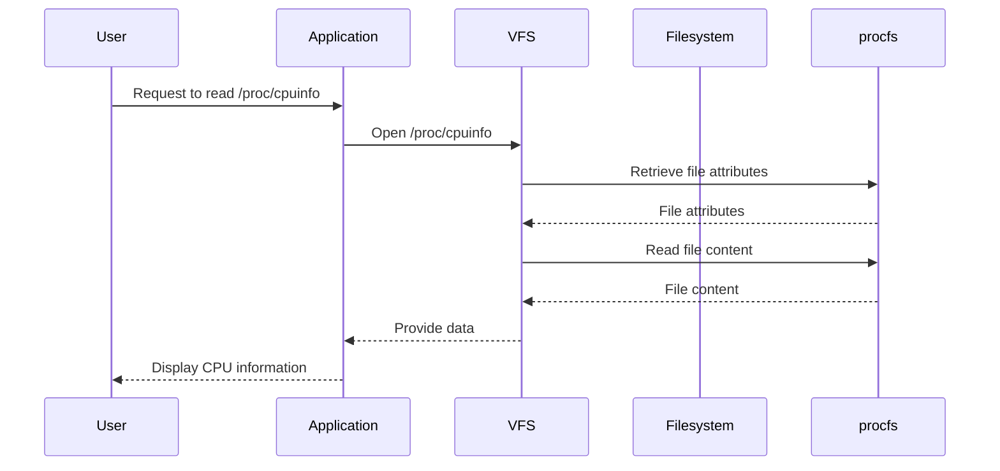

# Comprehensive Guide to Virtual Filesystems in Linux


## Table of Contents

- [Introduction](#introduction)
- [What is a Virtual Filesystem?](#what-is-a-virtual-filesystem)
- [Common Virtual Filesystems in Linux](#common-virtual-filesystems-in-linux)
  - [procfs (`/proc`)](#procfs-proc)
  - [sysfs (`/sys`)](#sysfs-sys)
  - [devtmpfs (`/dev`)](#devtmpfs-dev)
  - [tmpfs (`/tmp`, `/run`)](#tmpfs-tmp-run)
  - [debugfs (`/sys/kernel/debug`)](#debugfs-syskerneldebug)
  - [securityfs (`/sys/kernel/security`)](#securityfs-syskernelsecurity)
  - [cgroupfs (`/sys/fs/cgroup`)](#cgroupfs-sysfscgroup)
- [Understanding the Virtual Filesystem Interface (VFS)](#understanding-the-virtual-filesystem-interface-vfs)
- [Interacting with Virtual Filesystems](#interacting-with-virtual-filesystems)
  - [Browsing `/proc`](#browsing-proc)
  - [Exploring `/sys`](#exploring-sys)
  - [Managing Devices in `/dev`](#managing-devices-in-dev)
  - [Using `tmpfs`](#using-tmpfs)
- [Creating Custom Virtual Filesystems](#creating-custom-virtual-filesystems)
  - [Using FUSE (Filesystem in Userspace)](#using-fuse-filesystem-in-userspace)
  - [Developing Kernel Modules](#developing-kernel-modules)
- [Mermaid Diagrams](#mermaid-diagrams)
  - [Virtual Filesystem Architecture](#virtual-filesystem-architecture)
  - [Interaction Flow with VFS](#interaction-flow-with-vfs)
- [Practical Examples and Demos](#practical-examples-and-demos)
  - [Demo 1: Exploring `/proc`](#demo-1-exploring-proc)
  - [Demo 2: Monitoring System Resources via `/sys`](#demo-2-monitoring-system-resources-via-sys)
  - [Demo 3: Creating and Using a Symbolic Link in `/dev`](#demo-3-creating-and-using-a-symbolic-link-in-dev)
  - [Demo 4: Mounting a `tmpfs` Filesystem](#demo-4-mounting-a-tmpfs-filesystem)
  - [Demo 5: Creating a Simple FUSE Filesystem](#demo-5-creating-a-simple-fuse-filesystem)
- [Conclusion](#conclusion)
- [References](#references)

## Introduction

In Linux, the filesystem plays a pivotal role in organizing and managing data. Beyond the traditional disk-based filesystems like `ext4` or `xfs`, Linux employs **virtual filesystems**—special in-memory filesystems that provide interfaces to kernel data structures and system information. These virtual filesystems are integral to the operation and management of the system, enabling seamless interaction between user-space applications and kernel-space data.

This guide delves into the world of Linux virtual filesystems, exploring their types, purposes, interactions, and practical demonstrations to equip you with a comprehensive understanding of how they function and how to leverage them effectively.

## What is a Virtual Filesystem?

A **virtual filesystem (VFS)** is an abstraction layer within the Linux kernel that provides a uniform interface for different filesystem implementations. It allows the kernel and user-space applications to interact with various filesystems in a consistent manner, irrespective of their underlying structures or storage mediums.

**Key Characteristics:**

- **In-Memory:** Unlike traditional filesystems stored on disk, virtual filesystems reside in memory.
- **Dynamic:** They dynamically represent kernel data structures and system information.
- **Interface:** Serve as interfaces for communication between user-space applications and kernel-space data.

## Common Virtual Filesystems in Linux

Linux utilizes several virtual filesystems, each serving distinct purposes. Below are the most prevalent ones:

### procfs (`/proc`)

- **Purpose:** Provides a mechanism to access kernel data structures.
- **Usage:** Represents process and system information in a hierarchical file-like structure.
- **Key Features:**
  - Access to process-specific information (e.g., `/proc/[pid]/`).
  - System-wide information (e.g., `/proc/cpuinfo`, `/proc/meminfo`).

### sysfs (`/sys`)

- **Purpose:** Exposes kernel objects, their attributes, and relationships.
- **Usage:** Facilitates interaction with device drivers and kernel subsystems.
- **Key Features:**
  - Represents devices, drivers, and other kernel components.
  - Enables dynamic configuration of devices.

### devtmpfs (`/dev`)

- **Purpose:** Manages device nodes.
- **Usage:** Provides a dynamic directory for device files, automatically populated by the kernel.
- **Key Features:**
  - Device nodes for hardware devices.
  - Managed by `udev` for dynamic device management.

### tmpfs (`/tmp`, `/run`)

- **Purpose:** Offers temporary storage in volatile memory.
- **Usage:** Stores temporary files that do not need to persist across reboots.
- **Key Features:**
  - Fast read/write operations.
  - Automatically cleared on reboot.

### debugfs (`/sys/kernel/debug`)

- **Purpose:** Provides debugging information from the kernel.
- **Usage:** Access debugging and diagnostic information for kernel developers.
- **Key Features:**
  - Exposes kernel debugging interfaces.
  - Useful for development and troubleshooting.

### securityfs (`/sys/kernel/security`)

- **Purpose:** Interfaces with security modules.
- **Usage:** Facilitates interaction with Linux Security Modules (LSMs) like SELinux or AppArmor.
- **Key Features:**
  - Access to security-related configurations and logs.
  - Managed by security frameworks.

### cgroupfs (`/sys/fs/cgroup`)

- **Purpose:** Manages control groups.
- **Usage:** Controls resource allocation and limits for processes.
- **Key Features:**
  - Hierarchical organization of cgroups.
  - Resource management for CPU, memory, I/O, etc.

## Understanding the Virtual Filesystem Interface (VFS)

The **Virtual Filesystem Interface (VFS)** is a kernel subsystem that abstracts the details of different filesystems, providing a common API for user-space applications and kernel components to interact with any supported filesystem.

**Key Components:**

- **Superblock:** Represents a mounted filesystem.
- **Inode:** Represents a file within a filesystem.
- **Dentry:** Represents a directory entry linking names to inodes.
- **File Operations:** Define operations (e.g., read, write) applicable to files.

**Workflow:**

1. **Mounting a Filesystem:** The VFS associates a superblock with a mount point.
2. **File Access:** Operations on files are routed through the VFS to the appropriate filesystem implementation.
3. **Uniform Interface:** Regardless of the underlying filesystem, operations follow a consistent pattern.

## Interacting with Virtual Filesystems

Interacting with virtual filesystems involves navigating their directory structures, reading and writing files, and utilizing specialized commands to retrieve system information.

### Browsing `/proc`

The `/proc` directory contains a wealth of information about running processes and system parameters.

**Examples:**

- **View System Memory Information:**

  ```bash
  cat /proc/meminfo
  ```

- **List All Running Processes:**

  ```bash
  ls /proc | grep -E '^[0-9]+$'
  ```

- **Check CPU Information:**

  ```bash
  cat /proc/cpuinfo
  ```

### Exploring `/sys`

The `/sys` directory exposes information about devices and drivers.

**Examples:**

- **List All Block Devices:**

  ```bash
  ls /sys/block
  ```

- **View Device Attributes:**

  ```bash
  cat /sys/class/net/eth0/speed
  ```

- **Change Device Settings:**

  ```bash
  echo 1 | sudo tee /sys/devices/system/cpu/cpu0/online
  ```

### Managing Devices in `/dev`

The `/dev` directory contains device nodes that represent hardware devices.

**Examples:**

- **List All Devices:**

  ```bash
  ls -l /dev
  ```

- **Create a Symbolic Link for a Device:**

  ```bash
  sudo ln -s /dev/sda1 /dev/my_usb
  ```

- **Access a Device File:**

  ```bash
  sudo dd if=/dev/zero of=/dev/my_usb bs=1M count=100
  ```

### Using `tmpfs`

The `tmpfs` filesystem is used for temporary storage.

**Examples:**

- **Mount a `tmpfs` Filesystem:**

  ```bash
  sudo mount -t tmpfs -o size=100M tmpfs /mnt/tmpfs
  ```

- **Verify the Mount:**

  ```bash
  df -h | grep tmpfs
  ```

- **Unmount the `tmpfs`:**

  ```bash
  sudo umount /mnt/tmpfs
  ```

## Creating Custom Virtual Filesystems

Linux allows the creation of custom virtual filesystems, enabling specialized interactions and data representations.

### Using FUSE (Filesystem in Userspace)

**FUSE** allows the creation of custom filesystems without modifying kernel code.

**Steps to Create a Simple FUSE Filesystem:**

1. **Install FUSE:**

   ```bash
   sudo apt-get install libfuse-dev
   ```

2. **Write a Simple FUSE Program (e.g., `hello_fuse.c`):**

   ```c
   #define FUSE_USE_VERSION 31
   #include <fuse3/fuse.h>
   #include <string.h>
   #include <errno.h>

   static int hello_getattr(const char *path, struct stat *stbuf,
                            struct fuse_file_info *fi)
   {
       (void) fi;
       memset(stbuf, 0, sizeof(struct stat));
       if (strcmp(path, "/") == 0) {
           stbuf->st_mode = S_IFDIR | 0755;
           stbuf->st_nlink = 2;
       }
       else if (strcmp(path, "/hello") == 0) {
           stbuf->st_mode = S_IFREG | 0444;
           stbuf->st_nlink = 1;
           stbuf->st_size = 13;
       }
       else
           return -ENOENT;

       return 0;
   }

   static int hello_readdir(const char *path, void *buf, fuse_fill_dir_t filler,
                            off_t offset, struct fuse_file_info *fi,
                            enum fuse_readdir_flags flags)
   {
       (void) offset;
       (void) fi;
       (void) flags;

       if (strcmp(path, "/") != 0)
           return -ENOENT;

       filler(buf, ".", NULL, 0, 0);
       filler(buf, "..", NULL, 0, 0);
       filler(buf, "hello", NULL, 0, 0);

       return 0;
   }

   static int hello_read(const char *path, char *buf, size_t size, off_t offset,
                         struct fuse_file_info *fi)
   {
       (void) fi;
       if(strcmp(path, "/hello") != 0)
           return -ENOENT;

       const char *hello_str = "Hello, World!\n";
       size_t len = strlen(hello_str);
       if (offset < len) {
           if (offset + size > len)
               size = len - offset;
           memcpy(buf, hello_str + offset, size);
       }
       else
           size = 0;

       return size;
   }

   static const struct fuse_operations hello_oper = {
       .getattr    = hello_getattr,
       .readdir    = hello_readdir,
       .read       = hello_read,
   };

   int main(int argc, char *argv[])
   {
       return fuse_main(argc, argv, &hello_oper, NULL);
   }
   ```

3. **Compile the FUSE Program:**

   ```bash
   gcc -o hello_fuse hello_fuse.c `pkg-config fuse3 --cflags --libs`
   ```

4. **Create a Mount Point and Run the FUSE Filesystem:**

   ```bash
   mkdir /tmp/fuse_mount
   ./hello_fuse /tmp/fuse_mount
   ```

5. **Interact with the Filesystem:**

   ```bash
   ls /tmp/fuse_mount
   cat /tmp/fuse_mount/hello
   ```

6. **Unmount the FUSE Filesystem:**

   ```bash
   fusermount3 -u /tmp/fuse_mount
   ```

### Developing Kernel Modules

For more advanced and integrated virtual filesystems, developing kernel modules is necessary. This involves writing code that interacts directly with the Linux kernel, defining how the filesystem behaves and integrates with the system.

**Note:** Developing kernel modules requires a deep understanding of kernel programming and is generally recommended for experienced developers.

**Resources:**

- [Linux Kernel Module Programming Guide](https://tldp.org/LDP/lkmpg/2.6/html/index.html)
- [Creating a Simple Virtual Filesystem](https://www.kernel.org/doc/html/latest/filesystems/virtual.html)

## Diagrams

Visual representations can significantly enhance the understanding of virtual filesystems and their interactions within the Linux ecosystem.

### Virtual Filesystem Architecture Diagram



### Interaction Flow with VFS



## Practical Examples and Demos

### Demo 1: Exploring `/proc`

The `/proc` filesystem provides real-time information about system processes and hardware.

**Steps:**

1. **View System Information:**

   ```bash
   cat /proc/version
   ```

   **Output:**

   ```
   Linux version 5.4.0-42-generic (buildd@lcy01-amd64-022) (gcc version 9.3.0 (Ubuntu 9.3.0-17ubuntu1~20.04)) #46-Ubuntu SMP Fri Jul 10 00:24:02 UTC 2020
   ```

2. **List Open File Descriptors for a Process:**

   ```bash
   ls -l /proc/$$/fd
   ```

   **Output:**

   ```
   total 0
   lrwx------ 1 user user 64 Apr 10 10:00 0 -> /dev/pts/0
   lrwx------ 1 user user 64 Apr 10 10:00 1 -> /dev/pts/0
   lrwx------ 1 user user 64 Apr 10 10:00 2 -> /dev/pts/0
   ```

3. **Monitor Real-Time CPU Usage:**

   ```bash
   watch -n 1 cat /proc/stat
   ```

   **Output:**

   Displays CPU statistics updating every second.

### Demo 2: Monitoring System Resources via `/sys`

The `/sys` filesystem exposes detailed information about system devices and drivers.

**Steps:**

1. **Check Network Interface Speed:**

   ```bash
   cat /sys/class/net/eth0/speed
   ```

   **Output:**

   ```
   1000
   ```

2. **Enable or Disable a CPU Core:**

   ```bash
   # Disable CPU core 1
   echo 0 | sudo tee /sys/devices/system/cpu/cpu1/online

   # Enable CPU core 1
   echo 1 | sudo tee /sys/devices/system/cpu/cpu1/online
   ```

3. **View Device Attributes:**

   ```bash
   cat /sys/class/block/sda/queue/scheduler
   ```

   **Output:**

   ```
   mq-deadline kyber bfq none [cfq]
   ```

### Demo 3: Creating and Using a Symbolic Link in `/dev`

Symbolic links in `/dev` can simplify device access.

**Steps:**

1. **Identify a Device:**

   ```bash
   ls /dev/sd*
   ```

   **Output:**

   ```
   /dev/sda  /dev/sda1  /dev/sdb  /dev/sdb1
   ```

2. **Create a Symbolic Link:**

   ```bash
   sudo ln -s /dev/sdb1 /dev/my_usb
   ```

3. **Verify the Symbolic Link:**

   ```bash
   ls -l /dev/my_usb
   ```

   **Output:**

   ```
   lrwxrwxrwx 1 root root 6 Apr 10 10:00 /dev/my_usb -> sdb1
   ```

4. **Use the Symbolic Link:**

   ```bash
   sudo mount /dev/my_usb /mnt/usb
   ```

### Demo 4: Mounting a `tmpfs` Filesystem

`tmpfs` provides a temporary filesystem stored in volatile memory.

**Steps:**

1. **Create a Mount Point:**

   ```bash
   sudo mkdir /mnt/tmpfs_demo
   ```

2. **Mount `tmpfs`:**

   ```bash
   sudo mount -t tmpfs -o size=50M tmpfs /mnt/tmpfs_demo
   ```

3. **Verify the Mount:**

   ```bash
   df -h | grep tmpfs
   ```

   **Output:**

   ```
   tmpfs           50M     0M   50M   0% /mnt/tmpfs_demo
   ```

4. **Use the `tmpfs`:**

   ```bash
   echo "Temporary Data" | sudo tee /mnt/tmpfs_demo/temp.txt
   cat /mnt/tmpfs_demo/temp.txt
   ```

   **Output:**

   ```
   Temporary Data
   ```

5. **Unmount `tmpfs`:**

   ```bash
   sudo umount /mnt/tmpfs_demo
   ```

### Demo 5: Creating a Simple FUSE Filesystem

FUSE allows the creation of user-space filesystems.

**Steps:**

1. **Install FUSE Libraries:**

   ```bash
   sudo apt-get install libfuse-dev
   ```

2. **Create a Simple FUSE Program (`simple_fuse.c`):**

   ```c
   #define FUSE_USE_VERSION 31
   #include <fuse3/fuse.h>
   #include <string.h>
   #include <errno.h>

   static int simple_getattr(const char *path, struct stat *stbuf,
                            struct fuse_file_info *fi)
   {
       (void) fi;
       memset(stbuf, 0, sizeof(struct stat));
       if (strcmp(path, "/") == 0) {
           stbuf->st_mode = S_IFDIR | 0755;
           stbuf->st_nlink = 2;
       }
       else if (strcmp(path, "/hello") == 0) {
           stbuf->st_mode = S_IFREG | 0444;
           stbuf->st_nlink = 1;
           stbuf->st_size = 13;
       }
       else
           return -ENOENT;

       return 0;
   }

   static int simple_readdir(const char *path, void *buf, fuse_fill_dir_t filler,
                            off_t offset, struct fuse_file_info *fi,
                            enum fuse_readdir_flags flags)
   {
       (void) offset;
       (void) fi;
       (void) flags;

       if (strcmp(path, "/") != 0)
           return -ENOENT;

       filler(buf, ".", NULL, 0, 0);
       filler(buf, "..", NULL, 0, 0);
       filler(buf, "hello", NULL, 0, 0);

       return 0;
   }

   static int simple_read(const char *path, char *buf, size_t size, off_t offset,
                         struct fuse_file_info *fi)
   {
       (void) fi;
       if(strcmp(path, "/hello") != 0)
           return -ENOENT;

       const char *hello_str = "Hello, FUSE!\n";
       size_t len = strlen(hello_str);
       if (offset < len) {
           if (offset + size > len)
               size = len - offset;
           memcpy(buf, hello_str + offset, size);
       }
       else
           size = 0;

       return size;
   }

   static const struct fuse_operations simple_oper = {
       .getattr    = simple_getattr,
       .readdir    = simple_readdir,
       .read       = simple_read,
   };

   int main(int argc, char *argv[])
   {
       return fuse_main(argc, argv, &simple_oper, NULL);
   }
   ```

3. **Compile the FUSE Program:**

   ```bash
   gcc -o simple_fuse simple_fuse.c `pkg-config fuse3 --cflags --libs`
   ```

4. **Create a Mount Point and Run the FUSE Filesystem:**

   ```bash
   mkdir /tmp/fuse_demo
   ./simple_fuse /tmp/fuse_demo
   ```

5. **Interact with the FUSE Filesystem:**

   ```bash
   ls /tmp/fuse_demo
   cat /tmp/fuse_demo/hello
   ```

   **Output:**

   ```
   hello
   Hello, FUSE!
   ```

6. **Unmount the FUSE Filesystem:**

   ```bash
   fusermount3 -u /tmp/fuse_demo
   ```

## Conclusion

Virtual filesystems are an integral component of the Linux operating system, providing dynamic and flexible interfaces between user-space applications and kernel-space data. They enable efficient system management, real-time monitoring, and advanced functionalities like dynamic device management and resource control.

By understanding and leveraging virtual filesystems such as `/proc`, `/sys`, `/dev`, and others, users and administrators can gain deeper insights into system operations, optimize performance, and enhance security. Additionally, the ability to create custom virtual filesystems using tools like FUSE opens doors to innovative applications and specialized system integrations.

This guide aimed to provide a comprehensive overview of Linux virtual filesystems, covering their types, interactions, and practical demonstrations. Whether you're a system administrator, developer, or enthusiast, mastering virtual filesystems will empower you to harness the full potential of your Linux systems.

## References

- [Filesystem Hierarchy Standard (FHS)](https://refspecs.linuxfoundation.org/FHS_3.0/fhs/index.html)
- [Linux Kernel Documentation: Virtual Filesystem](https://www.kernel.org/doc/html/latest/filesystems/virtual.html)
- [FUSE (Filesystem in Userspace) Official Documentation](https://github.com/libfuse/libfuse)
- [The Linux Documentation Project](https://www.tldp.org/)
- [Understanding `/proc` Filesystem](https://www.tldp.org/LDP/Linux-Filesystem-Hierarchy/html/proc.html)
- [Understanding `/sys` Filesystem](https://www.tldp.org/LDP/Linux-Filesystem-Hierarchy/html/sysfs.html)
- [Creating a Simple FUSE Filesystem](https://github.com/libfuse/libfuse/blob/master/doc/basic-example.c)
- [Linux Device Management](https://www.tldp.org/LDP/intro-linux/html/sect_04_03.html)
- [Advanced Linux File System Management](https://www.digitalocean.com/community/tutorials/understanding-the-linux-filesystem-hierarchy)
