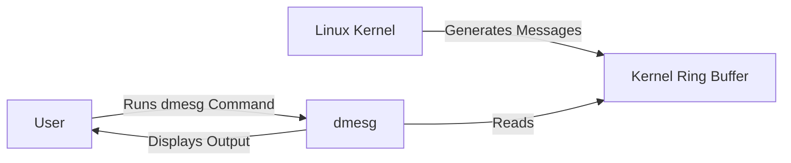
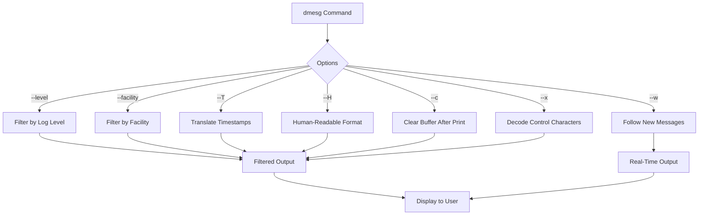

# Comprehensive Guide to `dmesg` in Linux


## Table of Contents

- [Introduction](#introduction)
- [What is `dmesg`?](#what-is-dmesg)
- [Understanding the Kernel Ring Buffer](#understanding-the-kernel-ring-buffer)
- [Basic Usage](#basic-usage)
- [`dmesg` Options](#dmesg-options)
  - [Filtering Output](#filtering-output)
  - [Formatting Output](#formatting-output)
  - [Controlling Buffer Size](#controlling-buffer-size)
  - [Real-Time Monitoring](#real-time-monitoring)
  - [Other Useful Options](#other-useful-options)
- [Practical Examples](#practical-examples)
  - [Example 1: Viewing Boot Messages](#example-1-viewing-boot-messages)
  - [Example 2: Monitoring Kernel Messages in Real-Time](#example-2-monitoring-kernel-messages-in-real-time)
  - [Example 3: Filtering Messages by Severity](#example-3-filtering-messages-by-severity)
  - [Example 4: Searching for Specific Keywords](#example-4-searching-for-specific-keywords)
  - [Example 5: Saving `dmesg` Output to a File](#example-5-saving-dmesg-output-to-a-file)
  - [Example 6: Following Kernel Messages](#example-6-following-kernel-messages)
- [Demonstrations](#demonstrations)
  - [Demo 1: Inspecting Hardware Initialization](#demo-1-inspecting-hardware-initialization)
  - [Demo 2: Diagnosing Driver Issues](#demo-2-diagnosing-driver-issues)
  - [Demo 3: Checking System Errors](#demo-3-checking-system-errors)
  - [Demo 4: Real-Time Monitoring with `dmesg -w`](#demo-4-real-time-monitoring-with-dmesg-w)
- [Advanced Usage](#advanced-usage)
  - [Integrating `dmesg` with Other Tools](#integrating-dmesg-with-other-tools)
  - [Automating `dmesg` Analysis](#automating-dmesg-analysis)
- [Best Practices](#best-practices)
- [Troubleshooting](#troubleshooting)
- [Mermaid Diagrams](#mermaid-diagrams)
  - [`dmesg` Workflow](#dmesg-workflow)
- [Conclusion](#conclusion)
- [References](#references)

---

## Introduction

In Linux, the `dmesg` (diagnostic message) command is a powerful utility that displays the **kernel ring buffer** messages. These messages include information about hardware detection, driver initialization, system errors, and other kernel-related events. Understanding how to effectively use `dmesg` is essential for system administrators, developers, and power users to monitor system health, diagnose issues, and gain insights into the kernel's operations.

---

## What is `dmesg`?

`dmesg` is a command-line utility that reads and displays the **kernel ring buffer**, a data structure in the Linux kernel that stores log messages generated during system boot and runtime. These messages provide valuable information about hardware components, drivers, system events, and errors.

**Key Points:**

- **Kernel Ring Buffer:** A circular buffer that holds the latest kernel messages.
- **Boot Messages:** Includes information about hardware detection and driver initialization during system startup.
- **Runtime Messages:** Logs events, warnings, and errors that occur while the system is running.
- **Diagnostics:** Useful for troubleshooting hardware and driver issues.

---

## Understanding the Kernel Ring Buffer

The **kernel ring buffer** is an in-memory log that records messages from the Linux kernel. It operates as a circular buffer, meaning that when it reaches its maximum size, it overwrites the oldest messages with new ones.

**Characteristics:**

- **Volatile Storage:** The buffer is stored in memory; its contents are lost upon reboot unless logged to a persistent storage.
- **Real-Time Logging:** Continuously captures kernel messages as they occur.
- **Access Control:** Generally accessible by the root user and members of specific groups (e.g., `adm`, `wheel`).

**Common Sources of `dmesg` Messages:**

- **Hardware Drivers:** Loading and initializing hardware components.
- **System Boot:** Messages generated during the boot process.
- **Error Logs:** Kernel panics, hardware failures, driver errors.
- **Device Events:** Plugging in USB devices, mounting filesystems.

---

## Basic Usage

The simplest way to use `dmesg` is to execute it without any options to display the current contents of the kernel ring buffer.

```bash
dmesg
```

**Sample Output:**

```
[    0.000000] Initializing cgroup subsys cpuset
[    0.000000] Initializing cgroup subsys cpu
[    0.000000] Initializing cgroup subsys cpuacct
...
[   10.123456] USB device found: ID 1234:5678
[   10.123789] usb 1-1: new high-speed USB device number 2 using xhci_hcd
...
```

---

## `dmesg` Options

`dmesg` offers various options to filter, format, and control the output of kernel messages. Understanding these options allows for more efficient and targeted usage.

### Filtering Output

#### `-l, --level LEVELS`

Filter messages by **log level**. Levels indicate the severity of messages.

**Syntax:**

```bash
dmesg --level=LEVELS
```

**Log Levels:**

| Level | Severity | Description                       |
| ----- | -------- | --------------------------------- |
| 0     | emerg    | Emergency: system is unusable     |
| 1     | alert    | Action must be taken immediately  |
| 2     | crit     | Critical conditions               |
| 3     | err      | Error conditions                  |
| 4     | warning  | Warning conditions                |
| 5     | notice   | Normal but significant conditions |
| 6     | info     | Informational messages            |
| 7     | debug    | Debug-level messages              |

**Example: Display Only Errors and Above**

```bash
dmesg --level=err,crit,alert,emerg
```

**Short Option:**

```bash
dmesg -l err,crit,alert,emerg
```

#### `-f, --facility FACILITY`

Filter messages by **facility**. Facilities categorize the source of messages.

**Facilities Include:**

- `kern`: Kernel messages
- `user`: User-level messages
- `mail`: Mail system messages
- `daemon`: Daemon messages
- `auth`: Authentication messages
- `syslog`: Syslog internal messages
- `lpr`: Printer subsystem messages
- `news`: News subsystem messages
- `uucp`: UUCP subsystem messages
- `cron`: Cron subsystem messages
- ... and more.

**Example: Display Only Kernel Messages**

```bash
dmesg -f kern
```

### Formatting Output

#### `-H, --human`

Format the output in a **human-readable** format with colored output.

**Example:**

```bash
dmesg -H
```

#### `-T, --ctime`

Translate **timestamps** to human-readable **clock times**.

**Example:**

```bash
dmesg -T
```

#### `--color=WHEN`

Control **colored output**.

- `always`: Always use colors.
- `auto`: Use colors if the output is to a terminal.
- `never`: Never use colors.

**Example:**

```bash
dmesg --color=always
```

### Controlling Buffer Size

#### `--buffer-size=SIZE`

Set the size of the kernel ring buffer. **Requires recompiling the kernel** and is generally not recommended for casual users.

**Example:**

```bash
sudo dmesg --buffer-size=1048576
```

#### `-s, --buffer SIZE`

Specify the size of the output buffer.

**Example:**

```bash
dmesg -s 1048576
```

### Real-Time Monitoring

#### `-w, --follow`

Wait for new messages and **continuously output** them as they are added to the buffer. Similar to `tail -f`.

**Example:**

```bash
dmesg -w
```

#### `-W, --realtime`

Work in **realtime**, which ensures that new messages are displayed immediately.

**Example:**

```bash
dmesg -W
```

**Note:** `-w` and `-W` can be combined for enhanced real-time monitoring.

### Other Useful Options

#### `-c, --clear`

**Clear** the kernel ring buffer after printing. Useful for resetting the buffer.

**Example:**

```bash
sudo dmesg -c
```

#### `-x, --decode`

**Decode** printable control characters in the messages.

**Example:**

```bash
dmesg -x
```

#### `-E, --reltime`

Show timestamps in **relative** format instead of absolute times.

**Example:**

```bash
dmesg -E
```

---

## Practical Examples

### Example 1: Viewing Boot Messages

To view messages generated during the system boot process:

```bash
dmesg --level=info,notice,warning,err,crit,alert,emerg -T | grep -i boot
```

**Explanation:**

- Filters messages with log levels from `info` to `emerg`.
- Translates timestamps to human-readable format.
- Searches for the keyword "boot".

### Example 2: Monitoring Kernel Messages in Real-Time

While `dmesg` itself does not support real-time monitoring, you can simulate it by repeatedly polling the kernel ring buffer.

```bash
watch -n 1 'dmesg --color=never | tail -n 20'
```

**Explanation:**

- Uses `watch` to execute the `dmesg` command every second.
- Displays the latest 20 kernel messages without colored output.

### Example 3: Filtering Messages by Severity

To display only **error** and more critical messages:

```bash
dmesg -l err,crit,alert,emerg -T
```

**Sample Output:**

```
[   10.123456] ERROR: USB device not recognized
[   15.654321] CRITICAL: Kernel panic - not syncing: Fatal exception
```

### Example 4: Searching for Specific Keywords

To find messages related to **USB** devices:

```bash
dmesg -T | grep -i usb
```

**Sample Output:**

```
[   10.123456] USB device found: ID 1234:5678
[   10.123789] usb 1-1: new high-speed USB device number 2 using xhci_hcd
```

### Example 5: Saving `dmesg` Output to a File

To save the current kernel messages to a file for later analysis:

```bash
dmesg -T > kernel_logs.txt
```

**Explanation:**

- Redirects the output of `dmesg` with human-readable timestamps to `kernel_logs.txt`.

### Example 6: Following Kernel Messages

To continuously monitor kernel messages as they occur:

```bash
sudo dmesg -wH
```

**Explanation:**

- `-w`: Wait for new messages and output them as they are added.
- `-H`: Human-readable format with colored output.

---

## Demonstrations

### Demo 1: Inspecting Hardware Initialization

**Objective:** Use `dmesg` to verify that hardware components are correctly initialized during boot.

**Steps:**

1. **Check for Network Interfaces:**

   ```bash
   dmesg -T | grep -i eth
   ```

   **Sample Output:**

   ```
   [    2.345678] eth0: Intel Ethernet Connection I219-LM
   [    2.346789] IPv6: ADDRCONF(NETDEV_UP): eth0: link is not ready
   ```

2. **Verify Graphics Card Initialization:**

   ```bash
   dmesg -T | grep -i drm
   ```

   **Sample Output:**

   ```
   [    3.456789] [drm] Initialized i915 1.6.0 20170810 for i915 on minor 0
   ```

**Explanation:**

- **Network Interfaces:** Confirms that `eth0` has been detected and initialized.
- **Graphics Card:** Ensures that the Direct Rendering Manager (DRM) for the Intel graphics card is initialized.

### Demo 2: Diagnosing Driver Issues

**Objective:** Identify and troubleshoot driver-related errors.

**Steps:**

1. **Simulate a Driver Error:**

   _Note: This step is for demonstration purposes. Avoid executing commands that can harm your system._

   ```bash
   sudo modprobe nonexistent_driver
   ```

2. **Check for Error Messages:**

   ```bash
   dmesg -T | grep -i nonexistent_driver
   ```

   **Sample Output:**

   ```
   [   20.789012] modprobe: ERROR: could not insert 'nonexistent_driver': Unknown symbol in module, or unknown parameter (see dmesg)
   ```

**Explanation:**

- Attempting to load a non-existent driver results in an error message captured by `dmesg`, aiding in troubleshooting.

### Demo 3: Checking System Errors

**Objective:** Detect and analyze system errors reported by the kernel.

**Steps:**

1. **Induce a Kernel Warning:**

   _Note: This step is for educational purposes only._

   ```bash
   echo "1" | sudo tee /proc/sys/kernel/sysrq
   sudo echo "c" > /proc/sysrq-trigger
   ```

   **Warning:** This may cause the system to crash or reboot. Proceed with caution.

2. **Review `dmesg` for Errors:**

   ```bash
   dmesg -T | grep -i panic
   ```

   **Sample Output:**

   ```
   [   25.678901] Kernel panic - not syncing: Fatal exception
   ```

**Explanation:**

- Kernel panics and other critical errors are logged by `dmesg`, providing insights into severe system issues.

### Demo 4: Real-Time Monitoring with `dmesg -w`

**Objective:** Monitor kernel messages in real-time as they occur.

**Steps:**

1. **Open a Terminal and Run:**

   ```bash
   sudo dmesg -wH
   ```

   **Explanation:**

   - `-w`: Wait for new messages and output them as they are added.
   - `-H`: Human-readable format with colored output.

2. **Trigger a Hardware Event:**

   - **Example:** Plug in a USB device, remove a USB device, or connect a network cable.

3. **Observe Real-Time Messages:**

   ```bash
   [   30.123456] usb 2-1: new high-speed USB device number 3 using xhci_hcd
   [   30.234567] usb 2-1: New USB device found, idVendor=abcd, idProduct=1234
   [   30.345678] usb-storage 2-1:1.0: USB Mass Storage device detected
   ```

4. **Terminate the Monitoring:**

   - Press `Ctrl + C` to stop.

**Explanation:**

- As you perform actions that affect the hardware, `dmesg` outputs corresponding kernel messages in real-time, allowing immediate observation of system behavior.

---

## Advanced Usage

### Integrating `dmesg` with Other Tools

#### Using `grep` for Pattern Matching

```bash
dmesg -T | grep -i error
```

**Explanation:**

- Filters `dmesg` output for lines containing "error" (case-insensitive).

#### Combining with `less` for Pagination

```bash
dmesg -T | less
```

**Explanation:**

- Pipes `dmesg` output into `less` for easy navigation through large logs.

#### Utilizing `awk` for Field Processing

```bash
dmesg -T | awk '/usb/ {print $1, $2, $3, $4}'
```

**Explanation:**

- Extracts and displays specific fields from lines containing "usb".

### Automating `dmesg` Analysis

#### Creating a Script to Monitor Errors

**Script: `monitor_dmesg_errors.sh`**

```bash
#!/bin/bash

# Monitor kernel messages for errors in real-time
dmesg -T --level=err,crit,alert,emerg -wH | while read -r line; do
    echo "[ERROR] $(date +"%Y-%m-%d %H:%M:%S") - $line" >> /var/log/kernel_errors.log
done
```

**Explanation:**

- **Options Used:**

  - `--level=err,crit,alert,emerg`: Filters for error-level messages.
  - `-w`: Wait for new messages (real-time monitoring).
  - `-H`: Human-readable format.

- **Functionality:**
  - Continuously watches for new error messages and appends them with timestamps to `/var/log/kernel_errors.log`.

**Usage:**

```bash
chmod +x monitor_dmesg_errors.sh
sudo ./monitor_dmesg_errors.sh
```

### Customizing Output with `dmesg`

#### Displaying Only Ring Buffer Dump Without Formatting

```bash
dmesg -x
```

**Explanation:**

- `-x` adds extra details to the output, including hexadecimal representations of certain fields.

#### Limiting the Number of Messages

```bash
dmesg | tail -n 50
```

**Explanation:**

- Displays the last 50 kernel messages.

#### Displaying Messages with Relative Timestamps

```bash
dmesg -E
```

**Explanation:**

- Shows timestamps in a relative format instead of absolute wall-clock times.

---

## Best Practices

1. **Regular Monitoring:**

   - Regularly check `dmesg` for unusual messages to proactively detect hardware or driver issues.

2. **Log Persistence:**

   - Since `dmesg` outputs are volatile, consider integrating it with persistent logging systems like `syslog` or `journald`.

3. **Permission Management:**

   - Restrict access to `dmesg` outputs to authorized users to prevent information leakage.

4. **Automated Alerts:**

   - Use scripts to monitor `dmesg` for critical errors and trigger alerts when necessary.

5. **Buffer Management:**

   - Be aware of the kernel ring buffer size; if it's too small, important messages may be overwritten quickly.

6. **Use Human-Readable Formats:**
   - Utilize the `-T` and `-H` options for easier interpretation of timestamps and message contents.

---

## Troubleshooting

### Issue: No Output from `dmesg`

**Possible Causes:**

1. **Permissions:**

   - Non-root users may have limited access to `dmesg` outputs.

2. **Buffer Size:**
   - The kernel ring buffer may be empty or messages have been overwritten.

**Solutions:**

1. **Run as Root:**

   ```bash
   sudo dmesg
   ```

2. **Check for Log Persistence:**
   - Verify if logs are being redirected to persistent storage like `/var/log/kern.log`.

### Issue: Broken Timestamps with `-T` Option

**Explanation:**

- The `-T` option translates timestamps to wall-clock time, which may not always align perfectly due to buffer rotations or time synchronization issues.

**Solution:**

- Use `dmesg` without `-T` for raw timestamps or ensure system time is synchronized using NTP.

### Issue: Overwhelming Amount of Messages

**Explanation:**

- Systems with high hardware activity or errors may generate a large number of kernel messages, making it hard to sift through relevant information.

**Solution:**

- Use filtering options (`-l`, `-f`) to narrow down the output.
- Utilize piping with `grep`, `awk`, or `less` for better readability.

---

## Mermaid Diagrams

### `dmesg` Workflow



**Explanation:**

- The **Linux Kernel** generates messages and stores them in the **Kernel Ring Buffer**.
- When a **User** runs the `dmesg` command, it reads from the **Ring Buffer** and displays the messages.

### `dmesg` Options Flow



**Explanation:**

- The `dmesg` command can be customized with various options to filter, format, and control the output.
- Each option processes the kernel messages differently before displaying them to the user.

---

## Conclusion

The `dmesg` command is an indispensable tool for monitoring and diagnosing kernel-related events in Linux. By understanding its options, integrating it with other tools, and employing best practices, you can effectively manage system health, troubleshoot issues, and gain deep insights into the underlying operations of your Linux system.

**Key Takeaways:**

- **`dmesg`** provides access to the kernel ring buffer, which logs critical system messages.
- **Options** allow for tailored outputs, filtering by severity, formatting, and more.
- **Practical usage** includes monitoring hardware initialization, diagnosing driver issues, and detecting system errors.
- **Integrations and automation** enhance the utility of `dmesg` in system administration and monitoring workflows.
- **Best practices** ensure effective and secure use of `dmesg` for system maintenance.

By mastering `dmesg`, you empower yourself to maintain robust and reliable Linux systems.

---

## References

- [GNU `dmesg` Manual](https://www.gnu.org/software/coreutils/manual/html_node/dmesg-invocation.html)
- [Linux Kernel Documentation: Kernel Message Buffer](https://www.kernel.org/doc/html/latest/admin-guide/printk.html)
- [Understanding `dmesg` Output](https://www.geeksforgeeks.org/dmesg-command-in-linux-with-examples/)
- [Arch Linux Wiki: dmesg](https://wiki.archlinux.org/title/Dmesg)
- [Ubuntu Manpage: dmesg](http://manpages.ubuntu.com/manpages/bionic/man1/dmesg.1.html)
- [Linux Journal: Using dmesg](https://www.linuxjournal.com/content/dmesg-command-fundamentals)
- [Red Hat Documentation: Viewing and Controlling `dmesg`](https://access.redhat.com/documentation/en-us/red_hat_enterprise_linux/7/html/system_administrators_guide/viewing-and-controlling-dmesg-output)
- [How `dmesg` Works](https://www.linux.com/training-tutorials/understanding-dmesg/)
- [Mermaid Official Documentation](https://mermaid-js.github.io/mermaid/#/)
