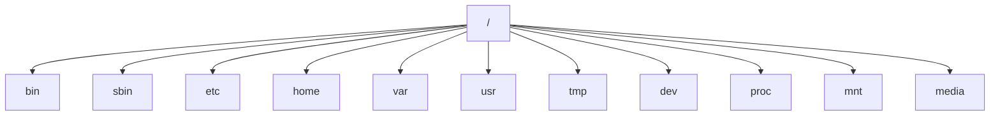
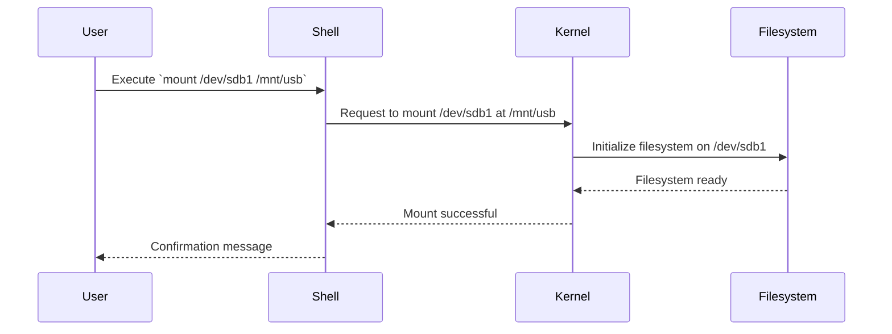

# Comprehensive Guide to Linux File Operations, Links, Mounting, and File Systems


## Table of Contents

- [Introduction](#introduction)
- [Linux File System Hierarchy](#linux-file-system-hierarchy)
- [File Operations](#file-operations)
  - [Creating Files and Directories](#creating-files-and-directories)
  - [Reading and Viewing Files](#reading-and-viewing-files)
  - [Updating and Editing Files](#updating-and-editing-files)
  - [Deleting Files and Directories](#deleting-files-and-directories)
  - [Copying and Moving Files](#copying-and-moving-files)
  - [Searching for Files](#searching-for-files)
- [Links in Linux](#links-in-linux)
  - [Soft Links (Symbolic Links)](#soft-links-symbolic-links)
    - [Creating Symbolic Links](#creating-symbolic-links)
    - [Use Cases for Symbolic Links](#use-cases-for-symbolic-links)
    - [Examples](#examples)
  - [Hard Links](#hard-links)
    - [Creating Hard Links](#creating-hard-links)
    - [Use Cases for Hard Links](#use-cases-for-hard-links)
    - [Examples](#examples-1)
  - [Differences Between Soft Links and Hard Links](#differences-between-soft-links-and-hard-links)
- [Mounting and Unmounting File Systems](#mounting-and-unmounting-file-systems)
  - [Understanding Mounting](#understanding-mounting)
  - [Mounting File Systems](#mounting-file-systems)
    - [Using the `mount` Command](#using-the-mount-command)
    - [Persistent Mounts with `/etc/fstab`](#persistent-mounts-with-etcfstab)
  - [Unmounting File Systems](#unmounting-file-systems)
    - [Using the `umount` Command](#using-the-umount-command)
  - [Common Mount Points](#common-mount-points)
- [Understanding the Linux File System](#understanding-the-linux-file-system)
  - [Filesystem Types](#filesystem-types)
  - [Root Filesystem and Other Mount Points](#root-filesystem-and-other-mount-points)
- [Mermaid Diagrams](#mermaid-diagrams)
  - [Linux File System Hierarchy Diagram](#linux-file-system-hierarchy-diagram)
  - [Mounting Process Diagram](#mounting-process-diagram)
- [Practical Examples and Commands](#practical-examples-and-commands)
- [Conclusion](#conclusion)
- [References](#references)

## Introduction

The Linux operating system relies heavily on its robust and flexible file system for managing data. Understanding file operations, links, mounting processes, and the overall file system hierarchy is crucial for effective system administration, programming, and everyday use. This guide provides a comprehensive overview of these topics, offering detailed explanations, practical examples, and visual diagrams to enhance your understanding.

## Linux File System Hierarchy

Linux employs a hierarchical file system structure, often referred to as the Filesystem Hierarchy Standard (FHS). This structure organizes files and directories in a tree-like format, starting from the root directory (`/`). Here's an overview of the primary directories:

- `/` - **Root Directory**: The top-level directory in the hierarchy.
- `/bin` - Essential binary executables required for system boot and operation.
- `/sbin` - System binaries essential for system administration.
- `/etc` - Configuration files for the system and installed applications.
- `/home` - User home directories.
- `/var` - Variable data files like logs, databases, and caches.
- `/usr` - User utilities and applications.
- `/tmp` - Temporary files.
- `/dev` - Device files.
- `/proc` - Virtual filesystem providing process and system information.
- `/mnt` - Temporary mount points for filesystems.
- `/media` - Mount points for removable media like USB drives and CDs.

Understanding the hierarchy helps in navigating the system, managing files, and configuring applications effectively.

## File Operations

File operations encompass a variety of actions performed on files and directories. Below are the fundamental operations along with commands and examples.

### Creating Files and Directories

#### Creating Files

- **Using `touch`**

  ```bash
  touch filename.txt
  ```

- **Using `echo`**

  ```bash
  echo "Hello, World!" > hello.txt
  ```

- **Using Text Editors**

  Create and edit a file using editors like `nano`, `vim`, or `gedit`.

  ```bash
  nano newfile.txt
  ```

#### Creating Directories

- **Using `mkdir`**

  ```bash
  mkdir my_directory
  ```

- **Creating Nested Directories**

  ```bash
  mkdir -p parent_dir/child_dir/grandchild_dir
  ```

### Reading and Viewing Files

- **Using `cat`**

  ```bash
  cat filename.txt
  ```

- **Using `less` or `more`**

  ```bash
  less filename.txt
  ```

  ```bash
  more filename.txt
  ```

- **Using `head` and `tail`**

  View the first 10 lines:

  ```bash
  head filename.txt
  ```

  View the last 10 lines:

  ```bash
  tail filename.txt
  ```

### Updating and Editing Files

- **Using Text Editors**

  Edit files using `nano`, `vim`, or `gedit`.

  ```bash
  vim filename.txt
  ```

- **Appending to Files**

  ```bash
  echo "Additional line." >> filename.txt
  ```

- **Using `sed` for Stream Editing**

  Replace text within a file.

  ```bash
  sed -i 's/old_text/new_text/g' filename.txt
  ```

### Deleting Files and Directories

- **Deleting Files with `rm`**

  ```bash
  rm filename.txt
  ```

- **Deleting Directories with `rm -r`**

  ```bash
  rm -r my_directory
  ```

- **Using `rmdir` for Empty Directories**

  ```bash
  rmdir empty_directory
  ```

### Copying and Moving Files

- **Copying Files with `cp`**

  ```bash
  cp source.txt destination.txt
  ```

  **Copying Directories**

  ```bash
  cp -r source_dir/ destination_dir/
  ```

- **Moving/Renaming Files with `mv`**

  ```bash
  mv oldname.txt newname.txt
  ```

  **Moving to a Different Directory**

  ```bash
  mv file.txt /path/to/destination/
  ```

### Searching for Files

- **Using `find`**

  ```bash
  find /path/to/search -name "filename.txt"
  ```

- **Using `locate`**

  ```bash
  locate filename.txt
  ```

- **Using `grep` to Search Within Files**

  ```bash
  grep "search_term" filename.txt
  ```

## Links in Linux

Links are references or pointers to other files. Linux supports two types of links: **Soft Links (Symbolic Links)** and **Hard Links**. Understanding the differences between them is essential for effective file management.

### Soft Links (Symbolic Links)

#### What are Soft Links?

A **Soft Link**, also known as a **Symbolic Link** or **Symlink**, is a special type of file that points to another file or directory. Unlike hard links, soft links can cross filesystem boundaries and can link to directories.

#### Creating Symbolic Links

- **Using `ln -s`**

  ```bash
  ln -s /path/to/original /path/to/symlink
  ```

  **Example:**

  ```bash
  ln -s /usr/local/bin/myapp /home/user/myapp_link
  ```

#### Use Cases for Symbolic Links

- **Creating Shortcuts**: Simplify access to deeply nested directories or long file paths.
- **Version Management**: Point to different versions of a software application.
- **Shared Resources**: Allow multiple users or applications to access the same file or directory.

#### Examples

- **Linking a Directory**

  ```bash
  ln -s /var/www/html /home/user/web
  ```

- **Linking a File**

  ```bash
  ln -s /etc/nginx/nginx.conf /home/user/nginx.conf
  ```

### Hard Links

#### What are Hard Links?

A **Hard Link** is an additional directory entry for an existing file. Both the original file and the hard link reference the same inode, meaning they share the same data on the disk. Hard links cannot span across different filesystems and cannot link to directories.

#### Creating Hard Links

- **Using `ln`**

  ```bash
  ln /path/to/original /path/to/hardlink
  ```

  **Example:**

  ```bash
  ln /home/user/document.txt /home/user/document_backup.txt
  ```

#### Use Cases for Hard Links

- **Data Redundancy**: Create multiple references to critical files without duplicating data.
- **Efficient Storage**: Save disk space by avoiding duplicate copies of the same file.
- **Backup Solutions**: Implement snapshot-based backups using hard links.

#### Examples

- **Creating a Hard Link**

  ```bash
  ln /home/user/report.pdf /home/user/report_backup.pdf
  ```

### Differences Between Soft Links and Hard Links

| Feature                   | Soft Links (Symbolic Links)                                  | Hard Links                                                            |
| ------------------------- | ------------------------------------------------------------ | --------------------------------------------------------------------- |
| **Reference Type**        | Points to the file path                                      | Points directly to the inode                                          |
| **Filesystem Boundaries** | Can span across different filesystems                        | Must reside within the same filesystem                                |
| **Linking Directories**   | Can link to directories                                      | Cannot link to directories                                            |
| **Deletion Behavior**     | If the original file is deleted, the symlink becomes broken  | Original file deletion affects all hard links                         |
| **Identification**        | Identified by a different inode and type (`ls -l` shows `l`) | Shares the same inode as the original file (`ls -l` shows same inode) |

## Mounting and Unmounting File Systems

Mounting is the process of making a filesystem accessible at a specified point in the directory tree. Unmounting detaches the filesystem, ensuring that all data is written and the mount point is free.

### Understanding Mounting

- **Mount Point**: A directory where the filesystem is attached.
- **Filesystem**: Can be a partition, a removable device, or a network filesystem.

### Mounting File Systems

#### Using the `mount` Command

**Syntax:**

```bash
mount -t filesystem_type device mount_point
```

**Examples:**

- **Mounting a USB Drive**

  ```bash
  sudo mount -t vfat /dev/sdb1 /mnt/usb
  ```

- **Mounting an ISO Image**

  ```bash
  sudo mount -o loop image.iso /mnt/iso
  ```

- **Mounting a Network Filesystem (NFS)**

  ```bash
  sudo mount -t nfs server:/export/share /mnt/nfs_share
  ```

#### Persistent Mounts with `/etc/fstab`

To automatically mount filesystems at boot, add entries to the `/etc/fstab` file.

**Example Entry:**

```fstab
/dev/sdb1   /mnt/usb    vfat    defaults    0   0
```

**Steps:**

1. **Edit `/etc/fstab`**

   ```bash
   sudo nano /etc/fstab
   ```

2. **Add the Mount Entry**

   ```fstab
   /dev/sdb1   /mnt/usb    vfat    defaults    0   0
   ```

3. **Apply Changes**

   ```bash
   sudo mount -a
   ```

### Unmounting File Systems

#### Using the `umount` Command

**Syntax:**

```bash
umount mount_point
```

**Examples:**

- **Unmounting a USB Drive**

  ```bash
  sudo umount /mnt/usb
  ```

- **Unmounting an ISO Image**

  ```bash
  sudo umount /mnt/iso
  ```

- **Unmounting a Network Filesystem**

  ```bash
  sudo umount /mnt/nfs_share
  ```

**Note:** Ensure no processes are using the filesystem before unmounting. Use `lsof` or `fuser` to check.

- **Using `lsof`**

  ```bash
  lsof /mnt/usb
  ```

- **Using `fuser`**

  ```bash
  sudo fuser -vm /mnt/usb
  ```

### Common Mount Points

- `/mnt`: Temporary mount point for mounting filesystems.
- `/media`: Standard mount point for removable media like USB drives, CDs, and DVDs.

## Understanding the Linux File System

The Linux file system is a complex structure that supports various filesystem types, each with its characteristics and use cases.

### Filesystem Types

- **ext4**: The default and most widely used filesystem in Linux. Known for reliability and performance.
- **xfs**: High-performance 64-bit journaling filesystem. Suitable for large files and parallel I/O.
- **btrfs**: Advanced filesystem with features like snapshots, RAID, and self-healing.
- **ntfs**: Filesystem developed by Microsoft. Commonly used for Windows partitions.
- **vfat (FAT32)**: Simple filesystem used for USB drives and other removable media.
- **nfs**: Network filesystem allowing access to files over a network.

### Root Filesystem and Other Mount Points

- **Root Filesystem (`/`)**: The primary filesystem containing all essential directories.
- **Separate Mount Points**: Directories like `/home`, `/var`, `/usr`, and others can be mounted separately to manage disk space and security effectively.

**Example `/etc/fstab` with Multiple Mount Points:**

```fstab
/dev/sda1    /           ext4    defaults        1 1
/dev/sda2    /home       ext4    defaults        1 2
/dev/sda3    /var        ext4    defaults        1 2
/dev/sdb1    /mnt/usb    vfat    defaults        0 0
```

## Mermaid Diagrams

Visual diagrams can enhance the understanding of the Linux file system structure and mounting processes.

### Linux File System Hierarchy Diagram



### Mounting Process Diagram



## Practical Examples and Commands

### Creating and Managing Symbolic Links

- **Create a Symbolic Link**

  ```bash
  ln -s /usr/local/bin/myapp /home/user/myapp_link
  ```

- **List Symbolic Links**

  ```bash
  ls -l /home/user | grep myapp_link
  ```

  **Output:**

  ```
  lrwxrwxrwx 1 user user    15 Apr 10 10:00 myapp_link -> /usr/local/bin/myapp
  ```

- **Remove a Symbolic Link**

  ```bash
  rm /home/user/myapp_link
  ```

### Creating and Managing Hard Links

- **Create a Hard Link**

  ```bash
  ln /home/user/document.txt /home/user/document_backup.txt
  ```

- **List Hard Links**

  ```bash
  ls -li /home/user/document.txt /home/user/document_backup.txt
  ```

  **Output:**

  ```
  123456 -rw-r--r-- 2 user user 1024 Apr 10 10:00 document.txt
  123456 -rw-r--r-- 2 user user 1024 Apr 10 10:00 document_backup.txt
  ```

- **Remove a Hard Link**

  ```bash
  rm /home/user/document_backup.txt
  ```

  **Note:** The original file remains intact as long as at least one hard link exists.

### Mounting a USB Drive

1. **Identify the Device**

   ```bash
   lsblk
   ```

   **Output:**

   ```
   NAME   MAJ:MIN RM   SIZE RO TYPE MOUNTPOINT
   sda      8:0    0  100G  0 disk
   ├─sda1   8:1    0   50G  0 part /
   ├─sda2   8:2    0   25G  0 part /home
   └─sda3   8:3    0   25G  0 part /var
   sdb      8:16   1   16G  0 disk
   └─sdb1   8:17   1   16G  0 part
   ```

2. **Create Mount Point (if not exists)**

   ```bash
   sudo mkdir -p /mnt/usb
   ```

3. **Mount the USB Drive**

   ```bash
   sudo mount /dev/sdb1 /mnt/usb
   ```

4. **Verify Mount**

   ```bash
   df -h | grep /mnt/usb
   ```

   **Output:**

   ```
   /dev/sdb1        15G  1.5G   13G  10% /mnt/usb
   ```

5. **Unmount the USB Drive**

   ```bash
   sudo umount /mnt/usb
   ```

### Editing `/etc/fstab` for Persistent Mounts

1. **Backup Current `/etc/fstab`**

   ```bash
   sudo cp /etc/fstab /etc/fstab.backup
   ```

2. **Edit `/etc/fstab`**

   ```bash
   sudo nano /etc/fstab
   ```

3. **Add Entry for USB Drive**

   ```fstab
   /dev/sdb1    /mnt/usb    vfat    defaults    0   0
   ```

4. **Apply Changes**

   ```bash
   sudo mount -a
   ```

### Searching for Files with `find`

- **Find All `.conf` Files in `/etc`**

  ```bash
  find /etc -type f -name "*.conf"
  ```

- **Find Files Modified in the Last 7 Days**

  ```bash
  find /home/user -type f -mtime -7
  ```

### Copying Directories with `rsync`

- **Synchronize Two Directories**

  ```bash
  rsync -avh /source/directory/ /destination/directory/
  ```

## Conclusion

Mastering file operations, understanding the nuances of soft and hard links, and managing the mounting processes are fundamental skills for anyone working with Linux systems. This guide provided a comprehensive overview of these topics, equipping you with the knowledge and practical skills to efficiently manage files and filesystems in a Linux environment. Whether you're a system administrator, developer, or an enthusiast, these skills are essential for maintaining a robust and organized system.

## References

- [Filesystem Hierarchy Standard (FHS)](https://refspecs.linuxfoundation.org/FHS_3.0/fhs/index.html)
- [GNU Core Utilities](https://www.gnu.org/software/coreutils/)
- [Linux `mount` Command Manual](https://man7.org/linux/man-pages/man8/mount.8.html)
- [Linux `ln` Command Manual](https://man7.org/linux/man-pages/man1/ln.1.html)
- [Understanding Hard Links and Soft Links in Linux](https://www.geeksforgeeks.org/difference-between-hard-and-symbolic-links-in-linux/)
- [The Linux Documentation Project](https://www.tldp.org/)
- [Advanced Linux File System Management](https://www.digitalocean.com/community/tutorials/understanding-the-linux-filesystem-hierarchy)
