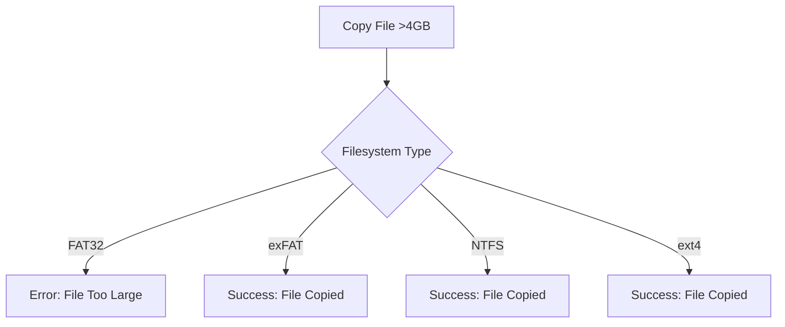

# Advanced Demo: Flashing, Partitioning, Formatting, and Testing Filesystems on a USB Drive


## Table of Contents

- [Introduction](#introduction)
- [Prerequisites](#prerequisites)
- [Demo Overview](#demo-overview)
- [Step-by-Step Demonstration](#step-by-step-demonstration)
  - [1. Identify the USB Drive](#1-identify-the-usb-drive)
  - [2. Flashing the USB Drive (Optional)](#2-flashing-the-usb-drive-optional)
  - [3. Unmount the USB Drive](#3-unmount-the-usb-drive)
  - [4. Formatting the USB Drive](#4-formatting-the-usb-drive)
  - [5. Creating Partitions with Different Filesystems](#5-creating-partitions-with-different-filesystems)
  - [6. Mounting the Partitions](#6-mounting-the-partitions)
  - [7. Testing File Copy to FAT32 Partition](#7-testing-file-copy-to-fat32-partition)
- [Expected Outcomes](#expected-outcomes)
- [Advanced Enhancements](#advanced-enhancements)
  - [Handling Large Files Across Filesystems](#handling-large-files-across-filesystems)
  - [Automating the Process with Scripts](#automating-the-process-with-scripts)
  - [Integrating Error Handling](#integrating-error-handling)
- [Troubleshooting](#troubleshooting)
- [Mermaid Diagrams](#mermaid-diagrams)
  - [Partitioning Workflow](#partitioning-workflow)
  - [Filesystem Limitations](#filesystem-limitations)
- [Conclusion](#conclusion)
- [References](#references)

---

## Introduction

This comprehensive guide walks you through an advanced demonstration of managing USB drives in Linux. You will learn how to:

1. **Identify** your USB drive.
2. **Flash** the USB drive with a disk image (optional).
3. **Unmount** the USB drive safely.
4. **Format** the USB drive.
5. **Create partitions** with different filesystems.
6. **Mount** the partitions.
7. **Test** filesystem limitations by attempting to copy a file exceeding FAT32's 4GB file size limit.

This demo is ideal for system administrators, developers, and Linux enthusiasts aiming to deepen their understanding of disk management and filesystem constraints.

---

## Prerequisites

Before proceeding with the demonstration, ensure you have the following:

- **Linux System:** Preferably a distribution like Ubuntu, Fedora, or Arch Linux.
- **USB Drive:** A USB flash drive (e.g., 16GB or larger) to perform the demo. **Warning:** All data on this drive will be erased.
- **Terminal Access:** Ability to execute commands with `sudo` privileges.
- **Tools Installed:**

  - `lsblk`
  - `fdisk` or `gdisk`
  - `mkfs` utilities (`mkfs.vfat`, `mkfs.ext4`, etc.)
  - `mount` and `umount`
  - `dd` (for flashing, optional)
  - `df`
  - `dmesg`

  **Installation Example:**

  ```bash
  sudo apt update
  sudo apt install util-linux dosfstools exfat-utils
  ```

---

## Demo Overview

This demonstration involves the following key steps:

1. **Identify** the USB drive to prevent data loss.
2. **Flash** the USB drive with a disk image (optional but useful for setting up bootable drives).
3. **Unmount** any mounted partitions to prepare for formatting.
4. **Format** the USB drive to a clean state.
5. **Create partitions** on the USB drive, each with a different filesystem (e.g., FAT32, ext4, NTFS).
6. **Mount** the newly created partitions to access them.
7. **Attempt to copy** a large file (>4GB) to the FAT32 partition to demonstrate filesystem limitations.

---

## Step-by-Step Demonstration

### 1. Identify the USB Drive

**Objective:** Determine the device name assigned to your USB drive to avoid accidental data loss.

**Steps:**

1. **Plug in the USB Drive.**
2. **List Block Devices:**

   ```bash
   lsblk -f
   ```

   **Sample Output:**

   ```
   NAME   FSTYPE LABEL UUID                                 MOUNTPOINT
   sda
   ├─sda1 ext4   root  a1b2c3d4-5678-90ab-cdef-1234567890ab /
   ├─sda2 swap         5678abcd-1234-efgh-ijkl-9876543210cd [SWAP]
   sdb
   └─sdb1 vfat   EFI   1234-ABCD                            /boot/efi
   ```

3. **Identify Your USB Drive:**

   - **Method 1:** Compare the size of the devices.
   - **Method 2:** Use `dmesg` to see the latest device connections.

   ```bash
   dmesg | tail -n 20
   ```

   **Sample Output:**

   ```
   [   10.123456] usb 2-1: new high-speed USB device number 3 using xhci_hcd
   [   10.234567] usb 2-1: New USB device found, idVendor=abcd, idProduct=1234
   [   10.345678] usb-storage 2-1:1.0: USB Mass Storage device detected
   ```

4. **Confirm Device Name:**

   Suppose your USB drive is `/dev/sdc`.

   **Caution:** Ensure you have correctly identified the USB drive to prevent data loss on other devices.

### 2. Flashing the USB Drive (Optional)

**Objective:** Write a disk image to the USB drive, making it bootable or setting up a specific environment.

**Note:** This step is optional and typically used for creating bootable USB drives.

**Steps:**

1. **Download or Prepare a Disk Image:**

   - Example: `ubuntu.iso` for a bootable Ubuntu USB.

2. **Use `dd` to Flash the Image:**

   ```bash
   sudo dd if=/path/to/ubuntu.iso of=/dev/sdc bs=4M status=progress && sync
   ```

   **Explanation:**

   - `if`: Input file (disk image).
   - `of`: Output file (USB device).
   - `bs=4M`: Block size of 4 Megabytes for faster writing.
   - `status=progress`: Shows progress during the operation.
   - `sync`: Ensures all write operations are completed.

3. **Verify the Flashing Process:**

   ```bash
   lsblk -f
   ```

   **Sample Output:**

   ```
   NAME   FSTYPE LABEL UUID                                 MOUNTPOINT
   sdc
   └─sdc1 iso9660 Ubuntu 2021-04-29-04-17-38-00-00
   ```

   **Explanation:**

   - The USB drive now contains the disk image filesystem (e.g., `iso9660` for ISO images).

**Warning:** Flashing a disk image will erase all existing data on the USB drive.

### 3. Unmount the USB Drive

**Objective:** Ensure no partitions are mounted before formatting to prevent data corruption.

**Steps:**

1. **Check Mounted Partitions:**

   ```bash
   lsblk
   ```

   **Sample Output:**

   ```
   NAME   MAJ:MIN RM   SIZE RO TYPE MOUNTPOINT
   sdc      8:32   1 14.9G  0 disk
   └─sdc1   8:33   1 14.9G  0 part /media/user/Ubuntu
   ```

2. **Unmount All Mounted Partitions:**

   ```bash
   sudo umount /dev/sdc1
   ```

   **Confirmation:**

   ```bash
   lsblk
   ```

   **Output:**

   ```
   NAME   MAJ:MIN RM   SIZE RO TYPE MOUNTPOINT
   sdc      8:32   1 14.9G  0 disk
   └─sdc1   8:33   1 14.9G  0 part
   ```

**Note:** Replace `/dev/sdc1` with your actual partition identifier.

### 4. Formatting the USB Drive

**Objective:** Erase existing data and prepare the USB drive for partitioning.

**Steps:**

1. **Erase Existing Partitions:**

   ```bash
   sudo wipefs -a /dev/sdc
   ```

   **Explanation:**

   - `wipefs`: Erases filesystem, RAID, or partition-table signatures.
   - `-a`: Remove all signatures.

2. **Verify Erasure:**

   ```bash
   sudo fdisk -l /dev/sdc
   ```

   **Sample Output:**

   ```
   Disk /dev/sdc: 15.0 GB, 15000000000 bytes, 29296875 sectors
   Units = sectors of 1 * 512 = 512 bytes
   Sector size (logical/physical): 512 bytes / 512 bytes
   I/O size (minimum/optimal): 512 bytes / 512 bytes
   Disklabel type: dos
   Disk identifier: 0x00000000
   ```

   **Note:** If no partitions are listed, the drive has been successfully wiped.

### 5. Creating Partitions with Different Filesystems

**Objective:** Partition the USB drive into multiple sections, each formatted with a different filesystem (e.g., FAT32, ext4, NTFS).

**Steps:**

1. **Launch `fdisk` for Partitioning:**

   ```bash
   sudo fdisk /dev/sdc
   ```

2. **Within `fdisk`, Perform the Following:**

   - **Create a New Partition Table (GPT Recommended):**

     ```bash
     Command (m for help): g
     ```

     **Explanation:**

     - `g`: Creates a new empty GPT partition table.

   - **Create Partition 1 (FAT32):**

     ```bash
     Command (m for help): n
     Partition number (1-128): 1
     First sector (default): [Press Enter]
     Last sector +Size (e.g., +4G): +4G
     ```

     - **Set Partition Type to FAT32:**

       ```bash
       Command (m for help): t
       Partition number (1-128): 1
       Hex code (type L to list all codes): b
       ```

       **Explanation:**

       - `b`: W95 FAT32.

   - **Create Partition 2 (ext4):**

     ```bash
     Command (m for help): n
     Partition number (2-128): 2
     First sector (default): [Press Enter]
     Last sector +Size (e.g., +8G): +8G
     ```

     - **Set Partition Type to Linux Filesystem:**

       ```bash
       Command (m for help): t
       Partition number (2-128): 2
       Hex code: 8300
       ```

   - **Create Partition 3 (NTFS):**

     ```bash
     Command (m for help): n
     Partition number (3-128): 3
     First sector (default): [Press Enter]
     Last sector +Size: [Press Enter for remaining space]
     ```

     - **Set Partition Type to NTFS:**

       ```bash
       Command (m for help): t
       Partition number (3-128): 3
       Hex code: 0700
       ```

   - **Write Changes and Exit:**

     ```bash
     Command (m for help): w
     ```

     **Explanation:**

     - `w`: Writes the partition table to disk and exits.

3. **Verify Partitioning:**

   ```bash
   lsblk -f /dev/sdc
   ```

   **Sample Output:**

   ```
   NAME   FSTYPE LABEL UUID                                 MOUNTPOINT
   sdc
   ├─sdc1 vfat           ABCD-EF01                            /mnt/sdc1
   ├─sdc2 ext4           a1b2c3d4-5678-90ab-cdef-1234567890ab
   └─sdc3 ntfs           ABCD-EF02                            /mnt/sdc3
   ```

### 6. Mounting the Partitions

**Objective:** Access the newly created partitions by mounting them to the filesystem.

**Steps:**

1. **Create Mount Points:**

   ```bash
   sudo mkdir -p /mnt/sdc1 /mnt/sdc2 /mnt/sdc3
   ```

2. **Mount Each Partition:**

   - **Mount FAT32 Partition:**

     ```bash
     sudo mount /dev/sdc1 /mnt/sdc1
     ```

   - **Mount ext4 Partition:**

     ```bash
     sudo mount /dev/sdc2 /mnt/sdc2
     ```

   - **Mount NTFS Partition:**

     ```bash
     sudo mount /dev/sdc3 /mnt/sdc3
     ```

3. **Verify Mounts:**

   ```bash
   lsblk -f
   ```

   **Sample Output:**

   ```
   NAME   FSTYPE LABEL UUID                                 MOUNTPOINT
   sdc
   ├─sdc1 vfat           ABCD-EF01                            /mnt/sdc1
   ├─sdc2 ext4           a1b2c3d4-5678-90ab-cdef-1234567890ab /mnt/sdc2
   └─sdc3 ntfs           ABCD-EF02                            /mnt/sdc3
   ```

**Note:** Ensure that the mount points correspond to the correct partitions.

### 7. Testing File Copy to FAT32 Partition

**Objective:** Demonstrate the FAT32 filesystem's 4GB file size limitation by attempting to copy a file larger than 4GB, which should fail.

**Steps:**

1. **Create a Large Test File (e.g., 5GB):**

   ```bash
   dd if=/dev/zero of=/home/user/large_test_file.bin bs=1G count=5
   ```

   **Explanation:**

   - `dd`: Disk duplication command.
   - `if=/dev/zero`: Input file (produces null bytes).
   - `of=/home/user/large_test_file.bin`: Output file.
   - `bs=1G`: Block size of 1 Gigabyte.
   - `count=5`: Number of blocks (total 5GB).

2. **Attempt to Copy the Large File to FAT32 Partition:**

   ```bash
   cp /home/user/large_test_file.bin /mnt/sdc1/
   ```

   **Expected Outcome:**

   - **Error Message:**

     ```
     cp: error writing '/mnt/sdc1/large_test_file.bin': File too large
     ```

   **Explanation:**

   - FAT32 does not support files larger than **4GB**. Attempting to copy a 5GB file results in an error.

3. **Attempt to Copy the Large File to ext4 Partition (Should Succeed):**

   ```bash
   cp /home/user/large_test_file.bin /mnt/sdc2/
   ```

   **Expected Outcome:**

   - **Successful Copy:**

     ```
     [No output; file copied successfully]
     ```

4. **Verify File Sizes:**

   - **On FAT32 Partition:**

     ```bash
     ls -lh /mnt/sdc1/large_test_file.bin
     ```

     **Expected Output:**

     ```
     ls: cannot access '/mnt/sdc1/large_test_file.bin': No such file or directory
     ```

   - **On ext4 Partition:**

     ```bash
     ls -lh /mnt/sdc2/large_test_file.bin
     ```

     **Sample Output:**

     ```
     -rw-r--r-- 1 user user 5.0G Dec 26 19:45 /mnt/sdc2/large_test_file.bin
     ```

**Conclusion:**

- **FAT32 Limitation:** Cannot handle files larger than 4GB, as demonstrated by the failed copy attempt.
- **ext4 Flexibility:** Successfully handles large files without issues.

---

## Expected Outcomes

After completing this demonstration, you should understand:

- **Device Identification:** How to accurately identify your USB drive to avoid unintended data loss.
- **Disk Flashing:** The process of flashing a USB drive with a disk image, making it bootable.
- **Unmounting:** Safely unmounting partitions before performing disk operations.
- **Formatting and Partitioning:** Creating a clean partition table and formatting partitions with different filesystems.
- **Filesystem Constraints:** Recognizing and testing filesystem limitations, such as FAT32's 4GB file size cap.
- **Practical Troubleshooting:** Understanding error messages and their implications.

---

## Advanced Enhancements

### Handling Large Files Across Filesystems

**Objective:** Explore alternatives to FAT32 for handling large files.

**Options:**

1. **Use exFAT:**

   - **Advantages:** Supports large files and is compatible across Windows, macOS, and Linux.
   - **Installation:**

     ```bash
     sudo apt install exfat-utils exfat-fuse
     ```

   - **Formatting Partition as exFAT:**

     ```bash
     sudo mkfs.exfat /dev/sdc1
     ```

2. **Use NTFS:**

   - **Advantages:** Supports large files, journaling, and is widely compatible.
   - **Installation:**

     ```bash
     sudo apt install ntfs-3g
     ```

   - **Formatting Partition as NTFS:**

     ```bash
     sudo mkfs.ntfs /dev/sdc1
     ```

**Demonstration:**

- **Formatting as exFAT and Copying Large File:**

  ```bash
  sudo umount /dev/sdc1
  sudo mkfs.exfat /dev/sdc1
  sudo mount /dev/sdc1 /mnt/sdc1
  cp /home/user/large_test_file.bin /mnt/sdc1/
  ```

- **Expected Outcome:**

  - **Successful Copy:** The large file is copied without errors.

### Automating the Process with Scripts

**Objective:** Create a bash script to automate flashing, partitioning, formatting, and mounting.

**Script Example: `usb_setup.sh`**

```bash
#!/bin/bash

# Variables
DEVICE="/dev/sdc"
MOUNT_POINT1="/mnt/sdc1"
MOUNT_POINT2="/mnt/sdc2"
MOUNT_POINT3="/mnt/sdc3"

# Check if running as root
if [ "$EUID" -ne 0 ]; then
  echo "Please run as root."
  exit
fi

# Unmount any mounted partitions
umount ${DEVICE}?* 2>/dev/null

# Wipe existing filesystem signatures
wipefs -a $DEVICE

# Create GPT partition table
parted $DEVICE mklabel gpt

# Create partitions
parted $DEVICE mkpart primary fat32 1MiB 4GiB
parted $DEVICE mkpart primary ext4 4GiB 12GiB
parted $DEVICE mkpart primary ntfs 12GiB 100%

# Set partition types
parted $DEVICE set 1 boot on

# Format partitions
mkfs.vfat -F32 ${DEVICE}1
mkfs.ext4 ${DEVICE}2
mkfs.ntfs -f ${DEVICE}3

# Create mount points
mkdir -p $MOUNT_POINT1 $MOUNT_POINT2 $MOUNT_POINT3

# Mount partitions
mount ${DEVICE}1 $MOUNT_POINT1
mount ${DEVICE}2 $MOUNT_POINT2
mount ${DEVICE}3 $MOUNT_POINT3

echo "USB setup complete."
```

**Usage:**

```bash
chmod +x usb_setup.sh
sudo ./usb_setup.sh
```

**Explanation:**

- Automates unmounting, wiping, partitioning, formatting, and mounting the USB drive.
- Enhances efficiency and reduces manual errors.

### Integrating Error Handling

**Objective:** Enhance scripts with error checking to ensure reliability.

**Enhanced Script Example: `usb_setup_advanced.sh`**

```bash
#!/bin/bash

# Variables
DEVICE="/dev/sdc"
MOUNT_POINT1="/mnt/sdc1"
MOUNT_POINT2="/mnt/sdc2"
MOUNT_POINT3="/mnt/sdc3"

# Function to handle errors
error_exit() {
    echo "$1" 1>&2
    exit 1
}

# Check if running as root
if [ "$EUID" -ne 0 ]; then
  error_exit "Please run as root."
fi

# Identify if DEVICE exists
if [ ! -b "$DEVICE" ]; then
  error_exit "Device $DEVICE does not exist."
fi

# Unmount any mounted partitions
umount ${DEVICE}?* 2>/dev/null || echo "No partitions mounted."

# Wipe existing filesystem signatures
wipefs -a $DEVICE || error_exit "Failed to wipe $DEVICE."

# Create GPT partition table
parted $DEVICE mklabel gpt || error_exit "Failed to create GPT partition table."

# Create partitions
parted $DEVICE mkpart primary fat32 1MiB 4GiB || error_exit "Failed to create FAT32 partition."
parted $DEVICE mkpart primary ext4 4GiB 12GiB || error_exit "Failed to create ext4 partition."
parted $DEVICE mkpart primary ntfs 12GiB 100% || error_exit "Failed to create NTFS partition."

# Set partition types
parted $DEVICE set 1 boot on || error_exit "Failed to set boot flag."

# Format partitions
mkfs.vfat -F32 ${DEVICE}1 || error_exit "Failed to format ${DEVICE}1 as FAT32."
mkfs.ext4 ${DEVICE}2 || error_exit "Failed to format ${DEVICE}2 as ext4."
mkfs.ntfs -f ${DEVICE}3 || error_exit "Failed to format ${DEVICE}3 as NTFS."

# Create mount points
mkdir -p $MOUNT_POINT1 $MOUNT_POINT2 $MOUNT_POINT3 || error_exit "Failed to create mount points."

# Mount partitions
mount ${DEVICE}1 $MOUNT_POINT1 || error_exit "Failed to mount ${DEVICE}1."
mount ${DEVICE}2 $MOUNT_POINT2 || error_exit "Failed to mount ${DEVICE}2."
mount ${DEVICE}3 $MOUNT_POINT3 || error_exit "Failed to mount ${DEVICE}3."

echo "USB setup complete and all partitions mounted successfully."
```

**Benefits:**

- **Reliability:** Stops execution on encountering errors.
- **User Feedback:** Provides clear error messages for troubleshooting.
- **Safety:** Prevents proceeding with faulty steps.

---

## Troubleshooting

### Common Issues and Solutions

1. **Incorrect Device Identification:**

   - **Symptom:** Accidental data loss on the wrong device.
   - **Solution:** Double-check device names using `lsblk` and `dmesg` before proceeding.

2. **Partitioning Errors:**

   - **Symptom:** `fdisk` or `parted` commands fail.
   - **Solution:** Ensure the device is unmounted and not in use. Re-run with `sudo`.

3. **Filesystem Creation Failures:**

   - **Symptom:** `mkfs` commands return errors.
   - **Solution:** Verify device permissions and that the device is not mounted.

4. **Mounting Issues:**

   - **Symptom:** Unable to mount partitions.
   - **Solution:** Check filesystem integrity using `fsck`. Ensure mount points exist and have appropriate permissions.

5. **Copy Operation Fails Unexpectedly:**

   - **Symptom:** Errors other than expected FAT32 limitations.
   - **Solution:** Review `dmesg` for related kernel messages. Ensure the filesystem is properly formatted and mounted.

---

## Mermaid Diagrams

### Partitioning Workflow

```mermaid
graph TB
    A[Start] --> B[Identify USB Drive]
    B --> C[Unmount Partitions]
    C --> D[Wipe Filesystem Signatures]
    D --> E[Create Partition Table (GPT)]
    E --> F[Create Partition 1 (FAT32)]
    E --> G[Create Partition 2 (ext4)]
    E --> H[Create Partition 3 (NTFS)]
    F --> I[Set Partition Types]
    G --> I
    H --> I
    I --> J[Format Partitions]
    J --> K[Create Mount Points]
    K --> L[Mount Partitions]
    L --> M[Copy Test File]
    M --> N[Observe Results]
    N --> O[End]
```

**Explanation:**

- Visual representation of the entire process from identifying the USB drive to observing the test file copy results.

### Filesystem Limitations



**Explanation:**

- Demonstrates how different filesystems handle copying files larger than 4GB.

---

## Conclusion

This advanced demonstration has equipped you with the knowledge and practical skills to:

- **Manage USB Drives:** Identify, flash, unmount, format, partition, and mount USB drives effectively.
- **Understand Filesystem Constraints:** Recognize and test the limitations of various filesystems, specifically FAT32's 4GB file size limit.
- **Implement Best Practices:** Ensure data integrity and system stability through careful disk management and error handling.
- **Automate Processes:** Utilize scripting to streamline repetitive tasks and enhance efficiency.

By mastering these operations, you enhance your ability to manage storage devices, troubleshoot filesystem issues, and optimize your Linux environment for diverse use cases.

---

## References

- [GNU `dd` Manual](https://www.gnu.org/software/coreutils/manual/html_node/dd-invocation.html)
- [GNU `fdisk` Manual](https://www.gnu.org/software/util-linux/manual/html_node/fdisk-1.html)
- [Parted Documentation](https://www.gnu.org/software/parted/manual/parted.html)
- [mkfs Documentation](https://man7.org/linux/man-pages/man8/mkfs.8.html)
- [Linux Filesystem Hierarchy](https://refspecs.linuxfoundation.org/FHS_3.0/fhs/index.html)
- [Understanding Filesystem Limitations](https://www.geeksforgeeks.org/difference-between-fs-fs-and-other-filesystems/)
- [Arch Linux Wiki: Partitioning Disks](https://wiki.archlinux.org/title/Partitioning_disks)
- [Linux `lsblk` Manual](https://man7.org/linux/man-pages/man8/lsblk.8.html)
- [Understanding `dmesg` Output](https://www.geeksforgeeks.org/dmesg-command-in-linux-with-examples/)
- [Mermaid Official Documentation](https://mermaid-js.github.io/mermaid/#/)
