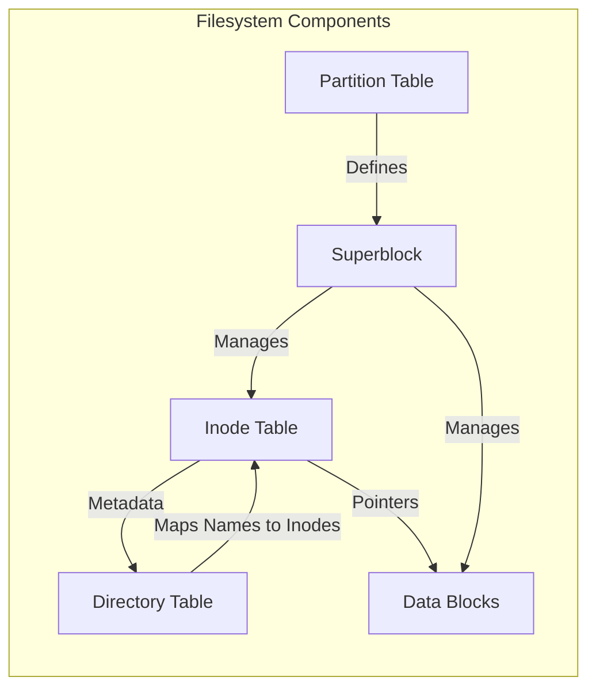
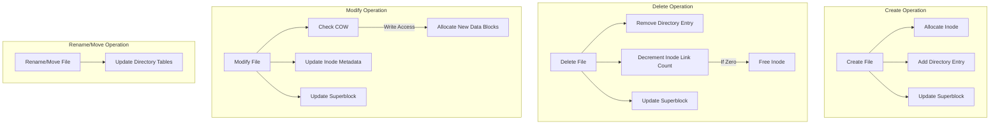

# Comprehensive Guide to Linux File Operations: Inodes, Directory Tables, Superblocks, and Partition Tables


## Table of Contents

- [Introduction](#introduction)
- [Filesystem Components](#filesystem-components)
  - [Inodes](#inodes)
  - [Directory Tables](#directory-tables)
  - [Superblocks](#superblocks)
  - [Partition Tables](#partition-tables)
- [File Operations and Their Impact](#file-operations-and-their-impact)
  - [Creating Files and Directories](#creating-files-and-directories)
  - [Deleting Files and Directories](#deleting-files-and-directories)
  - [Modifying Files](#modifying-files)
  - [Renaming and Moving Files](#renaming-and-moving-files)
  - [Reading and Writing Files](#reading-and-writing-files)
- [Filesystem-Specific Behaviors](#filesystem-specific-behaviors)
  - [Ext4](#ext4)
  - [XFS](#xfs)
  - [Btrfs](#btrfs)
  - [NTFS](#ntfs)
- [Practical Demonstrations](#practical-demonstrations)
  - [Demo 1: Exploring Inodes](#demo-1-exploring-inodes)
  - [Demo 2: Inspecting Superblocks](#demo-2-inspecting-superblocks)
  - [Demo 3: Analyzing Directory Tables](#demo-3-analyzing-directory-tables)
  - [Demo 4: Understanding Partition Tables](#demo-4-understanding-partition-tables)
- [Tables and Summaries](#tables-and-summaries)
  - [Impact of File Operations on Filesystem Components](#impact-of-file-operations-on-filesystem-components)
  - [Comparison Across Filesystems](#comparison-across-filesystems)
- [Mermaid Diagrams](#mermaid-diagrams)
  - [Filesystem Components Structure](#filesystem-components-structure)
  - [File Operation Impact Flow](#file-operation-impact-flow)
- [Conclusion](#conclusion)
- [References](#references)

---

## Introduction

Understanding Linux file operations at an advanced level requires a deep dive into the underlying filesystem structures. This guide explores critical components such as **inodes**, **directory tables**, **superblocks**, and **partition tables**, detailing how various file operations interact with these structures. By the end of this guide, you'll have a comprehensive understanding of how Linux manages files and directories, the impact of different operations, and how these mechanisms vary across different filesystems.

---

## Filesystem Components

### Inodes

**Inodes** (Index Nodes) are fundamental to Linux filesystems like **Ext4**, **XFS**, and **Btrfs**. An inode stores metadata about a file or directory, excluding its name or actual data.

**Key Attributes Stored in an Inode:**

- **File Type:** Regular file, directory, symbolic link, etc.
- **Permissions:** Read, write, execute permissions for user, group, others.
- **Ownership:** User ID (UID) and Group ID (GID) of the file owner.
- **Size:** Size of the file in bytes.
- **Timestamps:** Creation, modification, and access times.
- **Link Count:** Number of hard links pointing to the inode.
- **Pointers to Data Blocks:** Addresses of the actual data on disk.

**Illustrative Example:**

```bash
ls -i /path/to/file
```

**Output:**

```
1234567 /path/to/file
```

Here, `1234567` is the inode number of `/path/to/file`.

**Advanced Insight:**

Each inode is unique within a filesystem and is identified by its inode number. The filesystem maintains a table of inodes (inode table) that allows quick access to file metadata without traversing directories.

### Directory Tables

**Directory Tables** map filenames to their corresponding inode numbers. Unlike inodes, directories are special files that contain entries associating names with inodes.

**Structure of a Directory Entry:**

| Field        | Description                            |
| ------------ | -------------------------------------- |
| Filename     | Name of the file or subdirectory       |
| Inode Number | Unique identifier linking to the inode |

**Example:**

```bash
ls -il /path/to/directory
```

**Output:**

```
total 12
1234567 -rw-r--r-- 1 user group 1024 Apr 10 10:00 file1.txt
1234568 drwxr-xr-x 2 user group 4096 Apr 10 10:05 subdir
```

Here, `file1.txt` is linked to inode `1234567`, and `subdir` is linked to inode `1234568`.

**Advanced Insight:**

Directories use specialized data structures (like hash tables or B-trees in some filesystems) to optimize the lookup of filenames to inode numbers, enhancing performance for large directories.

### Superblocks

**Superblocks** contain critical information about the filesystem as a whole. They are essential for filesystem integrity and operation.

**Key Information Stored in a Superblock:**

- **Filesystem Type:** Ext4, XFS, Btrfs, etc.
- **Block Size:** Size of filesystem blocks in bytes.
- **Total Number of Inodes and Blocks:** Capacity of the filesystem.
- **Free Blocks and Inodes:** Current availability.
- **Mount Status:** Whether the filesystem is clean or has errors.
- **Filesystem UUID:** Unique identifier for the filesystem.

**Accessing Superblock Information:**

```bash
dumpe2fs /dev/sda1 | grep -i 'Superblock'
```

**Output:**

```
Superblock backups stored on blocks:
32768, 98304, 163840, 229376, ...
```

**Advanced Insight:**

Filesystems typically store multiple copies of the superblock at regular intervals to aid in recovery if the primary superblock becomes corrupted.

### Partition Tables

**Partition Tables** define the layout of partitions on a storage device. They are crucial for booting and organizing data.

**Common Types of Partition Tables:**

- **MBR (Master Boot Record):** Traditional partitioning scheme with limitations on partition size and number.
- **GPT (GUID Partition Table):** Modern partitioning scheme supporting larger disks and more partitions.

**Structure of a Partition Table Entry:**

| Field           | Description                                  |
| --------------- | -------------------------------------------- |
| Boot Indicator  | Indicates if the partition is bootable       |
| Starting CHS    | Cylinder-Head-Sector addressing (obsolete)   |
| Partition Type  | Type of filesystem or purpose                |
| Ending CHS      | Cylinder-Head-Sector addressing (obsolete)   |
| Starting LBA    | Logical Block Address where partition starts |
| Size in Sectors | Total size of the partition                  |

**Example: Viewing Partition Table:**

```bash
sudo fdisk -l /dev/sda
```

**Output:**

```
Device     Boot Start       End   Sectors Size Type
/dev/sda1  *     2048   1050623   1048576  512M EFI System
/dev/sda2      1050624 1953523711 1952473088 931G Linux filesystem
```

**Advanced Insight:**

Partition tables are critical during system boot. The BIOS or UEFI firmware reads the partition table to identify bootable partitions and load the operating system accordingly.

---

## File Operations and Their Impact

Understanding how various file operations affect filesystem components is crucial for system administration and optimization. Below, we delve into common file operations and their interactions with **inodes**, **directory tables**, **superblocks**, and **partition tables**.

### Creating Files and Directories

**Operation:** Creating a new file or directory.

**Impact on Filesystem Components:**

| Component        | Change Occurred? | Description                                                                             |
| ---------------- | ---------------- | --------------------------------------------------------------------------------------- |
| Inodes           | Yes              | A new inode is allocated to store metadata for the new file/directory.                  |
| Directory Tables | Yes              | A new entry mapping the filename to the newly allocated inode is added.                 |
| Superblocks      | Yes              | Free inode count decreases; free block count may decrease if data blocks are allocated. |
| Partition Tables | No               | Unchanged, as partitioning is independent of file creation within a filesystem.         |

**Example: Creating a File and Directory**

```bash
mkdir /path/to/new_directory
touch /path/to/new_directory/new_file.txt
```

**Explanation:**

1. **`mkdir`**:

   - Allocates a new inode for `new_directory`.
   - Adds an entry in the parent directory's table mapping `new_directory` to its inode.
   - Updates the superblock to reflect the allocation.

2. **`touch`**:
   - Allocates a new inode for `new_file.txt`.
   - Adds an entry in `new_directory`'s table mapping `new_file.txt` to its inode.
   - Updates the superblock accordingly.

### Deleting Files and Directories

**Operation:** Deleting a file or directory.

**Impact on Filesystem Components:**

| Component        | Change Occurred? | Description                                                                             |
| ---------------- | ---------------- | --------------------------------------------------------------------------------------- |
| Inodes           | Yes              | The inode's link count is decremented. If it reaches zero, the inode is marked as free. |
| Directory Tables | Yes              | The entry mapping the filename to its inode is removed.                                 |
| Superblocks      | Yes              | Free inode count increases; free block count may increase if data blocks are freed.     |
| Partition Tables | No               | Unchanged, as partitioning is independent of file deletion within a filesystem.         |

**Example: Deleting a File and Directory**

```bash
rm /path/to/new_directory/new_file.txt
rmdir /path/to/new_directory
```

**Explanation:**

1. **`rm`**:

   - Removes the directory entry for `new_file.txt`.
   - Decrements the inode's link count. If no other links exist, the inode and its data blocks are freed.
   - Updates the superblock to reflect the deallocation.

2. **`rmdir`**:
   - Removes the directory entry for `new_directory`.
   - Decrements the inode's link count. If no other links exist, the inode and its data blocks are freed.
   - Updates the superblock accordingly.

### Modifying Files

**Operation:** Modifying the contents of a file.

**Impact on Filesystem Components:**

| Component        | Change Occurred? | Description                                                                            |
| ---------------- | ---------------- | -------------------------------------------------------------------------------------- |
| Inodes           | Partially        | The file size may change, updating the inode's size attribute. Timestamps are updated. |
| Directory Tables | No               | No changes unless the filename or link count is affected.                              |
| Superblocks      | Partially        | Free block count may decrease or increase based on data allocation or deallocation.    |
| Partition Tables | No               | Unchanged, as partitioning is independent of file modification within a filesystem.    |

**Example: Modifying a File**

```bash
echo "Adding new content" >> /path/to/existing_file.txt
```

**Explanation:**

- **Data Blocks:**
  - If the file grows beyond its current allocated blocks, additional blocks are allocated.
  - The inode's size attribute is updated to reflect the new file size.
- **Superblock:**
  - Updates the free block count based on new allocations.
- **Timestamps:**
  - The inode's modification and access times are updated.

### Renaming and Moving Files

**Operation:** Renaming a file or moving it to a different directory.

**Impact on Filesystem Components:**

| Component        | Change Occurred? | Description                                                                                 |
| ---------------- | ---------------- | ------------------------------------------------------------------------------------------- |
| Inodes           | No               | The inode remains the same; only the directory entry changes.                               |
| Directory Tables | Yes              | The source directory's table entry is removed; the target directory's table entry is added. |
| Superblocks      | No               | No change, as inode and block allocations remain the same.                                  |
| Partition Tables | No               | Unchanged, as partitioning is independent of file operations within a filesystem.           |

**Example: Renaming and Moving a File**

```bash
mv /path/to/existing_file.txt /path/to/new_directory/renamed_file.txt
```

**Explanation:**

- **Directory Tables:**
  - The original directory removes the entry for `existing_file.txt`.
  - The target directory adds a new entry for `renamed_file.txt` pointing to the same inode.
- **Inodes and Superblocks:**
  - Inode and block allocations remain unchanged, so superblocks are unaffected.

### Reading and Writing Files

**Operation:** Reading from or writing to a file.

**Impact on Filesystem Components:**

| Component        | Change Occurred?                      | Description                                                                                         |
| ---------------- | ------------------------------------- | --------------------------------------------------------------------------------------------------- |
| Inodes           | No (for read) / Partially (for write) | **Read:** No changes. **Write:** May update size, timestamps, and allocate new blocks if necessary. |
| Directory Tables | No                                    | Unchanged during read/write operations.                                                             |
| Superblocks      | No (for read) / Partially (for write) | **Read:** No changes. **Write:** May affect free block counts if blocks are allocated or freed.     |
| Partition Tables | No                                    | Unchanged, as partitioning is independent of file read/write operations.                            |

**Example: Reading and Writing to a File**

```bash
# Reading
cat /path/to/existing_file.txt

# Writing
echo "New data" > /path/to/existing_file.txt
```

**Explanation:**

- **`cat`:** Reads the file without altering any filesystem structures.
- **`echo` with `>`:** Overwrites the file, potentially allocating new blocks and updating inode metadata.
- **`echo` with `>>`:** Appends to the file, potentially allocating additional blocks and updating inode size and timestamps.

---

## Filesystem-Specific Behaviors

Different filesystems implement these components and operations with varying degrees of complexity and features. Below, we explore how **Ext4**, **XFS**, **Btrfs**, and **NTFS** handle these structures and operations.

### Ext4

**Features:**

- **Inodes:** Fixed number set at filesystem creation; supports up to ~4 billion inodes.
- **Directory Tables:** Utilizes hashed B-trees for efficient lookups.
- **Superblocks:** Multiple backups; robust error detection.
- **Partition Tables:** Typically uses GPT for modern systems.

**Operation Handling:**

| Operation   | Inodes                | Directory Tables            | Superblocks                   | Partition Tables |
| ----------- | --------------------- | --------------------------- | ----------------------------- | ---------------- |
| Create      | Allocate new inode    | Add entry to directory      | Update free inode/block count | No               |
| Delete      | Decrement link count  | Remove entry from directory | Update free inode/block count | No               |
| Modify      | Update inode metadata | No                          | Update block allocations      | No               |
| Rename/Move | No                    | Update directory entries    | No                            | No               |

### XFS

**Features:**

- **Inodes:** Dynamic inode allocation; no fixed limit.
- **Directory Tables:** Uses B+ trees for high scalability.
- **Superblocks:** Resilient with multiple copies; supports online defragmentation.
- **Partition Tables:** Commonly uses GPT.

**Operation Handling:**

| Operation   | Inodes                                 | Directory Tables                 | Superblocks                   | Partition Tables |
| ----------- | -------------------------------------- | -------------------------------- | ----------------------------- | ---------------- |
| Create      | Dynamically allocate inode             | Insert into B+ tree directory    | Update free inode/block count | No               |
| Delete      | Deallocate inode if link count is zero | Remove from B+ tree directory    | Update free inode/block count | No               |
| Modify      | Update inode metadata                  | No                               | Manage block allocations      | No               |
| Rename/Move | No                                     | Update B+ tree directory entries | No                            | No               |

### Btrfs

**Features:**

- **Inodes:** Dynamic inode allocation; supports snapshots and subvolumes.
- **Directory Tables:** Uses B-trees for directories, supporting large directories efficiently.
- **Superblocks:** Highly resilient with checksum-protected metadata; supports multi-device configurations.
- **Partition Tables:** Uses GPT.

**Operation Handling:**

| Operation   | Inodes                                                 | Directory Tables                | Superblocks                             | Partition Tables |
| ----------- | ------------------------------------------------------ | ------------------------------- | --------------------------------------- | ---------------- |
| Create      | Allocate new inode                                     | Insert into B-tree directory    | Update free inode/block count           | No               |
| Delete      | Deallocate inode if link count is zero                 | Remove from B-tree directory    | Update free inode/block count           | No               |
| Modify      | Update inode metadata and possibly allocate new blocks | No                              | Manage block allocations with checksums | No               |
| Rename/Move | No                                                     | Update B-tree directory entries | No                                      | No               |

### NTFS

**Features:**

- **Inodes (Master File Table - MFT):** Each file/directory has an MFT entry; dynamic allocation.
- **Directory Tables:** Uses B-trees for directories.
- **Superblocks (Volume Boot Record):** Contains metadata about the filesystem.
- **Partition Tables:** Uses GPT or MBR.

**Operation Handling:**

| Operation   | Inodes (MFT)                     | Directory Tables                | Superblocks                 | Partition Tables |
| ----------- | -------------------------------- | ------------------------------- | --------------------------- | ---------------- |
| Create      | Allocate new MFT entry           | Insert into B-tree directory    | Update free MFT entry count | No               |
| Delete      | Deallocate MFT entry if no links | Remove from B-tree directory    | Update free MFT entry count | No               |
| Modify      | Update MFT entry metadata        | No                              | Manage block allocations    | No               |
| Rename/Move | No                               | Update B-tree directory entries | No                          | No               |

---

## Practical Demonstrations

To solidify your understanding, let's explore practical demonstrations that interact with inodes, superblocks, directory tables, and partition tables.

### Demo 1: Exploring Inodes

**Objective:** Understand how inodes represent files and directories.

**Steps:**

1. **List Files with Inode Numbers:**

   ```bash
   ls -i /path/to/directory
   ```

   **Output:**

   ```
   1234567 file1.txt
   1234568 file2.txt
   1234569 subdir
   ```

2. **Inspect Inode Details Using `stat`:**

   ```bash
   stat /path/to/directory/file1.txt
   ```

   **Output:**

   ```
     File: file1.txt
     Size: 1024              Blocks: 8          IO Block: 4096   regular file
   Device: 802h/2050d      Inode: 1234567     Links: 1
   Access: (0644/-rw-r--r--)  Uid: ( 1000/   user)   Gid: ( 1000/   group)
   Access: 2024-04-10 10:00:00.000000000 +0000
   Modify: 2024-04-10 10:00:00.000000000 +0000
   Change: 2024-04-10 10:00:00.000000000 +0000
   Birth: -
   ```

3. **Find All Hard Links to an Inode:**

   ```bash
   find / -inum 1234567
   ```

   **Output:**

   ```
   /path/to/directory/file1.txt
   /another/path/file1_hardlink.txt
   ```

**Explanation:**

- **`ls -i`:** Lists files along with their inode numbers.
- **`stat`:** Provides detailed information about a file's inode.
- **`find -inum`:** Searches for all hard links pointing to a specific inode.

**Advanced Insight:**

Hard links allow multiple filenames to reference the same inode, meaning they share the same data and metadata. Deleting one hard link doesn't remove the actual file until all links are removed.

### Demo 2: Inspecting Superblocks

**Objective:** Examine superblock information to understand filesystem metadata.

**Steps:**

1. **Display Superblock Information Using `dumpe2fs`:**

   ```bash
   sudo dumpe2fs /dev/sda1 | grep -i 'Superblock'
   ```

   **Output:**

   ```
   Superblock backups stored on blocks:
   32768, 98304, 163840, 229376, 294912, 819200, 884736, 1605632
   ```

2. **View Detailed Superblock Information:**

   ```bash
   sudo dumpe2fs /dev/sda1 | less
   ```

   **Sections to Explore:**

   - **Filesystem UUID**
   - **Block Size**
   - **Total Blocks and Free Blocks**
   - **Inode Information**
   - **Mount Count and Last Check**

**Explanation:**

- **`dumpe2fs`:** Dumps filesystem information, including superblock details.
- **Superblock Backups:** Multiple copies ensure recovery in case the primary superblock is corrupted.

**Advanced Insight:**

Understanding superblock details is essential for filesystem integrity checks and repairs. Tools like `fsck` rely on superblock information to diagnose and fix filesystem issues.

### Demo 3: Analyzing Directory Tables

**Objective:** Explore how directory tables map filenames to inodes.

**Steps:**

1. **Create a New Directory and Files:**

   ```bash
   mkdir /tmp/demo_dir
   touch /tmp/demo_dir/fileA.txt
   touch /tmp/demo_dir/fileB.txt
   ```

2. **List Directory Entries with Inode Numbers:**

   ```bash
   ls -i /tmp/demo_dir
   ```

   **Output:**

   ```
   100001 fileA.txt
   100002 fileB.txt
   ```

3. **Inspect Directory Inode Using `stat`:**

   ```bash
   stat /tmp/demo_dir
   ```

   **Output:**

   ```
     File: /tmp/demo_dir
     Size: 4096            Blocks: 8          IO Block: 4096   directory
   Device: 802h/2050d      Inode: 1000001    Links: 2
   Access: (0755/drwxr-xr-x)  Uid: ( 1000/   user)   Gid: ( 1000/   group)
   Access: 2024-04-10 10:00:00.000000000 +0000
   Modify: 2024-04-10 10:05:00.000000000 +0000
   Change: 2024-04-10 10:05:00.000000000 +0000
    Birth: -
   ```

4. **Use `debugfs` to Examine Directory Entries:**

   ```bash
   sudo debugfs -R 'ls /tmp/demo_dir' /dev/sda1
   ```

   **Output:**

   ```
   fileA.txt
   fileB.txt
   ```

**Explanation:**

- **Directory Inode (`1000001`):** Contains entries mapping `fileA.txt` and `fileB.txt` to their respective inodes (`100001` and `100002`).
- **`debugfs`:** A filesystem debugger that allows low-level examination of filesystem structures.

**Advanced Insight:**

Directories are implemented as special files containing a list of directory entries. Each entry maps a filename to an inode, enabling efficient file lookups.

### Demo 4: Understanding Partition Tables

**Objective:** Examine how partition tables define the layout of storage devices.

**Steps:**

1. **Display Partition Table Using `fdisk`:**

   ```bash
   sudo fdisk -l /dev/sda
   ```

   **Output:**

   ```
   Disk /dev/sda: 500 GB, 500107862016 bytes
   255 heads, 63 sectors/track, 60801 cylinders, total 976773168 sectors
   Units = sectors of 1 * 512 = 512 bytes
   Sector size (logical/physical): 512 bytes / 4096 bytes
   I/O size (minimum/optimal): 4096 bytes / 4096 bytes
   Disk identifier: 0x00000000

      Device Boot      Start         End      Blocks   Id  System
   /dev/sda1   *        2048     1050623     524288   ef  EFI (FAT-12/16/32)
   /dev/sda2         1050624  976773167  487361772+ 83  Linux
   ```

2. **Inspect GPT Partition Table Using `gdisk`:**

   ```bash
   sudo gdisk -l /dev/sda
   ```

   **Output:**

   ```
   Found valid GPT with protective MBR.
   Disk /dev/sda: 500107862016 sectors, 500 GB
   Logical sector size: 512 bytes
   Disk identifier (GUID): XXXXXXXX-XXXX-XXXX-XXXX-XXXXXXXXXXXX
   Partition table holds up to 128 entries
   First usable sector is 34, last usable sector is 976773134

      Number  Start (sector)    End (sector)  Size       Code  Name
         1            2048        1050623  524288 B    EF00  EFI System
         2         1050624       976773167 487361772 S    8300  Linux filesystem
   ```

**Explanation:**

- **MBR vs. GPT:**

  - **MBR (Master Boot Record):** Limited to 4 primary partitions; outdated for modern large disks.
  - **GPT (GUID Partition Table):** Supports up to 128 partitions and larger disk sizes; includes redundancy with multiple superblocks.

- **Partition Entries:**
  - **Boot Indicator (`*`):** Marks the partition as bootable (e.g., EFI System).
  - **Partition Type (`Id` or `Code`):** Defines the filesystem or usage type (e.g., `EF00` for EFI System, `83` or `8300` for Linux filesystem).

**Advanced Insight:**

Partition tables are critical for system boot processes and data organization. Modern systems predominantly use GPT due to its robustness and flexibility compared to MBR.

---

## Tables and Summaries

### Impact of File Operations on Filesystem Components

| File Operation                   | Inodes                                         | Directory Tables            | Superblocks                  | Partition Tables |
| -------------------------------- | ---------------------------------------------- | --------------------------- | ---------------------------- | ---------------- |
| **Create File/Directory**        | Allocate new inode                             | Add entry to directory      | Decrement free inodes/blocks | No               |
| **Delete File/Directory**        | Decrement link count; free inode if zero       | Remove entry from directory | Increment free inodes/blocks | No               |
| **Modify File**                  | Update inode metadata; allocate/free blocks    | No                          | Adjust free blocks if needed | No               |
| **Rename/Move File**             | No                                             | Update directory entries    | No                           | No               |
| **Read File**                    | No                                             | No                          | No                           | No               |
| **Write File**                   | Potentially allocate/free blocks; update inode | No                          | Adjust free blocks if needed | No               |
| **Change Permissions/Ownership** | Update inode metadata                          | No                          | No                           | No               |

### Comparison Across Filesystems

| Filesystem | Inode Allocation  | Directory Structure | Superblock Features                | Dynamic Features        |
| ---------- | ----------------- | ------------------- | ---------------------------------- | ----------------------- |
| **Ext4**   | Fixed at creation | Hashed B-trees      | Multiple backups; robust integrity | Journaling, extents     |
| **XFS**    | Dynamic           | B+ trees            | Resilient with online defrag       | Journaling, scalability |
| **Btrfs**  | Dynamic           | B-trees             | Checksum-protected metadata        | Snapshots, RAID support |
| **NTFS**   | Dynamic (MFT)     | B-trees             | Volume boot record; MFT backups    | Journaling, encryption  |

---

## Mermaid Diagrams

### Filesystem Components Structure



**Explanation:**

- **Inodes:** Store metadata and pointers to data blocks.
- **Directory Tables:** Map filenames to inodes.
- **Superblock:** Manages overall filesystem information and resources.
- **Data Blocks:** Contain the actual file data.
- **Partition Tables:** Define how storage is divided into partitions, each with its own filesystem.

### File Operation Impact Flow



**Explanation:**

- **Create Operation:** Involves allocating a new inode, adding a directory entry, and updating the superblock.
- **Delete Operation:** Involves removing the directory entry, decrementing the inode link count, potentially freeing the inode, and updating the superblock.
- **Modify Operation:** May trigger COW, allocate new data blocks if necessary, update inode metadata, and update the superblock.
- **Rename/Move Operation:** Involves updating directory tables without altering inodes or superblocks.

## Conclusion

Linux employs sophisticated mechanisms like **Inodes**, **Directory Tables**, **Superblocks**, and **Partition Tables** to manage files and directories efficiently. Understanding how various file operations interact with these components is essential for advanced system administration, optimization, and troubleshooting.

- **Inodes** serve as the backbone for file metadata management.
- **Directory Tables** facilitate quick filename-to-inode lookups.
- **Superblocks** maintain overarching filesystem integrity and resource management.
- **Partition Tables** delineate storage boundaries and organize multiple filesystems on a single device.

Moreover, operations such as **creating**, **deleting**, **modifying**, and **renaming** files have distinct impacts on these structures, influencing system performance and reliability. By mastering these concepts and their interrelations, you can ensure efficient and secure filesystem management in Linux environments.

---

## References

- [Advanced Programming in the UNIX Environment by W. Richard Stevens](https://www.amazon.com/Advanced-Programming-UNIX-Environment-3rd/dp/0321637739)
- [Linux `stat` Command Manual](https://man7.org/linux/man-pages/man1/stat.1.html)
- [Linux `dumpe2fs` Command Manual](https://man7.org/linux/man-pages/man8/dumpe2fs.8.html)
- [Linux `debugfs` Command Manual](https://man7.org/linux/man-pages/man8/debugfs.8.html)
- [Linux `fdisk` Command Manual](https://man7.org/linux/man-pages/man8/fdisk.8.html)
- [Linux `gdisk` Command Manual](https://www.rodsbooks.com/gdisk/)
- [Understanding Inodes in Linux](https://www.geeksforgeeks.org/inode-linux-explained/)
- [Filesystem Hierarchy Standard (FHS)](https://refspecs.linuxfoundation.org/FHS_3.0/fhs/index.html)
- [The Linux Documentation Project](https://www.tldp.org/)
- [GNU C Library Reference Manual](https://www.gnu.org/software/libc/manual/html_node/Fork.html)
- [Memory Management in Linux](https://www.kernel.org/doc/html/latest/admin-guide/mm/index.html)
- [Mermaid Official Documentation](https://mermaid-js.github.io/mermaid/#/)
