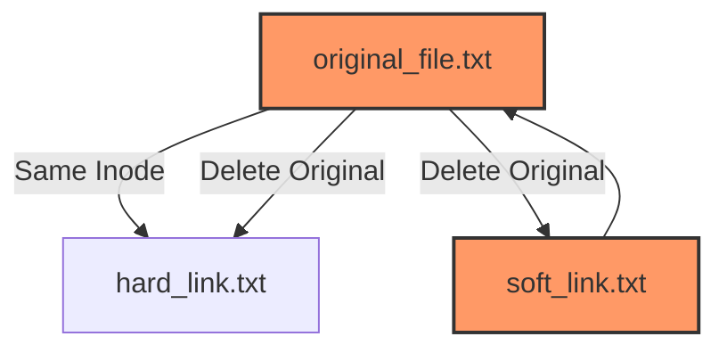

# Comprehensive Guide to Hard Links and Symbolic Links in Linux


## Table of Contents

- [Introduction](#introduction)
- [Understanding Links in Linux](#understanding-links-in-linux)
  - [What is a Link?](#what-is-a-link)
  - [Types of Links](#types-of-links)
    - [Hard Links](#hard-links)
    - [Symbolic (Soft) Links](#symbolic-soft-links)
- [In-Depth Comparison: Hard Links vs. Symbolic Links](#in-depth-comparison-hard-links-vs-symbolic-links)
  - [Key Differences](#key-differences)
  - [When to Use Which](#when-to-use-which)
- [Link Operations](#link-operations)
  - [Creating Hard Links](#creating-hard-links)
  - [Creating Symbolic Links](#creating-symbolic-links)
  - [Listing Links](#listing-links)
  - [Removing Links](#removing-links)
  - [Inspecting Links](#inspecting-links)
- [Scenarios and Use Cases](#scenarios-and-use-cases)
  - [Backup Systems](#backup-systems)
  - [Shared Libraries](#shared-libraries)
  - [Shortcuts and Aliases](#shortcuts-and-aliases)
- [Impact of Links on Filesystem](#impact-of-links-on-filesystem)
  - [Inode Reference Counts](#inode-reference-counts)
  - [File Deletion and Links](#file-deletion-and-links)
- [Practical Examples and Demonstrations](#practical-examples-and-demonstrations)
  - [Demo 1: Creating and Using Hard Links](#demo-1-creating-and-using-hard-links)
  - [Demo 2: Creating and Using Symbolic Links](#demo-2-creating-and-using-symbolic-links)
  - [Demo 3: Comparing Hard and Symbolic Links](#demo-3-comparing-hard-and-symbolic-links)
  - [Demo 4: Handling Broken Symbolic Links](#demo-4-handling-broken-symbolic-links)
- [Advanced Considerations](#advanced-considerations)
  - [Cross-Filesystem Linking](#cross-filesystem-linking)
  - [Permissions and Links](#permissions-and-links)
  - [Security Implications](#security-implications)
- [Mermaid Diagrams](#mermaid-diagrams)
  - [Hard Links Structure](#hard-links-structure)
  - [Symbolic Links Structure](#symbolic-links-structure)
  - [File Deletion with Links](#file-deletion-with-links)
- [Conclusion](#conclusion)
- [References](#references)

---

## Introduction

In Linux, **links** are a fundamental concept that allows multiple directory entries to reference the same underlying file data. Understanding the nuances between different types of links—**hard links** and **symbolic (soft) links**—is essential for effective filesystem management, backup strategies, and optimizing storage usage. This guide provides an in-depth exploration of links in Linux, covering their creation, differences, operations, and practical applications with detailed examples and demonstrations.

---

## Understanding Links in Linux

### What is a Link?

A **link** in Linux is a directory entry that associates a name with a file. Links allow the same file data to be accessible via different names and paths within the filesystem. There are two primary types of links:

1. **Hard Links**
2. **Symbolic (Soft) Links**

Each type serves different purposes and has unique characteristics.

### Types of Links

#### Hard Links

- **Definition:** A hard link is an additional directory entry for an existing file. Both the original filename and the hard link point to the same inode (the filesystem's internal representation of a file).

- **Characteristics:**
  - **Same Inode Number:** Both names share the same inode.
  - **Equal Status:** There is no "original" or "primary" file; all hard links are equal.
  - **Cannot Span Filesystems:** Hard links must reside on the same filesystem as the target file.
  - **Cannot Link to Directories:** To prevent circular references and maintain filesystem integrity.

#### Symbolic (Soft) Links

- **Definition:** A symbolic link is a special type of file that contains a pathname reference to another file or directory.

- **Characteristics:**
  - **Different Inode Number:** The symbolic link has its own inode separate from the target file.
  - **Point to Pathnames:** The link points to the path of the target, not directly to the inode.
  - **Can Span Filesystems:** Symbolic links can reference files across different filesystems.
  - **Can Link to Directories:** Useful for creating shortcuts to directories.

---

## In-Depth Comparison: Hard Links vs. Symbolic Links

### Key Differences

| Feature                   | Hard Links                                  | Symbolic (Soft) Links                           |
| ------------------------- | ------------------------------------------- | ----------------------------------------------- |
| **Inode Number**          | Same inode as the target file               | Different inode; stores a pathname              |
| **Filesystem Boundaries** | Must reside on the same filesystem          | Can link across different filesystems           |
| **Link to Directories**   | Not allowed to prevent filesystem loops     | Allowed; useful for shortcuts to directories    |
| **Original vs. Link**     | No concept of original; all names are equal | Distinction between original and link           |
| **Broken Links**          | Not possible as all links point to inodes   | Can become broken if target is moved or deleted |
| **Space Usage**           | No additional space beyond directory entry  | Requires space to store the pathname            |
| **Performance**           | Faster as it points directly to inode       | Slight overhead due to pathname resolution      |

### When to Use Which

- **Hard Links:**

  - When you need multiple references to the same file data within the same filesystem.
  - Useful for backup systems to save space by avoiding data duplication.
  - Ideal for scenarios where the link should remain valid even if the original filename is deleted.

- **Symbolic Links:**
  - When linking across different filesystems or partitions.
  - Useful for creating shortcuts to directories.
  - Preferred when the link should reflect changes in the target's location or name.
  - Suitable for referencing dynamic files or when the target may not always exist.

---

## Link Operations

### Creating Hard Links

- **Command:** `ln`
- **Syntax:** `ln [TARGET] [LINK_NAME]`
- **Example:**

  ```bash
  ln original_file.txt hard_link.txt
  ```

  **Explanation:** Creates a hard link named `hard_link.txt` pointing to `original_file.txt`.

### Creating Symbolic Links

- **Command:** `ln -s`
- **Syntax:** `ln -s [TARGET] [LINK_NAME]`
- **Example:**

  ```bash
  ln -s /path/to/original_file.txt soft_link.txt
  ```

  **Explanation:** Creates a symbolic link named `soft_link.txt` pointing to `/path/to/original_file.txt`.

### Listing Links

- **List with Inode Numbers:** `ls -i`

  ```bash
  ls -i original_file.txt hard_link.txt
  ```

  **Output:**

  ```
  14087 original_file.txt
  14087 hard_link.txt
  ```

  **Explanation:** Both files share the same inode number, indicating they are hard links to the same file data.

- **List with Symbolic Links:** `ls -l`

  ```bash
  ls -l soft_link.txt
  ```

  **Output:**

  ```
  lrwxrwxrwx 1 user group 24 Dec 26 19:10 soft_link.txt -> /path/to/original_file.txt
  ```

  **Explanation:** Indicates that `soft_link.txt` is a symbolic link pointing to `/path/to/original_file.txt`.

### Removing Links

- **Remove Hard Links:** `rm`

  ```bash
  rm hard_link.txt
  ```

  **Explanation:** Deletes the hard link `hard_link.txt`. The file data remains accessible via `original_file.txt` as long as at least one hard link exists.

- **Remove Symbolic Links:** `rm`

  ```bash
  rm soft_link.txt
  ```

  **Explanation:** Deletes the symbolic link `soft_link.txt`. If the target exists, it remains unaffected. If the target is deleted, the symbolic link becomes broken.

### Inspecting Links

- **Determine Link Type:** `ls -l`

  ```bash
  ls -l
  ```

  **Output:**

  ```
  -rw-r--r-- 2 user group 18 Dec 26 19:10 original_file.txt
  lrwxrwxrwx 1 user group 24 Dec 26 19:15 soft_link.txt -> /path/to/original_file.txt
  ```

  **Explanation:**

  - The `-` at the beginning indicates a regular file with `2` hard links.
  - The `l` indicates a symbolic link.

- **View Symbolic Link Target:** `readlink`

  ```bash
  readlink soft_link.txt
  ```

  **Output:**

  ```
  /path/to/original_file.txt
  ```

  **Explanation:** Shows the pathname that the symbolic link points to.

---

## Scenarios and Use Cases

### Backup Systems

- **Hard Links:** Tools like `rsnapshot` utilize hard links to create incremental backups efficiently. Since hard links point to the same inode, unchanged files across snapshots don't consume additional space.

### Shared Libraries

- **Hard Links:** Some system libraries use hard links to maintain multiple versions of a library while ensuring backward compatibility.

### Shortcuts and Aliases

- **Symbolic Links:** Commonly used to create shortcuts in the filesystem. For example, linking configuration files in a home directory to those in a central location.

### Version Control Systems

- **Symbolic Links:** Can be used to reference scripts or shared resources across different projects within a repository.

---

## Impact of Links on Filesystem

### Inode Reference Counts

- **Hard Links:**

  - Each hard link increases the inode's **link count**.
  - The link count indicates how many directory entries reference the inode.
  - When the link count drops to zero, the filesystem frees the inode and its associated data blocks.

- **Symbolic Links:**
  - Have their own inodes separate from the target file.
  - The link count of the target inode is **not** affected by symbolic links.

### File Deletion and Links

- **Hard Links:**

  - Deleting one hard link decreases the link count.
  - The file data remains until all hard links are removed.

- **Symbolic Links:**
  - Deleting the symbolic link removes only the link.
  - If the target file is deleted, the symbolic link becomes **broken** (dangling).

---

## Practical Examples and Demonstrations

### Demo 1: Creating and Using Hard Links

**Objective:** Understand how hard links reference the same inode as the original file.

**Steps:**

1. **Create an Original File:**

   ```bash
   echo "Hello, World!" > original_file.txt
   ```

2. **Create a Hard Link:**

   ```bash
   ln original_file.txt hard_link.txt
   ```

3. **Verify Inode Numbers:**

   ```bash
   ls -i original_file.txt hard_link.txt
   ```

   **Output:**

   ```
   14087 original_file.txt
   14087 hard_link.txt
   ```

4. **Modify the Hard Link:**

   ```bash
   echo "Appending via hard link." >> hard_link.txt
   ```

5. **Check Both Files:**

   ```bash
   cat original_file.txt
   cat hard_link.txt
   ```

   **Output for Both:**

   ```
   Hello, World!
   Appending via hard link.
   ```

**Explanation:**

- Both `original_file.txt` and `hard_link.txt` share the same inode (`14087`).
- Modifying one affects the other since they reference the same data blocks.

### Demo 2: Creating and Using Symbolic Links

**Objective:** Learn how symbolic links reference the pathname of the target file.

**Steps:**

1. **Create an Original File:**

   ```bash
   echo "Hello, Symbolic Link!" > original_symlink.txt
   ```

2. **Create a Symbolic Link:**

   ```bash
   ln -s original_symlink.txt soft_link.txt
   ```

3. **Verify Link Type:**

   ```bash
   ls -l soft_link.txt
   ```

   **Output:**

   ```
   lrwxrwxrwx 1 user group 21 Dec 26 19:20 soft_link.txt -> original_symlink.txt
   ```

4. **Modify the Symbolic Link:**

   ```bash
   echo "Appending via symbolic link." >> soft_link.txt
   ```

5. **Check Both Files:**

   ```bash
   cat original_symlink.txt
   cat soft_link.txt
   ```

   **Output for Both:**

   ```
   Hello, Symbolic Link!
   Appending via symbolic link.
   ```

6. **Delete the Original File:**

   ```bash
   rm original_symlink.txt
   ```

7. **Check the Symbolic Link:**

   ```bash
   cat soft_link.txt
   ```

   **Output:**

   ```
   cat: soft_link.txt: No such file or directory
   ```

**Explanation:**

- `soft_link.txt` points to `original_symlink.txt`.
- After deleting the original, the symbolic link becomes broken (dangling).

### Demo 3: Comparing Hard and Symbolic Links

**Objective:** Observe the behavioral differences between hard and symbolic links.

**Steps:**

1. **Create an Original File:**

   ```bash
   echo "Original Content" > file.txt
   ```

2. **Create Hard and Symbolic Links:**

   ```bash
   ln file.txt hard_link_file.txt
   ln -s file.txt soft_link_file.txt
   ```

3. **Verify Inode Numbers:**

   ```bash
   ls -i file.txt hard_link_file.txt soft_link_file.txt
   ```

   **Output:**

   ```
   14088 file.txt
   14088 hard_link_file.txt
   14100 soft_link_file.txt
   ```

4. **Modify the Original File via Hard Link:**

   ```bash
   echo "Modified via hard link." >> hard_link_file.txt
   ```

5. **Check All Files:**

   ```bash
   cat file.txt
   cat hard_link_file.txt
   cat soft_link_file.txt
   ```

   **Output:**

   ```
   Original Content
   Modified via hard link.
   Original Content
   Modified via hard link.
   ```

6. **Modify the Original File via Symbolic Link:**

   ```bash
   echo "Modified via symbolic link." >> soft_link_file.txt
   ```

7. **Check All Files:**

   ```bash
   cat file.txt
   cat hard_link_file.txt
   cat soft_link_file.txt
   ```

   **Output:**

   ```
   Original Content
   Modified via hard link.
   Modified via symbolic link.
   ```

**Explanation:**

- **Hard Links:** Both `file.txt` and `hard_link_file.txt` share the same inode. Modifying via one affects the other.
- **Symbolic Links:** `soft_link_file.txt` points to `file.txt`. Modifying via the symbolic link changes the target file.

### Demo 4: Handling Broken Symbolic Links

**Objective:** Learn how to identify and handle broken symbolic links.

**Steps:**

1. **Create a Symbolic Link to a Non-Existent File:**

   ```bash
   ln -s nonexistent_file.txt broken_soft_link.txt
   ```

2. **Verify the Broken Link:**

   ```bash
   ls -l broken_soft_link.txt
   ```

   **Output:**

   ```
   lrwxrwxrwx 1 user group 20 Dec 26 19:30 broken_soft_link.txt -> nonexistent_file.txt
   ```

3. **Attempt to Access the Broken Link:**

   ```bash
   cat broken_soft_link.txt
   ```

   **Output:**

   ```
   cat: broken_soft_link.txt: No such file or directory
   ```

4. **Find All Broken Symbolic Links in a Directory:**

   ```bash
   find /path/to/directory -xtype l
   ```

   **Explanation:**

   - `-xtype l`: Finds symbolic links that are broken.

**Explanation:**

- Symbolic links can become broken if the target file is moved or deleted.
- Broken links can lead to errors in scripts and applications expecting valid references.

---

## Advanced Considerations

### Cross-Filesystem Linking

- **Hard Links:** Cannot span multiple filesystems. Attempting to create a hard link across filesystems results in an error.

  ```bash
  ln /mnt/sda1/file.txt /mnt/sdb1/hard_link_file.txt
  ```

  **Error:**

  ```
  ln: failed to create hard link '/mnt/sdb1/hard_link_file.txt' => '/mnt/sda1/file.txt': Invalid cross-device link
  ```

- **Symbolic Links:** Can reference files across different filesystems seamlessly.

  ```bash
  ln -s /mnt/sda1/file.txt /mnt/sdb1/soft_link_file.txt
  ```

### Permissions and Links

- **Hard Links:**

  - File permissions are tied to the inode. All hard links share the same permissions.
  - Changing permissions via one hard link affects all others.

  ```bash
  chmod 600 original_file.txt
  ls -l hard_link.txt
  ```

  **Output:**

  ```
  -rw------- 2 user group 34 Dec 26 19:40 hard_link.txt
  ```

- **Symbolic Links:**
  - Permissions of the symbolic link itself are generally ignored; access is controlled by the target file's permissions.
  - However, some systems may display default permissions for symlinks.

### Security Implications

- **Symbolic Links:**

  - **Symlink Attacks:** Malicious users can create symbolic links pointing to sensitive system files, potentially exploiting software that follows links without proper validation.
  - **Mitigation:** Use absolute paths, validate input, and employ security measures like `chroot` environments.

- **Hard Links:**
  - **Limited Exploitation:** Since hard links cannot span filesystems and cannot link to directories, they present fewer security risks compared to symbolic links.
  - **Privilege Management:** Superuser privileges are required to create hard links to files owned by other users.

---

## Diagrams

### Hard Links Structure


**Explanation:**

- Both `original_file.txt` and `hard_link.txt` point to the same inode, meaning they reference the same file data.

### Symbolic Links Structure


**Explanation:**

- `soft_link.txt` points to the pathname of `original_file.txt`, acting as a shortcut or reference.

### File Deletion with Links



**Explanation:**

- Deleting `original_file.txt`:
  - **HardLink:** Remains valid since it shares the same inode.
  - **SoftLink:** Becomes broken as it points to a deleted pathname.

---

## Conclusion

Understanding **hard links** and **symbolic links** is pivotal for effective Linux filesystem management. Both types of links offer unique advantages and serve distinct purposes:

- **Hard Links:** Ideal for creating multiple references to the same file data within the same filesystem, conserving storage space and ensuring data integrity even if one link is deleted.

- **Symbolic Links:** Perfect for creating shortcuts across different filesystems, linking to directories, and referencing files that may move or change over time.

By mastering link operations, you can optimize your workflows, enhance system organization, and implement robust backup strategies. Always consider the implications of each link type on permissions, security, and filesystem boundaries to maintain a secure and efficient environment.

---

## References

- [GNU Coreutils Manual - ln](https://www.gnu.org/software/coreutils/manual/html_node/ln-invocation.html)
- [Linux Filesystem Hierarchy](https://refspecs.linuxfoundation.org/FHS_3.0/fhs/index.html)
- [Advanced Programming in the UNIX Environment by W. Richard Stevens](https://www.amazon.com/Advanced-Programming-UNIX-Environment-3rd/dp/0321637739)
- [Understanding Linux Filesystems](https://www.geeksforgeeks.org/understanding-linux-filesystems/)
- [Filesystem Links](https://linuxjourney.com/lesson/links)
- [Linux `stat` Command Manual](https://man7.org/linux/man-pages/man1/stat.1.html)
- [Linux `find` Command Manual](https://man7.org/linux/man-pages/man1/find.1.html)
- [Linux `ls` Command Manual](https://man7.org/linux/man-pages/man1/ls.1.html)
- [Security Considerations for Symbolic Links](https://access.redhat.com/documentation/en-us/red_hat_enterprise_linux/7/html/security_guide/sec_security_restrictions_on_symbolic_links)
