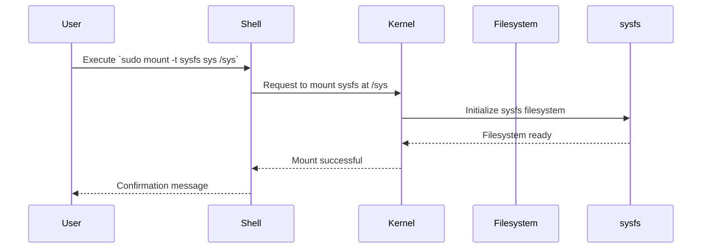
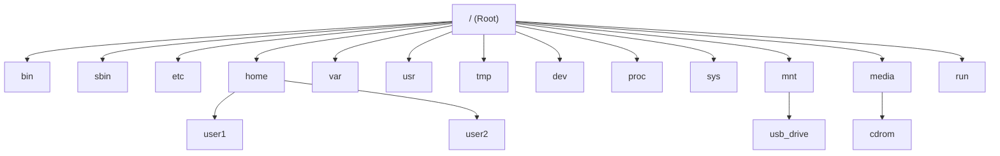

# Comprehensive Guide to Mounting Filesystems in Linux


## Table of Contents

- [Introduction](#introduction)
- [Understanding Mounting in Linux](#understanding-mounting-in-linux)
  - [What is Mounting?](#what-is-mounting)
  - [Mount Points](#mount-points)
  - [Types of Filesystems](#types-of-filesystems)
- [The `mount` Command](#the-mount-command)
  - [Basic Syntax](#basic-syntax)
  - [Common `mount` Options](#common-mount-options)
  - [Mounting Different Filesystems](#mounting-different-filesystems)
- [Virtual Filesystems in Linux](#virtual-filesystems-in-linux)
  - [What are Virtual Filesystems?](#what-are-virtual-filesystems)
  - [Common Virtual Filesystems](#common-virtual-filesystems)
    - [/proc (`procfs`)](#proc-procfs)
    - [/sys (`sysfs`)](#sys-sysfs)
    - [/dev (`devtmpfs`)](#dev-devtmpfs)
    - [/run and /tmp (`tmpfs`)](#run-and-tmpfs-tmpfs)
  - [Mounting Virtual Filesystems](#mounting-virtual-filesystems)
    - [Mounting `/proc`](#mounting-proc)
    - [Mounting `/sys`](#mounting-sys)
    - [Mounting `/dev`](#mounting-dev)
    - [Mounting `/run` and `/tmp`](#mounting-run-and-tmpfs)
- [Special Mounting Scenarios](#special-mounting-scenarios)
  - [Bind Mounts](#bind-mounts)
  - [Loop Devices](#loop-devices)
  - [Network Filesystems](#network-filesystems)
- [Persistent Mounts with `/etc/fstab`](#persistent-mounts-with-etcfstab)
  - [Understanding `/etc/fstab`](#understanding-etcfstab)
  - [Creating `/etc/fstab` Entries](#creating-etcfstab-entries)
  - [Mounting All Filesystems](#mounting-all-filesystems)
- [Unmounting Filesystems](#unmounting-filesystems)
  - [Using `umount`](#using-umount)
  - [Handling Busy Mount Points](#handling-busy-mount-points)
- [Advanced Mount Options](#advanced-mount-options)
  - [Security Options](#security-options)
  - [Performance Options](#performance-options)
  - [Filesystem-Specific Options](#filesystem-specific-options)
- [Troubleshooting Mount Issues](#troubleshooting-mount-issues)
  - [Common Errors and Solutions](#common-errors-and-solutions)
  - [Using Diagnostic Tools](#using-diagnostic-tools)
- [Mermaid Diagrams](#mermaid-diagrams)
  - [Mount Process Diagram](#mount-process-diagram)
  - [Filesystem Hierarchy with Mount Points](#filesystem-hierarchy-with-mount-points)
- [Practical Examples and Demos](#practical-examples-and-demos)
  - [Demo 1: Mounting a USB Drive](#demo-1-mounting-a-usb-drive)
  - [Demo 2: Mounting an ISO Image](#demo-2-mounting-an-iso-image)
  - [Demo 3: Creating a Bind Mount](#demo-3-creating-a-bind-mount)
  - [Demo 4: Mounting a tmpfs Filesystem](#demo-4-mounting-a-tmpfs-filesystem)
  - [Demo 5: Mounting `/proc` and Understanding Its Behavior](#demo-5-mounting-proc-and-understanding-its-behavior)
  - [Demo 6: Mounting `/sys` with Detailed Explanation](#demo-6-mounting-sys-with-detailed-explanation)
- [Conclusion](#conclusion)
- [References](#references)

## Introduction

Mounting is a fundamental concept in Unix-like operating systems, including Linux, that allows the integration of different filesystems into a single hierarchical directory structure. By mounting, you make a filesystem accessible at a specific point in the directory tree, known as a **mount point**. Understanding how to effectively use the `mount` command, along with its various options and scenarios, is crucial for system administration, storage management, and ensuring system security and performance.

This guide provides an in-depth exploration of mounting in Linux, covering everything from basic commands to advanced options and special mounting scenarios. It includes practical demonstrations, troubleshooting tips, and visual diagrams to enhance your understanding.

## Understanding Mounting in Linux

### What is Mounting?

**Mounting** is the process of making a filesystem accessible at a specific location within the existing directory tree. It involves attaching a storage device or a virtual filesystem to a **mount point**, which is typically an empty directory. Once mounted, the contents of the filesystem become accessible to users and applications through the mount point.

**Example:**

```bash
sudo mount /dev/sdb1 /mnt/usb
```

In this example, the filesystem on `/dev/sdb1` (a USB drive) is mounted to the directory `/mnt/usb`. After mounting, you can access the USB drive's contents via `/mnt/usb`.

### Mount Points

A **mount point** is a directory in the existing filesystem where the new filesystem is attached. The directory must exist and typically should be empty to avoid conflicts between the existing directory contents and the mounted filesystem.

**Common Mount Points:**

- `/mnt`: A generic mount point for temporary mounts.
- `/media`: Standard mount point for removable media like USB drives, CDs, and DVDs.
- `/proc`, `/sys`, `/dev`: Special mount points for virtual filesystems providing system and hardware information.

### Types of Filesystems

Linux supports a variety of filesystem types, each designed for specific use cases. Understanding these types is essential for choosing the right filesystem for your needs.

**Common Filesystem Types:**

- **Ext4**: The default and most widely used filesystem in Linux, known for reliability and performance.
- **XFS**: High-performance 64-bit journaling filesystem, suitable for large files and parallel I/O.
- **Btrfs**: Advanced filesystem with features like snapshots, RAID, and self-healing.
- **NTFS**: Filesystem developed by Microsoft, commonly used for Windows partitions.
- **vfat (FAT32)**: Simple filesystem used for USB drives and other removable media.
- **tmpfs**: Temporary filesystem stored in volatile memory (RAM).
- **procfs (`/proc`)**: Virtual filesystem providing process and system information.
- **sysfs (`/sys`)**: Virtual filesystem exposing information about devices and drivers.
- **devtmpfs (`/dev`)**: Virtual filesystem managing device nodes.

## The `mount` Command

The `mount` command is used to attach a filesystem to the directory tree at a specified mount point. It offers a wide range of options to control how the filesystem is mounted.

### Basic Syntax

```bash
mount [OPTIONS] DEVICE MOUNT_POINT
```

- **DEVICE**: The storage device or virtual filesystem to mount (e.g., `/dev/sdb1`, `tmpfs`).
- **MOUNT_POINT**: The directory where the filesystem will be mounted (e.g., `/mnt/usb`).

**Example:**

```bash
sudo mount /dev/sdb1 /mnt/usb
```

### Common `mount` Options

- **-t, --types**: Specify the filesystem type.

  ```bash
  sudo mount -t ext4 /dev/sdb1 /mnt/usb
  ```

- **-o, --options**: Specify mount options.

  ```bash
  sudo mount -o ro /dev/sdb1 /mnt/usb  # Mount as read-only
  ```

- **-a, --all**: Mount all filesystems mentioned in `/etc/fstab`.

  ```bash
  sudo mount -a
  ```

- **-r, --read-only**: Mount the filesystem as read-only.

  ```bash
  sudo mount -r /dev/sdb1 /mnt/usb
  ```

- **-w, --rw**: Mount the filesystem as read-write.

  ```bash
  sudo mount -w /dev/sdb1 /mnt/usb
  ```

- **--bind**: Bind mount a directory to another location.

  ```bash
  sudo mount --bind /source/directory /target/directory
  ```

### Mounting Different Filesystems

Mounting varies depending on the type of filesystem you are working with. Below are examples for various filesystem types.

- **Mounting a USB Drive (Ext4):**

  ```bash
  sudo mount -t ext4 /dev/sdb1 /mnt/usb
  ```

- **Mounting a USB Drive (vfat):**

  ```bash
  sudo mount -t vfat /dev/sdb1 /mnt/usb
  ```

- **Mounting an ISO Image:**

  ```bash
  sudo mount -o loop image.iso /mnt/iso
  ```

- **Mounting a tmpfs Filesystem:**

  ```bash
  sudo mount -t tmpfs -o size=100M tmpfs /mnt/tmpfs
  ```

## Virtual Filesystems in Linux

Virtual filesystems are integral to the Linux operating system, providing dynamic interfaces to kernel data structures and system information. Unlike traditional disk-based filesystems, virtual filesystems reside in memory and offer real-time data to user-space applications.

### What are Virtual Filesystems?

A **virtual filesystem (VFS)** is an abstraction layer within the Linux kernel that provides a uniform interface for different filesystem implementations. It allows the kernel and user-space applications to interact with various filesystems in a consistent manner, irrespective of their underlying structures or storage mediums.

**Key Characteristics:**

- **In-Memory:** Unlike traditional filesystems stored on disk, virtual filesystems reside in memory.
- **Dynamic:** They dynamically represent kernel data structures and system information.
- **Interface:** Serve as interfaces for communication between user-space applications and kernel-space data.

### Common Virtual Filesystems

Linux utilizes several virtual filesystems, each serving distinct purposes. Below are the most prevalent ones:

#### /proc (`procfs`)

- **Purpose:** Provides a mechanism to access kernel data structures.
- **Usage:** Represents process and system information in a hierarchical file-like structure.
- **Key Features:**
  - Access to process-specific information (e.g., `/proc/[pid]/`).
  - System-wide information (e.g., `/proc/cpuinfo`, `/proc/meminfo`).

#### /sys (`sysfs`)

- **Purpose:** Exposes kernel objects, their attributes, and relationships.
- **Usage:** Facilitates interaction with device drivers and kernel subsystems.
- **Key Features:**
  - Represents devices, drivers, and other kernel components.
  - Enables dynamic configuration of devices.

#### /dev (`devtmpfs`)

- **Purpose:** Manages device nodes.
- **Usage:** Provides a dynamic directory for device files, automatically populated by the kernel.
- **Key Features:**
  - Device nodes for hardware devices.
  - Managed by `udev` for dynamic device management.

#### /run and /tmp (`tmpfs`)

- **Purpose:** Offers temporary storage in volatile memory.
- **Usage:** Stores temporary files that do not need to persist across reboots.
- **Key Features:**
  - Fast read/write operations.
  - Automatically cleared on reboot.

### Mounting Virtual Filesystems

Mounting virtual filesystems involves attaching them to their designated mount points, enabling interaction with their dynamic content.

#### Mounting `/proc`

The `/proc` filesystem provides a pseudo-filesystem that contains runtime system information (e.g., system memory, devices mounted, hardware configuration).

**Mount Command:**

```bash
sudo mount -t proc proc /proc
```

**Breakdown:**

- `sudo`: Executes the command with superuser privileges.
- `mount`: The command to mount filesystems.
- `-t proc`: Specifies the filesystem type as `procfs`.
- `proc`: The device to mount. In virtual filesystems, this is a pseudo-device name.
- `/proc`: The mount point where the filesystem will be attached.

**Important Note:** Typically, `/proc` is mounted automatically at boot. Mounting `/proc` over an existing `/proc` can lead to unexpected behavior and is generally not recommended.

#### Mounting `/sys`

The `/sys` filesystem exposes information about devices and drivers from the kernel.

**Mount Command:**

```bash
sudo mount -t sysfs sys /sys
```

**Breakdown:**

- `sudo`: Executes the command with superuser privileges.
- `mount`: The command to mount filesystems.
- `-t sysfs`: Specifies the filesystem type as `sysfs`.
- `sys`: The device to mount, representing the `sysfs` virtual filesystem.
- `/sys`: The mount point where the filesystem will be attached.

**Detailed Explanation:**

- **`sysfs`**: A virtual filesystem that provides a tree of devices, drivers, and other kernel objects.
- **Mounting Process:**
  1. **Command Execution:** When you run `sudo mount -t sysfs sys /sys`, you're instructing the system to mount the `sysfs` virtual filesystem to the `/sys` directory.
  2. **Kernel Interaction:** The kernel processes the mount request, initializes the `sysfs` filesystem, and attaches it to the specified mount point.
  3. **Result:** After mounting, `/sys` contains a hierarchical representation of devices and drivers, allowing users and applications to query and interact with kernel objects.

**Weird Behavior When Mounting `/sys` Over `/sys`:**

Mounting `/sys` over itself (i.e., remounting `/sys` without unmounting first) can lead to confusing and unintended behavior because:

- **Overlaying:** The existing `/sys` directory is already a `sysfs` mount. Remounting it without unmounting can create an overlay, potentially masking underlying files or causing conflicts.
- **Redundancy:** Since `/sys` is already mounted, attempting to mount it again is unnecessary and can lead to errors or inconsistencies.
- **System Stability:** Improperly handling virtual filesystem mounts can disrupt system operations, especially for critical directories like `/sys`.

**Recommendation:** Avoid remounting virtual filesystems like `/sys` unless you have a specific and advanced need, and understand the implications thoroughly.

#### Mounting `/dev`

The `/dev` directory contains device nodes that represent hardware devices.

**Mount Command:**

```bash
sudo mount -t devtmpfs dev /dev
```

**Breakdown:**

- `sudo`: Executes the command with superuser privileges.
- `mount`: The command to mount filesystems.
- `-t devtmpfs`: Specifies the filesystem type as `devtmpfs`.
- `dev`: The device to mount, representing the `devtmpfs` virtual filesystem.
- `/dev`: The mount point where the filesystem will be attached.

**Detailed Explanation:**

- **`devtmpfs`**: A virtual filesystem that manages device nodes dynamically.
- **Mounting Process:**
  1. **Command Execution:** Running `sudo mount -t devtmpfs dev /dev` mounts the `devtmpfs` filesystem to the `/dev` directory.
  2. **Kernel Interaction:** The kernel initializes the `devtmpfs` filesystem, populating `/dev` with device nodes corresponding to hardware devices.
  3. **Result:** `/dev` now contains device nodes like `/dev/sda`, `/dev/ttyS0`, etc., enabling user-space applications to interact with hardware devices.

**Weird Behavior When Mounting `/dev` Over `/dev`:**

Similar to `/proc` and `/sys`, remounting `/dev` over itself can lead to:

- **Overlaying:** Existing device nodes might be obscured or duplicated, causing confusion.
- **Conflict:** Device management utilities like `udev` expect `/dev` to be managed in a specific way. Interfering with this can disrupt device detection and management.
- **System Stability:** `/dev` is critical for hardware interaction. Improper mounts can render devices inaccessible or cause system components to malfunction.

**Recommendation:** Let the system handle mounting of `/dev` automatically. Manual mounting is generally unnecessary and risky.

#### Mounting `/run` and `/tmp`

**Purpose:** Both `/run` and `/tmp` are mounted using `tmpfs`, a temporary filesystem stored in volatile memory (RAM).

**Mount Command:**

```bash
sudo mount -t tmpfs -o size=50M tmpfs /run
sudo mount -t tmpfs -o size=100M tmpfs /tmp
```

**Breakdown:**

- `sudo`: Executes the command with superuser privileges.
- `mount`: The command to mount filesystems.
- `-t tmpfs`: Specifies the filesystem type as `tmpfs`.
- `-o size=50M`: Sets the maximum size of the mounted filesystem (e.g., 50MB for `/run`).
- `tmpfs`: The device name, representing the `tmpfs` filesystem.
- `/run` or `/tmp`: The mount point where the filesystem will be attached.

**Detailed Explanation:**

- **`tmpfs`**: A temporary filesystem that uses RAM for storage, providing fast read/write operations.
- **Mounting Process:**
  1. **Command Execution:** Running `sudo mount -t tmpfs -o size=50M tmpfs /run` mounts a `tmpfs` filesystem to `/run` with a size limit of 50MB.
  2. **Kernel Interaction:** The kernel allocates the specified amount of RAM for the filesystem and attaches it to the mount point.
  3. **Result:** `/run` and `/tmp` can store temporary files that are fast to access and do not persist across reboots.

**Weird Behavior When Mounting `tmpfs` Over Existing Mount Points:**

- **Overlaying Data:** Mounting `tmpfs` over an existing mount point (e.g., `/run` or `/tmp`) will hide any existing files or directories beneath it until unmounted.
- **System Services:** Critical system services rely on `/run` and `/tmp` being correctly mounted. Improper mounting can disrupt these services.
- **Data Volatility:** Data stored in `tmpfs` is lost on reboot, so ensure that only non-persistent data is stored here.

**Recommendation:** Allow the system to handle mounting of `/run` and `/tmp` automatically unless there is a specific need to customize their mount options.

## Special Mounting Scenarios

Mounting in Linux isn't limited to physical storage devices. Special scenarios involve virtual filesystems, bind mounts, loop devices, and network filesystems.

### Bind Mounts

**Definition:** Bind mounts allow you to mount a directory to another location in the filesystem. This can be useful for making the same directory accessible from multiple points.

**Creating a Bind Mount:**

```bash
sudo mount --bind /source/directory /target/directory
```

**Example:**

```bash
sudo mount --bind /var/www/html /mnt/html_backup
```

**Unmounting a Bind Mount:**

```bash
sudo umount /target/directory
```

**Use Cases:**

- **Access Control:** Provide access to a directory in a different location without duplicating data.
- **Chroot Environments:** Set up isolated environments by bind mounting necessary directories.
- **Backup Solutions:** Create backup points by bind mounting directories.

### Loop Devices

**Definition:** Loop devices allow you to mount disk image files as if they were physical disks. This is useful for accessing files within ISO images, disk images, or other container files.

**Mounting an ISO Image:**

```bash
sudo mount -o loop image.iso /mnt/iso
```

**Unmounting a Loop Mount:**

```bash
sudo umount /mnt/iso
```

**Use Cases:**

- **Accessing CD/DVD Images:** Mount ISO images without burning them to physical media.
- **Testing Filesystems:** Create and test filesystem images in a contained environment.
- **Virtual Machine Disks:** Mount virtual machine disk images for inspection or modification.

### Network Filesystems

**Definition:** Network filesystems enable mounting filesystems over a network, allowing access to remote directories as if they were local.

**Common Network Filesystems:**

- **NFS (Network File System):**

  ```bash
  sudo mount -t nfs server:/export/share /mnt/nfs_share
  ```

- **SMB/CIFS (used for Windows Shares):**

  ```bash
  sudo mount -t cifs //server/share /mnt/cifs_share -o username=user,password=pass
  ```

**Use Cases:**

- **Centralized Storage:** Share files across multiple machines in a network.
- **Collaborative Environments:** Enable multiple users to access and modify shared resources.
- **Backup Solutions:** Centralize backups on a network-attached storage device.

## Persistent Mounts with `/etc/fstab`

To ensure filesystems are mounted automatically at boot, entries are added to the `/etc/fstab` file.

### Understanding `/etc/fstab`

The `/etc/fstab` file contains information about filesystems and how they should be mounted. Each line in the file represents a filesystem with specific mount options.

**`fstab` Entry Format:**

```
<device>    <mount_point>    <filesystem_type>    <options>    <dump>    <pass>
```

**Example:**

```
/dev/sdb1    /mnt/usb    ext4    defaults    0    2
```

### Creating `/etc/fstab` Entries

**Steps:**

1. **Identify the Device UUID:**

   Using UUIDs is preferred over device names as they are persistent across reboots.

   ```bash
   sudo blkid /dev/sdb1
   ```

   **Output:**

   ```
   /dev/sdb1: UUID="1234-5678" TYPE="ext4" PARTUUID="abcd-efgh"
   ```

2. **Edit `/etc/fstab`:**

   ```bash
   sudo nano /etc/fstab
   ```

3. **Add the Mount Entry:**

   ```
   UUID=1234-5678    /mnt/usb    ext4    defaults    0    2
   ```

4. **Apply Changes:**

   Mount all filesystems mentioned in `/etc/fstab`:

   ```bash
   sudo mount -a
   ```

### Mounting All Filesystems

After editing `/etc/fstab`, use the following command to mount all filesystems that are not currently mounted:

```bash
sudo mount -a
```

**Note:** Ensure that `/etc/fstab` entries are correct to prevent boot issues.

## Unmounting Filesystems

Unmounting is the process of detaching a filesystem from the directory tree. Proper unmounting ensures data integrity and system stability.

### Using `umount`

**Basic Syntax:**

```bash
sudo umount MOUNT_POINT
```

**Examples:**

- **Unmounting a USB Drive:**

  ```bash
  sudo umount /mnt/usb
  ```

- **Unmounting an ISO Image:**

  ```bash
  sudo umount /mnt/iso
  ```

**Unmounting by Device Name:**

```bash
sudo umount /dev/sdb1
```

### Handling Busy Mount Points

Sometimes, you may encounter errors when attempting to unmount a filesystem because it is busy (i.e., being used by a process).

**Common Errors:**

```
umount: /mnt/usb: target is busy
```

**Solutions:**

1. **Identify Open Files or Processes:**

   - **Using `lsof`:**

     ```bash
     sudo lsof +f -- /mnt/usb
     ```

   - **Using `fuser`:**

     ```bash
     sudo fuser -vm /mnt/usb
     ```

2. **Terminate Processes Using the Mount Point:**

   After identifying the processes, you can terminate them gracefully or forcefully.

   ```bash
   sudo kill -9 <PID>
   ```

3. **Force Unmount (Use with Caution):**

   ```bash
   sudo umount -l /mnt/usb  # Lazy unmount
   sudo umount -f /mnt/usb  # Force unmount (primarily for network filesystems)
   ```

**Note:** Forcing unmounts can lead to data loss or corruption. Use them only when necessary and understand the risks involved.

## Advanced Mount Options

The `mount` command offers numerous options to fine-tune how filesystems are mounted. These options can enhance security, performance, and compatibility.

### Security Options

- **noexec**: Prevents execution of binaries on the mounted filesystem.

  ```bash
  sudo mount -o noexec /dev/sdb1 /mnt/usb
  ```

- **nosuid**: Blocks the operation of `set-user-identifier` or `set-group-identifier` bits.

  ```bash
  sudo mount -o nosuid /dev/sdb1 /mnt/usb
  ```

- **nodev**: Disallows character or block special devices on the filesystem.

  ```bash
  sudo mount -o nodev /dev/sdb1 /mnt/usb
  ```

### Performance Options

- **rw** / **ro**: Mount the filesystem as read-write or read-only.

  ```bash
  sudo mount -o ro /dev/sdb1 /mnt/usb
  ```

- **async** / **sync**: Control write operations.

  ```bash
  sudo mount -o async /dev/sdb1 /mnt/usb
  ```

- **noatime**: Do not update inode access times on read.

  ```bash
  sudo mount -o noatime /dev/sdb1 /mnt/usb
  ```

### Filesystem-Specific Options

Different filesystems support unique mount options tailored to their functionalities.

- **Ext4 Example:**

  ```bash
  sudo mount -t ext4 -o defaults,data=ordered /dev/sdb1 /mnt/usb
  ```

- **NTFS Example:**

  ```bash
  sudo mount -t ntfs-3g -o uid=1000,gid=1000,umask=022 /dev/sdb1 /mnt/usb
  ```

- **tmpfs Example:**

  ```bash
  sudo mount -t tmpfs -o size=100M tmpfs /mnt/tmpfs
  ```

## Troubleshooting Mount Issues

Mounting filesystems can sometimes result in errors or unexpected behavior. This section provides guidance on diagnosing and resolving common issues.

### Common Errors and Solutions

1. **"Permission denied":**

   - **Cause:** Insufficient permissions to mount the filesystem.
   - **Solution:** Use `sudo` to execute the mount command.

     ```bash
     sudo mount /dev/sdb1 /mnt/usb
     ```

2. **"unknown filesystem type":**

   - **Cause:** The specified filesystem type is not recognized.
   - **Solution:** Ensure the correct filesystem type is used and necessary drivers are installed.

     ```bash
     sudo mount -t ext4 /dev/sdb1 /mnt/usb
     ```

3. **"device or resource busy":**

   - **Cause:** The mount point is in use by a process.
   - **Solution:** Identify and terminate the processes using the mount point or use lazy unmount.

     ```bash
     sudo lsof +f -- /mnt/usb
     sudo umount -l /mnt/usb
     ```

4. **"invalid argument":**

   - **Cause:** Incorrect mount options or syntax.
   - **Solution:** Review the mount command syntax and options.

     ```bash
     sudo mount -o defaults /dev/sdb1 /mnt/usb
     ```

### Using Diagnostic Tools

- **`dmesg`**: Check kernel messages for detailed error information.

  ```bash
  dmesg | tail
  ```

- **`journalctl`**: Access system logs for mount-related messages.

  ```bash
  sudo journalctl -xe | grep mount
  ```

## Mermaid Diagrams

Visual diagrams can enhance the understanding of mounting processes and filesystem hierarchies.

### Mount Process Diagram



### Filesystem Hierarchy with Mount Points



## Practical Examples and Demos

Hands-on demonstrations can solidify your understanding of mounting in Linux. Below are detailed examples covering various scenarios.

### Demo 1: Mounting a USB Drive

**Objective:** Mount a USB drive to access its contents.

**Steps:**

1. **Identify the USB Drive:**

   Insert the USB drive and identify its device name using `lsblk` or `fdisk`.

   ```bash
   lsblk
   ```

   **Output:**

   ```
   NAME   MAJ:MIN RM   SIZE RO TYPE MOUNTPOINT
   sda      8:0    0  100G  0 disk
   ├─sda1   8:1    0   50G  0 part /
   ├─sda2   8:2    0   25G  0 part /home
   └─sda3   8:3    0   25G  0 part /var
   sdb      8:16   1   16G  0 disk
   └─sdb1   8:17   1   16G  0 part
   ```

   Assume the USB drive is `/dev/sdb1`.

2. **Create a Mount Point:**

   ```bash
   sudo mkdir -p /mnt/usb
   ```

3. **Mount the USB Drive:**

   ```bash
   sudo mount -t ext4 /dev/sdb1 /mnt/usb
   ```

   **Note:** Replace `ext4` with the appropriate filesystem type if different.

4. **Verify the Mount:**

   ```bash
   df -h | grep /mnt/usb
   ```

   **Output:**

   ```
   /dev/sdb1        15G  1.5G   13G  10% /mnt/usb
   ```

5. **Access the USB Drive:**

   ```bash
   ls /mnt/usb
   ```

6. **Unmount the USB Drive:**

   ```bash
   sudo umount /mnt/usb
   ```

### Demo 2: Mounting an ISO Image

**Objective:** Mount an ISO image to access its contents without burning it to a physical disc.

**Steps:**

1. **Create a Mount Point:**

   ```bash
   sudo mkdir -p /mnt/iso
   ```

2. **Mount the ISO Image:**

   ```bash
   sudo mount -o loop image.iso /mnt/iso
   ```

3. **Verify the Mount:**

   ```bash
   df -h | grep /mnt/iso
   ```

   **Output:**

   ```
   image.iso        700M  700M     0 100% /mnt/iso
   ```

4. **Access the ISO Contents:**

   ```bash
   ls /mnt/iso
   ```

5. **Unmount the ISO Image:**

   ```bash
   sudo umount /mnt/iso
   ```

### Demo 3: Creating a Bind Mount

**Objective:** Create a bind mount to access the same directory from multiple locations.

**Steps:**

1. **Identify the Source Directory:**

   ```bash
   ls /var/www/html
   ```

2. **Create a Target Mount Point:**

   ```bash
   sudo mkdir -p /mnt/html_backup
   ```

3. **Create the Bind Mount:**

   ```bash
   sudo mount --bind /var/www/html /mnt/html_backup
   ```

4. **Verify the Bind Mount:**

   ```bash
   ls /mnt/html_backup
   ```

   **Output:**

   ```
   index.html  about.html  contact.html
   ```

5. **Unmount the Bind Mount:**

   ```bash
   sudo umount /mnt/html_backup
   ```

### Demo 4: Mounting a tmpfs Filesystem

**Objective:** Mount a temporary filesystem in RAM for fast read/write operations.

**Steps:**

1. **Create a Mount Point:**

   ```bash
   sudo mkdir -p /mnt/tmpfs_demo
   ```

2. **Mount the tmpfs Filesystem:**

   ```bash
   sudo mount -t tmpfs -o size=50M tmpfs /mnt/tmpfs_demo
   ```

3. **Verify the Mount:**

   ```bash
   df -h | grep tmpfs
   ```

   **Output:**

   ```
   tmpfs           50M     0M   50M   0% /mnt/tmpfs_demo
   ```

4. **Use the tmpfs Filesystem:**

   ```bash
   echo "Temporary Data" | sudo tee /mnt/tmpfs_demo/temp.txt
   cat /mnt/tmpfs_demo/temp.txt
   ```

   **Output:**

   ```
   Temporary Data
   ```

5. **Unmount the tmpfs Filesystem:**

   ```bash
   sudo umount /mnt/tmpfs_demo
   ```

### Demo 5: Mounting `/proc` and Understanding Its Behavior

**Objective:** Mount the `/proc` virtual filesystem and observe its dynamic nature.

**Important Note:** Mounting `/proc` over itself is unusual and generally not recommended, as it can lead to system instability. This demonstration is purely educational to understand the behavior.

**Steps:**

1. **Unmount `/proc` (Caution: This can disrupt system operations):**

   ```bash
   sudo umount /proc
   ```

   **Warning:** Unmounting `/proc` can cause many system commands to fail. Proceed with caution and preferably in a controlled environment like a virtual machine.

2. **Mount `/proc` Again:**

   ```bash
   sudo mount -t proc proc /proc
   ```

3. **Verify the Mount:**

   ```bash
   ls /proc
   ```

   **Output:**

   ```
   1    1000  cgroups  execdomains  meminfo  stat  version_signature
   ...
   ```

4. **Access Process Information:**

   ```bash
   cat /proc/1/status
   ```

   **Output:**

   ```
   Name:   systemd
   Umask:  0022
   State:  S (sleeping)
   Tgid:   1
   Ngid:   0
   Pid:    1
   PPid:   0
   ...
   ```

5. **Understanding the Behavior:**

   - **Dynamic Content:** The `/proc` filesystem dynamically represents kernel and process information. Its content changes in real-time as system state changes.
   - **No Persistent Data:** Files within `/proc` do not consume disk space; they are generated on-the-fly by the kernel.

**Conclusion of Demo:**

Mounting `/proc` allows users and applications to access vital system and process information in a structured and standardized manner. However, improper mounting or unmounting of `/proc` can severely impact system functionality.

### Demo 6: Mounting `/sys` with Detailed Explanation

**Objective:** Mount the `/sys` virtual filesystem and understand each component's role.

**Mount Command:**

```bash
sudo mount -t sysfs sys /sys
```

**Breakdown:**

- `sudo`: Executes the command with superuser privileges.
- `mount`: The command to mount filesystems.
- `-t sysfs`: Specifies the filesystem type as `sysfs`.
- `sys`: The device to mount, representing the `sysfs` virtual filesystem.
- `/sys`: The mount point where the filesystem will be attached.

**Step-by-Step Explanation:**

1. **Executing the Command:**

   ```bash
   sudo mount -t sysfs sys /sys
   ```

   This command mounts the `sysfs` virtual filesystem to the `/sys` directory.

2. **Understanding `sysfs`:**

   - **Purpose:** `sysfs` exposes information about devices, drivers, and other kernel objects.
   - **Location:** Mounted at `/sys`.
   - **Functionality:** Allows user-space applications and administrators to query and modify kernel parameters, device configurations, and driver information.

3. **Components of `/sys`:**

   - **Classes:** Represent different types of devices and kernel subsystems (e.g., `/sys/class/net` for network interfaces).
   - **Devices:** Represent individual hardware devices (e.g., `/sys/devices/pci0000:00/0000:00:1f.2/`).
   - **Subsystems:** Represent kernel subsystems like networking, storage, etc.

4. **Accessing and Modifying Attributes:**

   - **View Network Interface Speed:**

     ```bash
     cat /sys/class/net/eth0/speed
     ```

     **Output:**

     ```
     1000
     ```

   - **Change Device Settings (Example: Enable CPU Core 1):**

     ```bash
     echo 1 | sudo tee /sys/devices/system/cpu/cpu1/online
     ```

5. **Understanding the Behavior When Mounting `/sys` Over `/sys`:**

   **Scenario:** Attempting to remount `/sys` over itself.

   ```bash
   sudo mount -t sysfs sys /sys
   ```

   **Potential Issues:**

   - **Overlaying:** The existing `sysfs` mount is being mounted again, which can create an overlay that may obscure underlying files or cause conflicts.
   - **Redundancy:** Since `/sys` is already mounted, remounting it is unnecessary and can lead to errors or inconsistencies.
   - **System Stability:** Critical system components rely on `/sys` being correctly mounted. Improper handling can disrupt these components, leading to system instability or malfunction.

   **Recommendation:** Avoid remounting virtual filesystems like `/sys` unless you have a specific and advanced need, and fully understand the implications.

6. **Verifying the Mount:**

   After mounting, you can verify the `sysfs` mount using:

   ```bash
   mount | grep sysfs
   ```

   **Output:**

   ```
   sysfs on /sys type sysfs (rw,nosuid,nodev,noexec,relatime)
   ```

**Conclusion of Demo:**

Mounting `/sys` enables access to a wealth of information about the system's hardware and kernel subsystems. Proper management of `/sys` is crucial for system configuration and monitoring. Avoid remounting `/sys` over itself to maintain system stability and ensure that kernel interactions function as intended.

## Conclusion

Mounting is a cornerstone of Linux system management, enabling the integration and access of diverse filesystems within a unified directory structure. Mastery of the `mount` command, along with an understanding of various mounting scenarios and options, empowers users and administrators to optimize system performance, ensure data integrity, and maintain robust security practices.

This comprehensive guide has covered:

- **Fundamental Concepts:** Understanding what mounting is and the role of mount points.
- **Practical Usage:** Detailed explanations of the `mount` command, common options, and real-world examples.
- **Virtual Filesystems:** Insights into mounting virtual filesystems like `/proc`, `/sys`, `/dev`, and `/tmp`.
- **Special Scenarios:** Utilizing bind mounts, loop devices, and network filesystems.
- **Persistent Mounts:** Configuring automatic mounts using `/etc/fstab`.
- **Advanced Techniques:** Exploring security and performance mount options.
- **Troubleshooting:** Strategies to diagnose and resolve common mounting issues.
- **Visual Aids:** Mermaid diagrams to visualize mounting processes and filesystem hierarchies.
- **Hands-On Demonstrations:** Practical demos to reinforce learning and provide actionable knowledge.

By leveraging the information and examples provided, you can enhance your ability to manage and troubleshoot filesystems effectively, ensuring a stable and efficient Linux environment.

## References

- [Filesystem Hierarchy Standard (FHS)](https://refspecs.linuxfoundation.org/FHS_3.0/fhs/index.html)
- [Linux `mount` Command Manual](https://man7.org/linux/man-pages/man8/mount.8.html)
- [Linux `umount` Command Manual](https://man7.org/linux/man-pages/man8/umount.8.html)
- [Understanding `/proc` Filesystem](https://www.tldp.org/LDP/Linux-Filesystem-Hierarchy/html/proc.html)
- [Understanding `/sys` Filesystem](https://www.tldp.org/LDP/Linux-Filesystem-Hierarchy/html/sysfs.html)
- [Filesystem in Userspace (FUSE)](https://github.com/libfuse/libfuse)
- [Advanced Linux File System Management](https://www.digitalocean.com/community/tutorials/understanding-the-linux-filesystem-hierarchy)
- [Linux Device Management](https://www.tldp.org/LDP/intro-linux/html/sect_04_03.html)
- [Mermaid Official Documentation](https://mermaid-js.github.io/mermaid/#/)
- [Linux Kernel Documentation: Virtual Filesystem](https://www.kernel.org/doc/html/latest/filesystems/virtual.html)
- [The Linux Documentation Project](https://www.tldp.org/)
