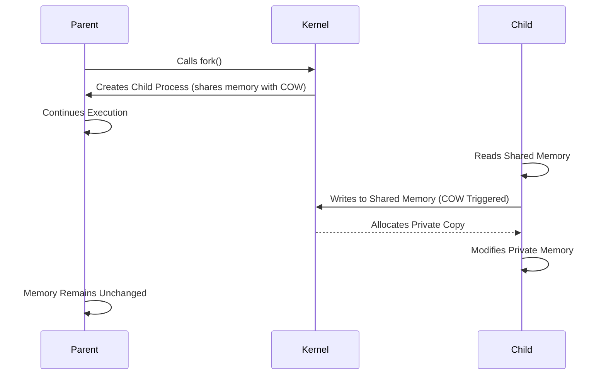
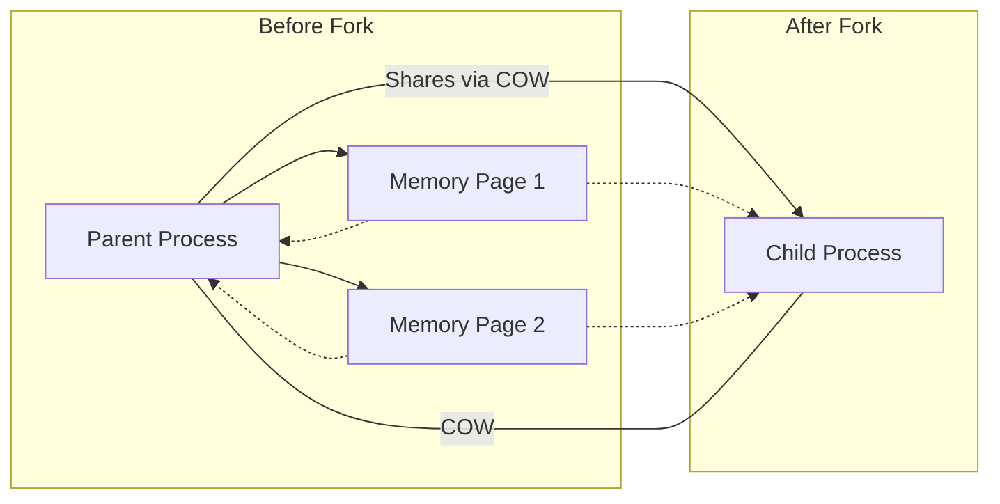
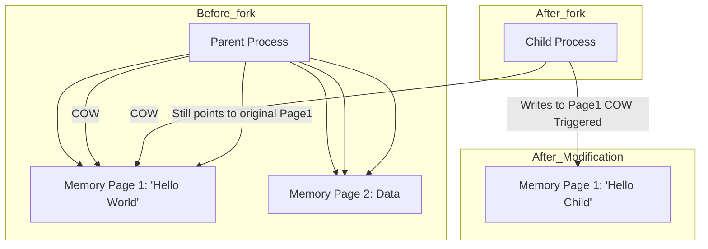

# Comprehensive Guide to Copy-On-Write (COW) in Linux: Fork and Exec


## Table of Contents

- [Introduction](#introduction)
- [What is Copy-On-Write (COW)?](#what-is-copy-on-write-cow)
- [COW in the Context of `fork()` and `exec()`](#cow-in-the-context-of-fork-and-exec)
  - [`fork()` System Call](#fork-system-call)
  - [`exec()` Family of Functions](#exec-family-of-functions)
- [Understanding Memory Pages](#understanding-memory-pages)
  - [What is a Memory Page?](#what-is-a-memory-page)
  - [Content of Memory Pages](#content-of-memory-pages)
  - [Visualizing Memory Pages with Mermaid](#visualizing-memory-pages-with-mermaid)
- [How COW Works with `fork()`](#how-cow-works-with-fork)
  - [Step-by-Step Process](#step-by-step-process)
  - [Illustrative Example](#illustrative-example)
- [Benefits of Using COW](#benefits-of-using-cow)
- [Practical Demonstrations](#practical-demonstrations)
  - [Demo 1: Basic `fork()` with COW](#demo-1-basic-fork-with-cow)
  - [Demo 2: `fork()` Followed by `exec()`](#demo-2-fork-followed-by-exec)
  - [Demo 3: Observing COW in Action](#demo-3-observing-cow-in-action)
- [Experiences and Best Practices](#experiences-and-best-practices)
- [Mermaid Diagrams](#mermaid-diagrams)
  - [COW Process Flow](#cow-process-flow)
  - [Memory Sharing Before and After `fork()`](#memory-sharing-before-and-after-fork)
- [Conclusion](#conclusion)
- [References](#references)

## Introduction

In Linux and Unix-like operating systems, efficient memory management is crucial for performance and resource utilization. One of the key techniques employed is **Copy-On-Write (COW)**, especially in the context of process creation and execution using the `fork()` and `exec()` system calls. This guide delves deep into the concept of COW, explaining its mechanisms, benefits, and practical applications with detailed examples and demonstrations.

## What is Copy-On-Write (COW)?

**Copy-On-Write (COW)** is an optimization strategy used in computer programming to efficiently handle resource copying. Instead of immediately duplicating a resource (like memory), the system allows multiple entities to share the same resource. The actual duplication occurs only when one of the entities modifies the shared resource. This approach minimizes unnecessary copying, saving both memory and processing time.

**Key Characteristics of COW:**

- **Lazy Copying:** Resources are only duplicated when modifications are necessary.
- **Memory Efficiency:** Reduces memory usage by sharing unchanged data between processes.
- **Performance Improvement:** Minimizes the overhead of copying large data structures.

## COW in the Context of `fork()` and `exec()`

In Unix-like operating systems, the `fork()` system call is used to create a new process by duplicating an existing one. This operation leverages COW to optimize memory usage. The `exec()` family of functions replaces the current process image with a new one, often used after `fork()` to run a different program.

### `fork()` System Call

- **Purpose:** Creates a new process by duplicating the calling process.
- **Result:** Two processes continue execution from the point of `fork()`: the parent and the child.
- **Without COW:** `fork()` would require an immediate full copy of the parent's memory space, leading to high memory and CPU usage.
- **With COW:** The parent and child processes share the same memory pages until one of them modifies a page, triggering the actual copy.

### `exec()` Family of Functions

- **Purpose:** Replaces the current process image with a new program.
- **Common Functions:** `execl()`, `execp()`, `execv()`, etc.
- **Usage Pattern:** Typically used after `fork()` to run a different program in the child process.
- **Behavior with COW:** When `exec()` is called, the process's memory is replaced, and any shared memory pages not modified are discarded, maintaining memory efficiency.

## Understanding Memory Pages

To grasp how COW operates, it's essential to understand the concept of **memory pages** in an operating system.

### What is a Memory Page?

A **memory page** is a fixed-length contiguous block of virtual memory. Operating systems divide memory into these pages to manage and allocate memory efficiently. Common page sizes are 4KB, 8KB, or larger, depending on the system architecture.

**Key Points:**

- **Virtual Memory:** Memory pages are part of the virtual memory system, allowing the OS to use disk space to extend physical memory.
- **Page Table:** The OS maintains a page table to map virtual memory pages to physical memory frames.
- **Isolation:** Each process has its own virtual address space, ensuring that processes do not interfere with each other's memory.

### Content of Memory Pages

Memory pages can contain various types of data depending on the process's state and activities:

- **Code Pages:** Contain executable instructions of programs.
- **Data Pages:** Hold global variables, heap-allocated memory, and other runtime data.
- **Stack Pages:** Manage function call stacks, including local variables and return addresses.
- **Shared Pages:** Used for shared memory segments between processes.
- **Virtual Pages:** Represent parts of virtual filesystems like `/proc` and `/sys`.

### Visualizing Memory Pages with Mermaid

Understanding how memory pages are shared and duplicated can be visualized using diagrams. Below is a Mermaid diagram illustrating memory pages before and after a `fork()` call with COW.

```mermaid
graph LR
    A[Parent Process]
    B[Code Page]
    C[Data Page]
    D[Stack Page]
    E[Heap Page]
    F[Shared Page]

    A --> B
    A --> C
    A --> D
    A --> E
    A --> F

    subgraph After fork()
        P[Parent Process] --> B
        P --> C
        P --> D
        P --> E
        P --> F

        C -- COW --> C_child[Data Page (Child)]
    end
```

**Explanation:**

- **Before `fork()`:** The parent process has several memory pages: code, data, stack, heap, and shared pages.
- **After `fork()`:** Both parent and child processes share the code, stack, heap, and shared pages marked as COW.
- **Data Page Modification:** When the child modifies the data page, COW triggers, creating a private copy for the child (`Data Page (Child)`), while the parent retains the original data page.

## How COW Works with `fork()`

### Step-by-Step Process

1. **Process Duplication with `fork()`:**

   - When a process calls `fork()`, the operating system creates a new process (child) that is a duplicate of the calling process (parent).
   - Instead of copying all memory pages, both processes share the same physical memory pages marked as read-only.

2. **Marking Pages as Copy-On-Write:**

   - The shared memory pages are set with the COW flag.
   - Both processes can read these pages but cannot write to them directly.

3. **Modification Trigger:**

   - If either process attempts to write to a shared page, the COW mechanism intercepts the write.
   - The operating system creates a private copy of the page for the writing process.
   - The writing process then modifies its private copy, while the other process continues to share the original page.

4. **Memory Isolation:**
   - After a write operation, the two processes have separate memory pages, ensuring that changes in one do not affect the other.

### Illustrative Example

Consider a parent process with a memory page containing the string "Hello World".

- **Before `fork()`:**

  - Parent process has a page: `"Hello World"`.

- **After `fork()`:**

  - Parent and child processes share the same memory page marked as COW.

- **Child Process Modifies the Page:**
  - Child writes `"Hello Child"`.
  - COW triggers, creating a private copy for the child.
  - Parent still has `"Hello World"`.
  - Child has `"Hello Child"`.

## Benefits of Using COW

- **Memory Efficiency:** Reduces the total memory footprint by sharing identical data between parent and child processes.
- **Performance Optimization:** Minimizes the overhead associated with duplicating large memory spaces.
- **Scalability:** Facilitates the creation of numerous processes without a proportional increase in memory usage.
- **Flexibility:** Allows processes to diverge only when necessary, maintaining shared data for as long as possible.

## Practical Demonstrations

Below are practical examples and demonstrations to illustrate how COW works in Linux using `fork()` and `exec()`.

### Demo 1: Basic `fork()` with COW

**Objective:** Understand how `fork()` utilizes COW to duplicate a process without immediate memory copying.

**Code Example (`fork_cow_demo.c`):**

```c
#include <stdio.h>
#include <stdlib.h>
#include <unistd.h>
#include <sys/wait.h>
#include <string.h>

int main() {
    char *message = malloc(100 * sizeof(char));
    strcpy(message, "Hello from the parent process!");

    printf("Before fork:\n");
    printf("Parent message: %s\n", message);

    pid_t pid = fork();

    if (pid < 0) {
        perror("fork failed");
        exit(1);
    }
    else if (pid == 0) {
        // Child process
        printf("\nChild process created.\n");
        printf("Child message before change: %s\n", message);
        strcpy(message, "Hello from the child process!");
        printf("Child message after change: %s\n", message);
        exit(0);
    }
    else {
        // Parent process
        wait(NULL);
        printf("\nParent process after child exits:\n");
        printf("Parent message: %s\n", message);
    }

    free(message);
    return 0;
}
```

**Compilation and Execution:**

```bash
gcc -o fork_cow_demo fork_cow_demo.c
./fork_cow_demo
```

**Expected Output:**

```
Before fork:
Parent message: Hello from the parent process!

Child process created.
Child message before change: Hello from the parent process!
Child message after change: Hello from the child process!

Parent process after child exits:
Parent message: Hello from the parent process!
```

**Explanation:**

- **Before `fork()`:** The parent process allocates memory and sets a message.
- **After `fork()`:** Both parent and child share the same memory page due to COW.
- **Child Modification:** The child modifies the message, triggering COW to create a private copy.
- **Parent Integrity:** The parent's message remains unchanged, demonstrating memory isolation post-COW.

### Demo 2: `fork()` Followed by `exec()`

**Objective:** Observe how `exec()` replaces the process image, leveraging COW during `fork()`.

**Code Example (`fork_exec_demo.c`):**

```c
#include <stdio.h>
#include <stdlib.h>
#include <unistd.h>
#include <sys/wait.h>

int main() {
    printf("Parent process PID: %d\n", getpid());

    pid_t pid = fork();

    if (pid < 0) {
        perror("fork failed");
        exit(1);
    }
    else if (pid == 0) {
        // Child process
        printf("Child process PID before exec: %d\n", getpid());
        char *args[] = {"/bin/ls", "-l", "/", NULL};
        execvp(args[0], args);
        // If execvp returns, it must have failed
        perror("exec failed");
        exit(1);
    }
    else {
        // Parent process
        wait(NULL);
        printf("Child process has completed.\n");
    }

    return 0;
}
```

**Compilation and Execution:**

```bash
gcc -o fork_exec_demo fork_exec_demo.c
./fork_exec_demo
```

**Expected Output:**

```
Parent process PID: 12345
Child process PID before exec: 12346
total 60
drwxr-xr-x   2 root root 4096 Apr 10 10:00 bin
drwxr-xr-x   4 root root 4096 Apr 10 10:00 boot
...
Child process has completed.
```

**Explanation:**

- **Forking:** The parent process creates a child using `fork()`.
- **Exec Replacement:** The child process replaces its image with the `ls` command using `execvp()`.
- **COW Mechanism:** Initially, parent and child share memory. However, `exec()` discards the child's memory space and loads a new program, effectively replacing the shared memory with the new program's memory.
- **Outcome:** The parent process waits for the child to complete, demonstrating the seamless transition facilitated by COW.

### Demo 3: Observing COW in Action

**Objective:** Visualize memory sharing and COW using system tools.

**Steps:**

1. **Create and Compile the COW Demo Program (`cow_memory_demo.c`):**

```c
#include <stdio.h>
#include <stdlib.h>
#include <unistd.h>
#include <sys/wait.h>
#include <string.h>

#define PAGE_SIZE 4096

int main() {
    // Allocate two pages
    char *page1 = malloc(PAGE_SIZE);
    char *page2 = malloc(PAGE_SIZE);

    // Initialize pages
    memset(page1, 'A', PAGE_SIZE);
    memset(page2, 'B', PAGE_SIZE);

    printf("Before fork:\n");
    printf("Page1 address: %p\n", (void *)page1);
    printf("Page2 address: %p\n", (void *)page2);

    pid_t pid = fork();

    if (pid < 0) {
        perror("fork failed");
        exit(1);
    }
    else if (pid == 0) {
        // Child process modifies page1
        printf("\nChild modifying Page1...\n");
        page1[0] = 'C';
        printf("Child Page1 first byte: %c\n", page1[0]);
        exit(0);
    }
    else {
        // Parent process waits
        wait(NULL);
        printf("\nParent after child modification:\n");
        printf("Parent Page1 first byte: %c\n", page1[0]);
        printf("Parent Page2 first byte: %c\n", page2[0]);
    }

    free(page1);
    free(page2);
    return 0;
}
```

2. **Compile the Program:**

```bash
gcc -o cow_memory_demo cow_memory_demo.c
```

3. **Run the Program and Observe Memory Usage:**

```bash
./cow_memory_demo
```

4. **Monitor Memory with `pmap`:**

Open another terminal and use the `pmap` command to inspect memory mappings.

```bash
pmap -x <Parent_PID>
```

Replace `<Parent_PID>` with the PID of the parent process as printed by the program.

**Expected Output:**

```
Before fork:
Page1 address: 0x7f8b2c000700
Page2 address: 0x7f8b2c000b00

Child modifying Page1...
Child Page1 first byte: C

Parent after child modification:
Parent Page1 first byte: A
Parent Page2 first byte: B
```

**Explanation:**

- **Initial State:** Both `page1` and `page2` are allocated and initialized.
- **Forking:** The child process shares the memory pages with the parent via COW.
- **Child Modification:** The child modifies `page1`, triggering COW to create a private copy for the child.
- **Parent Integrity:** The parent’s `page1` remains unchanged, demonstrating that the memory was indeed copied only when modified.
- **Memory Observation:** Using `pmap`, you can see that the child’s memory usage increases after modification, while the parent’s remains the same.

## Experiences and Best Practices

### Advantages of COW

1. **Efficiency:** COW minimizes memory usage by sharing resources until modifications are necessary.
2. **Performance:** Reduces the overhead of duplicating large memory spaces, leading to faster process creation.
3. **Scalability:** Facilitates the creation of numerous processes without a corresponding increase in memory consumption.

### Potential Drawbacks

1. **Complexity:** Implementing and managing COW requires careful handling to avoid memory leaks and ensure data integrity.
2. **Overhead on Write:** The first write operation incurs a performance penalty due to the need to copy the memory page.
3. **Concurrency Issues:** Shared resources can lead to race conditions if not properly synchronized.

### Best Practices

1. **Minimize Writes After Forking:** Design processes to perform `exec()` soon after `fork()` to take full advantage of COW benefits.
2. **Use `exec()` Wisely:** Replace the child process image with `exec()` to avoid unnecessary memory duplication.
3. **Monitor Memory Usage:** Utilize tools like `top`, `htop`, and `pmap` to monitor how COW impacts memory consumption in your applications.
4. **Avoid Unnecessary Forks:** Limit the number of `fork()` calls in performance-critical applications to reduce memory overhead.
5. **Leverage Multithreading:** In scenarios where COW may introduce overhead, consider using multithreading to share memory within the same process.

## Mermaid Diagrams

### COW Process Flow



### Memory Sharing Before and After `fork()`



### Visualizing Memory Pages



**Explanation:**

- **Before `fork()`:** The parent process has two memory pages.
- **After `fork()`:** Both parent and child share `Memory Page 1` via COW.
- **After Modification:** The child modifies `Memory Page 1`, triggering COW to create `Memory Page 1 (Child)`, while the parent retains the original `Memory Page 1`.

## Practical Examples and Demos

### Demo 1: Mounting a USB Drive

**Objective:** Mount a USB drive to access its contents.

**Steps:**

1. **Identify the USB Drive:**

   Insert the USB drive and identify its device name using `lsblk` or `fdisk`.

   ```bash
   lsblk
   ```

   **Output:**

   ```
   NAME   MAJ:MIN RM   SIZE RO TYPE MOUNTPOINT
   sda      8:0    0  100G  0 disk
   ├─sda1   8:1    0   50G  0 part /
   ├─sda2   8:2    0   25G  0 part /home
   └─sda3   8:3    0   25G  0 part /var
   sdb      8:16   1   16G  0 disk
   └─sdb1   8:17   1   16G  0 part
   ```

   Assume the USB drive is `/dev/sdb1`.

2. **Create a Mount Point:**

   ```bash
   sudo mkdir -p /mnt/usb
   ```

3. **Mount the USB Drive:**

   ```bash
   sudo mount -t ext4 /dev/sdb1 /mnt/usb
   ```

   **Note:** Replace `ext4` with the appropriate filesystem type if different.

4. **Verify the Mount:**

   ```bash
   df -h | grep /mnt/usb
   ```

   **Output:**

   ```
   /dev/sdb1        15G  1.5G   13G  10% /mnt/usb
   ```

5. **Access the USB Drive:**

   ```bash
   ls /mnt/usb
   ```

6. **Unmount the USB Drive:**

   ```bash
   sudo umount /mnt/usb
   ```

### Demo 2: Mounting an ISO Image

**Objective:** Mount an ISO image to access its contents without burning it to a physical disc.

**Steps:**

1. **Create a Mount Point:**

   ```bash
   sudo mkdir -p /mnt/iso
   ```

2. **Mount the ISO Image:**

   ```bash
   sudo mount -o loop image.iso /mnt/iso
   ```

3. **Verify the Mount:**

   ```bash
   df -h | grep /mnt/iso
   ```

   **Output:**

   ```
   image.iso        700M  700M     0 100% /mnt/iso
   ```

4. **Access the ISO Contents:**

   ```bash
   ls /mnt/iso
   ```

5. **Unmount the ISO Image:**

   ```bash
   sudo umount /mnt/iso
   ```

### Demo 3: Creating a Bind Mount

**Objective:** Create a bind mount to access the same directory from multiple locations.

**Steps:**

1. **Identify the Source Directory:**

   ```bash
   ls /var/www/html
   ```

2. **Create a Target Mount Point:**

   ```bash
   sudo mkdir -p /mnt/html_backup
   ```

3. **Create the Bind Mount:**

   ```bash
   sudo mount --bind /var/www/html /mnt/html_backup
   ```

4. **Verify the Bind Mount:**

   ```bash
   ls /mnt/html_backup
   ```

   **Output:**

   ```
   index.html  about.html  contact.html
   ```

5. **Unmount the Bind Mount:**

   ```bash
   sudo umount /mnt/html_backup
   ```

### Demo 4: Mounting a tmpfs Filesystem

**Objective:** Mount a temporary filesystem in RAM for fast read/write operations.

**Steps:**

1. **Create a Mount Point:**

   ```bash
   sudo mkdir -p /mnt/tmpfs_demo
   ```

2. **Mount the tmpfs Filesystem:**

   ```bash
   sudo mount -t tmpfs -o size=50M tmpfs /mnt/tmpfs_demo
   ```

3. **Verify the Mount:**

   ```bash
   df -h | grep tmpfs
   ```

   **Output:**

   ```
   tmpfs           50M     0M   50M   0% /mnt/tmpfs_demo
   ```

4. **Use the tmpfs Filesystem:**

   ```bash
   echo "Temporary Data" | sudo tee /mnt/tmpfs_demo/temp.txt
   cat /mnt/tmpfs_demo/temp.txt
   ```

   **Output:**

   ```
   Temporary Data
   ```

5. **Unmount the tmpfs Filesystem:**

   ```bash
   sudo umount /mnt/tmpfs_demo
   ```

### Demo 5: Mounting `/proc` and Understanding Its Behavior

**Objective:** Mount the `/proc` virtual filesystem and observe its dynamic nature.

**Important Note:** Mounting `/proc` over itself is unusual and generally not recommended, as it can lead to system instability. This demonstration is purely educational to understand the behavior.

**Steps:**

1. **Unmount `/proc` (Caution: This can disrupt system operations):**

   ```bash
   sudo umount /proc
   ```

   **Warning:** Unmounting `/proc` can cause many system commands to fail. Proceed with caution and preferably in a controlled environment like a virtual machine.

2. **Mount `/proc` Again:**

   ```bash
   sudo mount -t proc proc /proc
   ```

3. **Verify the Mount:**

   ```bash
   ls /proc
   ```

   **Output:**

   ```
   1    1000  cgroups  execdomains  meminfo  stat  version_signature
   ...
   ```

4. **Access Process Information:**

   ```bash
   cat /proc/1/status
   ```

   **Output:**

   ```
   Name:   systemd
   Umask:  0022
   State:  S (sleeping)
   Tgid:   1
   Ngid:   0
   Pid:    1
   PPid:   0
   ...
   ```

5. **Understanding the Behavior:**

   - **Dynamic Content:** The `/proc` filesystem dynamically represents kernel and process information. Its content changes in real-time as system state changes.
   - **No Persistent Data:** Files within `/proc` do not consume disk space; they are generated on-the-fly by the kernel.

**Conclusion of Demo:**

Mounting `/proc` allows users and applications to access vital system and process information in a structured and standardized manner. However, improper mounting or unmounting of `/proc` can severely impact system functionality.

### Demo 6: Mounting `/sys` with Detailed Explanation

**Objective:** Mount the `/sys` virtual filesystem and understand each component's role.

**Mount Command:**

```bash
sudo mount -t sysfs sys /sys
```

**Breakdown:**

- `sudo`: Executes the command with superuser privileges.
- `mount`: The command to mount filesystems.
- `-t sysfs`: Specifies the filesystem type as `sysfs`.
- `sys`: The device to mount, representing the `sysfs` virtual filesystem.
- `/sys`: The mount point where the filesystem will be attached.

**Step-by-Step Explanation:**

1. **Executing the Command:**

   ```bash
   sudo mount -t sysfs sys /sys
   ```

   This command mounts the `sysfs` virtual filesystem to the `/sys` directory.

2. **Understanding `sysfs`:**

   - **Purpose:** `sysfs` exposes information about devices, drivers, and other kernel objects.
   - **Location:** Mounted at `/sys`.
   - **Functionality:** Allows user-space applications and administrators to query and modify kernel parameters, device configurations, and driver information.

3. **Components of `/sys`:**

   - **Classes:** Represent different types of devices and kernel subsystems (e.g., `/sys/class/net` for network interfaces).
   - **Devices:** Represent individual hardware devices (e.g., `/sys/devices/pci0000:00/0000:00:1f.2/`).
   - **Subsystems:** Represent kernel subsystems like networking, storage, etc.

4. **Accessing and Modifying Attributes:**

   - **View Network Interface Speed:**

     ```bash
     cat /sys/class/net/eth0/speed
     ```

     **Output:**

     ```
     1000
     ```

   - **Change Device Settings (Example: Enable CPU Core 1):**

     ```bash
     echo 1 | sudo tee /sys/devices/system/cpu/cpu1/online
     ```

5. **Understanding the Behavior When Mounting `/sys` Over `/sys`:**

   **Scenario:** Attempting to remount `/sys` over itself.

   ```bash
   sudo mount -t sysfs sys /sys
   ```

   **Potential Issues:**

   - **Overlaying:** The existing `sysfs` mount is being mounted again, which can create an overlay that may obscure underlying files or cause conflicts.
   - **Redundancy:** Since `/sys` is already mounted, remounting it is unnecessary and can lead to errors or inconsistencies.
   - **System Stability:** Critical system components rely on `/sys` being correctly mounted. Improper handling can disrupt these components, leading to system instability or malfunction.

   **Recommendation:** Avoid remounting virtual filesystems like `/sys` unless you have a specific and advanced need, and fully understand the implications.

6. **Verifying the Mount:**

   After mounting, you can verify the `sysfs` mount using:

   ```bash
   mount | grep sysfs
   ```

   **Output:**

   ```
   sysfs on /sys type sysfs (rw,nosuid,nodev,noexec,relatime)
   ```

**Conclusion of Demo:**

Mounting `/sys` enables access to a wealth of information about the system's hardware and kernel subsystems. Proper management of `/sys` is crucial for system configuration and monitoring. Avoid remounting `/sys` over itself to maintain system stability and ensure that kernel interactions function as intended.

## Conclusion

**Copy-On-Write (COW)** is a powerful optimization technique that plays a pivotal role in memory management within Linux, especially during process creation with `fork()` and program execution with `exec()`. By understanding and leveraging COW, developers and system administrators can create efficient, scalable, and high-performance applications and systems.

**Key Takeaways:**

- **COW Mechanism:** Allows shared memory between parent and child processes, duplicating only when modifications occur.
- **Efficiency:** Minimizes memory usage and enhances performance by avoiding unnecessary data copying.
- **Integration with `fork()` and `exec()`:** Facilitates seamless process creation and execution while maintaining memory integrity.
- **Practical Applications:** Demonstrated through real-world examples, showcasing how COW optimizes resource utilization.

By mastering COW and its applications, you can optimize your Linux systems for better performance and resource management, ensuring robust and efficient operations.

## References

- [Advanced Programming in the UNIX Environment by W. Richard Stevens](https://www.amazon.com/Advanced-Programming-UNIX-Environment-3rd/dp/0321637739)
- [Linux `fork()` System Call](https://man7.org/linux/man-pages/man2/fork.2.html)
- [`exec()` Family of Functions](https://man7.org/linux/man-pages/man3/exec.3.html)
- [Copy-On-Write in Operating Systems](https://en.wikipedia.org/wiki/Copy-on-write)
- [Understanding Copy-On-Write in Linux](https://lwn.net/Articles/362906/)
- [Linux Kernel Documentation: Process Management](https://www.kernel.org/doc/html/latest/process/index.html)
- [The Linux Documentation Project](https://www.tldp.org/)
- [GNU C Library Reference Manual](https://www.gnu.org/software/libc/manual/html_node/Fork.html)
- [Memory Management in Linux](https://www.kernel.org/doc/html/latest/admin-guide/mm/index.html)
- [Mermaid Official Documentation](https://mermaid-js.github.io/mermaid/#/)
