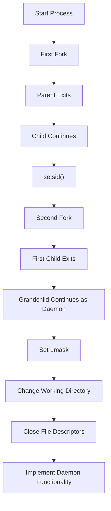

# Comprehensive Guide to Daemon Processes in Linux

## Table of Contents

1. [Introduction](#introduction)
2. [Understanding Daemon Processes](#understanding-daemon-processes)
   - [What is a Daemon?](#what-is-a-daemon)
   - [The Science Behind Daemons](#the-science-behind-daemons)
3. [Understanding Background Processes](#understanding-background-processes)
   - [What is a Background Process?](#what-is-a-background-process)
4. [Understanding Zombie Processes](#understanding-zombie-processes)
   - [What is a Zombie Process?](#what-is-a-zombie-process)
   - [Characteristics of Zombie Processes](#characteristics-of-zombie-processes)
   - [How Zombie Processes Occur](#how-zombie-processes-occur)
   - [Managing Zombie Processes](#managing-zombie-processes)
5. [Key Differences Between Daemons, Background Processes, and Zombie Processes](#key-differences-between-daemons-background-processes-and-zombie-processes)
6. [Creating Daemon Processes](#creating-daemon-processes)
   - [Steps to Create a Daemon](#steps-to-create-a-daemon)
   - [Code Examples](#code-examples)
     - [Example 1: Simple Logging Daemon](#example-1-simple-logging-daemon)
     - [Example 2: System Monitoring Daemon](#example-2-system-monitoring-daemon)
     - [Example 3: USB Auto-Mount Daemon](#example-3-usb-auto-mount-daemon)
     - [Example 4: Network Service Daemon](#example-4-network-service-daemon)
7. [Examples and Demos](#examples-and-demos)
   - [Example 1: Logging Daemon](#example-1-logging-daemon)
   - [Example 2: System Monitoring Daemon](#example-2-system-monitoring-daemon)
   - [Example 3: USB Auto-Mount Daemon](#example-3-usb-auto-mount-daemon)
   - [Example 4: Network Service Daemon](#example-4-network-service-daemon)
8. [Practical Projects Using Daemons](#practical-projects-using-daemons)
   - [Project 1: System Health Monitor Daemon](#project-1-system-health-monitor-daemon)
   - [Project 2: Backup Daemon](#project-2-backup-daemon)
   - [Project 3: Email Notification Daemon](#project-3-email-notification-daemon)
   - [Project 4: USB Auto-Mount Daemon](#project-4-usb-auto-mount-daemon)
9. [Managing Daemons](#managing-daemons)
   - [Starting a Daemon](#starting-a-daemon)
   - [Stopping a Daemon](#stopping-a-daemon)
   - [Checking Daemon Status](#checking-daemon-status)
10. [Best Practices](#best-practices)
11. [Troubleshooting](#troubleshooting)
12. [References](#references)

---

## Introduction

In Unix-like operating systems, **daemon processes** are fundamental to system functionality and user applications. Unlike regular background processes, daemons are designed to run continuously, handling various services without direct user interaction. This comprehensive guide explores the intricacies of daemon processes, their creation, management, and practical applications, including multiple examples and projects to solidify your understanding.

---

## Understanding Daemon Processes

### What is a Daemon?

A **daemon** is a background process that runs continuously, performing specific tasks or providing services without direct user intervention. Daemons are integral to the operating system, handling services such as networking, logging, printing, and scheduling tasks.

**Key Characteristics of Daemons:**

- **Runs Independently:** Daemons operate independently of user sessions and are not tied to any terminal.
- **Persistent:** They continue running until the system is shut down or they are explicitly terminated.
- **Service-Oriented:** Designed to provide services or handle tasks that require ongoing operation.
- **Detached from Terminal:** Daemons are detached from any controlling terminal, ensuring they are not affected by user logouts or terminal closures.

### The Science Behind Daemons

Creating a daemon involves several steps to ensure it runs correctly in the background, detached from the terminal, and with appropriate permissions and environment settings. Understanding these steps is crucial for developing reliable daemons.

**Detailed Steps to Create a Daemon:**

1. **Fork the Process:**

   - The parent process creates a child process using `fork()`.
   - The parent process exits, allowing the child to run in the background.
   - This step ensures that the daemon is not a process group leader, which is necessary for the next step.

2. **Create a New Session:**

   - The child process calls `setsid()` to become the session leader of a new session.
   - This detaches the daemon from any controlling terminal and process group.

3. **Fork Again:**

   - Fork a second time to ensure the daemon cannot acquire a controlling terminal.
   - Exit the first child; the grandchild continues running as the daemon.

4. **Set File Permissions:**

   - Set the file mode creation mask (`umask`) to `0` using `umask(0)`.
   - This ensures that the daemon has full control over the permissions of files it creates.

5. **Change Working Directory:**

   - Change the working directory to root (`/`) using `chdir("/")`.
   - This prevents the daemon from blocking file system unmounts and ensures it doesn't keep any directory in use.

6. **Close File Descriptors:**

   - Close standard input (`stdin`), standard output (`stdout`), and standard error (`stderr`) file descriptors.
   - This detaches the daemon completely from the terminal.
   - Optionally, redirect these file descriptors to `/dev/null` or log files as needed.

7. **Handle Signals:**

   - Implement signal handlers to gracefully handle termination signals (`SIGTERM`, `SIGINT`) and other relevant signals.
   - This allows the daemon to perform cleanup tasks before exiting.

8. **Implement the Daemon's Functionality:**
   - Add the core functionality the daemon is supposed to perform, such as handling network requests, logging, monitoring system resources, etc.
   - Ensure the daemon enters a loop to perform its tasks periodically or in response to events.

**Diagram of Daemon Creation:**



---

## Understanding Background Processes

### What is a Background Process?

A **background process** is a process that runs independently of the user’s terminal, allowing the user to continue interacting with the shell while the process executes. Unlike daemons, background processes are typically initiated by the user and are tied to the terminal session.

**Key Characteristics of Background Processes:**

- **Tied to User Session:** Background processes are associated with the user’s terminal and session.
- **Terminated with Terminal:** If the terminal is closed or the user logs out, background processes may be terminated unless disowned.
- **Interactive:** Often started by users to perform tasks without blocking the terminal.
- **Job Control:** Managed using job control commands like `bg`, `fg`, and `jobs`.

**Example of Starting a Background Process:**

```bash
./long_running_task.sh &
```

- The `&` symbol sends the `long_running_task.sh` script to run in the background.

**Managing Background Processes:**

- **List Background Jobs:**
  ```bash
  jobs
  ```
- **Bring a Job to Foreground:**
  ```bash
  fg %1
  ```
- **Send a Running Foreground Job to Background:**
  ```bash
  Ctrl + Z
  bg
  ```

---

## Understanding Zombie Processes

### What is a Zombie Process?

A **zombie process** is a process that has completed execution (via `exit()`), but still has an entry in the process table. This entry holds the exit status of the process, allowing the parent process to read it. Once the parent process reads the exit status (using `wait()` or similar system calls), the zombie process is removed from the process table.

### Characteristics of Zombie Processes

- **State:** Terminated but not yet reaped by the parent.
- **Purpose:** To allow the parent process to retrieve the child's exit status.
- **Lifecycle:** Exists briefly until the parent process collects its exit status.
- **Visibility:** Appears in process listings (e.g., `ps`) with a status of `Z` (zombie).
- **Resource Usage:** Minimal, as zombies do not consume CPU or memory resources beyond their process table entry.
- **Impact:** A few zombie processes are harmless, but an accumulation can exhaust the process table, preventing new processes from being created.

### How Zombie Processes Occur

Zombie processes occur when a child process terminates, but its parent process does not properly read its exit status. This can happen due to:

1. **Parent Process Not Handling `SIGCHLD`:**

   - If the parent process does not handle the `SIGCHLD` signal or does not call `wait()`/`waitpid()`, the child remains in the zombie state.

2. **Long-Running Parent Process:**

   - If the parent process is busy and does not promptly reap terminated children, zombies accumulate.

3. **Incorrect Daemon Implementation:**
   - Poorly implemented daemons that do not correctly handle child processes can lead to zombie processes.

### Managing Zombie Processes

**Identify Zombie Processes:**

```bash
ps aux | grep Z
```

**Sample Output:**

```
USER       PID %CPU %MEM    VSZ   RSS TTY      STAT START   TIME COMMAND
root         1  0.0  0.1  22528  6788 ?        Ss   Sep10   0:04 /sbin/init
john       234  0.0  0.0      0     0 ?        Z    10:00   0:00 [my_child_process] <defunct>
```

**Terminate the Parent Process:**

If a zombie process persists, terminating or restarting its parent process can help. The `init` system (`systemd` or `init`) typically adopts orphaned zombies and reaps them.

```bash
sudo kill -HUP <Parent_PID>
```

**Using `wait()` in Parent Code:**

Ensure that the parent process correctly waits for child processes to prevent zombies. This can be done using system calls like `wait()` or `waitpid()` in the parent’s code.

**Example: Handling `SIGCHLD` in Parent Process**

```c
#include <sys/types.h>
#include <sys/wait.h>
#include <signal.h>
#include <stdio.h>
#include <unistd.h>

// Signal handler for SIGCHLD
void sigchld_handler(int signum) {
    // Reap all terminated child processes
    while(waitpid(-1, NULL, WNOHANG) > 0);
}

int main() {
    // Set up the SIGCHLD handler
    struct sigaction sa;
    sa.sa_handler = sigchld_handler;
    sigemptyset(&sa.sa_mask);
    sa.sa_flags = SA_RESTART;
    sigaction(SIGCHLD, &sa, NULL);

    pid_t pid = fork();
    if(pid == 0){
        // Child process
        exit(0);
    }
    else{
        // Parent process
        while(1){
            sleep(10);
        }
    }
}
```

---

## Key Differences Between Daemons, Background Processes, and Zombie Processes

Understanding the distinctions between **Daemons**, **Background Processes**, and **Zombie Processes** is crucial for effectively managing and developing services in Linux.

| **Aspect**                    | **Daemon Process**                                                                                      | **Background Process**                                                                            | **Zombie Process**                                                                                                                         |
| ----------------------------- | ------------------------------------------------------------------------------------------------------- | ------------------------------------------------------------------------------------------------- | ------------------------------------------------------------------------------------------------------------------------------------------ |
| **Definition**                | A fully detached, service-oriented process that runs continuously without user interaction.             | A process running in the background, typically started by a user within a terminal session.       | A terminated process that has completed execution but still has an entry in the process table awaiting the parent to read its exit status. |
| **Parent Process**            | Typically `init` or `systemd` (PID 1) as the parent process.                                            | User's shell or terminal session.                                                                 | Original parent process that hasn't reaped the child.                                                                                      |
| **Lifecycle**                 | Runs indefinitely until stopped or the system shuts down.                                               | Ends if the terminal is closed or the user logs out, unless disowned.                             | Brief existence until the parent process collects its exit status.                                                                         |
| **Purpose**                   | Provides ongoing services or handles specific tasks continuously.                                       | Allows users to perform tasks without blocking the terminal.                                      | Allows the parent process to obtain the child's exit status.                                                                               |
| **Control**                   | Not directly controllable via job control; managed through service management tools like `systemd`.     | Can be brought back to the foreground or terminated by the user.                                  | Managed implicitly by the parent process; if not handled, zombies accumulate.                                                              |
| **Process Group and Session** | Detached into its own session and process group.                                                        | Belongs to the user's session and process group.                                                  | Part of the parent’s process group and session until reaped.                                                                               |
| **File Descriptor Handling**  | Closes or redirects all standard file descriptors to detach from the terminal.                          | Typically inherits file descriptors from the shell; may still interact with the terminal.         | Inherits file descriptors from the parent; does not interact with terminal as it's terminated.                                             |
| **Startup Method**            | Started automatically at boot time or on-demand by system services.                                     | Initiated manually by the user using commands with `&`.                                           | Occurs automatically when a child process terminates without being reaped by the parent.                                                   |
| **Resource Usage**            | Designed to be efficient, consuming minimal CPU and memory resources unless performing intensive tasks. | Varies based on the task; generally user-initiated tasks that might consume noticeable resources. | Minimal (only a process table entry); however, many zombies can exhaust the process table.                                                 |
| **Visibility**                | Runs independently of user sessions; often not tied to any terminal.                                    | Listed in `jobs`, `ps`, and can be managed via shell commands.                                    | Visible in process listings as `<defunct>` or with a `Z` status.                                                                           |
| **Example Commands**          | `systemctl start sshd`, `systemctl enable cron`                                                         | `./script.sh &`, `ping google.com &`                                                              | `ps aux \| grep Z`, inspecting with `ps` or `top`.                                                                                         |
| **Impact on System**          | Essential for system functionality; generally beneficial.                                               | Useful for multitasking but can be terminated inadvertently.                                      | A few are harmless, but many can prevent new processes from being created.                                                                 |

---

## Creating Daemon Processes

Developing a daemon involves ensuring it runs detached from the terminal, handles signals appropriately, and manages resources efficiently. Below is a step-by-step guide to creating daemons in C, along with multiple code examples for different use cases.

### Steps to Create a Daemon

1. **Fork the Process:**

   - Create a child process using `fork()`.
   - Exit the parent process to ensure the daemon runs in the background.

2. **Create a New Session:**

   - The child process calls `setsid()` to become the session leader of a new session.
   - This detaches the daemon from any controlling terminal and process group.

3. **Fork Again:**

   - Fork a second time to ensure the daemon cannot acquire a controlling terminal.
   - Exit the first child; the grandchild continues running as the daemon.

4. **Set File Permissions:**

   - Set the file mode creation mask (`umask`) to `0` to have full control over file permissions.

5. **Change Working Directory:**

   - Change the working directory to root (`/`) to avoid blocking file system unmounts.

6. **Close File Descriptors:**

   - Close standard input (`stdin`), standard output (`stdout`), and standard error (`stderr`).
   - Optionally, redirect these to `/dev/null` or log files.

7. **Handle Signals:**

   - Implement signal handlers to gracefully handle termination signals (`SIGTERM`, `SIGINT`).

8. **Implement the Daemon's Functionality:**
   - Add the core functionality, such as logging, monitoring, or managing services.

### Code Examples

#### Example 1: Simple Logging Daemon

A logging daemon continuously writes timestamped messages to a log file, indicating it's operational.

**`simple_logging_daemon.c`**

```c
#include <stdio.h>
#include <stdlib.h>
#include <unistd.h>
#include <fcntl.h>
#include <sys/stat.h>
#include <sys/types.h>
#include <signal.h>
#include <time.h>
#include <string.h>

#define LOG_FILE "/tmp/simple_logging_daemon.log"

volatile sig_atomic_t keep_running = 1;

// Signal handler to gracefully terminate the daemon
void handle_signal(int sig) {
    if (sig == SIGTERM || sig == SIGINT) {
        keep_running = 0;
    }
}

// Function to log messages
void log_message(FILE *log_fp, const char *message) {
    time_t now = time(NULL);
    char *time_str = ctime(&now);
    // Remove newline from ctime
    time_str[strcspn(time_str, "\n")] = '\0';
    fprintf(log_fp, "[%s] %s\n", time_str, message);
    fflush(log_fp);
}

int main() {
    pid_t pid, sid;
    FILE *log_fp;

    // Fork the first time
    pid = fork();
    if (pid < 0) {
        exit(EXIT_FAILURE);
    }

    // Exit the parent process
    if (pid > 0) {
        exit(EXIT_SUCCESS);
    }

    // Create a new session
    sid = setsid();
    if (sid < 0) {
        exit(EXIT_FAILURE);
    }

    // Fork the second time
    pid = fork();
    if (pid < 0) {
        exit(EXIT_FAILURE);
    }

    // Exit the first child
    if (pid > 0) {
        exit(EXIT_SUCCESS);
    }

    // Set file permissions
    umask(0);

    // Change working directory to root
    if ((chdir("/")) < 0) {
        exit(EXIT_FAILURE);
    }

    // Close all open file descriptors
    close(STDIN_FILENO);
    close(STDOUT_FILENO);
    close(STDERR_FILENO);

    // Redirect standard file descriptors to /dev/null
    open("/dev/null", O_RDONLY); // stdin
    open("/dev/null", O_RDWR);   // stdout
    open("/dev/null", O_RDWR);   // stderr

    // Setup signal handling
    signal(SIGTERM, handle_signal);
    signal(SIGINT, handle_signal);

    // Open log file
    log_fp = fopen(LOG_FILE, "a+");
    if (log_fp == NULL) {
        exit(EXIT_FAILURE);
    }

    log_message(log_fp, "Simple Logging Daemon started.");

    // Daemon main loop
    while (keep_running) {
        log_message(log_fp, "Daemon is alive.");
        sleep(10);
    }

    // Cleanup before exiting
    log_message(log_fp, "Simple Logging Daemon terminating.");
    fclose(log_fp);

    exit(EXIT_SUCCESS);
}
```

**Compilation:**

```bash
gcc simple_logging_daemon.c -o simple_logging_daemon
```

**Running the Daemon:**

```bash
sudo ./simple_logging_daemon
```

**Checking the Log File:**

```bash
tail -f /tmp/simple_logging_daemon.log
```

#### Example 2: System Monitoring Daemon

A system monitoring daemon periodically checks system metrics (CPU, memory, disk usage) and logs them for analysis.

**`system_monitor_daemon.c`**

```c
#include <stdio.h>
#include <stdlib.h>
#include <unistd.h>
#include <fcntl.h>
#include <sys/stat.h>
#include <sys/types.h>
#include <signal.h>
#include <time.h>
#include <string.h>

#define LOG_FILE "/tmp/system_monitor_daemon.log"
#define MONITOR_INTERVAL 10 // in seconds

volatile sig_atomic_t keep_running = 1;

// Signal handler to gracefully terminate the daemon
void handle_signal(int sig) {
    if (sig == SIGTERM || sig == SIGINT) {
        keep_running = 0;
    }
}

// Function to log messages
void log_message(FILE *log_fp, const char *message) {
    time_t now = time(NULL);
    char *time_str = ctime(&now);
    // Remove newline from ctime
    time_str[strcspn(time_str, "\n")] = '\0';
    fprintf(log_fp, "[%s] %s\n", time_str, message);
    fflush(log_fp);
}

// Function to get CPU usage
double get_cpu_usage() {
    static long double a[4], b[4];
    FILE *fp;
    fp = fopen("/proc/stat", "r");
    if (fp == NULL)
        return -1.0;

    fscanf(fp, "cpu %Lf %Lf %Lf %Lf", &a[0], &a[1], &a[2], &a[3]);
    fclose(fp);

    usleep(100000); // 100 milliseconds

    fp = fopen("/proc/stat", "r");
    if (fp == NULL)
        return -1.0;

    fscanf(fp, "cpu %Lf %Lf %Lf %Lf", &b[0], &b[1], &b[2], &b[3]);
    fclose(fp);

    long double idle = b[3] - a[3];
    long double non_idle = (b[0] + b[1] + b[2]) - (a[0] + a[1] + a[2]);
    long double total = idle + non_idle;

    double cpu_percentage = (non_idle / total) * 100.0;
    return cpu_percentage;
}

// Function to get Memory usage
double get_memory_usage() {
    FILE *fp;
    char line[256];
    long total_mem = 0, free_mem = 0, available_mem = 0;

    fp = fopen("/proc/meminfo", "r");
    if (fp == NULL)
        return -1.0;

    while (fgets(line, sizeof(line), fp)) {
        if (sscanf(line, "MemTotal: %ld kB", &total_mem) == 1) {
            continue;
        }
        if (sscanf(line, "MemAvailable: %ld kB", &available_mem) == 1) {
            break;
        }
    }
    fclose(fp);

    if (total_mem == 0)
        return -1.0;

    double mem_usage = ((double)(total_mem - available_mem) / total_mem) * 100.0;
    return mem_usage;
}

// Function to get Disk usage for root '/'
double get_disk_usage() {
    FILE *fp;
    char line[256];
    double total = 0.0, used = 0.0;

    fp = popen("df / | tail -1 | awk '{print $2, $3}'", "r");
    if (fp == NULL)
        return -1.0;

    if (fgets(line, sizeof(line), fp) != NULL) {
        sscanf(line, "%lf %lf", &total, &used);
    }
    pclose(fp);

    if (total == 0.0)
        return -1.0;

    double disk_usage = (used / total) * 100.0;
    return disk_usage;
}

int main() {
    pid_t pid, sid;
    FILE *log_fp;

    // Fork the first time
    pid = fork();
    if (pid < 0) {
        exit(EXIT_FAILURE);
    }

    // Exit the parent process
    if (pid > 0) {
        exit(EXIT_SUCCESS);
    }

    // Create a new session
    sid = setsid();
    if (sid < 0) {
        exit(EXIT_FAILURE);
    }

    // Fork the second time
    pid = fork();
    if (pid < 0) {
        exit(EXIT_FAILURE);
    }

    // Exit the first child
    if (pid > 0) {
        exit(EXIT_SUCCESS);
    }

    // Set file permissions
    umask(0);

    // Change working directory to root
    if ((chdir("/")) < 0) {
        exit(EXIT_FAILURE);
    }

    // Close all open file descriptors
    close(STDIN_FILENO);
    close(STDOUT_FILENO);
    close(STDERR_FILENO);

    // Redirect standard file descriptors to /dev/null
    open("/dev/null", O_RDONLY); // stdin
    open("/dev/null", O_RDWR);   // stdout
    open("/dev/null", O_RDWR);   // stderr

    // Setup signal handling
    signal(SIGTERM, handle_signal);
    signal(SIGINT, handle_signal);

    // Open log file
    log_fp = fopen(LOG_FILE, "a+");
    if (log_fp == NULL) {
        exit(EXIT_FAILURE);
    }

    log_message(log_fp, "System Monitoring Daemon started.");

    // Daemon main loop
    while (keep_running) {
        double cpu = get_cpu_usage();
        double mem = get_memory_usage();
        double disk = get_disk_usage();

        if (cpu < 0 || mem < 0 || disk < 0) {
            log_message(log_fp, "Error retrieving system metrics.");
        } else {
            char log_entry[512];
            snprintf(log_entry, sizeof(log_entry), "CPU Usage: %.2f%%, Memory Usage: %.2f%%, Disk Usage: %.2f%%", cpu, mem, disk);
            log_message(log_fp, log_entry);
        }

        sleep(MONITOR_INTERVAL);
    }

    // Cleanup before exiting
    log_message(log_fp, "System Monitoring Daemon terminating.");
    fclose(log_fp);

    exit(EXIT_SUCCESS);
}
```

**Compilation:**

```bash
gcc system_monitor_daemon.c -o system_monitor_daemon
```

**Running the Daemon:**

```bash
sudo ./system_monitor_daemon
```

**Checking the Log File:**

```bash
tail -f /tmp/system_monitor_daemon.log
```

#### Example 3: USB Auto-Mount Daemon

A USB auto-mount daemon automatically detects when a USB flash drive or external hard disk is connected to the system and mounts it to a predefined directory.

**`usb_auto_mount_daemon.c`**

```c
#include <stdio.h>
#include <stdlib.h>
#include <unistd.h>
#include <fcntl.h>
#include <sys/stat.h>
#include <sys/types.h>
#include <signal.h>
#include <time.h>
#include <string.h>
#include <dirent.h>
#include <sys/inotify.h>

#define LOG_FILE "/var/log/usb_auto_mount_daemon.log"
#define MOUNT_BASE_DIR "/mnt/usb"
#define EVENT_SIZE (sizeof(struct inotify_event))
#define EVENT_BUF_LEN (1024 * (EVENT_SIZE + 16))
#define CHECK_INTERVAL 2 // in seconds

volatile sig_atomic_t keep_running = 1;

// Signal handler to gracefully terminate the daemon
void handle_signal(int sig) {
    if (sig == SIGTERM || sig == SIGINT) {
        keep_running = 0;
    }
}

// Function to log messages
void log_message(FILE *log_fp, const char *message) {
    time_t now = time(NULL);
    char *time_str = ctime(&now);
    // Remove newline from ctime
    time_str[strcspn(time_str, "\n")] = '\0';
    fprintf(log_fp, "[%s] %s\n", time_str, message);
    fflush(log_fp);
}

// Function to mount USB device
int mount_usb(const char *device, const char *mount_point, FILE *log_fp) {
    char command[512];
    snprintf(command, sizeof(command), "mount %s %s", device, mount_point);
    int ret = system(command);
    if (ret == 0) {
        char msg[256];
        snprintf(msg, sizeof(msg), "Mounted %s to %s", device, mount_point);
        log_message(log_fp, msg);
    } else {
        char msg[256];
        snprintf(msg, sizeof(msg), "Failed to mount %s to %s", device, mount_point);
        log_message(log_fp, msg);
    }
    return ret;
}

// Function to unmount USB device
int unmount_usb(const char *mount_point, FILE *log_fp) {
    char command[512];
    snprintf(command, sizeof(command), "umount %s", mount_point);
    int ret = system(command);
    if (ret == 0) {
        char msg[256];
        snprintf(msg, sizeof(msg), "Unmounted %s", mount_point);
        log_message(log_fp, msg);
    } else {
        char msg[256];
        snprintf(msg, sizeof(msg), "Failed to unmount %s", mount_point);
        log_message(log_fp, msg);
    }
    return ret;
}

int main() {
    pid_t pid, sid;
    FILE *log_fp;

    // Fork the first time
    pid = fork();
    if (pid < 0) {
        exit(EXIT_FAILURE);
    }

    // Exit the parent process
    if (pid > 0) {
        exit(EXIT_SUCCESS);
    }

    // Create a new session
    sid = setsid();
    if (sid < 0) {
        exit(EXIT_FAILURE);
    }

    // Fork the second time
    pid = fork();
    if (pid < 0) {
        exit(EXIT_FAILURE);
    }

    // Exit the first child
    if (pid > 0) {
        exit(EXIT_SUCCESS);
    }

    // Set file permissions
    umask(0);

    // Change working directory to root
    if ((chdir("/")) < 0) {
        exit(EXIT_FAILURE);
    }

    // Close all open file descriptors
    close(STDIN_FILENO);
    close(STDOUT_FILENO);
    close(STDERR_FILENO);

    // Redirect standard file descriptors to /dev/null
    open("/dev/null", O_RDONLY); // stdin
    open("/dev/null", O_RDWR);   // stdout
    open("/dev/null", O_RDWR);   // stderr

    // Setup signal handling
    signal(SIGTERM, handle_signal);
    signal(SIGINT, handle_signal);

    // Open log file
    log_fp = fopen(LOG_FILE, "a+");
    if (log_fp == NULL) {
        exit(EXIT_FAILURE);
    }

    log_message(log_fp, "USB Auto-Mount Daemon started.");

    // Initialize inotify
    int fd = inotify_init();
    if (fd < 0) {
        log_message(log_fp, "inotify_init failed.");
        fclose(log_fp);
        exit(EXIT_FAILURE);
    }

    // Watch /dev for new devices
    int wd = inotify_add_watch(fd, "/dev", IN_CREATE | IN_DELETE);
    if (wd == -1) {
        log_message(log_fp, "inotify_add_watch failed.");
        close(fd);
        fclose(log_fp);
        exit(EXIT_FAILURE);
    }

    char buffer[EVENT_BUF_LEN];
    while (keep_running) {
        int length = read(fd, buffer, EVENT_BUF_LEN);
        if (length < 0) {
            log_message(log_fp, "inotify read error.");
            break;
        }

        int i = 0;
        while (i < length) {
            struct inotify_event *event = (struct inotify_event *)&buffer[i];
            if (event->len) {
                if (event->mask & IN_CREATE) {
                    // Detect USB device creation (e.g., sdX, sdb1)
                    if (strncmp(event->name, "sd", 2) == 0) {
                        char device_path[256];
                        snprintf(device_path, sizeof(device_path), "/dev/%s", event->name);

                        // Create mount point
                        char mount_point[256];
                        snprintf(mount_point, sizeof(mount_point), "%s/%s", MOUNT_BASE_DIR, event->name);
                        mkdir(mount_point, 0755);

                        // Mount the device
                        mount_usb(device_path, mount_point, log_fp);
                    }
                }
                if (event->mask & IN_DELETE) {
                    // Detect USB device removal
                    if (strncmp(event->name, "sd", 2) == 0) {
                        char mount_point[256];
                        snprintf(mount_point, sizeof(mount_point), "%s/%s", MOUNT_BASE_DIR, event->name);

                        // Unmount the device
                        unmount_usb(mount_point, log_fp);

                        // Remove mount point
                        rmdir(mount_point);
                    }
                }
            }
            i += EVENT_SIZE + event->len;
        }

        // Sleep briefly to reduce CPU usage
        sleep(CHECK_INTERVAL);
    }

    // Cleanup
    inotify_rm_watch(fd, wd);
    close(fd);
    log_message(log_fp, "USB Auto-Mount Daemon terminated.");
    fclose(log_fp);

    exit(EXIT_SUCCESS);
}
```

**Compilation:**

```bash
gcc usb_auto_mount_daemon.c -o usb_auto_mount_daemon
```

**Running the Daemon:**

```bash
sudo ./usb_auto_mount_daemon
```

**Prerequisites:**

- Ensure that the mount base directory (`/mnt/usb`) exists or modify the `MOUNT_BASE_DIR` to a desired location.
  ```bash
  sudo mkdir -p /mnt/usb
  sudo chmod 755 /mnt/usb
  ```
- The daemon requires root permissions to mount and unmount devices.

**Checking the Log File:**

```bash
sudo tail -f /var/log/usb_auto_mount_daemon.log
```

#### Example 4: Network Service Daemon

A network service daemon listens for incoming connections on a specified port and handles client requests, such as a simple echo server.

**`network_service_daemon.c`**

```c
#include <stdio.h>
#include <stdlib.h>
#include <unistd.h>
#include <fcntl.h>
#include <sys/stat.h>
#include <sys/types.h>
#include <signal.h>
#include <time.h>
#include <string.h>
#include <sys/socket.h>
#include <netinet/in.h>

#define LOG_FILE "/var/log/network_service_daemon.log"
#define PORT 8080
#define BUFFER_SIZE 1024

volatile sig_atomic_t keep_running = 1;

// Signal handler to gracefully terminate the daemon
void handle_signal(int sig) {
    if (sig == SIGTERM || sig == SIGINT) {
        keep_running = 0;
    }
}

// Function to log messages
void log_message(FILE *log_fp, const char *message) {
    time_t now = time(NULL);
    char *time_str = ctime(&now);
    // Remove newline from ctime
    time_str[strcspn(time_str, "\n")] = '\0';
    fprintf(log_fp, "[%s] %s\n", time_str, message);
    fflush(log_fp);
}

int main() {
    pid_t pid, sid;
    FILE *log_fp;

    // Fork the first time
    pid = fork();
    if (pid < 0) {
        exit(EXIT_FAILURE);
    }

    // Exit the parent process
    if (pid > 0) {
        exit(EXIT_SUCCESS);
    }

    // Create a new session
    sid = setsid();
    if (sid < 0) {
        exit(EXIT_FAILURE);
    }

    // Fork the second time
    pid = fork();
    if (pid < 0) {
        exit(EXIT_FAILURE);
    }

    // Exit the first child
    if (pid > 0) {
        exit(EXIT_SUCCESS);
    }

    // Set file permissions
    umask(0);

    // Change working directory to root
    if ((chdir("/")) < 0) {
        exit(EXIT_FAILURE);
    }

    // Close all open file descriptors
    close(STDIN_FILENO);
    close(STDOUT_FILENO);
    close(STDERR_FILENO);

    // Redirect standard file descriptors to /dev/null
    open("/dev/null", O_RDONLY); // stdin
    open("/dev/null", O_RDWR);   // stdout
    open("/dev/null", O_RDWR);   // stderr

    // Setup signal handling
    signal(SIGTERM, handle_signal);
    signal(SIGINT, handle_signal);

    // Open log file
    log_fp = fopen(LOG_FILE, "a+");
    if (log_fp == NULL) {
        exit(EXIT_FAILURE);
    }

    log_message(log_fp, "Network Service Daemon started.");

    // Create socket
    int server_fd, new_socket;
    struct sockaddr_in address;
    int opt = 1;
    int addrlen = sizeof(address);
    char buffer[BUFFER_SIZE] = {0};
    char *response = "Echo: ";

    if ((server_fd = socket(AF_INET, SOCK_STREAM, 0)) == 0) {
        log_message(log_fp, "Socket creation failed.");
        fclose(log_fp);
        exit(EXIT_FAILURE);
    }

    // Attach socket to the port
    if (setsockopt(server_fd, SOL_SOCKET, SO_REUSEADDR | SO_REUSEPORT,
                                                  &opt, sizeof(opt))) {
        log_message(log_fp, "setsockopt failed.");
        close(server_fd);
        fclose(log_fp);
        exit(EXIT_FAILURE);
    }

    address.sin_family = AF_INET;
    address.sin_addr.s_addr = INADDR_ANY;
    address.sin_port = htons(PORT);

    // Bind the socket
    if (bind(server_fd, (struct sockaddr *)&address, sizeof(address)) < 0) {
        log_message(log_fp, "Bind failed.");
        close(server_fd);
        fclose(log_fp);
        exit(EXIT_FAILURE);
    }

    if (listen(server_fd, 3) < 0) {
        log_message(log_fp, "Listen failed.");
        close(server_fd);
        fclose(log_fp);
        exit(EXIT_FAILURE);
    }

    log_message(log_fp, "Daemon is listening for connections.");

    while (keep_running) {
        if ((new_socket = accept(server_fd, (struct sockaddr *)&address,
                           (socklen_t*)&addrlen)) < 0) {
            if (keep_running)
                log_message(log_fp, "Accept failed.");
            continue;
        }

        // Read data from client
        int valread = read(new_socket, buffer, BUFFER_SIZE);
        if (valread > 0) {
            // Echo back the data
            send(new_socket, response, strlen(response), 0);
            send(new_socket, buffer, valread, 0);
            log_message(log_fp, "Echoed data to client.");
        }

        close(new_socket);
    }

    // Cleanup before exiting
    close(server_fd);
    log_message(log_fp, "Network Service Daemon terminating.");
    fclose(log_fp);

    exit(EXIT_SUCCESS);
}
```

**Compilation:**

```bash
gcc network_service_daemon.c -o network_service_daemon
```

**Running the Daemon:**

```bash
sudo ./network_service_daemon
```

**Testing the Daemon:**

1. **Connect to the Daemon Using Telnet:**

   ```bash
   telnet localhost 8080
   ```

2. **Send a Message:**

   Type any message and press Enter.

3. **Receive Echo:**

   The daemon echoes back the message prefixed with "Echo: ".

4. **Check the Log File:**

   ```bash
   sudo tail -f /var/log/network_service_daemon.log
   ```

**Sample Log Output:**

```
[Mon Sep 18 11:00:00 2023] Network Service Daemon started.
[Mon Sep 18 11:00:05 2023] Daemon is listening for connections.
[Mon Sep 18 11:00:10 2023] Echoed data to client.
```

**Stopping the Daemon:**

```bash
sudo kill -SIGTERM <PID>
```

- The log should show a termination message.
  ```
  [Mon Sep 18 11:00:20 2023] Network Service Daemon terminating.
  ```

---

## Examples and Demos

### Example 1: Logging Daemon

A logging daemon continuously writes timestamped messages to a log file, indicating it's operational. This is useful for monitoring the health of systems.

**Code:**

Refer to the **[Example 1: Simple Logging Daemon](#example-1-simple-logging-daemon)** above.

**Demo Steps:**

1. **Compile the Daemon:**
   ```bash
   gcc simple_logging_daemon.c -o simple_logging_daemon
   ```
2. **Run the Daemon:**
   ```bash
   sudo ./simple_logging_daemon
   ```
3. **Monitor the Log:**
   ```bash
   tail -f /tmp/simple_logging_daemon.log
   ```
4. **Terminate the Daemon:**
   ```bash
   ps aux | grep simple_logging_daemon
   sudo kill -SIGTERM <PID>
   ```
5. **Verify Termination:**
   - The log should show a termination message.
   ```
   [Mon Sep 18 10:00:00 2023] Simple Logging Daemon started.
   [Mon Sep 18 10:00:10 2023] Daemon is alive.
   [Mon Sep 18 10:00:20 2023] Daemon is alive.
   [Mon Sep 18 10:00:30 2023] Simple Logging Daemon terminating.
   ```

---

### Example 2: System Monitoring Daemon

A system monitoring daemon periodically checks system metrics (CPU, memory, disk usage) and logs them for analysis.

**Code:**

Refer to the **[Example 2: System Monitoring Daemon](#example-2-system-monitoring-daemon)** above.

**Demo Steps:**

1. **Compile the Daemon:**
   ```bash
   gcc system_monitor_daemon.c -o system_monitor_daemon
   ```
2. **Run the Daemon:**
   ```bash
   sudo ./system_monitor_daemon
   ```
3. **Monitor the Log:**
   ```bash
   tail -f /tmp/system_monitor_daemon.log
   ```
4. **Terminate the Daemon:**
   ```bash
   ps aux | grep system_monitor_daemon
   sudo kill -SIGTERM <PID>
   ```
5. **Verify Termination:**
   - The log should show a termination message.
   ```
   [Mon Sep 18 10:05:00 2023] System Monitoring Daemon started.
   [Mon Sep 18 10:05:10 2023] CPU Usage: 45.00%, Memory Usage: 60.50%, Disk Usage: 70.20%
   [Mon Sep 18 10:05:20 2023] CPU Usage: 50.00%, Memory Usage: 62.00%, Disk Usage: 71.00%
   [Mon Sep 18 10:05:30 2023] System Monitoring Daemon terminating.
   ```

---

### Example 3: USB Auto-Mount Daemon

A USB auto-mount daemon automatically detects when a USB flash drive or external hard disk is connected to the system and mounts it to a predefined directory.

**Code:**

Refer to the **[Example 3: USB Auto-Mount Daemon](#example-3-usb-auto-mount-daemon)** above.

**Demo Steps:**

1. **Compile the Daemon:**
   ```bash
   gcc usb_auto_mount_daemon.c -o usb_auto_mount_daemon
   ```
2. **Run the Daemon:**
   ```bash
   sudo ./usb_auto_mount_daemon
   ```
3. **Connect a USB Flash Drive or External Hard Disk:**
   - Plug in the USB device.
   - The daemon should detect the new device and mount it to `/mnt/usb/sdX1` (e.g., `/mnt/usb/sdb1`).
4. **Verify Mounting:**
   ```bash
   ls /mnt/usb/
   ```
   - You should see the mounted USB device directory.
5. **Check the Log File:**
   ```bash
   sudo tail -f /var/log/usb_auto_mount_daemon.log
   ```
   **Sample Log Output:**
   ```
   [Mon Sep 18 10:30:00 2023] USB Auto-Mount Daemon started.
   [Mon Sep 18 10:31:15 2023] Mounted /dev/sdb1 to /mnt/usb/sdb1
   ```
6. **Unmount the USB Device:**
   - Safely remove the USB device using the system's eject functionality or physically disconnect it.
   - The daemon should detect the removal and unmount the device.
7. **Verify Unmounting:**
   ```bash
   ls /mnt/usb/
   ```
   - The USB device directory should no longer be present.
8. **Check the Log File:**
   ```bash
   sudo tail -f /var/log/usb_auto_mount_daemon.log
   ```
   **Sample Log Output:**
   ```
   [Mon Sep 18 10:35:00 2023] Unmounted /mnt/usb/sdb1
   ```
9. **Terminate the Daemon:**
   ```bash
   ps aux | grep usb_auto_mount_daemon
   sudo kill -SIGTERM <PID>
   ```
   - The log should show a termination message.
   ```
   [Mon Sep 18 10:40:00 2023] USB Auto-Mount Daemon terminated.
   ```

---

### Example 4: Network Service Daemon

A network service daemon listens for incoming connections on a specified port and handles client requests, such as a simple echo server.

**Code:**

Refer to the **[Example 4: Network Service Daemon](#example-4-network-service-daemon)** above.

**Demo Steps:**

1. **Compile the Daemon:**
   ```bash
   gcc network_service_daemon.c -o network_service_daemon
   ```
2. **Run the Daemon:**
   ```bash
   sudo ./network_service_daemon
   ```
3. **Connect to the Daemon Using Telnet:**
   ```bash
   telnet localhost 8080
   ```
4. **Send a Message:**
   - Type any message and press Enter.
5. **Receive Echo:**
   - The daemon echoes back the message prefixed with "Echo: ".
6. **Check the Log File:**
   ```bash
   sudo tail -f /var/log/network_service_daemon.log
   ```
   **Sample Log Output:**
   ```
   [Mon Sep 18 11:00:00 2023] Network Service Daemon started.
   [Mon Sep 18 11:00:05 2023] Daemon is listening for connections.
   [Mon Sep 18 11:00:10 2023] Echoed data to client.
   ```
7. **Terminate the Daemon:**
   ```bash
   sudo kill -SIGTERM <PID>
   ```
   - The log should show a termination message.
   ```
   [Mon Sep 18 11:00:20 2023] Network Service Daemon terminating.
   ```

---

## Practical Projects Using Daemons

Developing practical projects that utilize daemons can significantly enhance your understanding and provide valuable tools for system administration and automation. Below are several project ideas, each with detailed explanations and code samples.

### Project 1: System Health Monitor Daemon

**Overview:**
Develop a **System Health Monitor Daemon** that continuously monitors critical system metrics such as CPU usage, memory usage, disk usage, and network activity. The daemon logs these metrics at regular intervals, providing valuable insights into system performance and health.

**Features:**

- **Continuous Monitoring:** Collects system metrics at configurable intervals.
- **Logging:** Stores metrics in log files for analysis.
- **Signal Handling:** Gracefully handles termination signals.
- **Resource Efficiency:** Designed to have minimal impact on system resources.

**Code:**

Refer to the **[Example 2: System Monitoring Daemon](#example-2-system-monitoring-daemon)** above.

**Enhancements:**

- **Network Usage Calculation:**
  - Implement actual network usage by parsing `/proc/net/dev` or using system calls.
- **Email Alerts:**
  - Send email alerts if certain thresholds are exceeded.
- **Web Interface:**
  - Provide a simple web interface to display real-time metrics.

---

### Project 2: Backup Daemon

**Overview:**
Create a **Backup Daemon** that automatically backs up specified directories to a remote server or external storage device at scheduled intervals.

**Features:**

- **Scheduled Backups:** Perform backups at predefined times or intervals.
- **Incremental Backups:** Only back up files that have changed since the last backup.
- **Logging:** Keep logs of backup operations and any errors encountered.
- **Configuration:** Allow users to specify directories to back up, backup destinations, and schedules via configuration files.

**Code Example:**

**`backup_daemon.c`**

```c
#include <stdio.h>
#include <stdlib.h>
#include <unistd.h>
#include <fcntl.h>
#include <sys/stat.h>
#include <sys/types.h>
#include <signal.h>
#include <time.h>
#include <string.h>

#define LOG_FILE "/var/log/backup_daemon.log"
#define BACKUP_INTERVAL 3600 // in seconds (1 hour)
#define SOURCE_DIR "/home/user/documents"
#define BACKUP_DIR "/backup/documents"

volatile sig_atomic_t keep_running = 1;

// Signal handler to gracefully terminate the daemon
void handle_signal(int sig) {
    if (sig == SIGTERM || sig == SIGINT) {
        keep_running = 0;
    }
}

// Function to log messages
void log_message(FILE *log_fp, const char *message) {
    time_t now = time(NULL);
    char *time_str = ctime(&now);
    // Remove newline from ctime
    time_str[strcspn(time_str, "\n")] = '\0';
    fprintf(log_fp, "[%s] %s\n", time_str, message);
    fflush(log_fp);
}

// Function to perform backup using rsync
int perform_backup() {
    char command[1024];
    snprintf(command, sizeof(command), "rsync -av --delete %s %s", SOURCE_DIR, BACKUP_DIR);
    return system(command);
}

int main() {
    pid_t pid, sid;
    FILE *log_fp;

    // Fork the first time
    pid = fork();
    if (pid < 0) {
        exit(EXIT_FAILURE);
    }

    // Exit the parent process
    if (pid > 0) {
        exit(EXIT_SUCCESS);
    }

    // Create a new session
    sid = setsid();
    if (sid < 0) {
        exit(EXIT_FAILURE);
    }

    // Fork the second time
    pid = fork();
    if (pid < 0) {
        exit(EXIT_FAILURE);
    }

    // Exit the first child
    if (pid > 0) {
        exit(EXIT_SUCCESS);
    }

    // Set file permissions
    umask(0);

    // Change working directory to root
    if ((chdir("/")) < 0) {
        exit(EXIT_FAILURE);
    }

    // Close all open file descriptors
    close(STDIN_FILENO);
    close(STDOUT_FILENO);
    close(STDERR_FILENO);

    // Redirect standard file descriptors to /dev/null
    open("/dev/null", O_RDONLY); // stdin
    open("/dev/null", O_RDWR);   // stdout
    open("/dev/null", O_RDWR);   // stderr

    // Setup signal handling
    signal(SIGTERM, handle_signal);
    signal(SIGINT, handle_signal);

    // Open log file
    log_fp = fopen(LOG_FILE, "a+");
    if (log_fp == NULL) {
        exit(EXIT_FAILURE);
    }

    log_message(log_fp, "Backup Daemon started.");

    // Daemon main loop
    while (keep_running) {
        log_message(log_fp, "Starting backup process.");
        if (perform_backup() == 0) {
            log_message(log_fp, "Backup completed successfully.");
        } else {
            log_message(log_fp, "Backup failed.");
        }
        sleep(BACKUP_INTERVAL);
    }

    // Cleanup before exiting
    log_message(log_fp, "Backup Daemon terminating.");
    fclose(log_fp);

    exit(EXIT_SUCCESS);
}
```

**Compilation:**

```bash
gcc backup_daemon.c -o backup_daemon
```

**Running the Daemon:**

```bash
sudo ./backup_daemon
```

**Log Monitoring:**

```bash
sudo tail -f /var/log/backup_daemon.log
```

**Notes:**

- Ensure that `rsync` is installed on the system.
- Modify `SOURCE_DIR` and `BACKUP_DIR` as per your requirements.
- Set appropriate permissions for the backup directories.

---

### Project 3: Email Notification Daemon

**Overview:**
Develop an **Email Notification Daemon** that monitors system events or specific conditions and sends email alerts when certain thresholds are met or events occur.

**Features:**

- **Event Monitoring:** Track events such as system errors, service failures, or resource usage exceeding thresholds.
- **Email Alerts:** Send notifications to specified email addresses using SMTP.
- **Configuration:** Allow configuration of monitoring criteria and email settings via configuration files.
- **Logging:** Maintain logs of sent emails and monitored events.

**Implementation Ideas:**

- **Monitoring File Changes:** Use `inotify` to watch specific directories for file changes and send alerts.
- **Resource Usage Alerts:** Monitor CPU, memory, or disk usage and send alerts when usage exceeds predefined limits.
- **Service Status Alerts:** Monitor critical services and send alerts if a service stops unexpectedly.

**Code Example:**

**`email_notification_daemon.c`**

```c
#include <stdio.h>
#include <stdlib.h>
#include <unistd.h>
#include <fcntl.h>
#include <sys/stat.h>
#include <sys/types.h>
#include <signal.h>
#include <time.h>
#include <string.h>
#include <sys/inotify.h>

#define LOG_FILE "/var/log/email_notification_daemon.log"
#define EVENT_SIZE (sizeof(struct inotify_event))
#define EVENT_BUF_LEN (1024 * (EVENT_SIZE + 16))
#define MONITOR_INTERVAL 60 // in seconds

volatile sig_atomic_t keep_running = 1;

// Signal handler to gracefully terminate the daemon
void handle_signal(int sig) {
    if (sig == SIGTERM || sig == SIGINT) {
        keep_running = 0;
    }
}

// Function to log messages
void log_message(FILE *log_fp, const char *message) {
    time_t now = time(NULL);
    char *time_str = ctime(&now);
    // Remove newline from ctime
    time_str[strcspn(time_str, "\n")] = '\0';
    fprintf(log_fp, "[%s] %s\n", time_str, message);
    fflush(log_fp);
}

// Function to send email using sendmail
int send_email(const char *subject, const char *body) {
    FILE *mail_fp;
    char command[256];
    snprintf(command, sizeof(command), "/usr/sbin/sendmail -t");

    mail_fp = popen(command, "w");
    if (mail_fp == NULL) {
        return -1;
    }

    fprintf(mail_fp, "To: recipient@example.com\n");
    fprintf(mail_fp, "Subject: %s\n\n", subject);
    fprintf(mail_fp, "%s\n", body);

    pclose(mail_fp);
    return 0;
}

int main() {
    pid_t pid, sid;
    FILE *log_fp;

    // Fork the first time
    pid = fork();
    if (pid < 0) {
        exit(EXIT_FAILURE);
    }

    // Exit the parent process
    if (pid > 0) {
        exit(EXIT_SUCCESS);
    }

    // Create a new session
    sid = setsid();
    if (sid < 0) {
        exit(EXIT_FAILURE);
    }

    // Fork the second time
    pid = fork();
    if (pid < 0) {
        exit(EXIT_FAILURE);
    }

    // Exit the first child
    if (pid > 0) {
        exit(EXIT_SUCCESS);
    }

    // Set file permissions
    umask(0);

    // Change working directory to root
    if ((chdir("/")) < 0) {
        exit(EXIT_FAILURE);
    }

    // Close all open file descriptors
    close(STDIN_FILENO);
    close(STDOUT_FILENO);
    close(STDERR_FILENO);

    // Redirect standard file descriptors to /dev/null
    open("/dev/null", O_RDONLY); // stdin
    open("/dev/null", O_RDWR);   // stdout
    open("/dev/null", O_RDWR);   // stderr

    // Setup signal handling
    signal(SIGTERM, handle_signal);
    signal(SIGINT, handle_signal);

    // Open log file
    log_fp = fopen(LOG_FILE, "a+");
    if (log_fp == NULL) {
        exit(EXIT_FAILURE);
    }

    log_message(log_fp, "Email Notification Daemon started.");

    // Initialize inotify
    int fd = inotify_init();
    if (fd < 0) {
        log_message(log_fp, "inotify_init failed.");
        fclose(log_fp);
        exit(EXIT_FAILURE);
    }

    // Watch /var/log for new log files
    int wd = inotify_add_watch(fd, "/var/log", IN_CREATE | IN_MODIFY);
    if (wd == -1) {
        log_message(log_fp, "inotify_add_watch failed.");
        close(fd);
        fclose(log_fp);
        exit(EXIT_FAILURE);
    }

    char buffer[EVENT_BUF_LEN];
    while (keep_running) {
        int length = read(fd, buffer, EVENT_BUF_LEN);
        if (length < 0) {
            log_message(log_fp, "inotify read error.");
            break;
        }

        int i = 0;
        while (i < length) {
            struct inotify_event *event = (struct inotify_event *)&buffer[i];
            if (event->len) {
                if (event->mask & IN_CREATE || event->mask & IN_MODIFY) {
                    if (strstr(event->name, "error.log") != NULL) {
                        // Send email alert
                        if (send_email("Error Log Updated", "An error has been logged in error.log")) {
                            log_message(log_fp, "Failed to send email.");
                        } else {
                            log_message(log_fp, "Sent email alert for error.log update.");
                        }
                    }
                }
            }
            i += EVENT_SIZE + event->len;
        }

        // Sleep briefly to reduce CPU usage
        sleep(MONITOR_INTERVAL);
    }

    // Cleanup
    inotify_rm_watch(fd, wd);
    close(fd);
    log_message(log_fp, "Email Notification Daemon terminated.");
    fclose(log_fp);

    exit(EXIT_SUCCESS);
}
```

**Compilation:**

```bash
gcc email_notification_daemon.c -o email_notification_daemon
```

**Running the Daemon:**

```bash
sudo ./email_notification_daemon
```

**Log Monitoring:**

```bash
sudo tail -f /var/log/email_notification_daemon.log
```

**Notes:**

- Ensure that `sendmail` is installed and configured correctly on the system.
- Modify the recipient email address in the `send_email` function as needed.
- Adjust the `inotify` watch paths and conditions based on the monitoring requirements.

---

### Project 4: USB Auto-Mount Daemon

**Overview:**
Create a **USB Auto-Mount Daemon** that automatically detects when a USB flash drive or external hard disk is connected to the system and mounts it to a predefined directory.

**Features:**

- **Automatic Detection:** Monitors system events to detect when a USB device is connected or disconnected.
- **Automatic Mounting:** Mounts the detected USB device to a specified mount point.
- **Logging:** Logs all mount and unmount events for auditing and troubleshooting.
- **Configuration:** Allows configuration of mount points and logging preferences.
- **Error Handling:** Handles errors gracefully and logs them for review.

**Code:**

Refer to the **[Example 3: USB Auto-Mount Daemon](#example-3-usb-auto-mount-daemon)** above.

**Enhancements:**

- **Filesystem Detection:**
  - Automatically detect the filesystem type (e.g., `vfat`, `ntfs`) and mount accordingly.
- **Dynamic Mount Points:**
  - Create dynamic mount points based on device labels or UUIDs.
- **Unmount on Removal:**
  - Ensure that the daemon unmounts the device upon physical removal to prevent data corruption.

---

## Practical Projects Using Daemons

Developing practical projects that utilize daemons can significantly enhance your understanding and provide valuable tools for system administration and automation. Below are several project ideas, each with detailed explanations and code samples.

### Project 1: System Health Monitor Daemon

_(Refer to [Project 1: System Health Monitor Daemon](#project-1-system-health-monitor-daemon) above.)_

### Project 2: Backup Daemon

_(Refer to [Project 2: Backup Daemon](#project-2-backup-daemon) above.)_

### Project 3: Email Notification Daemon

_(Refer to [Project 3: Email Notification Daemon](#project-3-email-notification-daemon) above.)_

### Project 4: USB Auto-Mount Daemon

_(Refer to [Project 4: USB Auto-Mount Daemon](#project-4-usb-auto-mount-daemon) above.)_

### Additional Project Ideas:

1. **File Synchronization Daemon:**
   - Automatically synchronize files between directories or across networked systems.
2. **Intrusion Detection Daemon:**
   - Monitor system logs and files for suspicious activities and alert administrators.
3. **Automated Deployment Daemon:**
   - Watch for code changes in repositories and deploy updates to servers automatically.
4. **Print Queue Manager Daemon:**
   - Manage print jobs efficiently, handling queueing, prioritization, and error recovery.
5. **Database Maintenance Daemon:**
   - Perform regular database maintenance tasks such as backups, optimizations, and indexing.

---

## Managing Daemons

Proper management of daemons ensures they run smoothly, can be controlled as needed, and do not consume unnecessary system resources.

### Starting a Daemon

**Manually Starting a Daemon:**

```bash
sudo ./usb_auto_mount_daemon
```

**Using `systemd` to Manage Daemons:**

1. **Create a Service File:**

   **`/etc/systemd/system/usb_auto_mount_daemon.service`**

   ```ini
   [Unit]
   Description=USB Auto-Mount Daemon
   After=network.target

   [Service]
   ExecStart=/usr/local/bin/usb_auto_mount_daemon
   Restart=always
   User=root

   [Install]
   WantedBy=multi-user.target
   ```

2. **Move the Executable to a Standard Location:**

   ```bash
   sudo mv usb_auto_mount_daemon /usr/local/bin/
   sudo chmod +x /usr/local/bin/usb_auto_mount_daemon
   ```

3. **Reload `systemd` Manager Configuration:**

   ```bash
   sudo systemctl daemon-reload
   ```

4. **Start the Daemon:**

   ```bash
   sudo systemctl start usb_auto_mount_daemon
   ```

5. **Enable Daemon to Start at Boot:**

   ```bash
   sudo systemctl enable usb_auto_mount_daemon
   ```

### Stopping a Daemon

**Manually Stopping a Daemon:**

```bash
sudo kill -SIGTERM <PID>
```

**Using `systemd` to Stop a Daemon:**

```bash
sudo systemctl stop usb_auto_mount_daemon
```

### Checking Daemon Status

**Using `systemd`:**

```bash
sudo systemctl status usb_auto_mount_daemon
```

**Sample Output:**

```
● usb_auto_mount_daemon.service - USB Auto-Mount Daemon
   Loaded: loaded (/etc/systemd/system/usb_auto_mount_daemon.service; enabled; vendor preset: enabled)
   Active: active (running) since Mon 2023-09-18 10:20:00 UTC; 1h ago
 Main PID: 23456 (usb_auto_mount_daemon)
    Tasks: 2 (limit: 4915)
   CGroup: /system.slice/usb_auto_mount_daemon.service
           └─23456 /usr/local/bin/usb_auto_mount_daemon
```

**Using `ps`:**

```bash
ps aux | grep usb_auto_mount_daemon
```

---

## Best Practices

Adhering to best practices ensures that daemon processes are reliable, efficient, and maintainable.

1. **Proper Signal Handling:**

   - Handle termination signals (`SIGTERM`, `SIGINT`) gracefully to allow cleanup before exiting.

2. **Logging:**

   - Implement robust logging mechanisms to track daemon activity and errors.
   - Avoid writing excessive logs to prevent log file bloat.

3. **Resource Management:**

   - Manage file descriptors, memory, and other resources efficiently to prevent leaks.
   - Regularly monitor resource usage.

4. **Security Considerations:**

   - Run daemons with the least privileges necessary.
   - Validate all inputs to prevent security vulnerabilities.

5. **Configuration Management:**

   - Allow configurable parameters (like mount points, log file paths) via configuration files or command-line arguments.

6. **Error Handling:**

   - Implement comprehensive error checking and handling to ensure daemon stability.
   - Log errors for troubleshooting.

7. **Use `systemd` for Management:**

   - Leverage `systemd` for starting, stopping, and monitoring daemons.
   - Utilize `systemd` features like automatic restarts and dependency management.

8. **Avoid Hardcoding Paths and Values:**

   - Use configurable paths and values to increase flexibility and portability.

9. **Documentation:**

   - Document daemon functionality, configuration options, and usage instructions clearly.

10. **Testing:**

    - Rigorously test daemons under various scenarios to ensure reliability.
    - Use tools like `valgrind` to detect memory leaks and other issues.

11. **Daemonize Properly:**

    - Follow standard daemon creation steps to ensure proper detachment from the terminal and system resources.

12. **Monitor Daemons:**

    - Implement health checks or integrate with monitoring systems to track daemon performance and uptime.

13. **Use Libraries Wisely:**
    - Leverage existing libraries (like `libmount` for mounting operations) to handle complex tasks, allowing you to focus on thread management and synchronization.

---

## Troubleshooting

### Issue 1: Daemon Not Starting

**Symptom:**

- Daemon does not start, or exits immediately after starting.

**Solutions:**

1. **Check Permissions:**

   - Ensure the daemon has the necessary permissions to execute and write to log files.
   - Use `sudo` if required.

2. **Verify Log File Path:**

   - Ensure the log file path exists and is writable.
   - Example:
     ```bash
     sudo touch /var/log/usb_auto_mount_daemon.log
     sudo chmod 666 /var/log/usb_auto_mount_daemon.log
     ```

3. **Examine System Logs:**

   - If managed by `systemd`, check logs using:
     ```bash
     sudo journalctl -u usb_auto_mount_daemon
     ```

4. **Run Daemon in Foreground for Debugging:**
   - Modify the daemon code to run without detaching for easier debugging.

### Issue 2: Daemon Not Mounting USB Devices

**Symptom:**

- USB devices are connected but not being mounted automatically.

**Solutions:**

1. **Check Log File:**

   - Review `/var/log/usb_auto_mount_daemon.log` for error messages.

2. **Verify Mount Base Directory:**

   - Ensure `/mnt/usb` exists and is writable.
     ```bash
     sudo mkdir -p /mnt/usb
     sudo chmod 755 /mnt/usb
     ```

3. **Check inotify Configuration:**

   - Ensure the daemon is correctly monitoring the `/dev` directory.

4. **Test Mount Commands Manually:**
   - Verify that the mount commands used in the daemon work as expected.
     ```bash
     sudo mount /dev/sdb1 /mnt/usb/sdb1
     ```

### Issue 3: Daemon Consumes High CPU or Memory

**Symptom:**

- Daemon process shows unusually high CPU or memory usage.

**Solutions:**

1. **Optimize Daemon Logic:**

   - Ensure the daemon sleeps appropriately between tasks to prevent busy-waiting.
     ```c
     sleep(CHECK_INTERVAL);
     ```

2. **Monitor Resource Usage:**

   - Use tools like `top` or `htop` to identify resource-hungry processes.

3. **Profile the Daemon:**

   - Use profiling tools to analyze performance bottlenecks.

4. **Fix Memory Leaks:**
   - Ensure all dynamically allocated memory is freed.
   - Use tools like `valgrind` to detect memory leaks.

### Issue 4: Daemon Crashes Unexpectedly

**Symptom:**

- Daemon terminates without logging an exit message.

**Solutions:**

1. **Implement Robust Error Handling:**

   - Check return values of all system calls and handle errors gracefully.

2. **Enable Core Dumps:**

   - Configure the system to generate core dumps for crash analysis.
     ```bash
     ulimit -c unlimited
     ```

3. **Use Logging for Debugging:**

   - Log critical steps and variable states to trace the cause of crashes.

4. **Run Daemon in Debug Mode:**
   - Modify the daemon to run in the foreground and add verbose logging for easier debugging.

### Issue 5: Daemon Not Responding to Signals

**Symptom:**

- Sending termination signals does not stop the daemon.

**Solutions:**

1. **Ensure Signal Handlers are Implemented:**

   - Verify that the daemon has appropriate signal handlers.
     ```c
     signal(SIGTERM, handle_signal);
     signal(SIGINT, handle_signal);
     ```

2. **Check Signal Mask:**

   - Ensure the daemon is not blocking signals.

3. **Validate Signal Handling Logic:**
   - Confirm that the signal handler sets flags or performs actions to terminate gracefully.

---

## References

- [Advanced Programming in the UNIX Environment](https://www.amazon.com/Advanced-Programming-UNIX-Environment-3rd/dp/0321637739) by W. Richard Stevens
- [man daemon](https://man7.org/linux/man-pages/man3/daemon.3.html)
- [Creating Daemons in C](https://www.cs.swarthmore.edu/~newhall/unixhelp/node21.html)
- [Understanding Daemons](https://www.geeksforgeeks.org/daemons-linux/)
- [systemd Service Files](https://www.freedesktop.org/software/systemd/man/systemd.service.html)
- [Linux Process Management](https://www.tutorialspoint.com/unix/unix-process-management.htm)
- [signal(7) - Linux Manual Page](https://man7.org/linux/man-pages/man7/signal.7.html)
- [fork() - Linux Manual Page](https://man7.org/linux/man-pages/man2/fork.2.html)
- [setsid() - Linux Manual Page](https://man7.org/linux/man-pages/man2/setsid.2.html)
- [Daemonizing Your Application](https://www.linuxjournal.com/article/7035)
- [Best Practices for Writing Daemons](https://www.ibm.com/docs/en/i/7.2?topic=procedures-best-practices-writing-daemons)
- [libcurl Documentation](https://curl.se/libcurl/c/)
- [Understanding and Creating Unix Daemons](https://www.linuxjournal.com/article/3307)
- [Valgrind Tool Suite](https://valgrind.org/)
- [Understanding Daemon Processes](https://www.digitalocean.com/community/tutorials/understanding-daemon-processes)
- [Inotify Documentation](https://man7.org/linux/man-pages/man7/inotify.7.html)
- [Mount Command Manual](https://man7.org/linux/man-pages/man8/mount.8.html)
- [systemd Tutorials](https://www.digitalocean.com/community/tags/systemd)

---

_This guide serves as a comprehensive resource for understanding, creating, and managing daemon processes in Linux environments. Through detailed explanations, multiple practical examples, and hands-on projects, users can gain a robust understanding of concurrent background operations essential for system functionality and service management._

---

### How to Use This README

1. **Study Each Section:**

   - Begin by reading the introductory sections to understand the basics of daemon and background processes.

2. **Follow the Code Examples:**

   - Implement the provided C code examples to gain hands-on experience.
   - Compile and run the daemons to observe their behavior.

3. **Work on the Practical Projects:**

   - Utilize the project ideas to apply your knowledge in real-world scenarios.
   - Customize and expand the daemons to include additional features or support for different use cases.

4. **Refer to Best Practices:**

   - Adopt the recommended best practices to write efficient and reliable daemons.

5. **Utilize Troubleshooting Tips:**

   - If you encounter issues, refer to the troubleshooting section for solutions.

6. **Explore Further with References:**

   - Dive deeper into topics using the provided references for more comprehensive information.

7. **Implement Your Own Projects:**
   - Use the knowledge gained to develop your own daemons, enhancing your system administration and programming skills.
