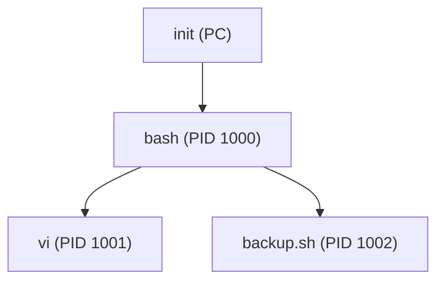
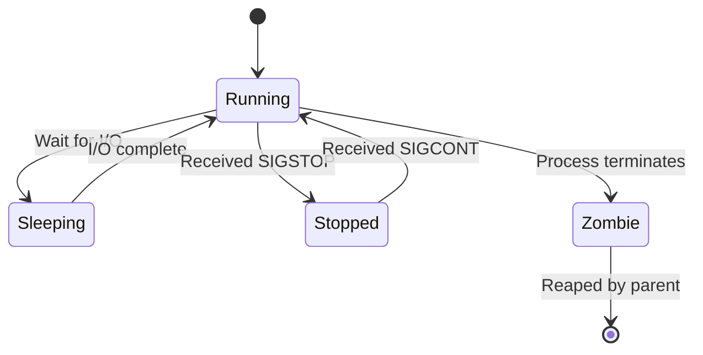
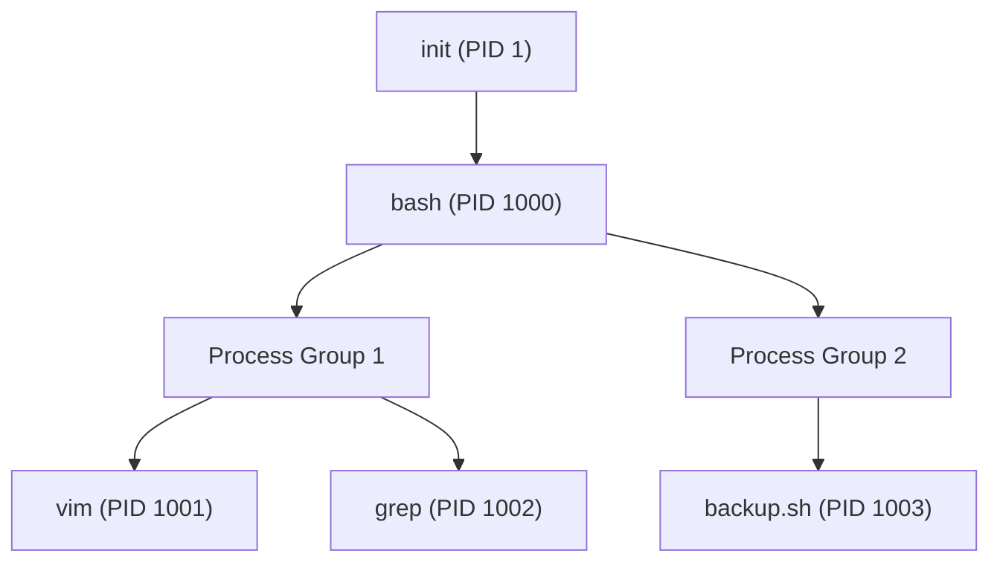
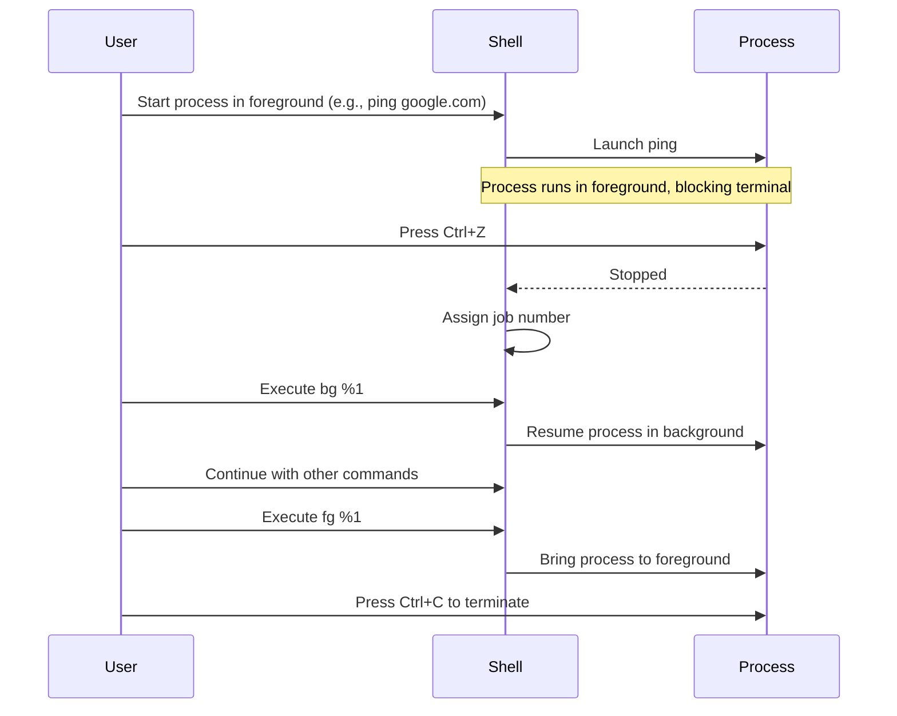

# Linux Background and Foreground Process Management

## Table of Contents

1. [Introduction](#introduction)
2. [Understanding Background and Foreground Processes](#understanding-background-and-foreground-processes)
   - [What is a Foreground Process?](#what-is-a-foreground-process)
   - [What is a Background Process?](#what-is-a-background-process)
   - [Key Differences](#key-differences)
   - [Process Hierarchy and States](#process-hierarchy-and-states)
3. [Managing Processes](#managing-processes)
   - [Starting Processes in the Foreground](#starting-processes-in-the-foreground)
   - [Starting Processes in the Background](#starting-processes-in-the-background)
   - [Listing Background and Foreground Processes](#listing-background-and-foreground-processes)
   - [Bringing Background Processes to the Foreground](#bringing-background-processes-to-the-foreground)
   - [Sending Processes to the Background](#sending-processes-to-the-background)
   - [Terminating Processes](#terminating-processes)
4. [Advanced Process Management](#advanced-process-management)
   - [Using `nohup` to Keep Processes Running After Logout](#using-nohup-to-keep-processes-running-after-logout)
   - [Using `disown` to Remove Processes from Shell's Job Control](#using-disown-to-remove-processes-from-shells-job-control)
   - [Using `screen` and `tmux` for Persistent Sessions](#using-screen-and-tmux-for-persistent-sessions)
   - [Process Groups and Sessions](#process-groups-and-sessions)
   - [Job Control Mechanism](#job-control-mechanism)
   - [Signal Handling and Process Control](#signal-handling-and-process-control)
   - [Integration with `systemd`](#integration-with-systemd)
5. [Practical Examples](#practical-examples)
   - [Example 1: Running a Script in the Background](#example-1-running-a-script-in-the-background)
   - [Example 2: Bringing a Background Process to the Foreground](#example-2-bringing-a-background-process-to-the-foreground)
   - [Example 3: Keeping a Process Running After Logout](#example-3-keeping-a-process-running-after-logout)
   - [Example 4: Managing Multiple Background Processes](#example-4-managing-multiple-background-processes)
   - [Example 5: Using `tmux` for Session Management](#example-5-using-tmux-for-session-management)
6. [Best Practices](#best-practices)
7. [Troubleshooting](#troubleshooting)
8. [Diagrams](#diagrams)
   - [Process Hierarchy](#process-hierarchy)
   - [Job Control Workflow](#job-control-workflow)
9. [References](#references)

---

## Introduction

In Unix-like operating systems, processes can run either in the **foreground** or **background**. Understanding the distinction between these two modes and effectively managing them is crucial for efficient system administration and multitasking. This guide explores the concepts of foreground and background processes, the commands used to manage them, advanced process management techniques, best practices, and provides practical examples to optimize workflow and system performance.

---

## Understanding Background and Foreground Processes

### What is a Foreground Process?

A **foreground process** is a process that runs interactively with the user, occupying the terminal or console until it completes its execution. While a foreground process is running, the user cannot interact with the terminal for other commands unless the process is suspended.

**Key Characteristics:**

- **Interactive:** Requires user interaction and input.
- **Terminal-Dependent:** Tied to the terminal session where it was started.
- **Exclusive Access:** Blocks the terminal until completion unless interrupted.

**Example:**

Running a text editor like `vim`:

```bash
vim myfile.txt
```

While `vim` is running, the terminal is occupied, and the user cannot execute other commands in the same terminal session.

### What is a Background Process?

A **background process** runs independently of the terminal, allowing the user to continue using the terminal for other tasks while the process executes. Background processes do not require user interaction and are suitable for tasks that take a long time to complete.

**Key Characteristics:**

- **Non-Interactive:** Does not require user input once started.
- **Terminal-Independent:** Continues running even if the user performs other tasks in the terminal.
- **Concurrent Execution:** Allows multitasking by freeing up the terminal for other commands.

**Example:**

Running a script in the background:

```bash
./long_running_script.sh &
```

The `&` symbol sends the script to run in the background, allowing the user to continue using the terminal.

### Key Differences

| **Aspect**                | **Foreground Process**                                 | **Background Process**                                  |
| ------------------------- | ------------------------------------------------------ | ------------------------------------------------------- |
| **Interactivity**         | Interactive, requires user input                       | Non-interactive, does not require user input            |
| **Terminal Dependency**   | Tied to the terminal session                           | Runs independently of the terminal session              |
| **Control**               | Blocks the terminal until completion                   | Allows continued use of the terminal for other commands |
| **Usage Scenarios**       | Tasks needing user interaction (e.g., editors, shells) | Long-running tasks, scripts, or services                |
| **Symbol Representation** | No special symbol                                      | Uses `&` to denote background execution                 |

### Process Hierarchy and States

Understanding how processes are structured and their various states is vital for effective process management.

#### Process Hierarchy

In Linux, processes are organized in a hierarchical structure. The `init` process (PID 1) is the ancestor of all other processes.



#### Process States

Processes in Linux can exist in several states:

- **Running (R):** Actively executing.
- **Sleeping (S):** Waiting for an event or resource.
- **Stopped (T):** Suspended by a signal.
- **Zombie (Z):** Terminated but not reaped by the parent.



---

## Managing Processes

Effective process management involves starting, stopping, and controlling processes to optimize system performance and workflow.

### Starting Processes in the Foreground

By default, processes run in the foreground when executed.

**Example:**

```bash
ping google.com
```

This command will continuously send ping requests to Google until interrupted (`Ctrl + C`).

### Starting Processes in the Background

Appending an `&` at the end of a command sends the process to the background.

**Example:**

```bash
ping google.com &
```

**Output:**

```
[1] 12345
```

- `[1]`: Job number
- `12345`: Process ID (PID)

The terminal becomes available for other commands immediately.

### Listing Background and Foreground Processes

Use the `jobs` command to list current jobs started in the background.

**Example:**

```bash
jobs
```

**Sample Output:**

```
[1]+  Running                 ping google.com &
[2]-  Running                 ./backup_script.sh &
```

- `[1]+`: Job number with `+` indicating the current job
- `[2]-`: Job number with `-` indicating the previous job
- `Running`: Current status
- `ping google.com &`: Command being executed

### Bringing Background Processes to the Foreground

Use the `fg` command followed by the job number to bring a background process to the foreground.

**Syntax:**

```bash
fg %[job_number]
```

**Example:**

Bring job `1` to the foreground:

```bash
fg %1
```

**Output:**

```
ping google.com
```

Now, `ping` runs in the foreground, blocking the terminal until interrupted.

### Sending Processes to the Background

While a foreground process is running, you can send it to the background.

**Steps:**

1. **Suspend the Process:**

   Press `Ctrl + Z` to suspend the foreground process.

   **Output:**

   ```
   [1]+  Stopped                 ping google.com
   ```

2. **Send to Background:**

   Use the `bg` command to resume the suspended process in the background.

   **Command:**

   ```bash
   bg %1
   ```

   **Output:**

   ```
   [1]+ ping google.com &
   ```

Now, `ping` runs in the background, and the terminal is free for other commands.

### Terminating Processes

To terminate processes, use commands like `kill`, `pkill`, or `killall`.

**Using `kill`:**

**Syntax:**

```bash
kill [signal] PID
```

**Example:**

Terminate process with PID `12345` using `SIGTERM`:

```bash
kill -SIGTERM 12345
```

**Using `pkill`:**

Terminate processes by name.

**Syntax:**

```bash
pkill [options] process_name
```

**Example:**

Terminate all `ping` processes:

```bash
pkill ping
```

**Using `killall`:**

Terminate all instances of a process by name.

**Syntax:**

```bash
killall [options] process_name
```

**Example:**

Terminate all `ping` processes:

```bash
killall ping
```

---

## Advanced Process Management

Beyond basic foreground and background management, advanced techniques help ensure processes run reliably and persistently.

### Using `nohup` to Keep Processes Running After Logout

The `nohup` command runs a process immune to hangups, allowing it to continue running after the user logs out.

**Syntax:**

```bash
nohup command [args] &
```

**Example:**

Run a script that should continue after logout:

```bash
nohup ./long_running_task.sh &
```

**Output:**

```
nohup: ignoring input and appending output to 'nohup.out'
[1] 12345
```

The output is redirected to `nohup.out` by default.

### Using `disown` to Remove Processes from Shell's Job Control

The `disown` command removes jobs from the shell's job table, preventing them from being terminated when the shell exits.

**Steps:**

1. **Start a Process in the Background:**

   ```bash
   ./long_running_task.sh &
   ```

2. **List Jobs:**

   ```bash
   jobs
   ```

   **Sample Output:**

   ```
   [1]+  Running                 ./long_running_task.sh &
   ```

3. **Disown the Process:**

   ```bash
   disown %1
   ```

   Now, the process is no longer listed in the shell's job table and won't be terminated upon logout.

### Using `screen` and `tmux` for Persistent Sessions

**`screen`** and **`tmux`** are terminal multiplexer programs that allow you to create persistent terminal sessions that can be detached and reattached, ensuring processes continue running even if the terminal closes.

#### Using `tmux`:

1. **Start a New Session:**

   ```bash
   tmux new -s mysession
   ```

2. **Run Your Commands or Processes Within the Session:**

   ```bash
   ./long_running_task.sh
   ```

3. **Detach from the Session:**

   Press `Ctrl + B`, then `D`.

4. **Reattach to the Session Later:**

   ```bash
   tmux attach -t mysession
   ```

#### Using `screen`:

1. **Start a New Session:**

   ```bash
   screen -S mysession
   ```

2. **Run Your Commands or Processes Within the Session:**

   ```bash
   ./long_running_task.sh
   ```

3. **Detach from the Session:**

   Press `Ctrl + A`, then `D`.

4. **Reattach to the Session Later:**

   ```bash
   screen -r mysession
   ```

### Process Groups and Sessions

**Process Groups** and **Sessions** are fundamental to job control in Unix-like systems.

- **Process Group:** A collection of one or more processes. Typically, all processes in a pipeline belong to the same process group.
- **Session:** A collection of one or more process groups. A session can have a controlling terminal.

**Diagram:**



**Explanation:**

- `init` spawns `bash`.
- `bash` manages two process groups:
  - **Process Group 1:** Contains `vim` and `grep`.
  - **Process Group 2:** Contains `backup.sh`.

### Job Control Mechanism

Job control allows users to manage multiple processes from a single terminal. It leverages process groups and sessions to control foreground and background jobs.

**Key Commands:**

- `jobs`: Lists active jobs.
- `bg`: Sends a stopped job to the background.
- `fg`: Brings a background job to the foreground.
- `kill`: Sends signals to jobs or processes.

**Workflow Diagram:**



### Signal Handling and Process Control

Signals are used to communicate with processes, instructing them to perform specific actions.

**Common Signals:**

- `SIGINT` (`Ctrl + C`): Interrupt the process.
- `SIGTSTP` (`Ctrl + Z`): Suspend the process.
- `SIGTERM`: Terminate the process gracefully.
- `SIGKILL`: Forcefully terminate the process.

**Handling Signals:**

Processes can handle signals by defining signal handlers. Proper signal handling ensures that processes can clean up resources before termination.

**Example in Bash:**

```bash
#!/bin/bash

trap "echo 'SIGTERM received. Exiting...'; exit" SIGTERM

while true; do
    echo "Running..."
    sleep 5
done
```

**Explanation:**

- The `trap` command catches the `SIGTERM` signal.
- Upon receiving `SIGTERM`, it echoes a message and exits gracefully.

### Integration with `systemd`

`systemd` is the default init system in many Linux distributions, managing system processes and services.

**Creating a `systemd` Service for a Background Process:**

1. **Create a Service File:**

   **`/etc/systemd/system/myservice.service`**

   ```ini
   [Unit]
   Description=My Background Service
   After=network.target

   [Service]
   ExecStart=/usr/local/bin/myservice.sh
   Restart=always
   User=nobody
   Group=nogroup
   Environment=ENV_VAR=value

   [Install]
   WantedBy=multi-user.target
   ```

2. **Move the Executable to a Standard Location:**

   ```bash
   sudo mv myservice.sh /usr/local/bin/
   sudo chmod +x /usr/local/bin/myservice.sh
   ```

3. **Reload `systemd` Manager Configuration:**

   ```bash
   sudo systemctl daemon-reload
   ```

4. **Start the Service:**

   ```bash
   sudo systemctl start myservice
   ```

5. **Enable the Service to Start at Boot:**

   ```bash
   sudo systemctl enable myservice
   ```

6. **Check Service Status:**

   ```bash
   sudo systemctl status myservice
   ```

**Advantages of Using `systemd`:**

- **Automatic Restart:** Configurable to restart services on failure.
- **Logging Integration:** Uses `journalctl` for centralized logging.
- **Dependency Management:** Define dependencies between services.
- **Security:** Run services under specific users and groups with limited permissions.

---

## Practical Examples

### Example 1: Running a Script in the Background

**Scenario:**

You have a script `backup.sh` that performs system backups. You want it to run in the background so you can continue using the terminal.

**Steps:**

1. **Start the Script in the Background:**

   ```bash
   ./backup.sh &
   ```

2. **Sample Output:**

   ```
   [1] 12345
   ```

3. **Check Running Jobs:**

   ```bash
   jobs
   ```

   **Output:**

   ```
   [1]+  Running                 ./backup.sh &
   ```

### Example 2: Bringing a Background Process to the Foreground

**Scenario:**

A background process `ping` is running, and you need to interact with it or stop it.

**Steps:**

1. **List Jobs:**

   ```bash
   jobs
   ```

   **Output:**

   ```
   [1]+  Running                 ping google.com &
   ```

2. **Bring `ping` to the Foreground:**

   ```bash
   fg %1
   ```

   **Output:**

   ```
   ping google.com
   ```

3. **Terminate `ping`:**

   Press `Ctrl + C`.

### Example 3: Keeping a Process Running After Logout

**Scenario:**

You start a long-running process but need to log out without stopping the process.

**Steps:**

1. **Start the Process with `nohup`:**

   ```bash
   nohup ./long_running_task.sh &
   ```

2. **Output:**

   ```
   nohup: ignoring input and appending output to 'nohup.out'
   [1] 12345
   ```

3. **Logout:**

   The process continues running in the background, and output is saved to `nohup.out`.

### Example 4: Managing Multiple Background Processes

**Scenario:**

You have multiple scripts that need to run simultaneously in the background.

**Steps:**

1. **Start Multiple Processes:**

   ```bash
   ./task1.sh &
   ./task2.sh &
   ./task3.sh &
   ```

2. **List Jobs:**

   ```bash
   jobs
   ```

   **Output:**

   ```
   [1]-  Running                 ./task1.sh &
   [2]+  Running                 ./task2.sh &
   [3]+  Running                 ./task3.sh &
   ```

3. **Bring a Specific Job to Foreground:**

   ```bash
   fg %2
   ```

4. **Terminate All Background Processes:**

   ```bash
   killall task1.sh task2.sh task3.sh
   ```

### Example 5: Using `tmux` for Session Management

**Scenario:**

You want to run a long-running task that persists across multiple terminal sessions or network disruptions.

**Steps:**

1. **Start a New `tmux` Session:**

   ```bash
   tmux new -s mysession
   ```

2. **Run Your Long-Running Task:**

   ```bash
   ./long_running_task.sh
   ```

3. **Detach from the Session:**

   Press `Ctrl + B`, then `D`.

4. **Reattach to the Session Later:**

   ```bash
   tmux attach -t mysession
   ```

---

## Best Practices

1. **Use Background Processes for Non-Critical Tasks:**

   - Assign background execution to tasks that do not require immediate attention, such as backups, data processing, or monitoring scripts.

2. **Monitor Background Processes:**

   - Regularly check the status of background processes using `jobs`, `ps`, `top`, or `htop` to ensure they are running as expected.

3. **Manage Resource Usage:**

   - Assign appropriate niceness values to background processes to prevent them from consuming excessive CPU resources. Use `nice` and `renice` as needed.

4. **Use Persistent Sessions for Long-Running Tasks:**

   - Utilize `tmux` or `screen` to manage sessions for tasks that need to persist across multiple terminal connections or system reboots.

5. **Handle Output Appropriately:**

   - Redirect output of background processes to log files or `/dev/null` to prevent cluttering the terminal and to facilitate debugging.

   **Example:**

   ```bash
   ./long_running_task.sh > /var/log/long_running_task.log 2>&1 &
   ```

6. **Ensure Proper Termination:**

   - Implement signal handling in scripts and processes to gracefully terminate background tasks when necessary.

7. **Document Process Management Strategies:**

   - Maintain documentation for how critical background processes are managed, including startup commands, monitoring procedures, and termination protocols.

8. **Avoid Overloading the System with Background Processes:**

   - Limit the number of concurrent background processes to maintain system stability and responsiveness.

9. **Leverage `systemd` for Service Management:**

   - Use `systemd` to manage background services, benefiting from features like automatic restarts and dependency handling.

10. **Implement Security Measures:**

    - Run background processes with the least privileges necessary to minimize security risks.

---

## Troubleshooting

### Issue 1: Background Process Stops Unexpectedly

**Symptom:**

- A background process that was running smoothly stops without warning.

**Possible Causes:**

- The parent shell was closed, and the process was not properly detached.
- The process encountered an error and exited.
- Resource limitations (e.g., memory or CPU constraints).

**Solutions:**

1. **Use `nohup` or `disown`:**

   - Ensure processes are properly detached using `nohup` or `disown` to prevent termination upon shell exit.

2. **Check Logs:**

   - Review log files or output redirection targets for error messages.

     ```bash
     tail -f /var/log/long_running_task.log
     ```

3. **Verify Resource Usage:**

   - Use `top` or `htop` to monitor system resources and ensure the process has sufficient resources.

4. **Restart the Process:**

   - If the process failed, restart it using appropriate commands with proper backgrounding.

### Issue 2: Cannot Bring Background Process to Foreground

**Symptom:**

- Attempting to bring a background process to the foreground using `fg` results in an error.

**Possible Causes:**

- The process was disowned or detached from the shell.
- The process has already terminated.
- Incorrect job number was specified.

**Solutions:**

1. **Check Job Numbers:**

   - Use `jobs` to list current jobs and verify the correct job number.

     ```bash
     jobs
     ```

2. **Ensure Process is Still Running:**

   - Use `ps` to verify the process is active.

     ```bash
     ps -p PID
     ```

3. **Use `fg` Correctly:**

   - Ensure the correct job number is used with the `%` symbol.

     ```bash
     fg %1
     ```

4. **Restart the Process if Needed:**

   - If the process has terminated, restart it in the foreground.

### Issue 3: Unable to Start Process in the Background

**Symptom:**

- Adding `&` to a command does not start it in the background as expected.

**Possible Causes:**

- Shell-specific behavior or restrictions.
- Syntax errors in the command.
- The process itself is designed to stay in the foreground.

**Solutions:**

1. **Check Command Syntax:**

   - Ensure the command is correctly formatted.

     ```bash
     ./my_script.sh &
     ```

2. **Use `nohup` for Detached Execution:**

   - If the process is sensitive to hangups, use `nohup`.

     ```bash
     nohup ./my_script.sh &
     ```

3. **Verify Shell Compatibility:**

   - Ensure that the shell being used supports background execution (`bash`, `zsh`, etc.).

4. **Check Process Design:**

   - Some processes may have built-in mechanisms to stay in the foreground. Modify the process or use tools like `screen` or `tmux` if necessary.

### Issue 4: Multiple Processes with the Same Job Number

**Symptom:**

- Confusion arises when multiple background processes share similar job numbers.

**Possible Causes:**

- Rapidly starting and stopping jobs without proper management.
- Complex scripts spawning multiple background processes.

**Solutions:**

1. **Assign Unique Job Names:**

   - Use descriptive job names when possible to differentiate between processes.

2. **Track PIDs Instead of Job Numbers:**

   - Use `ps` or `pgrep` to manage processes based on their PIDs rather than job numbers.

     ```bash
     ps -ef | grep my_script.sh
     ```

3. **Limit Concurrent Background Processes:**

   - Control the number of background processes to maintain clarity and manageability.

### Issue 5: Detached Background Process Not Terminating

**Symptom:**

- A detached background process continues running even after attempting to terminate it.

**Possible Causes:**

- The process is ignoring termination signals.
- The process has become unresponsive.

**Solutions:**

1. **Send a Stronger Signal:**

   - Use `SIGKILL` to forcefully terminate the process.

     ```bash
     kill -SIGKILL PID
     ```

2. **Check for Zombie Processes:**

   - Zombie processes remain in the process table without consuming resources.

     ```bash
     ps aux | grep Z
     ```

3. **Ensure Proper Signal Handling:**

   - Modify the process to handle signals appropriately, ensuring it can terminate gracefully.

---

## Diagrams

### Process Hierarchy

Understanding the relationship between processes helps in effective process management.


**Explanation:**

- `init` is the root process.
- `bash` is spawned by `init`.
- `bash` manages two process groups:
  - **Process Group 1:** Contains `vim` and `grep`.
  - **Process Group 2:** Contains `backup.sh`.

### Job Control Workflow

Illustrates how job control commands interact with processes.


---

## References

- [GNU `nohup` Manual](https://www.gnu.org/software/coreutils/manual/html_node/nohup-invocation.html)
- [GNU `screen` Manual](https://www.gnu.org/software/screen/manual/screen.html)
- [GNU `tmux` Manual](https://man7.org/linux/man-pages/man1/tmux.1.html)
- [Linux `jobs` Command](https://man7.org/linux/man-pages/man1/jobs.1.html)
- [Linux `bg` and `fg` Commands](https://man7.org/linux/man-pages/man1/bg.1.html)
- [Linux `kill` Command](https://man7.org/linux/man-pages/man1/kill.1.html)
- [Linux `ps` Command](https://man7.org/linux/man-pages/man1/ps.1.html)
- [Advanced Bash-Scripting Guide](https://tldp.org/LDP/abs/html/)
- [Understanding Process Control in Unix](https://www.geeksforgeeks.org/process-control-unix/)
- [Process Management in Linux](https://www.tutorialspoint.com/unix/unix-process-management.htm)
- [Linux Process Scheduling](https://www.geeksforgeeks.org/linux-process-scheduling/)
- [Managing Linux Processes](https://www.digitalocean.com/community/tutorials/an-introduction-to-linux-process-management)
- [Linux `systemd` Service Files](https://www.freedesktop.org/software/systemd/man/systemd.service.html)
- [Advanced Programming in the UNIX Environment](https://www.amazon.com/Advanced-Programming-UNIX-Environment-3rd/dp/0321637739) by W. Richard Stevens
- [Understanding the `screen` and `tmux` Tools](https://www.digitalocean.com/community/tutorials/how-to-use-linux-screen)
- [Mermaid Diagram Syntax](https://mermaid-js.github.io/mermaid/#/)
