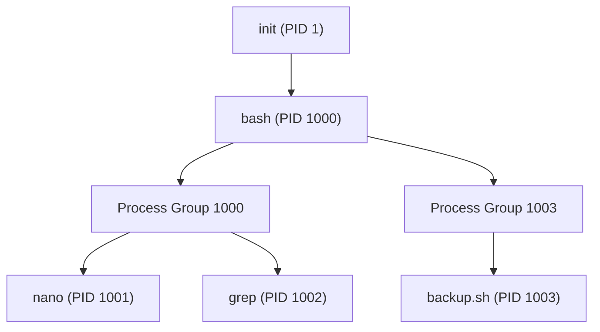
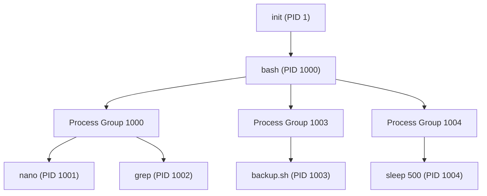
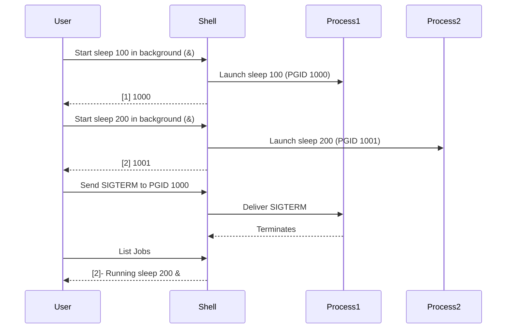

# Understanding Process Group ID (PGID) in Linux

## Table of Contents

1. [Introduction](#introduction)
2. [What is PGID?](#what-is-pgid)
   - [Key Concepts](#key-concepts)
   - [Process Group ID (PGID) vs. Process ID (PID)](#process-group-id-pgid-vs-process-id-pid)
3. [Process Groups and Sessions](#process-groups-and-sessions)
   - [Sessions](#sessions)
   - [Process Groups](#process-groups)
4. [Managing PGID via Command Line](#managing-pgid-via-command-line)
   - [Viewing PGID](#viewing-pgid)
   - [Setting PGID](#setting-pgid)
   - [Using `setpgid` in C](#using-setpgid-in-c)
5. [Practical CLI Examples](#practical-cli-examples)
   - [Example 1: Viewing PGID of Processes](#example-1-viewing-pgid-of-processes)
   - [Example 2: Creating a New Process Group](#example-2-creating-a-new-process-group)
   - [Example 3: Changing PGID of a Process](#example-3-changing-pgid-of-a-process)
   - [Example 4: Sending Signals to a Process Group](#example-4-sending-signals-to-a-process-group)
6. [Diagram Illustrations](#diagram-illustrations)
   - [Process Hierarchy and PGID](#process-hierarchy-and-pgid)
   - [Job Control and PGID Workflow](#job-control-and-pgid-workflow)
7. [Best Practices](#best-practices)
8. [Troubleshooting](#troubleshooting)
9. [References](#references)

---

## Introduction

In Unix-like operating systems, **Process Group ID (PGID)** is a fundamental concept that plays a critical role in process management and job control. Understanding PGID is essential for system administrators, developers, and power users to effectively manage multiple processes, control job execution, and handle signals appropriately. This guide delves into the intricacies of PGID, its relationship with processes and sessions, and provides practical methods to manage PGIDs using the command line.

---

## What is PGID?

### Key Concepts

- **Process Group:** A collection of one or more processes that can be managed collectively. Typically, all processes in a pipeline or job belong to the same process group.
- **Process Group ID (PGID):** A unique identifier assigned to each process group. The PGID is usually the PID of the group's leader process.

- **Job Control:** A mechanism that allows users to manage multiple process groups (jobs) within a single shell session, enabling operations like backgrounding, foregrounding, and terminating jobs.

### Process Group ID (PGID) vs. Process ID (PID)

| **Aspect**     | **Process ID (PID)**                                        | **Process Group ID (PGID)**                             |
| -------------- | ----------------------------------------------------------- | ------------------------------------------------------- |
| **Definition** | A unique identifier for each individual process.            | A unique identifier for a group of related processes.   |
| **Uniqueness** | Unique across the entire system at any given time.          | Unique within a session; can be same as a PID.          |
| **Usage**      | Identifying and managing individual processes.              | Managing and controlling groups of processes together.  |
| **Assignment** | Automatically assigned by the system upon process creation. | Typically set to the PID of the group's leader process. |

---

## Process Groups and Sessions

### Sessions

A **Session** is a collection of one or more process groups. It is a higher-level organizational structure that encompasses all the process groups initiated by a particular login or service.

- **Session Leader:** The first process in a session (often a shell like `bash`).
- **Controlling Terminal:** The terminal associated with the session, which receives input and displays output for the foreground process group.

### Process Groups

A **Process Group** is a subset within a session, consisting of one or more processes that can be managed as a single entity.

- **Group Leader:** The first process in a process group, usually the shell or the first process in a pipeline.
- **Members:** All processes within the same group share the same PGID.

#### Process Hierarchy Diagram



**Explanation:**

- `init` is the root process.
- `bash` is spawned by `init` and serves as the session leader.
- `pg1` (PGID 1000) includes `nano` and `grep`, processes started by `bash`.
- `pg2` (PGID 1003) includes `backup.sh`, another process started by `bash`.

---

## Managing PGID via Command Line

### Viewing PGID

To view the PGID of running processes, you can use the `ps` command with appropriate options.

**Command:**

```bash
ps -eo pid,ppid,pgid,cmd
```

**Sample Output:**

```
  PID  PPID  PGID CMD
 1000     1  1000 /bin/bash
 1001  1000  1000 nano myfile.txt
 1002  1000  1000 grep "search_term" myfile.txt
 1003  1000  1003 ./backup.sh
```

- **PID:** Process ID
- **PPID:** Parent Process ID
- **PGID:** Process Group ID
- **CMD:** Command executed

### Setting PGID

By default, the PGID is set to the PID of the process group leader. However, you can manually set the PGID of a process using the `setpgid` system call in programming languages like C. Directly changing PGID from the command line is not straightforward and typically requires writing a small program or using existing utilities that expose this functionality.

**Example in C:**

```c
#include <unistd.h>
#include <stdio.h>
#include <stdlib.h>

int main(int argc, char *argv[]) {
    pid_t pid, pgid;

    if (argc != 3) {
        fprintf(stderr, "Usage: %s <pid> <pgid>\n", argv[0]);
        exit(EXIT_FAILURE);
    }

    pid = atoi(argv[1]);
    pgid = atoi(argv[2]);

    if (setpgid(pid, pgid) == -1) {
        perror("setpgid");
        exit(EXIT_FAILURE);
    }

    printf("PGID of PID %d set to %d\n", pid, pgid);
    return 0;
}
```

**Usage:**

```bash
gcc set_pgid.c -o set_pgid
./set_pgid 1001 1003
```

**Note:** Changing PGID requires appropriate permissions. Typically, only the process itself or the superuser can change its PGID.

### Using `setpgid` in C

The `setpgid` function sets the PGID of a specified process.

**Syntax:**

```c
int setpgid(pid_t pid, pid_t pgid);
```

- **pid:** Process ID of the target process.
- **pgid:** Desired Process Group ID.

**Return Value:**

- `0` on success.
- `-1` on failure, with `errno` set appropriately.

---

## Practical CLI Examples

### Example 1: Viewing PGID of Processes

**Objective:** Display the PGID of all running processes.

**Command:**

```bash
ps -eo pid,ppid,pgid,cmd
```

**Output:**

```
  PID  PPID  PGID CMD
 1000     1  1000 /bin/bash
 1001  1000  1000 nano myfile.txt
 1002  1000  1000 grep "search_term" myfile.txt
 1003  1000  1003 ./backup.sh
```

**Explanation:**

- Processes `nano` and `grep` share the same PGID (`1000`) as their parent `bash`, indicating they are in the same process group.
- `backup.sh` has a different PGID (`1003`), indicating it belongs to a separate process group.

### Example 2: Creating a New Process Group

**Objective:** Start a new process in its own process group.

**Method:** Use `setsid` to start a new session, which inherently creates a new process group.

**Command:**

```bash
setsid sleep 500 &
```

**Output:**

```
[1] 1004
```

**Explanation:**

- `setsid` starts `sleep 500` in a new session and process group.
- The PGID of `sleep 500` is `1004`, distinct from the shell's PGID.

**Verification:**

```bash
ps -eo pid,ppid,pgid,cmd | grep sleep
```

**Sample Output:**

```
1004     1  1004 setsid sleep 500
```

### Example 3: Changing PGID of a Process

**Objective:** Change the PGID of an existing process.

**Prerequisite:** Requires superuser privileges or the process itself to change its PGID.

**Method:** Use a custom C program (as shown earlier) or leverage existing tools if available.

**Using the C Program:**

```bash
sudo ./set_pgid 1001 1003
```

**Output:**

```
PGID of PID 1001 set to 1003
```

**Explanation:**

- Changes the PGID of process `1001` (`nano`) to `1003` (`backup.sh`'s PGID), effectively moving `nano` into the `backup.sh` process group.

**Verification:**

```bash
ps -eo pid,ppid,pgid,cmd | grep nano
```

**Sample Output:**

```
1001 1000 1003 nano myfile.txt
```

### Example 4: Sending Signals to a Process Group

**Objective:** Terminate all processes in a specific process group.

**Command:**

```bash
kill -SIGTERM -1003
```

**Explanation:**

- The negative sign before `1003` indicates that the signal should be sent to the entire process group with PGID `1003`.
- This terminates all processes within PGID `1003`, such as `backup.sh` and any other members.

**Verification:**

```bash
ps -eo pid,ppid,pgid,cmd | grep backup
```

**Sample Output:**

```
# No output indicates the process has been terminated.
```

---

## Diagram Illustrations

### Process Hierarchy and PGID

Understanding the relationship between processes and their groups is crucial for effective management.



**Explanation:**

- `init` is the root process.
- `bash` is spawned by `init` and acts as the session leader.
- `pg1` (PGID 1000) includes `nano` and `grep`.
- `pg2` (PGID 1003) includes `backup.sh`.
- `pg3` (PGID 1004) includes `sleep 500`, started with `setsid` to create a new process group.

### Job Control and PGID Workflow

Illustrates how job control commands interact with process groups.



**Explanation:**

1. User starts two background jobs (`sleep 100` and `sleep 200`).
2. Each job is assigned a unique PGID (`1000` and `1001`).
3. User sends a `SIGTERM` to PGID `1000`, terminating `sleep 100`.
4. Only the targeted process group (`sleep 100`) is affected.
5. Listing jobs shows that only `sleep 200` is still running.

---

## Best Practices

1. **Use Descriptive Commands and Scripts:**

   - When creating multiple process groups, use descriptive names to easily identify and manage them.

2. **Monitor Process Groups Regularly:**

   - Utilize `ps`, `top`, or `htop` to keep track of active process groups and their statuses.

3. **Handle Signals Appropriately:**

   - Implement proper signal handling in your applications to ensure they respond gracefully to termination or suspension signals.

4. **Leverage Terminal Multiplexers:**

   - Use tools like `tmux` or `screen` to manage complex sessions and multiple process groups efficiently.

5. **Document Process Management Strategies:**

   - Maintain documentation for critical background jobs and their associated PGIDs for easier troubleshooting and management.

6. **Limit the Number of Background Jobs:**

   - Avoid overloading the system with excessive background jobs to maintain optimal performance and responsiveness.

7. **Use `systemd` for Persistent Services:**

   - For services that need to run continuously, consider creating `systemd` service units instead of relying solely on background jobs.

8. **Assign Appropriate Permissions:**

   - Ensure that background processes run with the necessary permissions and do not expose the system to security risks.

9. **Automate Process Group Management:**
   - Incorporate process group management into scripts and automation tools to maintain consistency across system reboots and deployments.

---

## Troubleshooting

### Issue 1: Background Process Stops Unexpectedly

**Symptom:**
A background process terminates without warning.

**Possible Causes:**

- The parent shell was closed without properly detaching the process.
- The process encountered an error and exited.
- Resource limitations (e.g., memory or CPU constraints).

**Solutions:**

1. **Ensure Proper Detachment:**

   - Use `nohup` or `disown` to prevent the process from terminating when the shell exits.
     ```bash
     nohup ./long_running_task.sh &
     disown %1
     ```

2. **Check Logs:**

   - If output was redirected to a log file, review it for error messages.
     ```bash
     tail -f nohup.out
     ```

3. **Verify Resource Usage:**

   - Use `top` or `htop` to monitor system resources and ensure the process has sufficient resources.

4. **Restart the Process:**
   - If the process failed, restart it with appropriate backgrounding.
     ```bash
     ./long_running_task.sh &
     ```

### Issue 2: Cannot Bring Background Process to Foreground

**Symptom:**
Attempting to bring a background process to the foreground using `fg` results in an error.

**Possible Causes:**

- The process was disowned or detached from the shell.
- The process has already terminated.
- Incorrect job number was specified.

**Solutions:**

1. **Check Job Numbers:**

   - Use `jobs` to list current jobs and verify the correct job number.
     ```bash
     jobs
     ```

2. **Ensure Process is Still Running:**

   - Use `ps` to verify the process is active.
     ```bash
     ps -p PID
     ```

3. **Use `fg` Correctly:**

   - Ensure the correct job number is used with the `%` symbol.
     ```bash
     fg %1
     ```

4. **Restart the Process if Needed:**
   - If the process has terminated, restart it in the foreground.
     ```bash
     ./my_process.sh
     ```

### Issue 3: Unable to Start Process in the Background

**Symptom:**
Adding `&` to a command does not start it in the background as expected.

**Possible Causes:**

- Shell-specific behavior or restrictions.
- Syntax errors in the command.
- The process itself is designed to stay in the foreground.

**Solutions:**

1. **Check Command Syntax:**

   - Ensure the command is correctly formatted.
     ```bash
     ./my_script.sh &
     ```

2. **Use `nohup` for Detached Execution:**

   - If the process is sensitive to hangups, use `nohup`.
     ```bash
     nohup ./my_script.sh &
     ```

3. **Verify Shell Compatibility:**

   - Ensure that the shell being used supports background execution (`bash`, `zsh`, etc.).

4. **Check Process Design:**
   - Some processes may have built-in mechanisms to stay in the foreground. Modify the process or use tools like `screen` or `tmux` if necessary.

### Issue 4: Multiple Processes with the Same Job Number

**Symptom:**
Confusion arises when multiple background processes share similar job numbers.

**Possible Causes:**

- Rapidly starting and stopping jobs without proper management.
- Complex scripts spawning multiple background processes.

**Solutions:**

1. **Assign Unique Job Names:**

   - Use descriptive job names when possible to differentiate between processes.

2. **Track PIDs Instead of Job Numbers:**

   - Use `ps` or `pgrep` to manage processes based on their PIDs rather than job numbers.
     ```bash
     ps -ef | grep my_script.sh
     ```

3. **Limit Concurrent Background Processes:**
   - Control the number of background processes to maintain clarity and manageability.

### Issue 5: Detached Background Process Not Terminating

**Symptom:**
A detached background process continues running even after attempting to terminate it.

**Possible Causes:**

- The process is ignoring termination signals.
- The process has become unresponsive.

**Solutions:**

1. **Send a Stronger Signal:**

   - Use `SIGKILL` to forcefully terminate the process.
     ```bash
     kill -SIGKILL PID
     ```

2. **Check for Zombie Processes:**

   - Zombie processes remain in the process table without consuming resources.
     ```bash
     ps aux | grep Z
     ```

3. **Ensure Proper Signal Handling:**
   - Modify the process to handle signals appropriately, ensuring it can terminate gracefully.

---

## Diagram Illustrations

### Process Hierarchy and PGID

Visualizing the relationship between processes and their groups helps in understanding how they are managed.


**Explanation:**

- `init` is the root process.
- `bash` is spawned by `init` and serves as the session leader.
- `pg1` (PGID 1000) includes `nano` and `grep`.
- `pg2` (PGID 1003) includes `backup.sh`.
- `pg3` (PGID 1004) includes `sleep 500`, started with `setsid` to create a new process group.

### Job Control and PGID Workflow

Illustrates how job control commands interact with process groups.


**Explanation:**

1. User starts two background jobs (`sleep 100` and `sleep 200`).
2. Each job is assigned a unique PGID (`1000` and `1001`).
3. User sends a `SIGTERM` to PGID `1000`, terminating `sleep 100`.
4. Only the targeted process group (`sleep 100`) is affected.
5. Listing jobs shows that only `sleep 200` is still running.

---

## References

- [GNU `nohup` Manual](https://www.gnu.org/software/coreutils/manual/html_node/nohup-invocation.html)
- [GNU `screen` Manual](https://www.gnu.org/software/screen/manual/screen.html)
- [GNU `tmux` Manual](https://man7.org/linux/man-pages/man1/tmux.1.html)
- [Linux `jobs` Command](https://man7.org/linux/man-pages/man1/jobs.1.html)
- [Linux `bg` and `fg` Commands](https://man7.org/linux/man-pages/man1/bg.1.html)
- [Linux `kill` Command](https://man7.org/linux/man-pages/man1/kill.1.html)
- [Linux `ps` Command](https://man7.org/linux/man-pages/man1/ps.1.html)
- [Advanced Bash-Scripting Guide](https://tldp.org/LDP/abs/html/)
- [Understanding Process Control in Unix](https://www.geeksforgeeks.org/process-control-unix/)
- [Process Management in Linux](https://www.tutorialspoint.com/unix/unix-process-management.htm)
- [Linux Process Scheduling](https://www.geeksforgeeks.org/linux-process-scheduling/)
- [Managing Linux Processes](https://www.digitalocean.com/community/tutorials/an-introduction-to-linux-process-management)
- [Linux `systemd` Service Files](https://www.freedesktop.org/software/systemd/man/systemd.service.html)
- [Advanced Programming in the UNIX Environment](https://www.amazon.com/Advanced-Programming-UNIX-Environment-3rd/dp/0321637739) by W. Richard Stevens
- [Understanding the `screen` and `tmux` Tools](https://www.digitalocean.com/community/tutorials/how-to-use-linux-screen)
- [Mermaid Diagram Syntax](https://mermaid-js.github.io/mermaid/#/)
