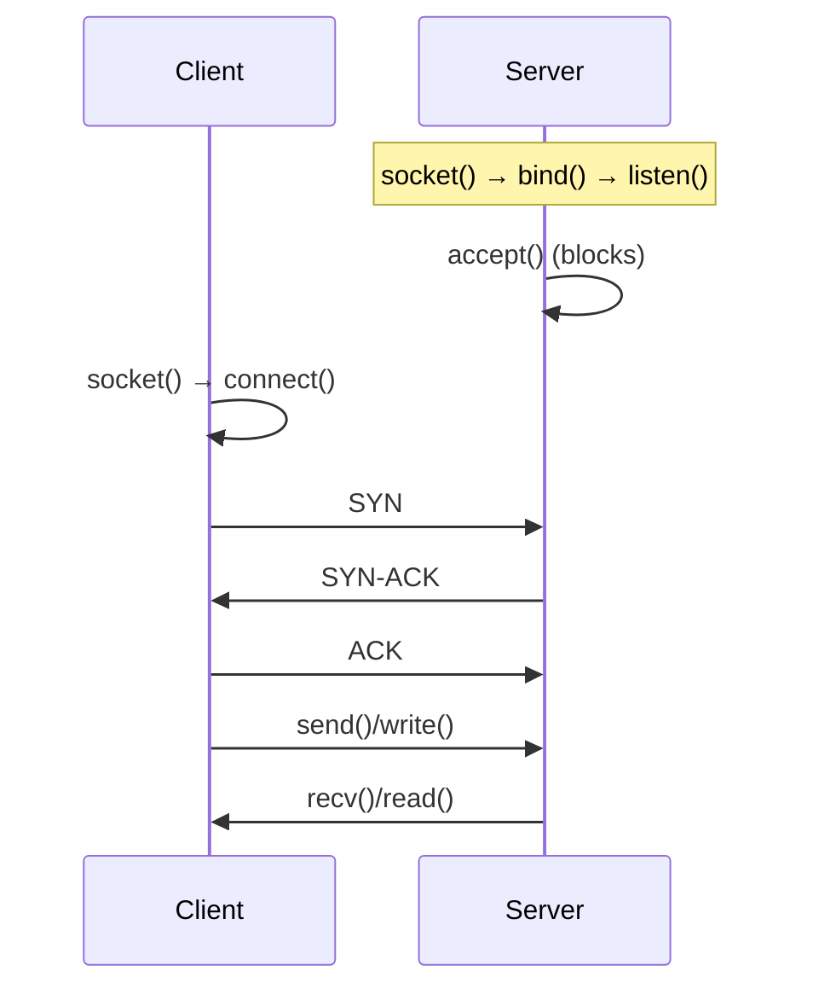
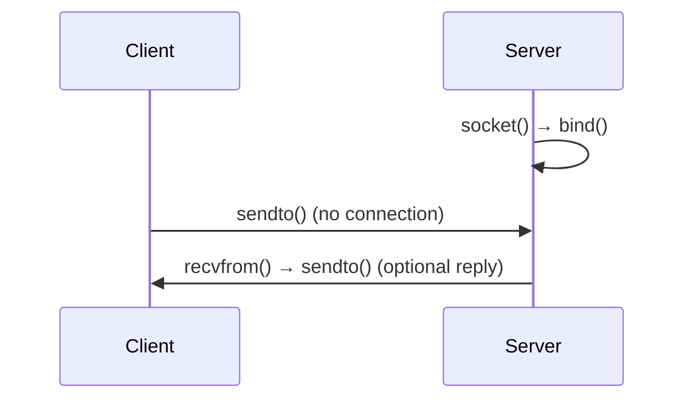

# Complete Guide to Socket Programming in C (TCP & UDP)

## Table of Contents

- [Complete Guide to Socket Programming in C (TCP \& UDP)](#complete-guide-to-socket-programming-in-c-tcp--udp)
  - [Table of Contents](#table-of-contents)
  - [1. Communication Types](#1-communication-types)
    - [TCP (Connection-Oriented)](#tcp-connection-oriented)
    - [UDP (Connectionless)](#udp-connectionless)
  - [2. Core Functions Deep Dive](#2-core-functions-deep-dive)
    - [2.1 `socket()`](#21-socket)
    - [2.2 `bind()`](#22-bind)
    - [2.3 `listen()` (TCP Only)](#23-listen-tcp-only)
    - [2.4 `accept()` (TCP Only)](#24-accept-tcp-only)
    - [2.5 `connect()` (TCP Only)](#25-connect-tcp-only)
    - [2.6 `send()` / `recv()` (TCP or Connected UDP)](#26-send--recv-tcp-or-connected-udp)
    - [2.7 `sendto()` / `recvfrom()` (UDP)](#27-sendto--recvfrom-udp)
      - [`sendto()`](#sendto)
      - [`recvfrom()`](#recvfrom)
    - [2.8 `close()` \& `shutdown()`](#28-close--shutdown)
    - [2.9 `htons()`, `ntohs()`, `htonl()`, and `ntohl()`](#29-htons-ntohs-htonl-and-ntohl)
  - [3. TCP vs UDP Code Comparison](#3-tcp-vs-udp-code-comparison)
    - [Receiver/Server Code](#receiverserver-code)
    - [Sender/Client Code](#senderclient-code)
  - [4. Parameter \& Return Value Reference](#4-parameter--return-value-reference)
    - [`struct sockaddr_in` (IPv4)](#struct-sockaddr_in-ipv4)
    - [Common Return Values \& Errors](#common-return-values--errors)
  - [5. Testing Both Protocols](#5-testing-both-protocols)
    - [TCP Test](#tcp-test)
    - [UDP Test](#udp-test)
    - [Key Differences in Testing](#key-differences-in-testing)

---

## 1. Communication Types

### TCP (Connection-Oriented)



Key features of **TCP**:

-   **Three-way handshake**: SYN → SYN-ACK → ACK for establishing a connection.
-   **Reliable, ordered** data delivery.
-   **Connection-oriented**: Must `connect()` before data transfer.
-   **Server** must `accept()` new connections.

---

### UDP (Connectionless)



Key features of **UDP**:

-   **No handshake**: You do not “connect” in the same way as TCP.
-   **Best-effort** delivery; no guaranteed ordering or retransmissions.
-   **Connectionless**: You send data with `sendto()` and receive with `recvfrom()`.

---

## 2. Core Functions Deep Dive

This section provides detailed descriptions, parameters, and common pitfalls for the major socket functions in C.

### 2.1 `socket()`

```c
int socket(int domain, int type, int protocol);
```

-   **Purpose**:
    Creates a new socket, returning a file descriptor you’ll use for further socket operations.
-   **Parameters**:

    1. **`domain`**:
        - Typically `AF_INET` (IPv4) or `AF_INET6` (IPv6).
        - Example: `AF_INET` is the most common for basic IPv4 usage.
    2. **`type`**:
        - `SOCK_STREAM` for TCP (reliable, connection-oriented).
        - `SOCK_DGRAM` for UDP (unreliable, connectionless).
    3. **`protocol`**:
        - Usually `0`, which lets the OS select the correct protocol for the given type (TCP or UDP).

-   **Return Value**:

    -   **≥ 0**: Socket descriptor if successful.
    -   **-1**: Error occurred (check `errno` or use `perror()` to diagnose).

-   **Common Pitfalls**:
    -   **Permission errors**: On some OSes, binding to ports < 1024 might require special privileges.
    -   **Unsupported domain**: If you pass an unsupported domain or type, you’ll get an error like `EAFNOSUPPORT`.

---

### 2.2 `bind()`

```c
int bind(int sockfd, const struct sockaddr *addr, socklen_t addrlen);
```

-   **Purpose**:
    Associates a socket with a specific **IP address** and **port number** (commonly done in server programs).

-   **Parameters**:

    1. **`sockfd`**: The socket descriptor returned by `socket()`.
    2. **`addr`**: A pointer to a `struct sockaddr_in` (for IPv4) or `struct sockaddr_in6` (for IPv6).
        - Typically cast to `(struct sockaddr*)`.
    3. **`addrlen`**: The size (in bytes) of the address structure, e.g. `sizeof(struct sockaddr_in)`.

-   **Usage Example** (simplified pseudocode):

    ```c
    struct sockaddr_in server_addr;
    server_addr.sin_family = AF_INET;
    server_addr.sin_addr.s_addr = INADDR_ANY;   // Listen on any local IP
    server_addr.sin_port = htons(8080);         // Convert 8080 to network byte order

    bind(sockfd, (struct sockaddr*)&server_addr, sizeof(server_addr));
    ```

-   **Return Value**:

    -   **0** on success.
    -   **-1** on error (e.g., `EADDRINUSE` if the port is already in use).

-   **Common Pitfalls**:
    -   Not calling `htons()` on the port leads to **incorrect port** binding.
    -   Binding to a port that’s already in use triggers `Address already in use`.
    -   Binding to a port < 1024 typically requires **root privileges** on Unix-like systems.

---

### 2.3 `listen()` (TCP Only)

```c
int listen(int sockfd, int backlog);
```

-   **Purpose**:
    Converts a bound socket into a **listening** socket (passive mode). Tells the OS you want to accept incoming **TCP** connections on `sockfd`.

-   **Parameters**:

    1. **`sockfd`**: The socket you created with `socket()` and bound with `bind()`.
    2. **`backlog`**: The number of pending connections that can be queued. Commonly 5 or 10.

-   **Return Value**:

    -   **0** on success.
    -   **-1** on error (e.g., if `sockfd` is invalid or not bound).

-   **Common Pitfalls**:
    -   Forgetting to call `listen()` on a socket intended for server connections results in `accept()` failures.
    -   A too-small `backlog` might cause new connections to be refused if the queue is full.

---

### 2.4 `accept()` (TCP Only)

```c
int accept(int sockfd, struct sockaddr *addr, socklen_t *addrlen);
```

-   **Purpose**:
    Used by a **TCP server** to **accept** an incoming client connection. Returns a **new** socket descriptor for that **specific** client.

-   **Parameters**:

    1. **`sockfd`**: The **listening** socket (from `listen()`).
    2. **`addr`**: Optionally fill with the client’s address. Usually cast from a `struct sockaddr_in *`.
    3. **`addrlen`**: A pointer to the size of the `addr` struct (e.g., `sizeof(struct sockaddr_in)`).

-   **Behavior**:

    -   **Blocking** by default: The call waits until a client connects or an error occurs.
    -   Once `accept()` succeeds, you have two sockets:
        -   **`sockfd`**: Still the listening socket.
        -   **`new_sockfd`** (the return value): For communication with that one client.

-   **Return Value**:

    -   A new socket descriptor (≥ 0) on success.
    -   **-1** on error.

-   **Common Pitfalls**:
    -   You must call `accept()` in a loop to handle multiple connections.
    -   If `listen()` wasn’t called or `sockfd` is invalid, you’ll get an error.

---

### 2.5 `connect()` (TCP Only)

```c
int connect(int sockfd, const struct sockaddr *addr, socklen_t addrlen);
```

-   **Purpose**:
    Used by a **client** to **initiate a connection** to a remote server for TCP.

-   **Parameters**:

    1. **`sockfd`**: The socket created via `socket()`.
    2. **`addr`**: The **server’s** address/port (often `struct sockaddr_in`).
    3. **`addrlen`**: Size of the address structure.

-   **Return Value**:

    -   **0** on success (connection established).
    -   **-1** on error (e.g., `ECONNREFUSED` if the server isn’t listening).

-   **Common Pitfalls**:
    -   Attempting to `send()` or `recv()` before `connect()` is completed leads to errors.
    -   If the server is offline or blocked by a firewall, `connect()` may time out or fail immediately.

---

### 2.6 `send()` / `recv()` (TCP or Connected UDP)

```c
ssize_t send(int sockfd, const void *buf, size_t len, int flags);
ssize_t recv(int sockfd, void *buf, size_t len, int flags);
```

-   **Purpose**:
    Send or receive data on a **connected** socket. With TCP, you typically call `send()` / `recv()` after `connect()` (client) or `accept()` (server).

-   **Parameters**:

    1. **`sockfd`**: A **connected** socket descriptor (TCP or a UDP socket that has done a `connect()` call).
    2. **`buf`**: Buffer (for sending data) or buffer to receive into.
    3. **`len`**: Number of bytes to send or max buffer size to receive.
    4. **`flags`**: Usually set to 0 for blocking mode.

-   **Return Value**:

    -   Number of bytes actually sent/received (`>0`),
    -   **0** if the other side has **closed** the connection (TCP),
    -   **-1** on error.

-   **Common Pitfalls**:
    -   **Partial sends**: `send()` might not write all data in one call. Loop until all data is sent if needed.
    -   **Blocked `recv()`**: If no data arrives, `recv()` can block indefinitely unless you use non-blocking sockets or timeouts.
    -   For **UDP** without `connect()`, use `sendto()` and `recvfrom()` instead.

---

### 2.7 `sendto()` / `recvfrom()` (UDP)

#### `sendto()`

```c
ssize_t sendto(int sockfd, const void *buf, size_t len, int flags,
               const struct sockaddr *dest_addr, socklen_t addrlen);
```

-   **Purpose**:
    Send a datagram to a specific address with **UDP** (or unconnected socket).

-   **Parameters**:

    -   **`dest_addr`**: The destination address/port.
    -   **`addrlen`**: Size of that address struct.

-   **Return Value**:

    -   Number of bytes sent, or -1 on error.

-   **Common Pitfalls**:
    -   No guarantee of delivery order or that it arrives at all.
    -   If **`dest_addr`** is incorrect, the packet is lost or triggers an error.

#### `recvfrom()`

```c
ssize_t recvfrom(int sockfd, void *buf, size_t len, int flags,
                 struct sockaddr *src_addr, socklen_t *addrlen);
```

-   **Purpose**:
    Receive a datagram from any sender (or from the connected peer if the socket is connected).

-   **Parameters**:

    -   **`src_addr`**: Optionally get the sender’s address.
    -   **`addrlen`**: Size of that struct, updated on return.

-   **Return Value**:

    -   Number of bytes received, or -1 on error.
    -   0 is only returned if the remote peer closed or no data (rare in UDP).

-   **Common Pitfalls**:
    -   Packet boundaries are preserved in UDP, so one `sendto()` corresponds to one `recvfrom()`. No partial reads.
    -   If `src_addr` is `NULL`, you lose info about the sender.

---

### 2.8 `close()` & `shutdown()`

-   **`close(sockfd)`**:

    -   Closes the socket file descriptor.
    -   For TCP, this signals the end of communication. The other side’s `recv()` may return 0.

-   **`shutdown(sockfd, how)`**:

    -   Allows partial shutdown of a TCP connection.
    -   **`how = SHUT_RD`**: No more receives.
    -   **`how = SHUT_WR`**: No more sends (but can still receive).
    -   **`how = SHUT_RDWR`**: Same as calling `close()`, ends both directions.

-   **Common Pitfalls**:
    -   **Double close**: Closing a socket twice can cause undefined behavior or errors.
    -   If you call `close()` on a socket that still has data to send, the OS typically tries to send it gracefully. If you need an immediate termination, consider `shutdown()` or other methods.

---

### 2.9 `htons()`, `ntohs()`, `htonl()`, and `ntohl()`

In IP networking, port numbers and addresses must be in **big-endian** format (a.k.a. **network byte order**). Many machines (like x86) are **little-endian**. These functions convert between “host” and “network” byte orders:

-   **`htons(uint16_t hostshort)`**:

    -   **H**ost **T**o **N**etwork **S**hort.
    -   Commonly used for converting **port numbers** (16-bit).

-   **`ntohs(uint16_t netshort)`**:

    -   **N**etwork **T**o **H**ost **S**hort.
    -   Converts a 16-bit value (like a port) from big-endian back to the host’s endianness.

-   **`htonl(uint32_t hostlong)`**:

    -   **H**ost **T**o **N**etwork **L**ong.
    -   Often used for 32-bit IPv4 addresses, although modern code often uses `inet_pton()` instead.

-   **`ntohl(uint32_t netlong)`**:
    -   **N**etwork **T**o **H**ost **L**ong.
    -   The reverse of `htonl()`.

**Pitfall**:

-   Forgetting to call `htons()` on a port (e.g., `bind()` or `connect()`) means the port likely becomes 0 or a wrong port in big-endian format.

---

## 3. TCP vs UDP Code Comparison

### Receiver/Server Code

| Operation         | **TCP Receiver**                           | **UDP Server**                   |
| ----------------- | ------------------------------------------ | -------------------------------- |
| **Socket**        | `socket(AF_INET, SOCK_STREAM, 0)`          | `socket(AF_INET, SOCK_DGRAM, 0)` |
| **Bind**          | Required                                   | Required                         |
| **Listen/Accept** | `listen()`, then `accept()`                | Not used for UDP                 |
| **Receive**       | `recv()` on **accepted** socket descriptor | `recvfrom()` with client info    |

### Sender/Client Code

| Operation      | **TCP Client**                    | **UDP Client**                                                        |
| -------------- | --------------------------------- | --------------------------------------------------------------------- |
| **Socket**     | `socket(AF_INET, SOCK_STREAM, 0)` | `socket(AF_INET, SOCK_DGRAM, 0)`                                      |
| **Connection** | `connect()` to server IP/port     | No connection; optional `connect()` for convenience, but not required |
| **Send**       | `send()`                          | `sendto()` with server address                                        |
| **Receive**    | `recv()`                          | `recvfrom()`                                                          |

---

## 4. Parameter & Return Value Reference

### `struct sockaddr_in` (IPv4)

```c
struct sockaddr_in {
    sa_family_t    sin_family;   // e.g. AF_INET
    in_port_t      sin_port;     // port in network byte order (htons)
    struct in_addr sin_addr;     // IPv4 address in network byte order
    unsigned char  sin_zero[8];  // padding, usually set to 0
};

struct in_addr {
    uint32_t s_addr; // 32-bit IPv4 address (network byte order)
};
```

### Common Return Values & Errors

| Function         | Success Return   | Error Return | Common `errno` Values                          |
| ---------------- | ---------------- | ------------ | ---------------------------------------------- |
| **`socket()`**   | FD (≥ 0)         | -1           | `EACCES` (permission), `EAFNOSUPPORT` (domain) |
| **`bind()`**     | 0                | -1           | `EADDRINUSE` (port busy), `EACCES`             |
| **`listen()`**   | 0                | -1           | `EADDRINUSE`, `EBADF`                          |
| **`accept()`**   | New FD (≥ 0)     | -1           | `EAGAIN` (non-blocking), `ECONNABORTED`        |
| **`connect()`**  | 0                | -1           | `ECONNREFUSED`, `ETIMEDOUT`, `ENETUNREACH`     |
| **`send()`**     | Bytes sent (> 0) | -1           | `ECONNRESET`, `EPIPE` (broken pipe)            |
| **`recv()`**     | Bytes recv (> 0) | -1 or 0      | `0` = closed by peer, `EWOULDBLOCK`            |
| **`sendto()`**   | Bytes sent (> 0) | -1           | `ENOBUFS`, `EMSGSIZE` (UDP limit)              |
| **`recvfrom()`** | Bytes recv (> 0) | -1 or 0      | `EAGAIN` (non-blocking), rarely `0`            |
| **`close()`**    | 0                | -1           | `EBADF` (invalid FD)                           |

---

## 5. Testing Both Protocols

Below is a general idea of how you’d run **TCP** vs **UDP** tests. Actual commands and outputs will vary depending on your code structure:

### TCP Test

1. **Terminal 1**: `./tcp_receiver`
    - Binds, listens on port 8080, waits for connections.
2. **Terminal 2**: `./tcp_sender`
    - Calls `connect()`, sends data to `127.0.0.1:8080`.
3. **Observation**:
    - The receiver’s `accept()` returns a new socket FD.
    - On receiving data, it may print “Received: Hello from TCP client”.

### UDP Test

1. **Terminal 1**: `./udp_server`
    - Calls `socket()` with `SOCK_DGRAM`, then `bind()` on port 8080, loops in `recvfrom()`.
2. **Terminal 2**: `./udp_client`
    - Uses `sendto()` to `127.0.0.1:8080`.
3. **Observation**:
    - The server prints “Received from 127.0.0.1:####: Hello from UDP client”.
4. **No real “connect”** step for standard UDP—packets flow directly with `sendto()` and `recvfrom()`.

**Note**: Firewalls, NAT, or OS-level security can affect tests. If you get “connection refused” or no data, confirm the server is indeed running and that your system is not blocking the port.

---

### Key Differences in Testing

1. **Order of Launch**

    - **TCP**: Must start the server **before** the client attempts `connect()`.
    - **UDP**: You can technically start in any order, but if the server isn’t ready, the first packet may be lost.

2. **Multiple Clients**

    - **TCP**: Each new client requires a new `accept()` call. Often you’ll use multi-threading or a loop to handle many.
    - **UDP**: The server can `recvfrom()` from multiple different addresses without special handling.

3. **Firewall**
    - UDP is more often blocked or rate-limited by certain firewalls.
    - TCP is typically allowed for common ports (like 80 or 443), but custom ports might still be blocked.
